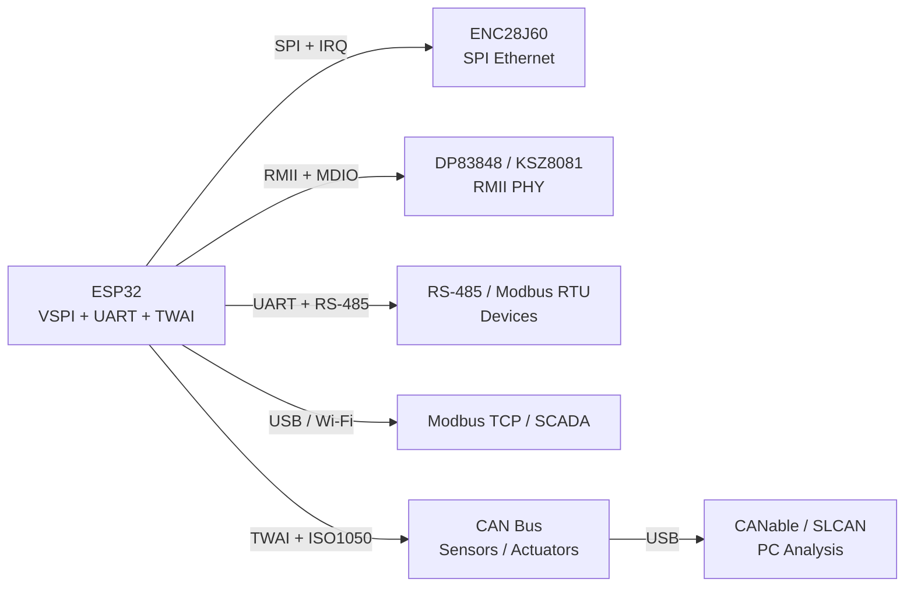

# Wired-2 - Modbus TCP Gateway (RTU↔TCP), Alt-PHY, ENC28J60, CAN Tools

> [!info] Purpose
> This note is the second part of wired modules (continuation of [[EN/12-Comm-Modules/04-RS485-CAN-Ethernet-Kamera.en]] and [[EN/12-Comm-Modules/07-SIM7600-W5500-MCP2515.en]]): Modbus TCP gateway (RTU↔TCP), alternative PHYs (DP83848 / KSZ8081 for RMII), ENC28J60 (SPI Ethernet for ESP32 without native MAC), CAN analysis / simulation tools (CANable / SLCAN / ISO1050 / PCAN / TWAI on ESP32), RS-485 / CAN / Ethernet integration.

![[assets/img/wired-2-eth-can-tools-scheme.png|600]]
*Fig. ESP32 as Modbus RTU↔TCP gateway and CAN analyzer: RMII-PHY / ENC28J60 on one side, TWAI + ISO1050 + CANable / SLCAN on the other, RS-485 / CAN / Ethernet interfaces.*

Links to [[EN/Home.en]], [[EN/12-Comm-Modules/04-RS485-CAN-Ethernet-Kamera.en]], [[EN/12-Comm-Modules/07-SIM7600-W5500-MCP2515.en]], [[EN/12-Comm-Modules/19-Wired-2.en]] (self), [[04-Interfaces/02-SPI|SPI]], [[04-Interfaces/01-UART|UART]], [[02-Power-Supply/01-Lancjugi-zhivlennya]].

Characteristics (comparison table):

| Node | Type | Interface | Power | When |
| --- | --- | --- | --- |
| DP83848 (TI) | RMII PHY | RMII to ESP32 | 3.3V | Ethernet with native MAC |
| KSZ8081 (Micrel) | RMII PHY | RMII to ESP32 | 3.3V | Ethernet, low price |
| ENC28J60 (Microchip) | SPI Ethernet controller | SPI to ESP32 + UART / IRQ | 3.3V | No native MAC; SPI only |
| W5500 (Wiznet) | SPI Ethernet + TCP/IP stack | SPI + UART / debug | 3.3V | Full TCP/IP offload |
| CANable / CANtact | USB CAN adapter / bitrate | USB to PC | 5V | CAN analysis / simulation |
| SLCAN / Lawicel | CAN USB adapter / serial | USB to PC / ESP32 UART | 5V | Simple CAN bus test |
| ISO1050 (TI) | CAN transceiver | CAN to ESP32 TWAI | 3.3-5V | CAN bus interface |
| MCP2515 (Microchip) | CAN controller | SPI to ESP32 | 3.3V / 5V | CAN with SPI interface |

## Purpose

Wired-2 - Modbus TCP gateway (RTU↔TCP), alt-PHY, ENC28J60, CAN tools - Modbus TCP and RTU↔TCP gateway; alternative PHY DP83848 / KSZ8081; ENC28J60 SPI Ethernet; CAN tools CANable / SLCAN / ISO1050 / PCAN; shows schematics, code and tables.

## 1. Modbus TCP Gateway (RTU↔TCP)

Modbus RTU (serial, RS-485) connects field devices; Modbus TCP (Ethernet) connects SCADA / cloud. ESP32 can be gateway: read RTU devices (slave addresses 1-247) and expose as TCP server (port 502) or client.

```text
Field: [Sensor 1] ---RS485---> [ESP32 Gateway] ---Wi-Fi/Ethernet---> [SCADA / Cloud]
                       |                 |
                       +-- Modbus RTU --+
                       +-- Modbus TCP ---+
```

```python
# MicroPython: Modbus TCP gateway (simplified; use umodbus / modbus-tcp library for full stack)
from machine import UART
import socket, struct

rtu = UART(2, baudrate=9600, bits=8, parity=1, stop=1, rx=16, tx=17)

def modbus_rtu_read(slave, reg):
    # Build RTU frame: slave + func + reg_hi + reg_lo + qty + crc
    pass

def tcp_server():
    s = socket.socket(socket.AF_INET, socket.SOCK_STREAM)
    s.bind(("0.0.0.0", 502))
    s.listen(1)
    conn, addr = s.accept()
    data = conn.recv(256)
    # Parse TCP Modbus ADU -> call RTU -> respond TCP
```

> [!tip] Gateway Modes
> TCP-to-RTU (server listens TCP, forwards to RTU) / RTU-to-TCP (poll RTU, push to TCP) / transparent (pass-through with address mapping). Use ESP32-S3 / C3 with 8 MB RAM for large gateway tables.

## 2. Alternative PHY: DP83848 / KSZ8081

ESP32 has no native Ethernet MAC; DP83848 / KSZ8081 provide RMII interface to ESP32 MAC (when using ESP32-Ethernet or ESP32-S3 with MAC). KSZ8081 is cheaper, DP83848 is industrial-grade.

```text
ESP32 RMII pins:
  GPIO21 (MDC)  -> MDC
  GPIO19 (MTD)  -> MDIO
  GPIO18 (CLK)  -> REF_CLK (50 MHz from PHY or ESP32)
  GPIO23 (TXD0) -> TXD0
  GPIO25 (TXD1) -> TXD1
  GPIO5  (RXD0) -> RXD0
  GPIO26 (RXD1) -> RXD1
  GPIO4  (CRS_DV) -> CRS_DV / CRS
  GPIO0  (RX_ER) -> RX_ER / RX_DV (depending on PHY)
```

> [!warning] RMII Needs 50 MHz Clock
> DP83848 / KSZ8081 require 50 MHz REF_CLK (from ESP32 or external oscillator). ESP32-S3 / C3 can generate it; ESP32 original needs external oscillator or PHY clock out. Check datasheet for clock direction (PHY to MAC or MAC to PHY).

## 3. ENC28J60 SPI Ethernet

ENC28J60 is a standalone SPI Ethernet controller with internal MAC / PHY. ESP32 uses SPI to control; Ethernet stack (lwIP / Arduino) runs on ESP32. No RMII needed.

```c
// ESP-IDF / Arduino: ENC28J60 basic init (SPI NSS=5, INT=4)
#include <SPI.h>
#define ENC_NSS 5
#define ENC_INT 4

void setup() {
  SPI.begin();
  pinMode(ENC_NSS, OUTPUT); digitalWrite(ENC_NSS, HIGH);
  pinMode(ENC_INT, INPUT_PULLUP);
  // ENC28J60 init sequence: soft reset, bank select, RX/TX init, MAC init
}
```

```python
# MicroPython: ENC28J60 with ENC28J60 library (simplified)
from machine import SPI, Pin
enc_spi = SPI(2, baudrate=20000000, polarity=1, phase=0, sck=Pin(18), mosi=Pin(23), miso=Pin(19))
enc_cs = Pin(5, Pin.OUT, value=1)
# Read bank 0, initialize MAC / PHY registers
```

## 4. CAN Tools (CANable / SLCAN / ISO1050 / PCAN)

CAN bus (CAN 2.0 A / B, ISO 11898) at 125 / 250 / 500 / 1000 kbps. ESP32 has TWAI (CAN controller) with ISO1050 transceiver.

```text
CAN bus topology: CANable (USB) <-> CAN_H / CAN_L <-> ISO1050 <-> ESP32 TWAI
                     |                      |
                     +-- CAN sensor / actuator
```

```c
// ESP32 (Arduino): CAN / TWAI init with ISO1050 (GPIO4/TX=CAN_TX, GPIO5/RX=CAN_RX)
#include <CAN.h>

void setup() {
  CAN.begin(500000); // 500 kbps
}

void loop() {
  CAN_Frame frame;
  if (CAN.read(frame)) {
    Serial.print("CAN ID: "); Serial.println(frame.ID);
  }
}
```

> [!tip] CAN Tool Selection
> CANable (open source USB-CAN, $20-40) for PC analysis / simulation. SLCAN (Lawicel CAN232 / USB) for simple UART-to-CAN. PCAN (Peak) for professional Windows/Linux. For ESP32: use ISO1050 + MCP2515 (if ESP32 TWAI unavailable) or native TWAI.

## 5. Integration (ESP32 + All Wired Modules)



### 5.1. Power Branches

```text
3.3V Main (ESP32): ESP32 + ENC28J60 + ISO1050 + CAN logic
5V External: CANable / PCAN (USB) / RS-485 adapter / ENC28J60 (some versions)
GND Common: All modules share GND; use star topology
```

### 5.2. Link Mapping (.en twins)

- [[EN/12-Comm-Modules/04-RS485-CAN-Ethernet-Kamera.en]] - RS-485 / CAN / Ethernet / camera
- [[EN/12-Comm-Modules/07-SIM7600-W5500-MCP2515.en]] - SIM7600 / W5500 / MCP2515
- [[EN/12-Comm-Modules/20-NFC-Biometry-2.en]] - NFC / fingerprint (GPIO mapping reference)
- [[EN/12-Comm-Modules/15-RFID-Advanced.en]] - RFID advanced

## 6. Common Errors

| Error | Cause | Fix |
| --- | --- | --- |
| No Ethernet link | Wrong PHY clock / RMII pin mismatch / antenna | Check REF_CLK / RMII mapping / use VNA for PHY |
| ENC28J60 SPI errors | Shared 3.3V / long SPI wires / no CS pull-up | Separate LDO / shorten SPI / 10k pull-up on CS |
| CAN bus errors | Wrong bitrate / termination missing / noise | Check CANalyzer / add 120 Ω terminators / shield |
| Modbus RTU timeout | Wrong baud / parity / slave address / RS-485 polarity | Use oscilloscope / check A/B polarity / set 9600 8N1 |
| Gateway not responding | Firewall / port 502 blocked / IP conflict / no TCP stack | Check firewall / bind 0.0.0.0:502 / verify lwIP config |

## References

- Modbus over TCP / RTU specs (Modbus Organization)
- DP83848 / KSZ8081 datasheets (TI / Micrel)
- ENC28J60 datasheet (Microchip)
- ISO 11898 / CAN 2.0 spec
- CANable / SLCAN / PCAN docs
- W5500 / ENC28J60 comparison (Wiznet / Microchip)
