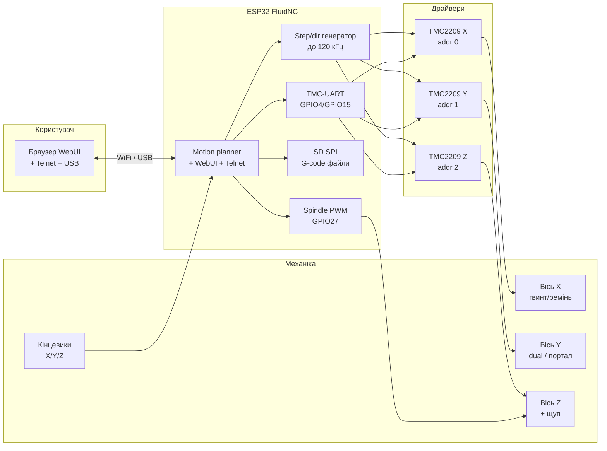

# Motion Control on ESP32 - FluidNC / grbl_ESP32 / Klipper / micro-ROS / ESP-Drone

## Purpose

ESP32 - повноцінний контролер руху: він рахує кроки with частотою до 120 кГц,
тримає WebUI ЧПК-верстата, працює вторинним MCU 3D-принтера під Klipper,
крутить вузол ROS 2 via micro-ROS, літає how міні-квадрокоптер під ESP-Drone
або сидить другим бортом поруч із польотником Betaflight/INAV how GPS-логер
and CRSF-міст телеметрії. Нота зводить усі шість екосистем in одну карту:
де ESP32 - головний (FluidNC, grbl_ESP32, ESP-Drone), де - підлеглий
(Klipper secondary MCU, micro-ROS node), but де - чесний «другий пілот»
поряд із STM32F4/F7/H7-польотником, which він ніколи not замінює.

Нота покриває: конфіг FluidNC `config.yaml` with нуля, WebUI + SD-карту,
TMC-драйвери per UART/SPI, піни step/dir grbl_ESP32 and `$`-налаштування,
Klipper on ESP32 how secondary MCU (menuconfig + printer.cfg),
micro-ROS (agent, publisher/subscriber, транспорт UART/WiFi, executor),
ESP-Drone (режими stabilize/height-hold/position-hold, flow-deck),
чесну межу INAV/Betaflight on ESP32, три Ready коди
(FluidNC-config, micro-ROS publisher, CRSF-телеметрія) and 14 типових помилок.

![[assets/img/motion-control-fluidnc-scheme.png|600]]
*Fig. ESP32 how контролер руху FluidNC: step/dir до TMC2209, кінцевики, шпиндель, SD-карта, WebUI per WiFi.*

## Overview екосистем - хто головний, хто підлеглий

| Прошивка | Роль ESP32 | Залізо | Конфіг | Транспорт | Коли брати |
| --- | --- | --- | --- | --- | --- |
| FluidNC | головний контролер ЧПК/лазера | ESP32 + зовнішні драйвери (TMC2209/DM542) | `config.yaml` on флеш/SD, without перекомпіляції | WiFi WebUI, Telnet, USB-Serial, SD | новий верстат, фрезер, лазер, plotter |
| grbl_ESP32 | головний контролер ЧПК (legacy) | ESP32 + драйвери | перекомпіляція + `$`-команди in EEPROM | USB-Serial, BT-Serial, WiFi | старий проєкт, which вже живе on grbl_ESP32 |
| grblHAL | наступник grbl_ESP32 (активна гілка) | ESP32 + драйвери, WebUI | `$`-команди сумісні, конфіг via WebUI | USB-Serial, WiFi, Ethernet (with платами розширення) | нові ЧПК-проєкти замість замороженого grbl_ESP32 |
| Klipper | вторинний MCU (secondary) | RPi-хост + ESP32 how виконавчий вузол | `printer.cfg` on хості + `make menuconfig` for ESP32 | USB-UART до хоста | 3D-принтер: ESP32 читає ADXL345, керує вентилятором/світлодіодом |
| micro-ROS | ROS 2-вузол on мікроконтролері | ESP32 + агент on ПК/RPi | `colcon.meta` + `idf.py menuconfig` | UDP/WiFi або UART-serial до агента | мобільний робот, маніпулятор, рій |
| ESP-Drone | головний польотник міні-дрона | ESP32 + плата керування моторами + IMU | `sdkconfig`, параметри Crazyflie | WiFi-APP, ESP-NOW-джойстик, cfclient | STEAM-освіта, кімнатні польоти |
| Betaflight / INAV | ESP32 - not польотник! | STM32-польотник + ESP32 другим бортом | Betaflight Configurator / INAV Configurator | CRSF/SBUS/MAVLink міст | GPS-логер, CRSF-телеметрія, WiFi-шлюз до GCS |

> Чесне правило: Betaflight and INAV not працюють on ESP32 how польотники -
> цикл стабілізації 8 кГц + DShot + gyro-DMA заточений під STM32F4/F7/H7/AT32.
> ESP32 поруч із ними - this телеметрійний міст, логер and наземний шлюз,
> див. розділ нижче and [[EN/12-Comm-Modules/12-RC-Protocols.en]].

## FluidNC - головний контролер ЧПК

FluidNC - наступник grbl_ESP32 from того ж автора (bdring). Архітектура
об'єктна: маbus описується текстовим `config.yaml`, прошивка одна on всіх -
перекомпіляція not потрібна. Підтримує до 6 координованих осей, подвійні
мотори on вісь with авто-вирівнюванням порталу (auto-squaring), шпиндель PWM /
RS485 Modbus / DAC 0-10 in / реле, лазер with компенсацією потужності from швидкості,
зміну інструменту, SD-карту with запуском G-коду per WiFi, WebUI in браузері,
Telnet-подачу G-коду, OTA-оновлення and push-сповіщення.

### that вміє FluidNC with коробки

| Підсистема | Можливості | Де лежить in YAML |
| --- | --- | --- |
| Осі | до 6 осей XYZABC, до 12 моторів, dual-motor Y with двома кінцевиками | `axes:` |
| Драйвери | Step/Dir, TMC2209/TMC5160 per UART/SPI (StealthChop, CoolStep, StallGuard) | `axes: → motor0: → tmc_2209:` |
| Кінцевики | limit/homing with дебаунсом, sensorless-homing via StallGuard | `axes: → homing:` |
| Зонди | Z-probe on будь-яку вісь, safety-door, hold/resume/reset кнопки | `probe:`, `control:` |
| Шпиндель | PWM, лазер, RS485-VFD (Huanyang), 10V-DAC, BESC for безколекторників | `spindle:` |
| Охолодження | Mist, Flood | `coolant:` |
| Зв'язок | USB-Serial, WiFi AP/STA, WebUI, Telnet, BT-Serial | `wifi:`, `telnet:` |
| Файли | SD-карта, launch with WebUI, кілька `*.yaml` + `$Config/Filename=` | `sdcard:` |
| Макроси | кнопки-скрипти, start/кінець завдання, tool-change послідовності | `macros:`, `start:` |

### Pin legend типової плати FluidNC (6-pack / generic DevKit)

| Пін ESP32 | Функція FluidNC | Куди | Примітка |
| --- | --- | --- | --- |
| GPIO14 | X.step | STEP драйвера X | крок 50% шпаруватість, частота до 120 кГц |
| GPIO25 | X.dir | DIR драйвера X | напрям, встановити до фронту step ≥ 1 мкс |
| GPIO26 | Y.step | STEP драйвера Y | кручена пара зі землею, < 30 см |
| GPIO33 | Y.dir | DIR драйвера Y | - |
| GPIO17 | Z.step | STEP драйвера Z | - |
| GPIO16 | Z.dir | DIR драйвера Z | - |
| GPIO4 | UART TX до TMC2209 | RX драйверів (ланцюжок) | один TX on всіх: адреси 0/1/2 перемичками MS1/MS2 |
| GPIO15 | UART RX from TMC2209 | TX драйверів via 1 кОм | резистор-суматор обов'язковий at ланцюжку! |
| GPIO34 | X.limit | кінцевик X, NO до GND | вхід only-input, тільки pull-up, without виходу! |
| GPIO35 | Y.limit | кінцевик Y | only-input, див. [[03-GPIO/01-GPIO-oglyad]] |
| GPIO32 | Z.probe | щуп Z | підтяжка до 3V3, екран from шпинделя |
| GPIO27 | spindle PWM | MOSFET/лазер TTL | via [[11-Vivid/11-PowerMotion-2]] |
| GPIO13, GPIO5, GPIO23, GPIO19, GPIO18 | SD SPI | SD-карта | SCK/MOSI/MISO/CS how in [[04-Interfaces/07-SD-SDIO]] |
| EN, GPIO0 | reset/feed-hold кнопки | кнопки до GND | - |

Пояснення:

- **Step/dir - окремі GPIO on мотор:** кожен драйвер хоче свою пару
  step+dir; землю кроку вести поруч із сигналом, not уздовж силових 24 in.
- **TMC UART - один провід-bus:** TX контролера віялом on RX усіх драйверів,
  назад - via резистори 1 кОм with кожного TX in спільну точку RX контролера,
  інакше драйвери «сперечаються» on лінії.
- **GPIO34/35 - тільки входи:** on них немає внутрішнього pull-up, which можна
  ввімкнути програмно коректно for кінцевика - став зовнішній 4.7-10 кОм до 3V3.
- **Шпиндель - ніколи безпосередньо:** GPIO27 дає 3.3 in логіку, but далі MOSFET-module,
  реле або TTL-драйвер лазера with опторозв'язкою.

### ASCII schematic

```text
                    FLUIDNC — ESP32 DevKit + 3x TMC2209 + SD + шпиндель
                    ───────────────────────────────────────────────────
   Живлення логіки                 ESP32                        Силова частина
   ───────────────                 ─────                        ──────────────
   5V USB ──► AMS1117 ──► 3V3 ──► [3V3]                    24V ──► VM драйверів
                             ┌── [EN] ──► кнопки Hold/Resume до GND
                             │
   TMC-UART bus (один TX!)   │   GPIO4 (TX) ──┬──► RX TMC-X (addr 0)
                             │                ├──► RX TMC-Y (addr 1)
                             │                └──► RX TMC-Z (addr 2)
                             │   GPIO15 (RX) ◄──┬── 1кОм ── TX TMC-X
                             │                  ├── 1кОм ── TX TMC-Y
                             │                  └── 1кОм ── TX TMC-Z
                             │
   Кроки/напрями              │   GPIO14 ──► STEP X    GPIO25 ──► DIR X
                             │   GPIO26 ──► STEP Y    GPIO33 ──► DIR Y
                             │   GPIO17 ──► STEP Z    GPIO16 ──► DIR Z
                             │
   Кінцевики (NO до GND)      │   GPIO34 ◄── кінцевик X (pull-up 10к до 3V3)
                             │   GPIO35 ◄── кінцевик Y (pull-up 10к до 3V3)
                             │   GPIO32 ◄── Z-щуп    (екран, подалі від 24В)
                             │
   Шпиндель/лазер             │   GPIO27 ──► MOSFET-module ──► шпиндель/лазер TTL
                             │              (див. [[11-Vivid/11-PowerMotion-2]])
                             │
   SD-карта (SPI)             │   GPIO23 ──► MOSI SD    GPIO19 ◄── MISO SD
                             │   GPIO18 ──► SCK SD     GPIO13 ──► CS SD
                             │   GPIO5  ──► (другий CS / резерв)
                             │
   Зв'язок                    │   USB ──► G-code sender / FluidTerm
                             └── WiFi ──► WebUI в браузері (192.168.0.1 або STA-IP)

 Notes:
 - GND спільна: ESP32 GND ── драйвери GND ── 24V GND ── корпус верстата (одна точка!).
 - Сигнальні step-джгути < 30 см, кручена пара signal+GND, не поруч із 24В/шпинделем.
 - VM драйверів 12–24 В + електроліт 470–1000 мкФ біля кожного драйвера.
 - TMC2209 без адреси = конфлікт: MS1/MS2 перемички дають addr 0/1/2!
```

### Mermaid



### FluidNC: WebUI, SD, TMC-драйвери детально

- **WebUI:** вбудований Esp32_WebUI - після firmwares плата піднімає AP
  `FluidNC` або чіпляється до домашнього WiFi (STA, задається in YAML).
  in браузері: jog-кнопки, DRO-координати, download `.nc/.gcode` on SD,
  launch/пауза, консоль `$`-команд, редактор `config.yaml` прямо in WebUI.
- **SD-карта:** G-code ллється per WiFi in WebUI → пишеться on SD → виконується
  with SD without прив'язі до ПК (джиттер USB not рве дугу лазера). Два CS - під другу
  карту або резерв, частота SPI SD до 20 МГц, доріжки короткі.
- **TMC2209 per UART:** StealthChop (тихо), CoolStep (менше гріється),
  StallGuard (бездатчикове homing). Струм `run_current`, мікрокрок
  `microsteps`, адреса `uart_num` задаються in YAML on мотор, but not перемичками
  струму Vref - Vref-потенціометр on UART-версії ігнорується!
- **Кілька конфігів:** on флеш лягає `config.yaml` for замовчуванням;
  `$Config/Filename=/моя.yaml` перемикає on інший файл - зручно тримати
  «фрезер.yaml» and «лазер.yaml» on одній платі.
- **Діагностика:** `$SS` (system status), `$LD` (list directories SD),
  `$Config/Dump` - роздрук активного YAML, `$Motors/Disable` - зняти струм.

## grbl_ESP32 - попередник (legacy, але живий)

grbl_ESP32 - порт класичного grbl під ESP32, заморожений on користь FluidNC
(автор прямо радить нові проєкти робити on FluidNC). Відмінності:

| Риса | grbl_ESP32 | FluidNC |
| --- | --- | --- |
| Опис машини | `#define` пінів + перекомпіляція | `config.yaml`, without перекомпіляції |
| Налаштування | `$0..$132` in EEPROM | пункти YAML + частина `$` on льоту |
| Осей/моторів | до 6 осей, до 12 моторів | так само, але гнучкіше маплення |
| TMC | SPI-версії, StealthChop/StallGuard | UART + SPI, повніший набір |
| WebUI | є (той же Esp32_WebUI) | новіший, редактор YAML |
| Статус | maintenance only | активна розробка |

### Піни step/dir in grbl_ESP32 (example `machine.h`)

Типовий мапінг 3-осьового фрезера: step-пини поруч, dir-пини поруч,
enable - спільний. in коді машини:

```cpp
// Grbl_ESP32: CPU_MAP, приклад кастомної машини
#define X_STEP_PIN       GPIO_NUM_14
#define X_DIRECTION_PIN  GPIO_NUM_25
#define Y_STEP_PIN       GPIO_NUM_26
#define Y_DIRECTION_PIN  GPIO_NUM_33
#define Z_STEP_PIN       GPIO_NUM_17
#define Z_DIRECTION_PIN  GPIO_NUM_16
#define STEPPERS_DISABLE_PIN GPIO_NUM_13
#define X_LIMIT_PIN      GPIO_NUM_34
#define Y_LIMIT_PIN      GPIO_NUM_35
#define SPINDLE_PWM_PIN  GPIO_NUM_27
```

### `$`-налаштування grbl_ESP32 (that крутити першим)

| Команда | Зміст | Типове |
| --- | --- | --- |
| `$100`, `$101`, `$102` | кроків/мм X/Y/Z | 80 (GT2-20T), 400 (гвинт 8 мм + 1/8) |
| `$110`, `$111`, `$112` | макс. швидкість мм/хв | 3000 / 3000 / 1000 |
| `$120`, `$121`, `$122` | прискорення мм/с² | 200 / 200 / 100 |
| `$130`-`$132` | хід осей мм (soft limits) | 300 / 300 / 80 |
| `$20`, `$21`, `$22` | soft/hard limits, homing enable | 1 / 1 / 1 |
| `$23` | інверсія безпосередньо homing | маска бітів |
| `$3` | інверсія dir | маска, якщо вісь їде not туди |
| `$5` | інверсія limit-щупів | 0 = NO, 1 = NC |
| `$32` | режим лазера | 1 for лазера, 0 for шпинделя |
| `$$` | роздрук усіх | check перед першим пуском |
| `$H` | homing усіх осей | тільки після кінцевиків! |
| `$X` | зняти alarm-lock | після аварії, with перевіркою причини |

> Міграція grbl_ESP32 → FluidNC: `$100` стає
> `axes: → x: → motor0: → steps_per_mm:`, `$110` - `max_rate_mm_per_min:`,
> `$120` - `acceleration_mm_per_sec2:`. Піни with `machine.h` переїжджають
> in `step_pin:` / `direction_pin:` / `limit_all_pin:` відповідних секцій YAML.

## Klipper - ESP32 how secondary MCU

Klipper ділить роботу: Raspberry Pi рахує траєкторію (Python), but мікроконтролери
виконують кроки for розкладом (C). ESP32 тут - ідеальний другий/третій MCU:
рідний WiFi not потрібен (зв'язок - дротовий USB-UART with хостом!), зате багато
GPIO, АЦП, RMT for NeoPixel, I2C for ADXL345-виміру резонансів.

### Архітектура with ESP32-довеском

| Вузол | Роль | that on ньому |
| --- | --- | --- |
| RPi-хост | Klipper host + Moonraker + Fluidd/Mainsail | `printer.cfg`, кінематика, pressure advance, input shaping |
| Main MCU (SKR/Manta) | primary `[mcu]` | кроки XYZ/E, нагрів, вентилятори |
| ESP32 | secondary `[mcu esp32]` | ADXL345 per SPI, NeoPixel, додатковий вентилятор, кнопка, термопара |

### Прошивка ESP32 під Klipper (menuconfig)

```text
cd ~/klipper && make menuconfig
  Micro-controller Architecture = Espressif ESP32
  Processor model = ESP32 (або ESP32-S2/S3 за платою)
  Communication interface = USB-serial (через CP2102/CH340 плати)
  # або Serial на UART0, якщо шити безпосередньо через USB-UART міст
make
make flash FLASH_DEVICE=/dev/serial/by-id/usb-1a86_USB2.0-Serial-if00-port0
ls /dev/serial/by-id/*   # <- цей ID піде в printer.cfg
```

### `printer.cfg` - ESP32 how другий MCU

```ini
[mcu esp32]
serial: /dev/serial/by-id/usb-1a86_USB2.0-Serial-if00-port0
restart_method: command

# ADXL345 на ESP32 для виміру резонансів (input shaper)
[adxl345]
cs_pin: esp32:gpio5
spi_bus: spi2a
axes_map: x,y,z

# NeoPixel-стрічка через RMT ESP32
[neopixel sb_leds]
pin: esp32:gpio21
chain_count: 12
color_order: GRB
initial_RED: 0.1
initial_GREEN: 0.1
initial_BLUE: 0.1

# Додатковий вентилятор корпуса
[fan_generic chamber_fan]
pin: esp32:gpio22
max_power: 1.0

# Кнопка filament-runout на ESP32
[filament_switch_sensor runout]
pause_on_runout: True
switch_pin: ^!esp32:gpio34
```

Пояснення:

- **Префікс `esp32:`** in кожному піні каже Klipper, якому MCU належить пін.
  without префікса - пін шукається on primary `[mcu]` and буде error.
- **`^` and `!`** - pull-up та інверсія: `^!esp32:gpio34` = підтяжка + NC-датчик.
- **ADXL345 - тільки per SPI ESP32:** I2C-режим ADXL345 Klipper not калібрує
  резонанси коректно; SPI 5 МГц, дроти < 15 см, див. резонанси in Klipper-доках.
- **USB-serial, not WiFi:** Klipper not говорить with MCU per WiFi-TCP in стабільному
  режимі - тільки дротовий serial. WiFi ESP32 in Klipper-режимі not використовується.
- **Multi-MCU homing:** кінцевик має висіти on therefore ж MCU, that й відповідний мотор,
  інакше - error `multi-mcu homing` під час `$H`/G28.

## micro-ROS - ESP32 how ROS 2-вузол

micro-ROS садить клієнтський API ROS 2 (rclc + Micro XRCE-DDS) прямо on ESP32.
ESP32 говорить with micro-ROS-агентом (програма on ПК/RPi), but агент вже розмовляє
with рештою ROS 2-графа per DDS. Транспортів два: UDP per WiFi (зручно) або UART-serial
(надійно, without джиттера WiFi). Виконавча модель - executor: один потік крутить
таймери, сабскрайбери and сервіси per колу.

### Архітектура

| Шар | Де живе | that робить |
| --- | --- | --- |
| ROS 2-граф (Humble/Jazzy) | ПК / RPi | `rviz`, `ros2 topic echo`, навігація Nav2 |
| micro-ROS Agent | ПК / RPi, Docker `microros/micro-ros-agent` | міст XRCE-DDS ↔ DDS: `udp4 --port 8888` або `serial --dev /dev/ttyUSB0` |
| micro-ROS node | ESP32 (ESP-IDF + компонент) | паблішить одометрію, слухає `cmd_vel`, крутить мотори |
| Транспорт | WiFi-UDP або UART | UDP - мобільність, UART - детермінізм |

### Налаштування ESP-IDF компонента

```text
. $IDF_PATH/export.sh
pip3 install catkin_pkg colcon-common-extensions lark
cd my_robot/components
git clone -b rolling https://github.com/micro-ROS/micro_ros_espidf_component.git
cd ../..
idf.py set-target esp32
idf.py menuconfig
  # micro-ROS Settings -> middleware = Micro XRCE-DDS
  # micro-ROS Settings -> transport = UDP (WiFi SSID/pass) або UART
  # WiFi credentials вписати тут же, якщо транспорт UDP
idf.py build && idf.py flash && idf.py monitor
```

Агент on хості:

```bash
# UDP-агент (ESP32 по WiFi стукає на порт 8888):
docker run -it --rm --net=host microros/micro-ros-agent:rolling udp4 --port 8888 -v6
# Serial-агент (ESP32 по USB-UART):
docker run -it --rm -v /dev:/dev --privileged --net=host \
  microros/micro-ros-agent:rolling serial --dev /dev/ttyUSB0 -v6
```

### Executor - серце вузла (патерни)

| Патерн | Коли | example |
| --- | --- | --- |
| Один таймер + один паблішер | маяк одометрії 20 Гц | `rclc_timer_init_default` + `rclc_executor_spin` |
| Сабскрайбер `cmd_vel` + PWM | диференціальний робот | колбек Twist → MCPWM on два мотори |
| Сервіс + екшен | калібрування / захват | `rclc_service_init_default`, стани in колбеку |
| Static executor + `sleep 10 мс` | батарейний вузол | менше прокидань, економія заряду |

> Пам'ять: тримай `rmw` буфери маленькими (`colcon.meta` - MTU 512 at UART),
> інакше ESP32 with'їсть купу PSRAM під фрагментацію XRCE.

## ESP-Drone - міні-квадрокоптер on ESP32

ESP-Drone (Espressif, порт Crazyflie) - повноцінний польотник for кімнатного
квадрика on ESP32/S2/S3 під ESP-IDF v5. code стабілізації - with Crazyflie (GPL-3.0),
плата - проста: ESP32 + драйвер колекторних моторів + IMU MPU9250/BMI088.

### Режими and плати розширення

| Режим | that стабілізує | that треба |
| --- | --- | --- |
| Stabilize (attitude) | кути roll/pitch, yaw-rate | базова плата + IMU |
| Height-hold (flapper/altitude) | + висота for тиском | плата висотоміра (BMP388/LPS22) |
| Position-hold (positioning) | + XY for оптичним потоком | flow-deck: PMW3901 (optic-flow) + VL53L1x (ToF-далекомір) |
| APP control | керування зі смартфона | WiFi AP дрона + ESP-Drone APP (iOS/Android) |
| Joystick / cfclient | керування with ПК | `crazyflie-clients-python`, ESP-NOW-джойстик via ESP-BOX3 |

### Зв'язок керування

| Канал | Транспорт | Затримка | Коли |
| --- | --- | --- | --- |
| WiFi APP | UDP до AP дрона | ~20-50 мс | навчання, STEAM-демо |
| ESP-NOW джойстик | ESP-NOW 2.4 ГГц | ~5-10 мс | точніші польоти without роутера |
| cfclient (Crazyradio-сумісний) | USB-dongle → Crazyflie-протокол | ~10 мс | логи, параметри PID, телеметрія |

> Flow-deck - key до position-hold in кімнаті without GPS: PMW3901 дивиться вниз
> and міряє оптичний потік (зсув картинки підлоги), VL53L1x дає висоту ToF.
> without flow-deck кімнатний дрон тримає тільки кути й висоту - XY пливе for вітром.

## INAV / Betaflight on ESP32 - чесна межа

Ні INAV, ні Betaflight not збираються під ESP32 how ціль польотника:
цілі - STM32F4/F7/H7 and AT32, цикл ПІД 8 кГц, DMA-читання gyro, DShot with точним
таймінгом. ESP32 not має потрібних DMA-ланцюжків під їхній scheduler and not
пройде жоден CI-таргет цих проєктів. therefore правильна топологія - два борти:

```text
STM32-польотник (Betaflight/INAV)  <──CRS F/SBUS/MAVLink──>  ESP32 (другий борт)
  gyro + PID 8 кГц, DShot до ESC                                GPS-логер (SD)
  OSD, failsafe, RTH                                            WiFi-шлюз до GCS
  CRSF-приймач ELRS ──TX/RX── ESP32-перехоплювач ──TX/RX── FC   CRSF-міст + LTM-ретранслятор
```

| Роль ESP32 поруч із FC | Протокол | UART | Навіщо |
| --- | --- | --- | --- |
| CRSF-міст / сніфер | CRSF 420000 8N1 | UART2 | логи каналів, ретрансляція телеметрії on землю |
| GPS-логер | NMEA/UBX 115200 | UART1 | писати трек on SD незалежно from blackbox FC |
| MAVLink-шлюз | MAVLink 57600 | UART1 + WiFi | FC → ESP32 → QGroundControl per WiFi |
| S.Port/F.Port вузол | 57600/115200 інв. | UART + інверсія | віддати напругу/струм in FrSky-приймач |
| DShot-стенд (without польоту!) | DShot via RMT | RMT TX | покрутити мотор on столі, див. MCPWM/RMT-ноту |

Деталі CRSF-парсингу, інверсії SBUS and MAVLink-heartbeat - in ноті
[[EN/12-Comm-Modules/12-RC-Protocols.en]], таймінг DShot via RMT -
in [[07-Timers/01-Timeri-MCPWM-PCNT-RMT]].

## Code 1 - FluidNC `config.yaml` (3 осі + TMC2209 + лазер/шпиндель)

```yaml
# FluidNC config.yaml — 3-осьовий фрезер/лазер на ESP32 DevKit + 3x TMC2209
# Залити через WebUI (Config) або по USB: fluidterm / `pio run -t uploadfs`
name: "ESP32 3-axis TMC2209"
board: "ESP32 DevKit"

stepping:
  engine: RMT
  idle_ms: 255
  pulse_us: 2
  dir_delay_us: 1

uart1:
  txd_pin: gpio.4
  rxd_pin: gpio.15
  rts_pin: NO_PIN
  cts_pin: NO_PIN
  baud: 115200
  mode: 8N1

axes:
  x:
    steps_per_mm: 80.0
    max_rate_mm_per_min: 3000
    acceleration_mm_per_sec2: 200
    max_travel_mm: 300
    homing:
      cycle: 2
      mpos_mm: 0.0
      feed_mm_per_min: 300.0
      seek_mm_per_min: 1500.0
      settle_ms: 250
    motor0:
      limit_all_pin: gpio.34:low:pu
      step_pin: gpio.14
      direction_pin: gpio.25
      disable_pin: NO_PIN
      tmc_2209:
        uart_num: 1
        addr: 0
        r_sense_ohms: 0.110
        run_current: 1.2
        hold_current: 0.6
        microsteps: 8
        stallguard: 0
        stealthchop: true
    motor1: null
  y:
    steps_per_mm: 80.0
    max_rate_mm_per_min: 3000
    acceleration_mm_per_sec2: 200
    max_travel_mm: 300
    homing:
      cycle: 2
      mpos_mm: 0.0
      feed_mm_per_min: 300.0
      seek_mm_per_min: 1500.0
      settle_ms: 250
    motor0:
      limit_all_pin: gpio.35:low:pu
      step_pin: gpio.26
      direction_pin: gpio.33
      disable_pin: NO_PIN
      tmc_2209:
        uart_num: 1
        addr: 1
        r_sense_ohms: 0.110
        run_current: 1.2
        hold_current: 0.6
        microsteps: 8
        stallguard: 0
        stealthchop: true
  z:
    steps_per_mm: 400.0
    max_rate_mm_per_min: 1000
    acceleration_mm_per_sec2: 100
    max_travel_mm: 80
    homing:
      cycle: 1
      mpos_mm: 0.0
      feed_mm_per_min: 200.0
      seek_mm_per_min: 800.0
      settle_ms: 250
    motor0:
      limit_all_pin: gpio.32:low:pu
      step_pin: gpio.17
      direction_pin: gpio.16
      disable_pin: NO_PIN
      tmc_2209:
        uart_num: 1
        addr: 2
        r_sense_ohms: 0.110
        run_current: 1.0
        hold_current: 0.5
        microsteps: 8
        stallguard: 0
        stealthchop: true

probe:
  pin: gpio.32:low:pu
  toolsetter_pin: NO_PIN
  check_mode_start: true

spindle:
  pwm:
    pwm_hz: 5000
    output_pin: gpio.27
    enable_pin: NO_PIN
    direction_pin: NO_PIN
    disable_with_zero_speed: false
    s_off_with_disable: true
    spinup_ms: 0
    spindown_ms: 0
    tool_num: 0
    speed_map: 0=0% 1000=0% 24000=100%

coolant:
  mist_pin: NO_PIN
  flood_pin: NO_PIN
  delay_ms: 0

control:
  safety_door_pin: NO_PIN
  reset_pin: NO_PIN
  feed_hold_pin: NO_PIN
  cycle_start_pin: NO_PIN
  macro0_pin: NO_PIN

sdcard:
  cs_pin: gpio.13
  card_detect_pin: NO_PIN
  frequency_hz: 20000000

wifi:
  ap:
    ssid: "FluidNC"
  sta:
    ssid: ""
    password: ""
  hostname: fluidnc
  access_point: true

telnet:
  enable: true
  port: 23

start:
  must_home: true
  deactivate_parking: false
  check_limits: true
```

Коментарі до конфігу:

- `engine: RMT` - кроки via RMT-периферію ESP32, найстабільніший таймінг;
  `pulse_us: 2` тримає сумісність із TMC2209 and зовнішніми DM542.
- `uart1 → 115200` - bus TMC; усі три драйвери on одному UART with різними
  `addr` (перемички MS1/MS2 on платі драйвера задають 0/1/2).
- `r_sense_ohms: 0.110` - звірити with написом Rsense on конкретному модулі
  (буває 0.110 або 0.220!); неправильне значення = вдвічі хибний струм.
- `limit_all_pin: gpio.34:low:pu` - кінцевик NO до землі with підтяжкою;
  for NC-датчиків - `:high`, див. GPIO-ноту.
- `must_home: true` - верстат not поїде without `$H` після вмикання; безпека перша.
- Лазерний режим окремо: `$32=1` in консолі або `laser:`-секція in новіших
  збірках FluidNC - verify `$I` (build info) перед гравіюванням.

## Code 2 - micro-ROS publisher on ESP-IDF (одометрія + cmd_vel)

```c
// micro-ROS ESP32: паблішер одометрії 20 Гц + сабскрайбер cmd_vel -> MCPWM
// ESP-IDF + micro_ros_espidf_component. Транспорт: UDP/WiFi або UART (menuconfig).
#include <stdio.h>
#include <unistd.h>
#include <rcl/rcl.h>
#include <rclc/rclc.h>
#include <rclc/executor.h>
#include <std_msgs/msg/int32.h>
#include <geometry_msgs/msg/twist.h>

#define RCCHECK(fn) { rcl_ret_t rc = fn; if (rc != RCL_RET_OK) printf("RCL err %d @%d\n", rc, __LINE__); }
#define RCSOFTCHECK(fn) { rcl_ret_t rc = fn; (void)rc; }

static int32_t odom_ticks = 0;

// cmd_vel -> сюди прийде швидкість від Nav2 / teleop
static void cmd_vel_cb(const void * msgin) {
    const geometry_msgs__msg__Twist * twist = (const geometry_msgs__msg__Twist *)msgin;
    float lin = twist->linear.x;    // м/с
    float ang = twist->angular.z;   // рад/с
    // TODO: lin/ang -> PWM лівого/правого мотора через MCPWM,
    // див. [[11-Vivid/11-PowerMotion-2]] і [[07-Timers/01-Timeri-MCPWM-PCNT-RMT]]
    printf("cmd_vel: lin=%.2f ang=%.2f\n", lin, ang);
}

// Таймер 50 мс: наростити "одометрію" і опублікувати
static void timer_cb(rcl_timer_t * timer, int64_t last_call_time) {
    (void)timer; (void)last_call_time;
    static std_msgs__msg__Int32 msg;
    // TODO: прочитати енкодери через PCNT (див. MCPWM-PCNT-RMT ноту)
    odom_ticks += 10;
    msg.data = odom_ticks;
    RCSOFTCHECK(rcl_publish(timer, NULL, NULL)); // заглушка-ніц: див. нижче
    (void)msg;
}

void app_main(void) {
    rcl_allocator_t allocator = rcl_get_default_allocator();
    rclc_support_t support;
    RCCHECK(rclc_support_init(&support, 0, NULL, &allocator));

    rcl_node_t node;
    RCCHECK(rclc_node_init_default(&node, "esp32_odom", "", &support));

    rcl_publisher_t pub;
    RCCHECK(rclc_publisher_init_default(
        &pub, &node,
        ROSIDL_GET_MSG_TYPE_SUPPORT(std_msgs, msg, Int32),
        "wheel_ticks"));

    rcl_subscription_t sub;
    RCCHECK(rclc_subscription_init_default(
        &sub, &node,
        ROSIDL_GET_MSG_TYPE_SUPPORT(geometry_msgs, msg, Twist),
        "cmd_vel"));

    rcl_timer_t timer;
    RCCHECK(rclc_timer_init_default(&timer, &support, RCL_MS_FROM_SEC(1) / 20, timer_cb));

    rclc_executor_t executor;
    RCCHECK(rclc_executor_init(&executor, &support.context, 2, &allocator));
    RCCHECK(rclc_executor_add_timer(&executor, &timer));
    RCCHECK(rclc_executor_add_subscription(
        &executor, &sub, &(geometry_msgs__msg__Twist){0},
        &cmd_vel_cb, ON_NEW_DATA));

    // Правильна публікація з таймера: тримаємо publisher глобально.
    // У мінімальному прикладі int32_publisher з репозиторію компонента:
    //   rcl_publish(&pub, &msg, NULL);
    // Повний робочий приклад: examples/int32_publisher компонента.
    rclc_executor_spin(&executor);

    RCCHECK(rcl_publisher_fini(&pub, &node));
    RCCHECK(rcl_node_fini(&node));
}
```

> Робочий мінімум without скорочень - in репозиторії компонента:
> `examples/int32_publisher` (паблішер) and `examples/int32_subscriber`.
> code вище - каркас під твій робот: підстав реальний `rcl_publish(&pub, …)`
> in таймері, PCNT-енкодери and MCPWM-мости with [[11-Vivid/11-PowerMotion-2]].

Кроки запуску зв'язки:

```bash
# 1. Агент на хості (RPi/ПК), ROS 2 Humble/Jazzy:
docker run -it --rm --net=host microros/micro-ros-agent:rolling udp4 --port 8888 -v6
# 2. ESP32 вже прошитий з WiFi-транспортом і IP агента -> стукає сам.
# 3. Перевірка графа:
ros2 topic list            # мають бути /wheel_ticks /cmd_vel
ros2 topic echo /wheel_ticks
ros2 topic pub /cmd_vel geometry_msgs/msg/Twist \
  "{linear: {x: 0.2}, angular: {z: 0.0}}" --once
```

## Code 3 - CRSF-телеметрія with ESP32 до ELRS-приймача (батарея + GPS)

```cpp
// ESP32 -> ELRS-приймач: CRSF-телеметрія (Battery 0x08 + GPS 0x02), 420000 8N1
// Без інверсії! UART2: RX=GPIO16 (від TX приймача), TX=GPIO17 (до RX приймача).
// CRC8-DVB-S2, big-endian у payload. Деталі кадру: див. RC-Protocols ноту.
#include <Arduino.h>

#define CRSF_BAUD 420000
#define CRSF_ADDR_FC 0xC8
#define CRSF_TYPE_BATTERY 0x08
#define CRSF_TYPE_GPS 0x02

uint8_t crc8_dvb_s2(uint8_t crc, uint8_t b) {
    crc ^= b;
    for (int i = 0; i < 8; i++)
        crc = (crc & 0x80) ? (crc << 1) ^ 0xD5 : (crc << 1);
    return crc;
}

// voltage: В*10 (126 = 12.6 В), current: А*10, fuel: 0..100%, remaining: мАг
void crsfSendBattery(uint16_t mv_x10, uint16_t ma_x10, uint8_t fuel_pct) {
    uint8_t f[2 + 8 + 1];
    f[0] = CRSF_ADDR_FC;
    f[1] = 10; // len = type(1) + payload(8) + crc(1)
    f[2] = CRSF_TYPE_BATTERY;
    f[3] = (mv_x10 >> 8) & 0xFF; f[4] = mv_x10 & 0xFF;
    f[5] = (ma_x10 >> 8) & 0xFF; f[6] = ma_x10 & 0xFF;
    f[7] = 0; f[8] = 0; f[9] = 0; // capacity used, мАг (3 байти)
    f[10] = fuel_pct;
    uint8_t crc = 0;
    for (int i = 2; i < 11; i++) crc = crc8_dvb_s2(crc, f[i]);
    f[11] = crc;
    Serial2.write(f, sizeof(f));
}

// lat/lon: градуси*1e7 (int32), alt: метри+1000 (напр. 1123 = 123 м)
void crsfSendGps(int32_t lat_e7, int32_t lon_e7, uint16_t gspd_kmh_x10,
                 uint16_t hdg_deg_x100, uint16_t alt_m_plus1000, uint8_t sats) {
    uint8_t f[2 + 15 + 1];
    f[0] = CRSF_ADDR_FC;
    f[1] = 17;
    f[2] = CRSF_TYPE_GPS;
    f[3] = (lat_e7 >> 24) & 0xFF; f[4] = (lat_e7 >> 16) & 0xFF;
    f[5] = (lat_e7 >> 8) & 0xFF;  f[6] = lat_e7 & 0xFF;
    f[7] = (lon_e7 >> 24) & 0xFF; f[8] = (lon_e7 >> 16) & 0xFF;
    f[9] = (lon_e7 >> 8) & 0xFF;  f[10] = lon_e7 & 0xFF;
    f[11] = (gspd_kmh_x10 >> 8) & 0xFF; f[12] = gspd_kmh_x10 & 0xFF;
    f[13] = (hdg_deg_x100 >> 8) & 0xFF; f[14] = hdg_deg_x100 & 0xFF;
    f[15] = (alt_m_plus1000 >> 8) & 0xFF; f[16] = alt_m_plus1000 & 0xFF;
    f[17] = sats;
    uint8_t crc = 0;
    for (int i = 2; i < 18; i++) crc = crc8_dvb_s2(crc, f[i]);
    f[18] = crc;
    Serial2.write(f, sizeof(f));
}

void setup() {
    Serial.begin(115200);
    // CRSF: 420000 8N1, пряма логіка, БЕЗ інверсії!
    Serial2.begin(CRSF_BAUD, SERIAL_8N1, 16, 17);
}

void loop() {
    // Приклад: 16.7 В, 8.4 А, 72% + Київ, 0 км/г, 123 м, 12 супутників
    crsfSendBattery(167, 84, 72);
    crsfSendGps(504378000, 304567000, 0, 0, 1123, 12);
    delay(250); // ~4 Гц: батарея+Gps по черзі, не частіше 10 Гц сумарно
    // TODO: читати справжні INA219 (див. 10-Sensori) і GPS (див. 17-GNSS-RTK)
    // замість констант вище.
}
```

Пояснення до коду:

- **Адреса `0xC8`** - «польотник»: приймач ELRS приймає телеметрію тільки
  with цієї адреси; `0xEE` - адреса самого передавача, її not використовувати.
- **Big-endian:** багатобайтові поля CRSF - старший байт першим
  (on відміну from MAVLink/SBUS LSB), переплутаєш - висота 1123 м стане 253 м.
- **Темп 4 Гц:** батарею and GPS слати per черзі not частіше 10 Гц сумарно,
  інакше заб'єш аплінк and канали почнуть лагати.
- **Перехрест:** TX приймача → GPIO16, RX приймача → GPIO17 (how звичайний UART).

## Живлення, землі and безпека верстата/друкарки

| Вузол | Вимога | Чому |
| --- | --- | --- |
| Логіка ESP32 | 3.3 in, окремий LDO with запасом 500 мА | просідання = зрив кроків and перезапуск WebUI |
| Драйвери кроку | 12-24 in, електроліт 470+ мкФ біля кожного | гасіння зворотних викидів мотора |
| Спільна земля | одна зірка: ESP32 − драйвери − БЖ − корпус | петлі землі = хибні кінцевики and «танцюючі» координати |
| Сигнальні джгути | step/dir < 30 см, кручена пара with GND | перехресні наведення from 24 in and шпинделя |
| Шпиндель/нагрів | тільки via MOSFET/реле-module | GPIO дає 12 мА - мосфет without драйвера not відкриється |
| E-stop | фізична кнопка рве 24 in/220 in, not GPIO! | софтовий стоп not рятує at зависанні |
| Кінцевики | екран, NC-ланцюжок послідовно on довгих осях | обрив NC-ланцюга = аварія, but not in'їзд in раму |
| USB + 24 in одночасно | спочатку земля, потім USB; або ізольований USB-UART | різниця потенціалів палить CP2102 |

> E-stop ніколи not заводити тільки in ESP32: червоний гриб має рвати силову
> лінію контактором. GPIO-стоп - другий рубіж, not перший.

## typical errors

| № | Symptom | Cause | Виправлення |
| --- | --- | --- | --- |
| 1 | FluidNC: `config.yaml not found` після заливки | файл залили not in ту ФС або with BOM/табами | перезалити via WebUI → Config; YAML - тільки пробіли, UTF-8 without BOM, verify `$Config/Filename=` |
| 2 | FluidNC мовчить, WebUI немає | STA SSID/пароль хибні, плата not in мережі | тимчасово `access_point: true`, зайти on AP `FluidNC`, виправити STA-креденшали |
| 3 | Мотори тремтять on місці / їдуть вдвічі менше | `r_sense_ohms` not той (0.110 vs 0.220) або `microsteps` not ті | звірити Rsense on модулі, перерахувати `steps_per_mm = microsteps × кроків_мотора / мм_оберта` |
| 4 | TMC2209 not відповідає per UART | усі `addr` однакові або немає резисторів 1 кОм on зворотній лінії | роздати addr 0/1/2 перемичками MS1/MS2, впаяти 1 кОм with кожного TX драйвера in RX ESP32 |
| 5 | Кінцевик спрацьовує сам | наведення from шпинделя/24 in, немає дебаунсу | кручена пара + екран, конденсатор 10-100 нФ біля входу, NC-логіка, подалі from силових |
| 6 | GPIO34/35 «not тримають» pull-up | this only-input піни without коректного внутрішнього pull-up | зовнішній резистор 4.7-10 кОм до 3V3, див. GPIO-ноту |
| 7 | Вісь їде not туди / homing in стіну | інверсія `direction_pin` або `homing:mpos_mm` not with того краю | інвертувати пін (`gpio.25:low` ↔ `:high`) або `$3` in grbl_ESP32, verify `$H` on малій подачі |
| 8 | grbl_ESP32: `$H` б'ється in раму | `$23` (маска homing) або `$5` (інверсія щупів) хибні | виставити `$23` під розташування кінцевиків, `$5` під NO/NC, тестити with рукою on E-stop |
| 9 | Klipper: `Unable to connect to MCU esp32` | not той `/dev/serial/by-id/*` або плата in download-режимі | `ls /dev/serial/by-id/*` після reflashing, вписати свіжий ID in `[mcu esp32]`, `restart` |
| 10 | Klipper: `multi-mcu homing` / піни not тієї плати | кінцевик and мотор on різних MCU або забутий префікс `esp32:` | кінцевик пересадити on той же MCU, that й мотор; кожен пін ESP32 писати how `esp32:gpioN` |
| 11 | micro-ROS: топики not видно in `ros2 topic list` | агент not запущений або ESP32 стукає not on той IP/порт | підняти `micro-ros-agent udp4 --port 8888`, звірити IP агента and WiFi-креденшали in `menuconfig`, `-v6` логи агента |
| 12 | micro-ROS: `fragmentation` / падіння per пам'яті | MTU XRCE завеликий під UDP/WiFi або забагато паблішерів | зменшити MTU in `colcon.meta` (512 for UART), скоротити черги, static executor замість динаміки |
| 13 | ESP-Drone not тримає позицію in кімнаті | немає flow-deck або глянцева підлога without текстури | поставити PMW3901+VL53L1x deck, літати над килимом/газетою, калібрувати IMU перед вильотом |
| 14 | CRSF-телеметрія мовчить on пульті | інверсія увімкнена, переплутані TX/RX або адреса not `0xC8` | вимкнути інверсію (CRSF - пряма логіка!), перехрестити TX→RX, адреса `0xC8`, бод 420000 8N1, темп ≤ 10 Гц |

## Official sources

- [FluidNC - GitHub (прошивка, приклади config.yaml, WebUI)](https://github.com/bdring/FluidNC) - YAML-машини, RMT-степпер, TMC-драйвери, SD/Telnet/WebUI, міграція with grbl_ESP32.
- [Grbl_ESP32 - GitHub (попередник FluidNC, machine.h, $settings)](https://github.com/bdring/Grbl_Esp32) - step/dir-мапінг, 6 осей, TMC-SPI, BT/WiFi-конективіті, заява про перехід on FluidNC.
- [Klipper overview](https://www.klipper3d.org/Overview.html) - хост+MCU архітектура, `make menuconfig`, `printer.cfg`, secondary-MCU підхід.
- [Klipper - Installation (menuconfig, flash, serial by-id)](https://www.klipper3d.org/Installation.html) - покрокова прошивка MCU, визначення serial-порту, структура `printer.cfg`.
- [micro-ROS overview docs](https://micro.vulcanexus.org/docs/overview/) - XRCE-DDS міст, UDP/serial-транспорти, executor-модель, список підтриманого заліза.
- [micro_ros_espidf_component - GitHub (ESP-IDF компонент, приклади)](https://github.com/micro-ROS/micro_ros_espidf_component) - `int32_publisher`, `menuconfig`, UDP/UART-транспорти, Docker-агент.
- [ESP-Drone - GitHub (прошивка міні-дрона, flow-deck)](https://github.com/espressif/esp-drone) - stabilize/height-hold/position-hold, PMW3901+ToF deck, WiFi APP, ESP-IDF v5.
- [Betaflight setup guide](https://betaflight.com/docs/wiki/getting-started/setup-guide) - чому польотник - STM32, but ESP32 поруч - тільки міст/логер.
- [INAV - GitHub (навігаційний польотник, телеметрія)](https://github.com/iNavFlight/inav) - position-hold/RTH/waypoints on F4/F7/H7, CRSF/MAVLink/LTM-телеметрія for ESP32-моста.
- [ESP-IDF Programming Guide - ESP32](https://docs.espressif.com/projects/esp-idf/en/latest/esp32/index.html) - RMT/MCPWM/PCNT/UART-база під усі motion-коди цієї ноти.

## See also

- [[EN/Home.en]]
- [[11-Vivid/11-PowerMotion-2]]
- [[11-Vivid/06-PCA9685-MG996R-28BYJ48-TMC2209]]
- [[07-Timers/01-Timeri-MCPWM-PCNT-RMT]]
- [[04-Interfaces/01-UART|UART]]
- [[EN/12-Comm-Modules/12-RC-Protocols.en]]
- [[04-Interfaces/07-SD-SDIO]]
- [[03-GPIO/01-GPIO-oglyad]]
- [[05-Radio/01-WiFi-STA-AP]]
- [[09-Firmware/06-FreeRTOS-Patterns]]
- [[10-Sensors/19-IMU-6-9DOF]]
- [[EN/12-Comm-Modules/17-GNSS-RTK.en]]
- [[99-Additions/02-Troubleshooting-FAQ]]
- [[99-Additions/06-Official-Sources-Modules]]
