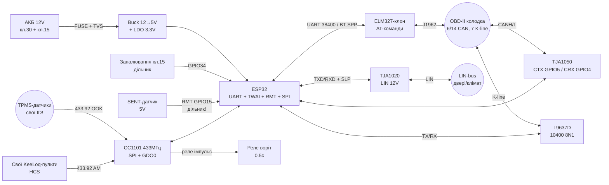

# Automotive - OBD-II (ELM327), LIN, SENT, FlexRay, 100BASE-T1, K-line, TPMS, KeeLoq, живлення 12V

## Purpose

Ця нота - автомобільний вузол ESP32: diagnostics **OBD-II** via **ELM327-клон**
(UART, AT-команди), table **PIDs** with формулами (включно with **010C RPM**),
**LIN-bus** (master/slave, checksum, трансивер **TJA1020**),
датчиковий протокол **SENT** (Single Edge Nibble),
огляди **FlexRay** and **100BASE-T1** (that треба знати інтегратору on ESP32),
легасі **K-line / ISO 9141** (драйвер **L9637D**),
прийом **TPMS 433 МГц** (декодування пакетів тиску),
**KeeLoq**-брелоки (rolling code - працюємо **тільки зі своїми** пультами!
плюс legal-блок), and **живлення from бортмережі 12V**
(стрибки до **40V**, load dump - тільки **buck + TVS**).

![[assets/img/automotive-obd-lin-scheme.png|600]]
*Fig. ESP32 in авто: ELM327-клон in OBD-II роз'ємі (UART/BT), LIN via TJA1020, K-line via L9637D, SENT-датчик on GPIO/RMT, TPMS-приймач 433 МГц, живлення 12V via buck + TVS.*

Links to [[EN/Home.en]], [[04-Interfaces/05-CAN-TWAI-RS485]], [[04-Interfaces/01-UART|UART]],
[[EN/12-Comm-Modules/19-Wired-2.en]], [[EN/12-Comm-Modules/17-GNSS-RTK.en]],
[[EN/12-Comm-Modules/23-Marine-Time.en]], [[EN/12-Comm-Modules/21-Motion-Control.en]],
[[02-Power-Supply/01-Lancjugi-zhivlennya]].

> [!warning] ESP32 - not блок керування безпекою!
> ESP32 not має автомобільної кваліфікації (AEC-Q100), детермінованого
> реального часу and ASIL-рівня. Використання: diagnostics, телеметрія,
> логер, стенд, комфортна електроніка. not вішати ESP32 on керування
> гальмами, подушками, рульовим, дроселем. Шина CAN авто - тільки via
> трансивер with фільтрами, in режимі listen-only поки not розумієте трафік.
> Запис in шину чужого авто without згоди власника - незаконне втручання.

## Характеристики

| Вузол | Роль | Інтерфейс до ESP32 | Живлення | Швидкість / межа | Коли брати |
| --- | --- | --- | --- | --- | --- |
| ELM327-клон (BT/USB/UART) | OBD-II інтерпретатор AT-команд | UART 38400 або BT SPP | 5V (всередині автоадаптера) | 10.4 кбод K-line / 500 кбіт CAN | Швидкий доступ до PIDs without писання CAN-стека |
| OBD-II PIDs (режим 01) | Стандартні параметри (RPM, швидкість, ECT) | via ELM327 або безпосередньо TWAI ISO 15765-4 | - | запит/відповідь ~20-50 мс | Діагностика, борткомп'ютер, логер |
| LIN (TJA1020) | Дешева підbus дверей/сидінь/клімату | UART + TX/RX до TJA1020 | 12V bus / 3.3-5V логіка | 2.4-19.2 кбод | Керування актуаторами LIN, емуляція master |
| SENT (SAE J2716) | Датчики (тиск, положення, педаль) | GPIO + RMT/PCNT вхід | 5V живлення датчика | tick 3-90 мкс, ~1-4 кГц кадрів | Читання штатних SENT-датчиків |
| FlexRay | Детермінована магістраль шасі | оглядово (ESP32 without контролера!) | - | до 10 Мбіт, 2 канали | Розуміти топологію, not підключати ESP32 безпосередньо |
| 100BASE-T1 | Автомобільний Ethernet (1 пара) | оглядово (потрібен PHY типу DP83TC811) | - | 100 Мбіт, 1 вита пара | Розуміти DoIP, diagnostics via шлюз |
| K-line / ISO 9141 (L9637D) | Легасі-diagnostics до ~2004-2008 | UART 10400 8N1 via L9637D | 12V bus / 5V логіка | 10.4 кбод | Старі VAG, ВАЗ, Daewoo, Hyundai |
| TPMS 433 МГц (RX) | Тиск/температура шин | SPI/CC1101 або OOK-RX + GPIO | 3.3V | 433.92 МГц, OOK/FSK 4-20 кбод | Монітор тиску свого авто/причепа |
| KeeLoq HCS301-подібні | Радіобрелоки 433 МГц rolling code | RX 433 МГц + декодер | 3.3V | 433.92 МГц AM | Тільки СВОЇ брелоки: свій приймач + свої пульти |
| Живлення 12V buck + TVS | Вижити in бортмережі | VIN 12V → buck 5V → LDO 3.3V | 9-36V вхід (стрибки 40V+) | струм ESP32 0.2-0.5A | Будь-which постійне installation in авто |

## 1. ELM327-клон - UART AT-команди

**ELM327** (оригінал Elm Electronics, зараз виробництво згорнуто - див. джерела)
and його клони (v1.5 «повний», v2.1 «урізаний») - this мікроконтролер-інтерпретатор:
приймає ASCII **AT-команди** per UART/BT and сам говорить with авто
(CAN ISO 15765-4, KWP2000, ISO 9141, J1850). for ESP32 this найшвидший шлях
до PIDs: not треба писати CAN-стек, достатньо UART 38400.

### 1.1. Базові AT-команди (маст-хев набір)

| Команда | that робить | typical відповідь |
| --- | --- | --- |
| `ATZ` | Скидання адаптера | `ELM327 v1.5` |
| `ATE0` | Вимкнути ехо | `OK` |
| `ATL0` | Вимкнути переведення рядка (короткі відповіді) | `OK` |
| `ATH1` / `ATH0` | Показати/приховати заголовки CAN | `OK` |
| `ATSP0` | Автопротокол | `OK` |
| `ATSP6` | Примусово ISO 15765-4 CAN 500 кбіт 11-біт | `OK` |
| `ATSP3` | Примусово ISO 9141-2 | `OK` |
| `ATDP` / `ATDPN` | Показати поточний протокол | `AUTO, ISO 15765-4 (CAN)` |
| `ATRV` | Напруга бортмережі | `12.4V` |
| `010C` | Запит RPM (режим 01, PID 0C) - not AT, but OBD-запит | `41 0C 1A F8` |
| `03` | Прочитати збережені DTC | `43 01 33 00 00` |
| `04` | Стерти DTC (ОБЕРЕЖНО - тремо MIL and freeze frame!) | `44` |

### 1.2. Формат запит/відповідь OBD via ELM327

```text
ESP32 -> ELM327 : "010C\r"            режим 01, PID 0C (RPM)
ELM327 -> авто  : 7DF#02 01 0C ...    CAN 11-біт ID 0x7DF, 2 байти запиту
авто   -> ELM327: 7E8#04 41 0C 1A F8  відповідь ECU (ID 0x7E8)
ELM327 -> ESP32 : "41 0C 1A F8\r>"    ASCII hex + промпт '>'
Формула RPM     : ((A*256)+B)/4 = ((0x1A*256)+0xF8)/4 = 1726 об/хв
```

> [!warning] Клони v2.1 брешуть про протокол
> Дешеві клони v2.1 часто відповідають `OK` on будь-which `ATSP`, але реально
> вміють тільки CAN 11/29-біт. for K-line авто (старі, до ~2008) шукайте
> клон **v1.5** with повним набором або окремий **K-line адаптер on L9637D**.
> check: `ATDPN` після підключення до авто + `0100` (підтримувані PIDs).

### 1.3. Три підключення ELM327 до ESP32

| Варіант | Плюси | Мінуси |
| --- | --- | --- |
| BT Classic SPP (HC-05-подібний ELM327) | without дротів, адаптер in колодці, ESP32 in бардачку | BT Classic немає on C3/S3 without Bluedroid, пін `1234`, затримка 50-150 мс |
| USB ELM327 + USB-OTG (тільки S2/S3 host) | Стабільно, живлення from ESP32 | Потрібен USB-host, драйвер PL2303/CH340 |
| Дротовий UART-module ELM327 (плата with TX/RX) | Найнадійніше, 38400 8N1, мінімум затримки | Треба тягти 4 дроти до колодки OBD-II |

## 2. OBD-II PIDs - режими, автотаблиця, формули

### 2.1. Режими (services) SAE J1979 - that питати

| Режим | Назва | example запиту | Коли |
| --- | --- | --- | --- |
| 01 | Поточні дані (live PIDs) | `010C` RPM | 95% роботи: борткомп'ютер, логер |
| 02 | Freeze frame (знімок on момент DTC) | `02020C` | Розбір причини Check Engine |
| 03 | Зчитати збережені DTC | `03` | Діагностика |
| 04 | Стерти DTC + freeze frame | `04` | Тільки після ремонту! |
| 07 | Очікуючі (pending) DTC | `07` | Раннє виявлення |
| 09 | Інфо про авто (VIN, ECU) | `0902` VIN | Ідентифікація авто |
| 0A | Постійні (permanent) DTC | `0A` | Після стирання 04 - that реально лишилось |

### 2.2. Автотаблиця PIDs режиму 01 (найпотрібніші)

Формула застосовується до байтів відповіді `41 <PID> <A> <B> ...`.
`A` - перший байт даних, `B` - другий.

| PID | Назва | Байти | Формула | example | Одиниці |
| --- | --- | --- | --- | --- | --- |
| 00 | Підтримувані PIDs 01-20 (бітова маска!) | 4 | біти A..D | `BE 1F A8 13` | маска |
| 04 | Навантаження двигуна (LOAD) | 1 (A) | `A*100/255` | `A=0x7F` → 49.8% | % |
| 05 | Температура охолоджувача (ECT) | 1 (A) | `A-40` | `A=0x5A` → 50°C | °C |
| 0B | Тиск in впуску (MAP) | 1 (A) | `A` | `A=0x64` → 100 кПа | кПа |
| 0C | Оберти (RPM) | 2 (A,B) | `((A*256)+B)/4` | `1A F8` → 1726 | об/хв |
| 0D | Швидкість авто (VSS) | 1 (A) | `A` | `A=0x3C` → 60 | км/г |
| 0F | Температура впуску (IAT) | 1 (A) | `A-40` | `A=0x46` → 30°C | °C |
| 10 | Витрата повітря (MAF) | 2 (A,B) | `((A*256)+B)/100` | `01 7C` → 3.8 | г/с |
| 11 | Положення дроселя (TP) | 1 (A) | `A*100/255` | `A=0x33` → 20% | % |
| 1F | Час from startу | 2 (A,B) | `A*256+B` | `00 B4` → 180 | с |
| 20 | Підтримувані PIDs 21-40 (маска) | 4 | біти | - | маска |
| 2F | Рівень палива | 1 (A) | `A*100/255` | `A=0x99` → 60% | % |
| 33 | Тиск барометра | 1 (A) | `A` | `A=0x65` → 101 | кПа |
| 42 | Напруга модуля керування | 2 (A,B) | `((A*256)+B)/1000` | `30 D4` → 12.5 | in |
| 46 | Температура навколишня (AMB) | 1 (A) | `A-40` | `A=0x4A` → 34°C | °C |
| 5E | Миттєва витрата (rate) | 2 (A,B) | `((A*256)+B)/20` | дизель/бензин | мЛ/г |

> Формула 010C RPM детально: відповідь `41 0C A B`, де `41` = відповідь
> on режим 01, `0C` = ехо PID. `RPM = ((A × 256) + B) / 4`.
> Ділення on 4 - because роздільна здатність 0.25 об/хв on молодший біт.
> example: `A=0x1A (26), B=0xF8 (248)` → `(26×256+248)/4 = 6904/4 = 1726`.

### 2.3. DTC-формат (режим 03) - розбір for 10 секунд

Відповідь `43 <N> <B1H> <B1L> <B2H> <B2L>...`, кожен DTC - 2 байти.
Перші 2 біти першого байта = літера: `00=P, 01=C, 10=B, 11=U`.
example: `01 33` → біти `00` + `0x133` → **P0133** (повільний зонд lambda).
`04` - стирання; після нього ECU гасить MIL, але монітори readiness
стають `not ready` (not пройде техогляд одразу - треба drive cycle!).

### 2.4. Прямий CAN without ELM327 (ISO 15765-4 via TWAI)

Сучасні авто (США with 2008 - усі): CAN 500 кбіт, 11-біт, запит on `0x7DF`,
відповіді `0x7E8-0x7EF`. Кадр: `[довжина][режим][PID][доп...]`.
Запит RPM: `02 01 0C 00 00 00 00 00`. ESP32-TWAI вміє this безпосередньо
(див. code + [[04-Interfaces/05-CAN-TWAI-RS485]]) - швидше for ELM327 in 3-5 разів,
але треба самому збирати ISO-TP for довгих відповідей (VIN, режим 09).

## 3. Протоколи авто - зведена автотаблиця

| Протокол | Швидкість | Фізика | Піни OBD-II | Авто / роки | ESP32-шлях |
| --- | --- | --- | --- | --- | --- |
| CAN ISO 15765-4 (11-біт, 500 кбіт) | 250/500 кбіт | Дифпара CANH/CANL | 6 (H), 14 (L) | Усі США with 2008, EU бензин with ~2001/EOBD | TWAI + TJA1050/SN65HVD230 |
| CAN 29-біт (extended, 250 кбіт) | 250 кбіт | Дифпара | 6, 14 | Вантажні, деякі GM/Ford | TWAI extended ID |
| K-line ISO 9141-2 | 10.4 кбод | Однодротова, 0/12V | 7 (K), 15 (L, опц.) | Chrysler/EU/Asia 1996-2004 | UART via L9637D |
| KWP2000 ISO 14230 | 1.2-10.4 кбод | how ISO 9141 | 7, 15 | VAG/ВАЗ/Daewoo 2000-2008 | UART via L9637D + fast init |
| SAE J1850 PWM (Ford) | 41.6 кбіт | Дифпара | 2 (+), 10 (−) | Ford USA до 2008 | Тільки via ELM327! |
| SAE J1850 VPW (GM) | 10.4 кбіт | Один дріт | 2 | GM USA до 2008 | Тільки via ELM327! |
| LIN (ISO 17987) | 2.4-19.2 кбод | Один дріт, 12V | немає in OBD (внутрішня) | Двері/клімат/сидіння всіх | UART via TJA1020 |
| SENT (SAE J2716) | tick 3-90 мкс | Один дріт, 5V | немає (датчики) | Датчики тиску/положення | GPIO + RMT вхід |
| FlexRay (ISO 17458) | до 10 Мбіт ×2 канали | Вита пара ×2 | немає in OBD | BMW/Mercedes/Audi шасі | Оглядово, ESP32 not підключати! |
| 100BASE-T1 (802.3bw) | 100 Мбіт | 1 вита пара | DoIP-піни (заводські) | Нові VAG/BMW, DoIP-diagnostics | Оглядово, потрібен T1-PHY |
| TPMS 433 МГц | OOK/FSK | Радіо 433.92 МГц | - | Датчики шин | CC1101/OOK-RX on SPI/GPIO |

## 4. LIN-bus - master/slave, checksum, TJA1020

**LIN** (Local Interconnect Network, ISO 17987) - дешева однодротова підbus:
один **master** (зазвичай BCM/блок комфорту) опитує до 16 **slave**
(кнопки дверей, мотори склопідйомників, клімат-заслінки, датчики дощу).
ESP32 виступає або **слухачем-логером**, або **master** on стенді
(емуляція BCM for перевірки дверної ручки), або **slave** (розумний актуатор).

### 4.1. Кадр LIN: break → sync → PID → data → checksum

```text
master шле:  BREAK (13+ біт LOW, мінімум 11 нульових + делімітер)
             SYNC  (0x55 = 01010101, slave міряє бод по ньому!)
             PID   (6 біт ID + 2 біти парності P0/P1)
slave шле:   DATA  (2/4/8 байт за ID)
             CHECKSUM (classic: сума DATA; enhanced: сума PID+DATA, інверсія)
Швидкість: 2400 / 9600 / 19200 бод, 8N1, LSB first, інверсна логіка драйвера.
```

### 4.2. Парність PID and checksum - формули

```text
ID біти: ID0..ID5. P0 = ID0^ID1^ID2^ID4, P1 = ~(ID1^ID3^ID4^ID5).
Приклад ID=0x32 (110010): P0=0, P1=1 -> PID = 0xB2.
Classic checksum: скласти DATA-байки з переносом (mod 255), інвертувати.
  DATA = 01 02 03 -> сума 06 -> checksum 0xF9.
Enhanced (LIN 2.x, ID 0..59): те саме + PID у суму.
  Діагностика (ID 60/61): завжди classic!
```

### 4.3. TJA1020 - that this and how підключати

**TJA1020** (NXP) - LIN-трансивер: перетворює UART-логіку ESP32 (TXD/RXD)
in 12V-сигнал LIN-шини зі slew-rate-контролем (мінімум завад),
режими normal/low-slope/sleep, wake-up per шині. Ключове:
внутрішній термінатор slave; for **master** треба зовнішні
**1 кОм + діод** між VBAT and LIN (інакше slave not побачать домінанту!).

| Пін TJA1020 (SO8) | Куди | Примітка |
| --- | --- | --- |
| TXD | GPIO TX ESP32 (UART) | Вхід даних from MCU |
| RXD | GPIO RX ESP32 (UART) | Вихід даних до MCU |
| LIN | Шина LIN (12V) | via дросель/ESD for потреби |
| VBAT / INH | 12V борт / key живлення | INH керує живленням вузла in sleep |
| SLP_N | GPIO ESP32 (режим сну) | LOW = sleep (струм ~10 мкА) |
| GND | Спільна земля | Зірка земель! |

> Break-issue UART: стандартний UART ESP32 not вміє слати 13-бітний LOW.
> Ліки: (but) тимчасово знизити бод in 1.5 раза and слати `0x00` (довший LOW =
> псевдо-break); (б) GPIO-бітбенг break (LOW 1 мс), потім UART-кадр;
> (in) LIN-контролер SJA1124 per SPI (апаратний break, 4 канали).

## 5. SENT - Single Edge Nibble Transmission (SAE J2716)

**SENT** - однодротовий протокол датчиків: кожне повідомлення - серія
імпульсів, де інформація in **довжині HIGH-фаз** (між спадними фронтами).
Датчик: тиск наддуву, положення педалі, кут керма, MAF нового типу.
ESP32 читає via **RMT-вхід** (вимір довжин) або **PCNT + таймер**.

```text
tick = базовий квант 3..90 мкс (типово 3 мкс, калібрується по SYNC-паузі 56 ticks).
Кадр: SYNC (56 ticks LOW) + STATUS (4 біти) + 6×DATA nibble + CRC + PAUSE (доповнення).
Нібл N (0..15): LOW 5 ticks + HIGH (12+N ... див. J2716) -> період 12..27 ticks.
Fast channel: 2 канали даних (тиск + температура).
Slow channel: серійні дані в бітах STATUS (ID датчика, diagnostics).
CRC: поліном x^4+x^3+x^2+1, seed 0101.
Приклад tick=3мкс: SYNC=168мкс, нібл 0 = 36мкс, нібл 15 = 81мкс.
```

Діагностика SENT: немає SYNC >1 мс - датчик without живлення; CRC-фейли -
завади on землі (датчик and ESP32 on різних землях!); дрейф tick ±20% -
норма, калібруватися per кожному SYNC.

## 6. FlexRay - оглядово (that знати, чого not робити)

**FlexRay** (ISO 17458-1..5, до 10 Мбіт, 2 незалежні канали, TDMA):
детермінована bus шасі/ADAS (BMW X5 E70 перший серійний, далі 7-series,
Audi A4 B9/A8, Mercedes W222/W213). Цикл = static segment (слоти) +
dynamic segment (event). ESP32 **not має** FlexRay-контролера -
підключення вимагає контролера (CIC310, E-Ray) + 2 трансиверів TJA1080.
Практичний висновок: on рівні ESP32 - **тільки розуміти**, that FlexRay
існує and чому туди лізти not можна without стенда for $2k+. Діагностика FlexRay -
via заводський шлюз/DoIP, not прямим підключенням.

## 7. 100BASE-T1 - оглядово (однопарний Ethernet)

**100BASE-T1** (IEEE 802.3bw, OPEN Alliance): 100 Мбіт per **одній** витій парі
(замість 2 пар in 100BASE-TX) - менше міді, менше ваги. Фізика PAM3,
повний дуплекс. for ESP32: потрібен автомобільний PHY
(напр. **DP83TC811S-Q1**, TI - див. джерела) per RMII/RGMII до MCU with EMAC
(ESP32 classic має EMAC; C3/S2 - ні!). Застосування: **DoIP**
(Diagnostics over IP, ISO 13400) - заводська diagnostics нових авто,
камери, доменні контролери. Практично: ESP32 how DoIP-сканер можливий
тільки with T1-PHY платою + TCP-стек UDS; починати with вивчення DoIP-шлюзу
авто, not with пайки PHY.

## 8. K-line / ISO 9141 - L9637D

Старі авто (VAG до ~2004, ВАЗ/ЗАЗ/Daewoo/Hyundai/KIA): diagnostics
**K-line** - однодротовий UART 10400 бод, рівні 0/12V, ініціалізація
**5-baud init** (ECU будиться повільним байтом 0x33 on 5 бод!) або
**fast init** (25 мс LOW + 25 мс HIGH). Драйвер **L9637D** (ST) -
перетворювач K/L-line ↔ логіка: TX (from MCU) → K (open-collector 12V),
K → RX (компаратор), ISO-термозахист, ESD.

| Сигнал L9637D | Куди on ESP32 | Примітка |
| --- | --- | --- |
| TX | GPIO UART TX | Вхід драйвера |
| RX | GPIO UART RX | Вихід драйвера |
| K | Пін 7 OBD-II | via 510 Ом + TVS! |
| L | Пін 15 OBD-II (опц.) | Часто not потрібна |
| VS | 12V борт (via діод) | Живлення драйвера |
| GND | Земля | Спільна with OBD піни 4/5 |

Послідовність 5-baud init (VAG 1.9 TDI, ВАЗ Bosch MP7.0):

```text
1. UART TX на 5 бод (!), слати 0x33 (адреса ECU), чекати 20-50мс.
2. ECU відповідає 0x55 0xEF 0x8F на 10400 бод (sync + key bytes).
3. ESP32 шле інверсію key2 (0x8F -> 0x70) як підтвердження.
4. ECU шле інверсію адреси (0xCC) -> з'єднання встановлено, далі KWP2000 кадри.
Бод UART ESP32: перемкнути 5 бод -> 10400 бод між кроком 1 і 2!
Таймінги W1..W5 (25-100мс) критичні — програмний UART на GPIO надійніший за HW на 5 бод.
```

## 9. TPMS 433 МГц - прийом and декодування

Датчики тиску шин шлють on **433.92 МГц** (OOK/ASK або FSK, Manchester):
ID датчика (32 біти) + тиск (8-9 біт) + температура + прапор батареї + CRC/Checksum.
Шлях ESP32: **CC1101** (SPI, гнучкий: OOK/FSK, RSSI) або дешевий OOK-RX
(напр. SRX882) + GPIO-переривання + софт-декодер Manchester.

```text
Типовий пакет (приклад, Schrader-подібний, 64 біти Manchester):
  преамбула 0xAA.. (8-16 біт) + sync 0x2D 0xD4 + ID(32б) + тиск(8б) + темп(8б) + статус(8б) + CRC8
  Тиск: raw*6.9 кПа або raw*0.25 psi (залежить від виробника — калібрувати манометром!).
  Температура: raw-50 °C (типово).
  Період: стоянка — 1 раз/год; рух — 1 раз/30-60с; витік — частіше (датчик з акселерометром!).
Процедура прив'язки: записати ID 4 датчиків свого авто, ігнорувати чужі (фільтр по ID!).
```

> [!warning] Чужий TPMS - чужі дані
> Етично and технічно: декодувати **тільки свої** датчики (своє авто, свій причіп).
> on паркінгу ESP32 побачить десятки чужих ID - відкидати фільтром білого списку,
> not логувати чужі треки. this and приватність, and стабільність (немає фантомних коліс).

## 10. KeeLoq - брелоки, rolling code (тільки свої! + legal)

**KeeLoq** (Microchip HCS301/HCS341 енкодери) - блочний шифр rolling code:
кожне натискання шле новий code (лічильник + дискримінант + шифр on ключі
виробника). Приймач приймає вікно наступних N кодів (±16 типово).

```text
Пакет HCS301 (66 біт, 433.92 МГц AM, PWM-манчестер ~1-2 кбод):
  преамбула (10 біт чергування) + header + hopping code (32б шифр) + serial (28б) + кнопки/батарея
Навчання приймача: кнопка LEARN + послати 2 пакети своїм пультом (seed/serial записується).
Rolling вікно: приймач зберігає останній лічильник; приймає +16 вперед, resync — 2 збіги підряд.
```

that робимо on ESP32 (ЛЕГАЛЬНО): купуємо **свій** комплект (приймач superheterodyne
433 МГц + 2 свої HCS-пульти або learning-приймач with реле), декодуємо **свої**
пакети for свого гаража/воріт/макету. code нижче - **прийом свого** фіксованого
ID + check лічильника монотонності (анти-replay on своєму приймачі).

> [!danger] Legal - прочитати двічі
> Перехоплення, replay, jamming, RollJam-подібні атаки on **чужі** авто/ворота -
> кримінальний злочин (несанкціоноване втручання, крадіжка). Дослідження
> вразливостей KeeLoq (Bogdanov, Courtois, Bochum side-channel - див. джерела)
> цитуємо for розуміння, чому свій приймач має мати **вікно resync малим**,
> **seed унікальним**, but реле - **імпульсним** (not тримати ворота відкритими).
> in цій ноті - ніяких граберів, ніякого глушіння, ніяких чужих ключів. Крапка.

## 11. Живлення 12V from бортмережі - стрибки 40V, buck + TVS

Бортмережа 12V - this not 12V: пуск (просадка до 6V), load dump
(вимкення АКБ at працюючому генераторі - **+40..+60V, сотні мс**),
стрибки запалювання, переполюсовка at «прикурюванні». Лінійний LDO
7805 тут згорить разом with ESP32. Схема виживання:

```text
АКБ 12V (клема 30, постійна) --[запобіжник 1A]--+--[TVS SMBJ28A]--+--[buck 9-36V->5V]--+--[LDO 5->3.3V]--> ESP32
                                                |  (обмежує 40V+)  |  (напр. MP1584/LM2596-авто) |  (AMS1117/MP2112)
Клема 15 (запалювання) --------------------------[дільник 10к/2.2к]--> GPIO34 (детект ON/OFF, сон при OFF)
                                                GND зіркою на кузов біля точки, TVS якомога ближче до входу!
```

| Елемент | Вимога | example |
| --- | --- | --- |
| Запобіжник | 0.5-1A, швидкий, тримач | Mini Blade + колодка |
| TVS (двонаправлений!) | Vrwm ≥ 22V (for 12V мережі), Pppm 600W+ | SMBJ24A/SMBJ28A, далі варистор опційно |
| Зворотний діод | protection from переполюсовки | SS34 Schottky (падіння 0.4V) |
| Buck | Вхід 7-40V+, вихід 5V 1A, AEC-практика | MP1584EN, LM2596HV (HV-версія!), XL1509-5 |
| LDO 3.3V | Після buck, чисті 3.3V for ESP32/RF | AMS1117-3.3 (with запасом) / ME6211 |
| Фільтр | LC on вході buck (100 мкГн + 100 мкФ) | Проти кидків startера |
| Детект запалювання | Дільник + стабілітрон 3.6V on GPIO | 12V→2.2V on GPIO34 (тільки вхід!) |

> Вимірювання: сплячий ESP32-логер має брати <5 мА from АКБ (deep-sleep +
> buck in eco-режимі або окремий key живлення per клемі 15). Інакше for 2 тижні
> стоянки АКБ 60Аг сяде in нуль. Реле/key high-side (BTS6143D) per запалюванню -
> стандартне рішення.

## Легенда пінів модуля

### ELM327-клон (BT-module, типовий)

| Пін / елемент | Позначення | Тип | Куди | Примітка |
| --- | --- | --- | --- | --- |
| 1 | VCC 5V | Живлення | 5V / OBD пін 16 via 12→5V | Всередині адаптера свій регулятор! |
| 2 | GND | Земля | GND / OBD піни 4+5 | Обидві землі OBD with'єднати! |
| 3 | TX (адаптер→ESP32) | Вихід UART 3.3/5V | GPIO16 (RX2 ESP32) via дільник якщо 5V! | Бод 38400 (рідше 9600/115200) |
| 4 | RX (ESP32→адаптер) | Вхід UART | GPIO17 (TX2 ESP32) | Перехресно TX→RX |
| BT | SPP `OBDII`, пін `1234`/`0000` | BT Classic | ESP32 Bluedroid SPP | Тільки classic ESP32, not C3! |
| OBD-роз'єм | J1962 16-пін | Авто | колодка авто | Піни 6/14 CAN, 7 K-line, 16 +12V |

### TJA1020 LIN-плата

| Pin | Label | Type | To ESP32 | Note |
| --- | --- | --- | --- | --- |
| 1 | VCC 3.3/5V | Живлення логіки | 3V3 (або 5V for версією плати) | Рівні TXD/RXD сумісні 3.3/5V |
| 2 | GND | Земля | GND | Спільна with ESP32 and кузовом |
| 3 | TXD | Вхід цифровий | GPIO17 (UART TX) | ESP32 TX → TXD |
| 4 | RXD | Вихід цифровий | GPIO16 (UART RX) | RXD → ESP32 RX |
| 5 | SLP_N | Вхід керування | GPIO5 (HIGH=робота) | LOW = сон 10 мкА |
| 6 | LIN | Шина 12V | LIN-bus авто/стенда | Master: +1кОм+діод on VBAT! |
| 7 | VBAT | Живлення 12V | Борт 12V via запобіжник | Діапазон 5.5-27V |

### L9637D K-line плата

| Pin | Label | Type | To | Note |
| --- | --- | --- | --- | --- |
| 1 | VCC 5V | Живлення | 5V | Логіка 5V - RX до ESP32 via дільник 2:1! |
| 2 | GND | Земля | GND | Спільна |
| 3 | TX | Вхід | GPIO17 (TX2) | 10400 8N1 |
| 4 | RX | Вихід 5V! | GPIO16 via дільник 10к/20к | 5V вб'є GPIO without дільника! |
| 5 | K | Шина | OBD пін 7, via 510 Ом | Підтяжка до 12V всередині |
| 6 | L | Шина (опц.) | OBD пін 15 | Часто NC |
| 7 | VS | 12V | Борт via діод + TVS | Живлення драйвера |

### CC1101 433 МГц (TPMS / свої KeeLoq-пульти)

| Pin | Label | Type | To ESP32 | Note |
| --- | --- | --- | --- | --- |
| 1 | VCC 3.3V | Живлення | 3V3 | Тільки 3.3V! |
| 2 | GND | Земля | GND | Короткий провід |
| 3 | SCK | SPI | GPIO18 | SPI до 10 МГц |
| 4 | MOSI | SPI | GPIO23 | - |
| 5 | MISO | SPI | GPIO19 | - |
| 6 | CSN | SPI | GPIO5 | Активний LOW |
| 7 | GDO0 | Вихід цифровий | GPIO4 (переривання) | Дані OOK / sync-преривання |
| 8 | GDO2 | Вихід цифровий | GPIO2 (опц.) | RSSI/carrier sense |
| ANT | SMA/IPEX | RF | Антена 433 МГц 17 см | Довжина чвертьхвилі! |

## Схема

Загальна схема: ESP32 + buck/TVS-живлення from 12V, ELM327 (UART/BT) in OBD,
LIN via TJA1020, K-line via L9637D, SENT-датчик on RMT-вхід,
TPMS/KeeLoq-RX on CC1101.

### ASCII schematic

```text
ЖИВЛЕННЯ (вижити при 40V!):
  АКБ 12V (кл.30) --[FUSE 1A]--+--[TVS SMBJ28A на GND]--+--[buck 12->5V]--+--[LDO 5->3.3V]--> ESP32 3V3
  Клема 15 (запалювання) -------[дільник 10к/2.2к + ZD 3.6V]-------------------------------> GPIO34 (детект ON/OFF)
  Кузов GND ------------------------------------------------------------------------------> GND (зірка!)

OBD-II J1962 (колодка авто):
  пін 16 (+12V) -> живлення ELM327-адаптера (внутрішній регулятор адаптера)
  пін 4+5 (GND) -> GND ESP32 (через адаптер)
  пін 6 CAN-H -> ELM327 / або TWAI-трансивер (TJA1050: CTX<-GPIO5, CRX->GPIO4)
  пін 14 CAN-L -> ELM327 / або TWAI-трансивер
  пін 7 K-line -> L9637D K <-> (TX GPIO17 / RX GPIO16 через дільник) [старі авто]
  пін 15 L-line -> L9637D L (опційно)

ELM327-адаптер:
  BT-версія:  SPP "OBDII" <-> ESP32 Bluedroid (classic ESP32!) 38400-еквівалент
  UART-версія: TX -> GPIO16 (RX2), RX <- GPIO17 (TX2), 38400 8N1, ECHO OFF (ATE0)

LIN-гілка (двері/стенд):
  ESP32 GPIO17 TX -> TXD TJA1020, GPIO16 RX <- RXD TJA1020, GPIO5 -> SLP_N (HIGH)
  TJA1020 LIN <-> LIN-bus (12V); MASTER-режим: LIN --[1кОм + 1N4148]-- VBAT 12V
  Бод 9600/19200, break GPIO-бітбенгом (LOW ~1мс) перед SYNC 0x55

SENT-датчик:
  Датчик VCC 5V (окремий LDO!), GND спільна, OUT -> GPIO15 (RMT-вхід, підтяжка 10к до 5V? НІ — до 3.3V через дільник!)
  УВАГА: SENT HIGH 4.1V+ вб'є GPIO -> дільник 10к/20к або буфер 74LVC245!

RF 433 МГц:
  CC1101: SCK GPIO18, MOSI GPIO23, MISO GPIO19, CSN GPIO5, GDO0 GPIO4 (IRQ), антена 17см
  TPMS-декодер: фільтр білого списку ID своїх 4-8 коліс, чужі — відкидати!
  KeeLoq: ТІЛЬКИ свій learning-приймач + свої пульти; реле імпульсом 0.5с
```

### Mermaid-діаграма шин



## Code

### ESP-IDF - ELM327 per UART + RPM 010C with формулою

```c
// ESP-IDF v5.x: ELM327-клон на UART2 (GPIO16 RX <- TX адаптера, GPIO17 TX -> RX).
// Ініціалізація ATZ/ATE0/ATSP0, запит 010C, парсинг "41 0C A B", RPM=((A*256)+B)/4.
#include <string.h>
#include <stdlib.h>
#include "freertos/FreeRTOS.h"
#include "freertos/task.h"
#include "esp_log.h"
#include "driver/uart.h"

#define TAG "elm327"
#define UART_NUM UART_NUM_2
#define PIN_TX 17
#define PIN_RX 16

static void uart_init_elm(void) {
    uart_config_t cfg = {
        .baud_rate = 38400,
        .data_bits = UART_DATA_8_BITS,
        .parity = UART_PARITY_DISABLE,
        .stop_bits = UART_STOP_BITS_1,
        .flow_ctrl = UART_HW_FLOWCTRL_DISABLE,
        .source_clk = UART_SCLK_DEFAULT,
    };
    ESP_ERROR_CHECK(uart_driver_install(UART_NUM, 1024, 1024, 0, NULL, 0));
    ESP_ERROR_CHECK(uart_param_config(UART_NUM, &cfg));
    ESP_ERROR_CHECK(uart_set_pin(UART_NUM, PIN_TX, PIN_RX,
                                UART_PIN_NO_CHANGE, UART_PIN_NO_CHANGE));
}

// Надіслати команду з \r, прочитати до промпта '>' з таймаутом мс
static int elm_cmd(const char *cmd, char *resp, int cap, int timeout_ms) {
    char tx[32];
    snprintf(tx, sizeof(tx), "%s\r", cmd);
    uart_write_bytes(UART_NUM, tx, strlen(tx));
    int n = 0;
    int waited = 0;
    while (waited < timeout_ms) {
        uint8_t b;
        int m = uart_read_bytes(UART_NUM, &b, 1, pdMS_TO_TICKS(20));
        if (m > 0) {
            if (n < cap - 1) resp[n++] = (char)b;
            if (b == '>') break;
            waited = 0;
        } else {
            waited += 20;
        }
    }
    resp[n] = 0;
    return n;
}

static void elm_init(void) {
    char r[256];
    elm_cmd("ATZ", r, sizeof(r), 2000);    // скидання, чекаємо ELM327 v1.5/v2.1
    vTaskDelay(pdMS_TO_TICKS(1000));
    elm_cmd("ATE0", r, sizeof(r), 500);    // ехо OFF
    elm_cmd("ATL0", r, sizeof(r), 500);    // LF OFF
    elm_cmd("ATH0", r, sizeof(r), 500);    // заголовки OFF
    elm_cmd("ATSP0", r, sizeof(r), 1000);  // автопротокол
    ESP_LOGI(TAG, "ELM init done");
}

// Парсинг "41 0C A B" -> RPM. Повертає -1 при помилці.
static int parse_rpm(const char *resp) {
    unsigned a = 0, b = 0;
    const char *p = strstr(resp, "41 0C");
    if (!p) return -1;
    if (sscanf(p, "41 0C %x %x", &a, &b) != 2) return -1;
    return ((a * 256) + b) / 4;            // формула 010C!
}

void app_main(void) {
    uart_init_elm();
    elm_init();
    char r[256];
    while (1) {
        elm_cmd("010C", r, sizeof(r), 1000);
        int rpm = parse_rpm(r);
        if (rpm >= 0) ESP_LOGI(TAG, "RPM=%d (%s)", rpm, r);
        else ESP_LOGW(TAG, "NO DATA: %s", r);
        vTaskDelay(pdMS_TO_TICKS(500));
    }
}
```

### ESP-IDF - прямий CAN ISO 15765-4 запит RPM via TWAI (without ELM327)

```c
// ESP-IDF v5.x (новий TWAI API): прямий запит RPM на 0x7DF, відповідь з 0x7E8.
// Трансивер TJA1050: CTX <- GPIO5, CRX -> GPIO4. Швидкість 500 кбіт (США з 2008).
#include "freertos/FreeRTOS.h"
#include "freertos/task.h"
#include "esp_log.h"
#include "esp_twai.h"
#include "esp_twai_onchip.h"

#define TAG "obd_twai"

static twai_node_handle_t twai_hdl;

static void twai_init_obd(void) {
    twai_onchip_node_config_t cfg = {
        .io_cfg.tx = 5,
        .io_cfg.rx = 4,
        .bit_timing.bitrate = 500000,
        .tx_queue_depth = 5,
    };
    ESP_ERROR_CHECK(twai_new_node_onchip(&cfg, &twai_hdl));
    ESP_ERROR_CHECK(twai_node_enable(twai_hdl));
}

static void obd_rpm_task(void *arg) {
    uint8_t q[8] = {0x02, 0x01, 0x0C, 0, 0, 0, 0, 0};  // len=2, mode 01, PID 0C
    twai_frame_t tx = {.header.id = 0x7DF, .buffer = q, .buffer_len = 8};
    // Прийом — через on_rx_done колбек (див. TWAI-документацію); тут опитуємо чергу:
    while (1) {
        ESP_ERROR_CHECK(twai_node_transmit(twai_hdl, &tx, 100));
        // У on_rx_done шукати кадр id 0x7E8: data[0]>=3, data[1]==0x41, data[2]==0x0C,
        // RPM = ((data[3]*256)+data[4])/4
        vTaskDelay(pdMS_TO_TICKS(500));
    }
}

void app_main(void) {
    twai_init_obd();
    xTaskCreate(obd_rpm_task, "obd", 4096, NULL, 5, NULL);
}
```

### ESP-IDF - LIN master (break + sync + PID, TJA1020)

```c
// ESP-IDF: LIN master на UART1 (GPIO17 TX -> TXD, GPIO16 RX <- RXD TJA1020),
// SLP_N на GPIO5 (HIGH). Break — GPIO-бітбенгом, далі 0x55 + PID + DATA + checksum.
#include "driver/uart.h"
#include "driver/gpio.h"
#include "freertos/FreeRTOS.h"
#include "freertos/task.h"

#define LIN_TX 17
#define LIN_RX 16
#define LIN_SLP 5

static uint8_t lin_pid_parity(uint8_t id) {
    uint8_t b[6];
    for (int i = 0; i < 6; i++) b[i] = (id >> i) & 1;
    uint8_t p0 = b[0]^b[1]^b[2]^b[4];
    uint8_t p1 = !(b[1]^b[3]^b[4]^b[5]);
    return (id & 0x3F) | (p0 << 6) | (p1 << 7);
}

static uint8_t lin_checksum_classic(const uint8_t *d, int n) {
    int s = 0;
    for (int i = 0; i < n; i++) { s += d[i]; if (s > 255) s -= 255; }
    return (~s) & 0xFF;
}

static void lin_send_break(void) {
    // Бітбенг break: TX як GPIO, LOW ~1 мс (13+ біт на 9600 = ~1.35 мс)
    gpio_set_direction((gpio_num_t)LIN_TX, GPIO_MODE_OUTPUT);
    gpio_set_level((gpio_num_t)LIN_TX, 0);
    vTaskDelay(pdMS_TO_TICKS(2));
    gpio_set_level((gpio_num_t)LIN_TX, 1);
    // Повернути пін UART-драйверу:
    uart_set_pin(UART_NUM_1, LIN_TX, LIN_RX,
                 UART_PIN_NO_CHANGE, UART_PIN_NO_CHANGE);
}

void app_main(void) {
    gpio_set_direction((gpio_num_t)LIN_SLP, GPIO_MODE_OUTPUT);
    gpio_set_level((gpio_num_t)LIN_SLP, 1);   // розбудити TJA1020
    uart_config_t c = {.baud_rate = 9600, .data_bits = UART_DATA_8_BITS,
        .parity = UART_PARITY_DISABLE, .stop_bits = UART_STOP_BITS_1,
        .flow_ctrl = UART_HW_FLOWCTRL_DISABLE, .source_clk = UART_SCLK_DEFAULT};
    uart_driver_install(UART_NUM_1, 512, 512, 0, NULL, 0);
    uart_param_config(UART_NUM_1, &c);
    uart_set_pin(UART_NUM_1, LIN_TX, LIN_RX, UART_PIN_NO_CHANGE, UART_PIN_NO_CHANGE);
    uint8_t data[2] = {0x12, 0x34};
    while (1) {
        lin_send_break();
        uint8_t sync = 0x55, pid = lin_pid_parity(0x32);
        uint8_t cs = lin_checksum_classic(data, 2);
        uart_write_bytes(UART_NUM_1, (char*)&sync, 1);
        uart_write_bytes(UART_NUM_1, (char*)&pid, 1);
        uart_write_bytes(UART_NUM_1, (char*)data, 2);
        uart_write_bytes(UART_NUM_1, (char*)&cs, 1);
        vTaskDelay(pdMS_TO_TICKS(100));
    }
}
```

### Arduino - ELM327 + LIN-слухач + SENT via RMT (огляд)

```cpp
// Arduino-ESP32: ELM327 по Serial2 (38400), TJA1020 LIN на Serial1 (9600),
// SENT-датчик на RMT-вході (вимір довжин імпульсів).
#include <Arduino.h>
#define ELM_RX 16
#define ELM_TX 17

String elmQuery(const String &cmd, int timeout = 800) {
  Serial2.print(cmd + "\r");
  String r;
  long t0 = millis();
  while (millis() - t0 < timeout) {
    while (Serial2.available()) {
      char c = Serial2.read();
      if (c == '>') return r;
      r += c;
    }
  }
  return r;
}

int obdRpm() {
  String r = elmQuery("010C");
  int i = r.indexOf("41 0C");
  if (i < 0) return -1;
  unsigned a, b;
  if (sscanf(r.c_str() + i, "41 0C %x %x", &a, &b) != 2) return -1;
  return ((a * 256) + b) / 4;   // формула 010C
}

void setup() {
  Serial.begin(115200);
  Serial2.begin(38400, SERIAL_8N1, ELM_RX, ELM_TX);
  delay(500);
  elmQuery("ATZ", 2000); elmQuery("ATE0"); elmQuery("ATSP0");
  Serial1.begin(9600, SERIAL_8N1, /*RX*/4, /*TX*/15);  // LIN-слухач через TJA1020
  // SENT RMT-вхід: rmtInit(15, RMT_RX_MODE, RMT_MEM_64) + rmtRead() — довжини ticks.
}

void loop() {
  int rpm = obdRpm();
  Serial.printf("RPM=%d\n", rpm);
  while (Serial1.available()) {           // LIN-трафік у hex для аналізу
    Serial.printf("%02X ", Serial1.read());
  }
  Serial.println();
  delay(500);
}
```

### MicroPython - OBD RPM + LIN-кадр + SENT-заглушка

```python
"""MicroPython ESP32: RPM через ELM327 (UART2 38400), LIN-кадр вручну, SENT — оцінка tick."""
from machine import UART, Pin
import time

elm = UART(2, baudrate=38400, tx=17, rx=16, timeout=800)

def elm_query(cmd):
    elm.write(cmd + "\r")
    buf = b""
    t0 = time.ticks_ms()
    while time.ticks_diff(time.ticks_ms(), t0) < 800:
        if elm.any():
            buf += elm.read(elm.any())
            if b">" in buf:
                break
    return buf.decode(errors="ignore")

def obd_rpm():
    r = elm_query("010C")
    i = r.find("41 0C")
    if i < 0:
        return None
    try:
        parts = r[i:].split()
        a, b = int(parts[2], 16), int(parts[3], 16)
        return ((a * 256) + b) // 4   # формула 010C
    except Exception:
        return None

def lin_pid(id6):
    b = [(id6 >> i) & 1 for i in range(6)]
    p0 = b[0] ^ b[1] ^ b[2] ^ b[4]
    p1 = 1 ^ (b[1] ^ b[3] ^ b[4] ^ b[5])
    return (id6 & 0x3F) | (p0 << 6) | (p1 << 7)

def lin_checksum(data):
    s = 0
    for x in data:
        s += x
        if s > 255:
            s -= 255
    return (~s) & 0xFF

print(elm_query("ATZ"))
elm_query("ATE0"); elm_query("ATSP0")
while True:
    print("RPM:", obd_rpm(), "PID 0x32 ->", hex(lin_pid(0x32)),
          "CS:", hex(lin_checksum([0x12, 0x34])))
    time.sleep(1)
```

### MicroPython - TPMS білий список ID (свої колеса!)

```python
"""Фільтр своїх TPMS-датчиків: чужі ID відкидаємо, свої — тиск/температура."""
MY_TPMS = {"A1B2C3D4", "E5F60718", "12345678", "9ABCDEF0"}  # ID своїх коліс!

def tpms_handle(pkt_id, press_raw, temp_raw):
    if pkt_id not in MY_TPMS:
        return  # чужий датчик з паркінгу — ігнор
    press_kpa = press_raw * 6.9       # калібрувати манометром під свій бренд!
    temp_c = temp_raw - 50
    print("TPMS", pkt_id, round(press_kpa, 1), "kPa", temp_c, "C")
    if press_kpa < 180:
        print("УВАГА: низький тиск!", pkt_id)
```

## typical errors

| # | Symptom | Cause | Ліки |
| --- | --- | --- | --- |
| 1 | ELM327 відповідає `?` on всі запити | Ехо not вимкнено / немає `\r` in кінці | `ATE0`, слати `cmd + "\r"`, чекати `>` |
| 2 | `NO DATA` on `010C` at ввімкненому запалюванні | not той протокол (клон v2.1 without K-line) | `ATDPN`, примусово `ATSP6` (CAN) або `ATSP3` (K-line) |
| 3 | Клон v2.1 мовчить on старому авто | Урізаний клон without ISO 9141/J1850 | Взяти v1.5-повний або L9637D-плату |
| 4 | RPM стрибає in 4 рази | Забули `/4` in формулі 010C | `((A*256)+B)/4`, not `(A*256+B)`! |
| 5 | `UNABLE TO CONNECT` після `ATSP0` | Адаптер not in колодці / запалювання OFF | verify пін 16 (+12V), увімкнути запалювання, `ATZ`+повтор |
| 6 | TWAI мовчить on CAN OBD | Немає термінатора / not та швидкість | 500 кбіт 11-біт (США with 2008), 120 Ом on кінцях стенда |
| 7 | LIN-slave not відповідають | Master without підтяжки 1кОм+діод | Додати master-термінатор on VBAT, verify SLP_N=HIGH |
| 8 | LIN-сміття замість кадрів | Бод not відкалібрований (немає SYNC-захоплення) | Слухати SYNC 0x55, міряти бод per ньому, break ≥13 біт |
| 9 | SENT CRC-фейли | Різні землі датчика and ESP32 / HIGH 4.1V without дільника | Спільна земля, дільник 10к/20к on вхід, калібровка per SYNC |
| 10 | L9637D мовчить (немає 0x55) | 5-baud init not витримані таймінги W1..W5 | Бітбенг 5 бод for 0x33, потім 10400, W=25-100мс |
| 11 | 5V on RX ESP32 from L9637D | RX драйвера 5V-рівень | Дільник 10к/20к або 74LVC245, інакше смерть GPIO! |
| 12 | TPMS показує чужі колеса | Немає білого списку ID | Фільтр своїх 4-8 ID, чужі відкидати |
| 13 | KeeLoq-приймач відкривається from запису | Resync-вікно величезне / seed спільний | Вузьке вікно, унікальний seed, реле імпульсом 0.5с |
| 14 | ESP32 згорів via тиждень in авто | Живлення безпосередньо from 12V / without TVS (load dump 40V+) | Buck 7-40V + TVS SMBJ28A + запобіжник 1A |
| 15 | АКБ сідає for стоянку | Логер жере 100+ мА постійно | Deep-sleep + key per клемі 15, ціль <5 мА in сні |

## Official sources

> Усі посилання нижче перевірені завантаженням (webfetch, 2026-09-29). Вгаданих URL немає.

- OBD-II PIDs (режими, формули включно with 010C RPM) - <https://en.wikipedia.org/wiki/OBD-II_PIDs>
- On-board diagnostics (J1962, протоколи, ISO 9141 / ISO 14230 / CAN) - <https://en.wikipedia.org/wiki/On-board_diagnostics>
- Elm Electronics (офіційний сайт ELM327: datasheets, AT-команди, статус) - <https://www.elmelectronics.com/>
- NXP TJA1020 - LIN-трансивер, baud до 20 кбод, документація - <https://www.nxp.com/products/interfaces/lin-transceivers/dual-lin-transceiver-with-low-drop-voltage-regulator:TJA1020>
- SENT - Single Edge Nibble Transmission, SAE J2716 (структура кадрів) - <https://en.wikipedia.org/wiki/SENT_(protocol)>
- FlexRay (ISO 17458, до 10 Мбіт, static/dynamic segments) - <https://en.wikipedia.org/wiki/FlexRay>
- KeeLoq (HCS, rolling code, атаки - for захисту своїх приймачів) - <https://en.wikipedia.org/wiki/KeeLoq>
- TI DP83TC811S-Q1 - 100BASE-T1 PHY IEEE 802.3bw, datasheet - <https://www.ti.com/product/DP83TC811S-Q1>
- ESP-IDF TWAI (CAN-контролер ESP32: TX/RX, фільтри, приклади) - <https://docs.espressif.com/projects/esp-idf/en/stable/esp32/api-reference/peripherals/twai.html>

## See also

- [[EN/Home.en]]
- [[04-Interfaces/05-CAN-TWAI-RS485]] - TWAI/CAN-база for прямого OBD-II without ELM327
- [[04-Interfaces/01-UART|UART]] - UART for ELM327 / LIN / K-line
- [[EN/12-Comm-Modules/19-Wired-2.en]] - CAN-інструменти (CANable, SLCAN, ISO1050, Wireshark)
- [[EN/12-Comm-Modules/17-GNSS-RTK.en]] - GNSS-трекер до автомобільного логера
- [[EN/12-Comm-Modules/23-Marine-Time.en]] - сусідня нота (NMEA2000/CAN 250 кбіт, спільний TWAI-досвід)
- [[EN/12-Comm-Modules/21-Motion-Control.en]] - керування моторами/актуаторами (продовження LIN-тематики)
- [[02-Power-Supply/01-Lancjugi-zhivlennya]] - ланцюги живлення, buck, TVS, protection
