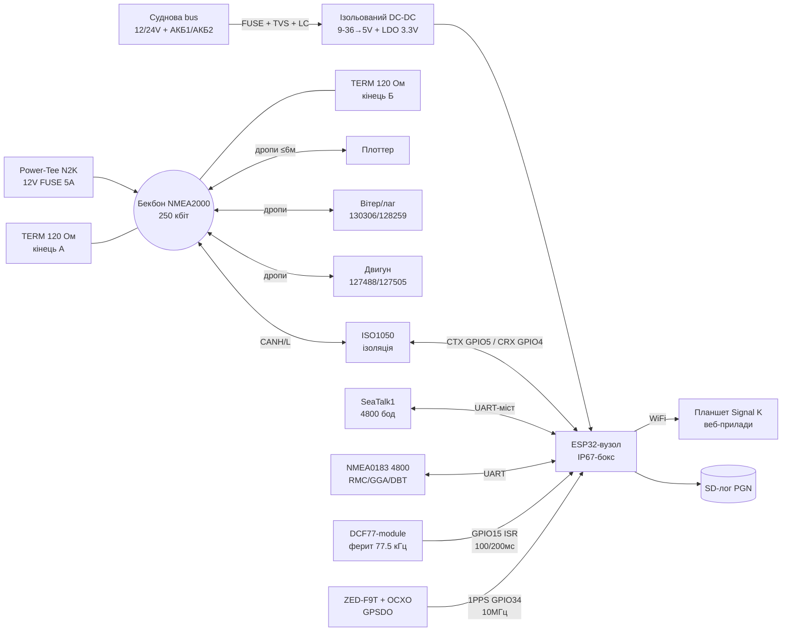

# Marine-Time - NMEA2000, SeaTalk, DCF77/WWVB/MSF, GPSDO, корпус IP67, живлення 12/24V

## Purpose

Ця нота - морський and часо-вимірювальний вузол ESP32: мережа **NMEA2000**
(CAN **250 кбіт**, **PGN**, **термінатори 120 Ом**, **живлення шини**),
огляд **SeaTalk** (легасі Raymarine and міст до NMEA2000),
радіосинхронізація часу **DCF77 / WWVB / MSF** (феритова антена,
декодування **секундних імпульсів**), **GPSDO** (дисциплінований
генератор with **holdover**), морський **корпус IP67** and живлення **12/24V**
(protection, розв'язка, резерв).

![[assets/img/marine-time-nmea-scheme.png|600]]
*Fig. ESP32 on яхті: NMEA2000-бекбон (термінатори, живлення шини), SeaTalk-міст, DCF77-приймач with феритом, GPSDO 10 МГц + 1PPS, IP67-корпус, живлення 12/24V via ізольований DC-DC.*

Links to [[EN/Home.en]], [[04-Interfaces/05-CAN-TWAI-RS485]], [[04-Interfaces/01-UART|UART]],
[[EN/12-Comm-Modules/19-Wired-2.en]], [[EN/12-Comm-Modules/17-GNSS-RTK.en]],
[[EN/12-Comm-Modules/22-Automotive.en]], [[EN/12-Comm-Modules/21-Motion-Control.en]],
[[02-Power-Supply/01-Lancjugi-zhivlennya]].

> [!warning] Море not пробачає макетування
> Солона вода + 12/24V + вібрація = корозія for тижні. Жодних «соплів» DuPont
> in кокпіті: тільки гермовводи, обтискні наконечники, лак/заливка,
> запобіжники on кожну гілку, IP67-корпус. Навігаційні дані (AIS, глибина,
> автопілот) via ESP32 - тільки how **дублюючий індикатор**, головними
> лишаються сертифіковані прилади. Штормова відповідальність - on шкіпері.

## Характеристики

| Вузол | Роль | Інтерфейс до ESP32 | Живлення | Швидкість / межа | Коли брати |
| --- | --- | --- | --- | --- | --- |
| NMEA2000 (CAN 250 кбіт) | Морська магістраль даних (PGN) | TWAI + трансивер (ISO1050 for розв'язки) | Шина 12V (9-16V), LEN-ліміт | 250 кбіт, бекбон до 200 м (mini) / 100 м (micro) | Яхта: глибина, вітер, GPS, двигун in одну мережу |
| SeaTalk (1 / NG) | Легасі-мережа Raymarine | UART 4800 (ST1) або міст ST-NG→N2K | 12V | 4800 бод (ST1), 250 кбіт (ST-NG=N2K) | Старі автопілоти/дисплеї Raymarine |
| DCF77-приймач (77.5 кГц) | Точний час EU (атомний еталон PTB) | GPIO цифровий (1000/2000 мс імпульси) | 3.3-5V | 1 біт/с, точність ~1 мс | Європейський берег, RTC-синхронізація without GPS |
| WWVB-приймач (60 кГц) | Точний час США (NIST) | GPIO цифровий | 3.3-5V | 1 біт/с (PWM + BPSK with 2012) | Америка, резерв до GPS |
| MSF-приймач (60 кГц) | Точний час UK (NPL) | GPIO цифровий | 3.3-5V | 1 біт/с | Британія/Північне море |
| GPSDO (напр. on ZED-F9T) | 10 МГц + 1PPS, прив'язані до GPS | UART-конфіг + 1PPS-вхід + 10 МГц-вихід | 3.3V + чисте живлення | дрейф holdover 1-10 мкс/добу (OCXO) | Маяк, SDR-база, наукові виміри |
| Корпус IP67 | Вижити in бризках/дощі | гермовводи PG7/PG9, клеми | - | IP67 (30 хв під 1 м) | Будь-which installation on палубі |
| Живлення 12/24V морське | Стабільні 5V/3.3V with 9-36V | ізольований DC-DC + TVS + фільтр | 12V (10-16V) / 24V (20-32V) | струм ESP32-вузла 0.2-1A | Яхта with двома busми, гальваніка обов'язкова |

## 1. NMEA2000 - CAN 250 кбіт, PGN, термінатори, живлення шини

**NMEA2000** (IEC 61162-3, роз'єм DeviceNet M12 5-пін) - this CAN 2.0B
(**29-біт** ID, **250 кбіт/с**) + протокол верхнього рівня from SAE J1939:
дані пакуються in **PGN** (Parameter Group Number). Фізично - **бекбон**
(магістраль) with **дропами** до приладів (до 6 м кожен).

### 1.1. Фізика шини - 4 залізні правила

1. **Два термінатори 120 Ом** - per одному on кожному кінці бекбона.
   Паралельно дають 60 Ом між CANH/CANL (мірте омметром on знеструмленій шині!).
2. **Довжини**: бекбон Micro - до **100 м**, Mini - до **200 м**;
   сума дропів - до 78 м, один дроп - до **6 м**.
3. **Живлення шини 12V** подається **in ОДНІЙ точці** via Power-Tee
   with запобіжником (typical 3-8A on мережу, залежно from кабелю Micro/Mini).
4. **Земля шини** (shield/drain) заземлюється **in одній точці** -
   інакше петлі and «плаваючі» errors CRC.

Розпіновка M12 DeviceNet (вид on гніздо):

```text
пін 1 = Shield (екран/drain)
пін 2 = NET-S (V+, +12V шини, червоний)
пін 3 = NET-C (V-, земля шини, чорний)
пін 4 = NET-H (CANH, білий)
пін 5 = NET-L (CANL, синій)
Кабель Micro (тонкий, до 3A) — малі яхти; Mini (товстий, до 8A) — бекбон великих суден.
```

### 1.2. PGN - that this and how читати

29-бітний CAN-ID кодує пріоритет + PGN + адреси (див. J1939-розбір),
but **PGN** каже, how тлумачити 8 байт даних (single-frame) або
склейку Fast Packet / multi-packet (довгі: позиція, AIS).

| PGN | Назва | Період | Зміст (скорочено) |
| --- | --- | --- | --- |
| 60928 | ISO Address Claim | at startі | Хто я (адреса, клас, виробник) |
| 126992 | System Time | 1 с | Дата/час UTC (source часу!) |
| 127250 | Vessel Heading | 10 Гц | Курс HDG, девіація/варіація |
| 127251 | Rate of Turn | 10 Гц | Кутова швидкість повороту |
| 127258 | Magnetic Variation | 1 с | Магнітна варіація (WMM) |
| 128259 | Speed (Water) | 1-10 Гц | Швидкість відносно води (лаг) |
| 128267 | Water Depth | 1-10 Гц | Глибина під трансдюсером + offset |
| 129025 | Position Rapid | 10 Гц | Широта/довгота (швидка!) |
| 129026 | COG/SOG Rapid | 10 Гц | Курс/швидкість відносно ґрунту |
| 129029 | GNSS Position | 1 с | Повна позиція + час + fix (ГНСС) |
| 129033 | Time & Date | 1 с | UTC дата/час прецизійні |
| 129540 | GNSS Sats in View | 1 с | Супутники, SNR, азимут/висота |
| 129794 | AIS Class A Static | on подію | AIS статика судна (MMSI, назва) |
| 129798 | AIS SAR | on подію | AIS-SART (рятувальний!) |
| 130306 | Wind Data | 10 Гц | Швидкість/кут вітру (вимпельний!) |
| 130310 | Environment | 1 с | Температура води/повітря, тиск |
| 130311 | Environment (2) | 1 с | Вологість, розширені параметри |
| 127488 | Engine Rapid | 10 Гц | RPM, тиск масла, температура |
| 127505 | Fluid Level | 1 с | Паливо/вода/масло (%) |
| 59904 | ISO Request | on подію | Запит PGN in пристрою |
| 65240 | ISO Commanded Address | on подію | Призначення адреси |

example декодування **127488 Engine Rapid** (8 байт):

```text
байт 0: екземпляр двигуна (0 = перший)
байт 1-2: RPM, LE, масштаб 0.25 об/хв  -> 1726 об/хв = 6904 = 0x1AF8 -> F8 1A
байт 3-4: тиск наддуву / тиск масла (за PGN-ревізією!)
байт 5-6: температура (offset -273.15 / 0.01K — читати canboat-DB!)
байт 7: статуси/резерв
Правило: НЕ вгадувати масштаби з голови — звіряти з базою canboat (див. джерела)!
```

### 1.3. ESP32 on NMEA2000 - ролі

| Роль ESP32 | that робить | Складність |
| --- | --- | --- |
| Слухач (listen-only) | Логує PGN (вітер/глибина/GPS) on SD, шле in WiFi-планшет | Низька - тільки прийом, without Address Claim |
| Дисплей-шлюз | N2K → SeaTalk/WiFi (Signal K), веб-приладова дошка | Середня - TCP/WebSocket + парсинг |
| Датчик (новий вузол) | Віддає свій PGN (напр. 130310 with BME280) | Висока - Address Claim + Fast Packet + сертифікаційна обережність |
| Міст NMEA0183↔N2K | Старі прилади (4800 бод) in нову мережу | Середня - два UART + TWAI |

> Address Claim (60928) - процедура «прописки»: новий пристрій заявляє
> адресу; at конфлікті молодший NAME поступається. ESP32-датчик мусить
> її реалізувати, інакше два однакові саморобні вузли покладуть мережу
> суперечкою. Слухачу/дзеркалу - not заявлятися взагалі (listen-only).

### 1.4. Ізоляція - ISO1050 або нічого

Морська земля ≠ земля ESP32 (гальваніка, берегове живлення, грозові
наведення). Трансивер **тільки ізольований** (ISO1050/ISO1042 + DC-DC
B0505S) або готовий ізольований module. НЕізольований SN65HVD230 - лише
for настільного стенда with живленням from одного БЖ. Детальніше -
[[EN/12-Comm-Modules/19-Wired-2.en]] and [[04-Interfaces/05-CAN-TWAI-RS485]].

## 2. SeaTalk - оглядово (that лишилось from Raymarine)

| Версія | Фізика | Швидкість | Сумісність with N2K |
| --- | --- | --- | --- |
| SeaTalk 1 (класичний, 3 дроти: +12/GND/Data) | Однодротовий UART-подібний, колізії | 4800 бод | Немає - потрібен міст/конвертер |
| SeaTalk 2 (рідкісний, NMEA2000-сумісний) | CAN | 250 кбіт | Так, пропрієтарні роз'єми |
| SeaTalk NG (сучасний) | CAN = NMEA2000 під іншим роз'ємом | 250 кбіт | Так via кабель-перехідник ST-NG→DeviceNet |

Практика: старий автопілот ST4000 (SeaTalk 1) + нова мережа N2K -
ставимо **міст ESP32**: читаємо ST1-кадри (курс/руль) per UART 4800
and віддаємо PGN 127250/127251 in N2K (and навпаки - команди ST8002).
Датировки ST1 відкриті ентузіастами (див. canboat-суміжні джерела);
критичні команди автопілота - тільки via сертифікований шлюз
(Raymarine E22158 або аналог), ESP32 - індикація/лог, not керування!

## 3. DCF77 / WWVB / MSF - приймачі часу (ферит, секундні імпульси)

Три станції - одна ідея: довгохвильовий передавач шле **1 біт/с**,
модулюючи **довжину секундної мітки**; приймач with **феритовою антеною**
ловить її for тисячі км. ESP32 декодує мітки GPIO-перериваннями and ставить
свій RTC/NTP-незалежний час (цінно without GPS and without інтернету!).

### 3.1. Порівняльна table станцій

| Станція | Країна / оператор | Частота | Потужність | Формат секунди | Зона покриття |
| --- | --- | --- | --- | --- | --- |
| DCF77 | Німеччина, PTB (Mainflingen) | 77.5 кГц | 50 кВт | AM: 100 мс = `0`, 200 мс = `1`, 59-та секунда - пауза (маркер хвилини) | EU + Україна (вночі стабільно!) |
| WWVB | США, NIST (Fort Collins) | 60 кГц | 70 кВт ERP | AM PWM: 200 мс = `0`, 500 мс = `1`, 800 мс = маркер; + BPSK with 2012 | Північна Америка |
| MSF | UK, NPL (Anthorn) | 60 кГц | 17 кВт | AM: 100 мс = `0`, 200 мс = `1`, 300 мс = маркери A/B; друга 59 - пауза | UK + Північне море |

> in Україні реально ловиться **DCF77** (особливо вночі, on ферит 60-100 мм
> або Ready модулі DCF77 with TCO-виходом). WWVB/MSF - for океанських
> переходів під відповідним берегом. Діапазони близькі (60/77.5 кГц) -
> антена-контур перестроюється, але фільтр приймача вузький: module
> купувати **під конкретну частоту**.

### 3.2. Залізо приймача: ферит + module

| Елемент | Вимога | example |
| --- | --- | --- |
| Феритова антена | Стрижень 60-100 мм, контур on 77.5 (або 60) кГц, Q високий | Штатна in модулях DCF77 (Conrad/Velleman-тип) |
| module-приймач | AGC + детектор + TCO/PON вихід (активний LOW/HIGH for версією!) | DCF77-модулі with виходом open-collector |
| Орієнтація | Вісь фериту - on передавач (Mainflingen for DCF77), далі from ESP32/WiFi! | Мінімум 1-2 м from імпульсних БЖ |
| Живлення | Чисті 3.3V, ферит not любить пульсацій buck | Окремий LDO + 100 мкФ біля модуля |
| Вихід до ESP32 | GPIO-переривання (front + back), pull-up for даташитом модуля | GPIO15/34, ISR міряє довжину LOW |

> WiFi ESP32 (2400 МГц) фериту not заважає безпосередньо, але **імпульсний buck**
> on 100-500 кГц дає гармоніки in ДХ-діапазон! Приймач часу живити from
> **лінійного LDO** and розносити with DC-DC мінімум on 30 см, інакше -
> суцільні «погані» хвилини.

### 3.3. Декодування секундних імпульсів (DCF77, детально)

```text
Хвилина = 59 секундних міток (секунда 59 — БЕЗ спаду, маркер кінця хвилини!).
Кожна секунда 0..58: спад на початку секунди, підйом через:
  ~100 мс -> біт 0
  ~200 мс -> біт 1
Допуски ESP32: 70-130 мс = 0; 170-230 мс = 1; інакше — бита секунда (завада).
Поля DCF77 (біти секунди -> значення, BCD, парності!):
  біт 15 = R (резерв/виклик), біт 16 = A1 (анонс літній/зимовий перехід),
  біт 17 = Z1, 18 = Z2 (зона: CET/CEST), біт 19 = A2 (анонс високосної),
  біт 20 = S (start часу, завжди 1),
  біти 21-24 + P1(біт 28): хвилини BCD (одиниці 1-2-4-8, десятки 10-20-40),
  біти 29-34 + P2(біт 35): години BCD,
  біти 36-41: день місяця BCD, 42-44: день тижня, 45-49: місяць BCD,
  біти 50-57 + P3(біт 58): рік BCD (дві цифри!).
Парності P1/P2/P3 — парні (even) на свої групи. Невірна парність = хвилина в сміття!
Час DCF77 = CET/CEST (Берлін!). UTC = мінус 1 (взимку) або 2 (влітку) години.
```

Алгоритм ESP32: ISR фіксує спад/підйом → довжина → біт → масив 59 біт;
маркер (немає спаду >1500 мс) → check P1/P2/P3 → BCD→час → ставимо RTC
(тільки якщо 2 хвилини підряд збігаються!). Далі - глибокий сон до наступної
синхронізації (година/доба). Див. code MicroPython/Arduino нижче.

### 3.4. WWVB / MSF - відмінності декодера

- **WWVB**: три довжини (200/500/800 мс) + позиційні маркери кожні 10 с;
  with 2012 паралельно **BPSK** (фазова модуляція несучої) - старі AM-модулі
  її ігнорують, новим - краща чутливість. Поля: хвилина/година/день/рік
  BCD + DST/Leap-біти (див. NIST-формат in джерелах).
- **MSF**: 4 типи секунд (00/01/10/11 via два маркерні біти A/B on секунду);
  швидкий code часу + повільний DUT1-code. Декодер складніший for DCF77 -
  брати готовий module with UART-виходом, якщо треба саме MSF.

## 4. GPSDO - дисциплінований генератор, holdover

**GPSDO** (GPS-Disciplined Oscillator): OCXO/TCXO-генератор 10 МГц,
which контролер постійно **підтягує** for фазою 1PPS from GNSS
(див. таймінговий приймач **ZED-F9T** - джерела). Виходи: **10 МГц**
(опора for SDR/вимірів) + **1PPS** (мітка секунди ±20-50 нс до UTC).

| Стан | that відбувається | Точність 10 МГц |
| --- | --- | --- |
| Lock (є GPS) | PLL for 1PPS, калібрування OCXO | 1e-11..1e-12 (for добу усереднення) |
| Holdover (GPS пропав) | Тримаємо останню калібровку, дрейф OCXO | OCXO: 1-10 мкс/добу; TCXO: 10-100 мкс/добу |
| Free-run (ніколи not було GPS) | Звичайний генератор | 1e-8..1e-7 (how without GPSDO) |

Практика ESP32 + GPSDO:

1. 1PPS from GPSDO → GPIO34 (захоплення таймера, мітка with точністю <1 мкс).
2. 10 МГц → зовнішній лічильник/SDR-референс (ESP32 його not тактує - лише використовує how еталон for калібрування свого RTC!).
3. UART from ZED-F9T → моніторинг lock/holdover (UBX-TIM-TP, NAV-CLOCK).
4. Антена GNSS - with видом on небо (див. [[EN/12-Comm-Modules/17-GNSS-RTK.en]]!);
   without неба GPSDO = дорогий OCXO.
5. Живлення OCXO - чисте (окремий LDO, прогрів 5-10 хв до lock!).

> Навіщо GPSDO on яхті: прецизійний час for SDR-прийому (AIS-декодер,
> NAVTEX), синхронізація логерів, резерв UTC at глушінні/відмові GPS
> (holdover тримає час добу with мікросекундами - вистачить дійти до порту).

## 5. Морський корпус IP67 + роз'єми + антикор

| Елемент | Вимога | Практика |
| --- | --- | --- |
| Корпус | IP67 (полікарбонат/ABS with силіконовим ущільнювачем) | Bopla/OKW/китайські IP67-бокси 150×110×70 |
| Гермовводи | PG7 (3-6.5 мм), PG9 (4-8 мм) під кожен кабель | Кабель with запасом-крапельником (U-петля ВНИЗ!) |
| Клеми | Пружинні Wago 221 in боксі, обтискні наконечники on кінцях | Ніяких скруток and «синьої ізоленти»! |
| Плата ESP32 | Лак (Plastik 70 / urethane) або силіконова заливка роз'ємів | USB-отвір закрити заглушкою після firmwares |
| Вентиляція | Мембрана Gore (дихає, воду not пускає) проти конденсату | without мембрани - силікагель-пакетик + ревізія раз on сезон |
| Монтаж | Нерж A4 (316) саморізи, віброгасники | Заземлення корпусу on шину at металевому боксі |
| Маркування | Гравіювання/термоусадка with підписами жил | via рік ніхто not пам'ятає, that for «синій дріт» |

> Крапельник: кабель входить in бокс **знизу** with U-петлею - крапля стікає
> with петлі, but not тече всередину per ізоляції. Ввід зверху without козирка =
> вода всередині після першого шторму.

## 6. Живлення 12/24V морське - ізоляція, фільтри, резерв

Суднова мережа: **12V** (10-16V, startерні просадки до 7V!) або **24V**
(20-32V), загальна земля with двигуном, берегове зарядне дає пульсації,
гроза - наведення in такелажі. Схема:

```text
Шина 12/24V --[запобіжник 2A]--+--[TVS SMBJ28A (12V) / SMBJ36A (24V)]--+--[синфазний дросель + LC]--+
                               |                                       |                             |
                              GND (bus)                              GND                           [ізольований DC-DC 9-36V -> 5V, напр. B0505S-стиль потужний / Traco]
                                                                                                     |
                                                                                    [5V bus вузла]--+--[LDO 3.3V]--> ESP32
                                                                                                     +--> NMEA2000 Power-Tee? НІ! (bus N2K живиться СВОЇМ запобіжником!)
РЕЗЕРВ: клема АКБ -> діодний АБО (2×SS54) -> DC-DC (безперебійність при перемиканні АКБ1/АКБ2)
СОН: key high-side по ignition/solar-контролеру, ціль <2 мА в сні (deep-sleep ESP32 + DC-DC в standby)
```

| Елемент | 12V-мережа | 24V-мережа |
| --- | --- | --- |
| TVS | SMBJ24A-SMBJ28A (Vrwm ≥ 18V) | SMBJ36A (Vrwm ≥ 30V) |
| DC-DC | 9-36V вхід (перекриває обидві!), ізольований | той же 9-36V (універсально!) |
| Запобіжник вузла | 1-2A | 1A (струм менший at тій же потужності) |
| NMEA2000 Power-Tee | Свій запобіжник 5A (Micro-кабель) | Той же Tee - bus N2K завжди ~12V (регулятор мережі!) |
| Блискавкозахист | Розрядник on антену VHF/GPS + TVS on кожен вхід | Те саме + рознесення кабелів |

> NMEA2000-bus живиться **окремо** своїм Power-Tee with власним запобіжником -
> not from 5V ESP32 and not from USB ноутбука! ESP32-вузол бере with N2K тільки
> дані (CANH/L), but живлення - зі свого DC-DC. Виняток - крихітні датчики
> with LEN ≤ 2, that живляться прямо with шини (тоді рахувати LEN-бюджет мережі!).

## 7. NMEA 0183 - старі прилади not викидаємо

Більшість старих плоттерів/радіо говорять **NMEA 0183** (IEC 61162-1):
UART **4800 8N1**, ASCII `$GPRMC,...*CHK`, один говорить - усі слухають.
ESP32-міст: UART1 (4800) слухає 0183 → парсить RMC/GGA/DBT/MWV →
віддає PGN 129029/128267/130306 in N2K (and навпаки).
Контрольна сума 0183: XOR байтів між `$` and `*` (див. code + ноту GNSS-RTK).
Швидкісний варіант AIS - **38400** (HS-порт плоттера!).

## Легенда пінів модуля

### NMEA2000-вузол (TWAI + ISO1050-плата)

| Pin | Label | Type | To ESP32 | Note |
| --- | --- | --- | --- | --- |
| 1 | VCC1 3.3V | Живлення логіки | 3V3 ESP32 | Сторона ESP32! |
| 2 | GND1 | Земля логіки | GND ESP32 | Тільки ESP32-сторона! |
| 3 | CTX | Вхід цифровий | GPIO5 (CAN TX) | ESP32 TX → CTX |
| 4 | CRX | Вихід цифровий | GPIO4 (CAN RX) | CRX → ESP32 RX |
| 5 | VCC2 5V | Живлення шини | +5V ізольованого DC-DC (B0505S) | not from ESP32! |
| 6 | GND2 | Земля шини | GND шини N2K (ізольована!) | not with'єднувати with GND1! |
| 7 | CANH | Шина | Білий, пін 4 M12 | 120 Ом on кінцях бекбона! |
| 8 | CANL | Шина | Синій, пін 5 M12 | 120 Ом on кінцях бекбона! |
| 9 | 120R-джампер | Термінатор | замкнути ТІЛЬКИ on кінцях! | Всередині мережі - розімкнути! |

### DCF77 / WWVB / MSF-module (TCO-вихід)

| Pin | Label | Type | To ESP32 | Note |
| --- | --- | --- | --- | --- |
| 1 | VCC 3.3V | Живлення | 3V3 via окремий LDO! | Чисте живлення, 100 мкФ поруч |
| 2 | GND | Земля | GND | Спільна, далі from buck! |
| 3 | DATA/TCO | Вихід цифровий | GPIO15 (переривання!) | Активний LOW або HIGH - читати даташит модуля! |
| 4 | PON | Вхід керування | GPIO13 або VCC | Power-ON (деякі модулі - сплячий режим) |
| ANT | Ферит 60-100 мм | RF | Вбудована, віссю on передавач | 1-2 м from ESP32/БЖ! |

### GPSDO-вузол (ZED-F9T + OCXO)

| Pin | Label | Type | To | Note |
| --- | --- | --- | --- | --- |
| 1 | VCC 3.3V | Живлення | Чистий LDO 500 мА | Прогрів OCXO 5-10 хв! |
| 2 | GND | Земля | GND | Зірка земель |
| 3 | TX (F9T) | Вихід UART | GPIO16 (RX2) | UBX-TIM-TP, NAV-CLOCK |
| 4 | RX (F9T) | Вхід UART | GPIO17 (TX2) | configuration |
| 5 | 1PPS | Вихід цифровий | GPIO34 (захоплення!) | ±20-50 нс, lock-індикатор |
| 6 | 10 МГц | Вихід RF | SDR / частотомір | 50 Ом, короткий коаксіал! |
| 7 | LOCK | Вихід цифровий | GPIO35 (LED) | HIGH = lock, LOW = holdover! |
| 8 | RF_IN | ВЧ | GNSS-антена with небом | Активна антена + bias! |

### Морське живлення (DC-DC вузол)

| Pin | Label | Type | To | Note |
| --- | --- | --- | --- | --- |
| 1 | VIN 9-36V | Живлення вхід | Шина 12/24V via FUSE 2A + TVS | Діодний АБО at двох АКБ |
| 2 | GND_IN | Земля шини | Земля судна | via синфазний дросель! |
| 3 | +5V_OUT | Живлення вихід | ESP32 VIN + периферія 5V | Ізольована земля OUT! |
| 4 | GND_OUT | Земля виходу | GND ESP32 | not with'єднувати with GND_IN! |
| 5 | EN/STBY | Вхід керування | key/ignition | LOW = standby (<100 мкА) |

## Схема

Загальна схема: бекбон NMEA2000 (Power-Tee + 2 термінатори), ESP32-вузол
via ISO1050, SeaTalk-міст, 0183-слухач, DCF77-module with феритом,
GPSDO (F9T + 1PPS/10 МГц), IP67-бокс, живлення 12/24V via ізольований DC-DC.

### ASCII schematic

```text
NMEA2000 БЕКБОН (Micro-кабель, 250 кбіт):
  [TERM 120]---[Power-Tee: +12V(FUSE 5A)/GND/CANH/CANL]---[дроп: плоттер]---[дроп: вітер]---[дроп: GPS]---[дроп: ESP32-вузол]---[TERM 120]
     |                                                                                              |
   кінець А                                                                                      кінець Б (60 Ом між H/L на знеструмленій!)
  Дропи ≤6м кожен, сума ≤78м; живлення шини ТІЛЬКИ в одній точці (Power-Tee)!

ESP32-ВУЗОЛ (у IP67-боксі, вводи PG7 ЗНИЗУ з U-петлями):
  TWAI: GPIO5 CTX -> ISO1050 CTX | GPIO4 CRX <- CRX | VCC2/GND2 від B0505S (ізольовані!)
        ISO1050 CANH -> білий (M12 пін 4), CANL -> синій (M12 пін 5)
  SeaTalk1-міст: GPIO14 RX <- ST1 DATA (через дільник/оптопару!), 4800 бод; UART1 TX -> ST1 (опційно)
  NMEA0183: UART 4800 (GPIO21/22 через MAX3232): RMC/GGA/DBT/MWV <-> PGN-міст
  DCF77-module: VCC чистий LDO 3.3V, GND, DATA -> GPIO15 (ISR: спад/підйом, довжини 100/200мс)
        ферит 77.5 кГц віссю на Mainflingen, ≥1м від buck/WiFi-антени!
  GPSDO: F9T TX -> GPIO16, RX <- GPIO17 (115200 UBX), 1PPS -> GPIO34, LOCK -> GPIO35+LED, 10МГц -> SDR (коаксіал 50 Ом)
  ЖИВЛЕННЯ вузла: bus 12/24V --[FUSE 2A]--[TVS]--[LC-фільтр]--[ізольований DC-DC 9-36->5V]--+--[LDO 3.3V]--> ESP32
                                                                                             +--> DCF77-LDO, ISO1050-VCC1
  РЕЗЕРВ: АКБ1 --|>|--+--> DC-DC (діодне АБО SS54); АКБ2 --|>|--+
```

### Mermaid graph LR



## Code

### ESP-IDF - NMEA2000 слухач (TWAI 250 кбіт, PGN with 29-біт ID)

```c
// ESP-IDF v5.x (новий TWAI API): listen-only слухач NMEA2000, 250 кбіт, extended ID.
// PGN = (ID >> 8) & 0x3FFFF (J1939-спрощено для single-frame). Трансивер — ISO1050!
#include "freertos/FreeRTOS.h"
#include "freertos/task.h"
#include "esp_log.h"
#include "esp_twai.h"
#include "esp_twai_onchip.h"

#define TAG "n2k_listen"

static twai_node_handle_t hdl;

static bool rx_cb(twai_node_handle_t h, const twai_rx_done_event_data_t *e, void *c) {
    uint8_t b[8];
    twai_frame_t f = {.buffer = b, .buffer_len = 8};
    if (twai_node_receive_from_isr(h, &f) == ESP_OK && f.header.ide) {
        uint32_t pgn = (f.header.id >> 8) & 0x3FFFF;
        // ESP_LOG з ISR не можна — ставимо прапор/чергу; тут спрощено через буфер:
    }
    return false;
}

void app_main(void) {
    twai_onchip_node_config_t cfg = {
        .io_cfg.tx = 5, .io_cfg.rx = 4,
        .bit_timing.bitrate = 250000,          // NMEA2000 = 250 кбіт!
        .tx_queue_depth = 5,
        .flags.enable_listen_only = 1,         // слухач: нічого не шлемо, ACK нема
    };
    ESP_ERROR_CHECK(twai_new_node_onchip(&cfg, &hdl));
    twai_event_callbacks_t cbs = {.on_rx_done = rx_cb};
    ESP_ERROR_CHECK(twai_node_register_event_callbacks(hdl, &cbs, NULL));
    ESP_ERROR_CHECK(twai_node_enable(hdl));
    ESP_LOGI(TAG, "N2K listen-only 250k started (60 Ом на шині? термінатори?)");
    while (1) { vTaskDelay(pdMS_TO_TICKS(1000)); }
}
```

### ESP-IDF - віддача свого PGN 130310 (датчик середовища, ESP32-вузол)

```c
// ESP-IDF: ESP32 як повноцінний N2K-вузол: Address Claim 60928 + PGN 130310.
// УВАГА: спочатку стенд з ОДНИМ плоттером, унікальна адреса, NAME з вашим виробником!
#include "esp_twai.h"
#include "esp_twai_onchip.h"

// PGN 130310 Environmental Parameters (приклад, 8 байт single-frame, спрощено):
// байт 0: SID, 1-2: темп. води (0.01K), 3-4: темп. повітря (0.01K), 5-6: тиск (100 Па)...,
// точні масштаби — ТІЛЬКИ з canboat-DB (не вгадувати!).
static void n2k_send_env(twai_node_handle_t h, uint16_t tWater_cK, uint16_t tAir_cK) {
    uint8_t d[8] = {0x01,
        tWater_cK & 0xFF, tWater_cK >> 8,
        tAir_cK & 0xFF, tAir_cK >> 8,
        0xFF, 0xFF, 0xFF};
    // 29-біт ID: пріоритет 5 | PGN 130310<<8 | SA (наша адреса, напр. 0x50)
    twai_frame_t f = {.header.id = (5UL << 26) | (130310UL << 8) | 0x50,
                      .header.ide = 1, .buffer = d, .buffer_len = 8};
    twai_node_transmit(h, &f, 100);
}
```

### Arduino - NMEA 0183 → PGN міст + DCF77-бітбенг (огляд)

```cpp
// Arduino-ESP32: слухаємо NMEA0183 4800 (Serial1), парсимо RMC; DCF77 DATA на GPIO15 (ISR).
#include <Arduino.h>
#define N183_RX 21
#define N183_TX 22
#define DCF_PIN 15

volatile unsigned long dcfFall = 0;
volatile int dcfLen = 0;

void IRAM_ATTR dcfIsr() {
  if (digitalRead(DCF_PIN) == LOW) dcfFall = micros();
  else dcfLen = (int)(micros() - dcfFall);   // довжина LOW: ~100мс=0, ~200мс=1
}

bool nmeaCheck(const String &line) {         // XOR між $ і *
  int a = line.indexOf('*');
  if (line[0] != '$' || a < 0) return false;
  uint8_t cs = 0;
  for (int i = 1; i < a; i++) cs ^= line[i];
  return cs == strtoul(line.substring(a + 1, a + 3).c_str(), NULL, 16);
}

void setup() {
  Serial.begin(115200);
  Serial1.begin(4800, SERIAL_8N1, N183_RX, N183_TX);  // NMEA0183!
  pinMode(DCF_PIN, INPUT_PULLUP);
  attachInterrupt(DCF_PIN, dcfIsr, CHANGE);
}

void loop() {
  static String buf;
  while (Serial1.available()) {
    char c = Serial1.read();
    if (c == '\n') {
      buf.trim();
      if (buf.startsWith("$GPRMC") && nmeaCheck(buf)) Serial.println("RMC-OK " + buf);
      buf = "";
    } else if (c != '\r') buf += c;
  }
  if (dcfLen > 0) {                          // секундна мітка DCF77
    const char *bit = (dcfLen > 170000) ? "1" : (dcfLen > 70000 ? "0" : "?");
    Serial.printf("DCF bit=%s len=%dms\n", bit, dcfLen / 1000);
    dcfLen = 0;
  }
}
```

### MicroPython - DCF77 повний декодер хвилини (BCD + парності P1/P2/P3)

```python
"""MicroPython ESP32: DCF77-декодер. DATA-module на GPIO15 (переривання CHANGE).
Збирає 59 біт, перевіряє P1/P2/P3, ставить RTC. Час DCF77 = CET/CEST!"""
from machine import Pin, RTC
import time

dcf = Pin(15, Pin.IN, Pin.PULL_UP)
rtc = RTC()
bits, fall, cur = [], 0, 0

def bcd(bits_ls, weights):
    return sum(b * w for b, w in zip(bits_ls, weights))

def even_par(group):
    return sum(group) % 2 == 0   # DCF77 парності — парні

def decode_minute(b):
    """b: список 59 біт (0/1). Повертає (hh, mm) або None."""
    if len(b) != 59 or b[20] != 1:
        return None
    minute = bcd(b[21:25], [1, 2, 4, 8]) + bcd(b[25:28], [10, 20, 40])
    hour = bcd(b[29:33], [1, 2, 4, 8]) + bcd(b[33:35], [10, 20])
    day = bcd(b[36:40], [1, 2, 4, 8]) + bcd(b[40:42], [10, 20])
    month = bcd(b[45:49], [1, 2, 4, 8]) + b[49] * 10
    year = 2000 + bcd(b[50:54], [1, 2, 4, 8]) + bcd(b[54:58], [10, 20, 40, 80])
    ok = even_par(b[21:28] + [b[28]]) and even_par(b[29:35] + [b[35]]) \
        and even_par(b[36:58] + [b[58]])
    if not ok or not (0 <= minute < 60 and 0 <= hour < 24):
        return None
    return (year, month, day, hour, minute)

def irq(p):
    global fall, cur
    if p.value() == 0:
        fall = time.ticks_ms()
    else:
        cur = time.ticks_diff(time.ticks_ms(), fall)  # ~100=0, ~200=1

dcf.irq(trigger=Pin.IRQ_FALLING | Pin.IRQ_RISING, handler=irq)

last_mark = time.ticks_ms()
while True:
    if cur:                                   # прийшла секундна мітка
        if 70 <= cur <= 130:
            bits.append(0)
        elif 170 <= cur <= 230:
            bits.append(1)
        else:
            bits = []                         # завада — хвилину в сміття
        cur, last_mark = 0, time.ticks_ms()
    if time.ticks_diff(time.ticks_ms(), last_mark) > 1500 and bits:
        # пауза >1.5с = маркер кінця хвилини (59-та секунда без спаду)
        r = decode_minute(bits)
        if r:
            print("DCF77 CET:", r)            # UTC = -1/-2 год!
        else:
            print("DCF77 bad minute, bits:", len(bits))
        bits, last_mark = [], time.ticks_ms()
    time.sleep_ms(20)
```

### MicroPython - GPSDO-монітор (1PPS + LOCK)

```python
"""1PPS-мітка + LOCK-індикація GPSDO. PPS на GPIO34, LOCK на GPIO35."""
from machine import Pin
import time

pps_count, last = 0, time.ticks_ms()

def on_pps(p):
    global pps_count, last
    now = time.ticks_ms()
    dt = time.ticks_diff(now, last)
    last = now
    pps_count += 1
    if abs(dt - 1000) > 50:
        print("PPS збій: dt =", dt, "мс (holdover/втрата GPS?)")

Pin(34, Pin.IN).irq(trigger=Pin.IRQ_RISING, handler=on_pps)
lock = Pin(35, Pin.IN)
while True:
    print("PPS:", pps_count, "LOCK:", "LOCK" if lock.value() else "HOLDOVER")
    time.sleep(5)
```

## typical errors

| # | Symptom | Cause | Ліки |
| --- | --- | --- | --- |
| 1 | TWAI: тиша, error-passive | Швидкість not 250 кбіт або bus without живлення | 250000 бод, extended ID, verify 12V on Power-Tee |
| 2 | Опір H/L not 60 Ом | Немає/зайві термінатори (0/1/3 замість 2) | Рівно 2×120 Ом on кінцях; всередині - джампер розімкнути! |
| 3 | Мережа лягає at підключенні ESP32 | Два однакові адреси / немає Address Claim | Унікальна SA, реалізувати 60928, слухач - in listen-only |
| 4 | SN65HVD230 згорів on борту | Неізольований трансивер in морській землі | Тільки ISO1050 + B0505S; GND2 ≠ GND1! |
| 5 | PGN with чужою адресою перебиває плоттер | ESP32 шле with SA чужого приладу | Своя SA (напр. 0x50+), not чіпати 0-30 (двигуни/GPS заводські) |
| 6 | Довгі PGN (129029/AIS) биті | Немає Fast Packet-склейки | Реалізувати sequence/counter with першого байта, таймаут 750 мс |
| 7 | Масштаби PGN вгадуємо with голови | Невірні gain/offset (тиск/темп) | Звіряти ТІЛЬКИ with canboat-DB, not with форумів! |
| 8 | SeaTalk1-каша on 4800 | Рівні 12V безпосередньо in GPIO | Дільник/оптопара, інверсія for потреби, common ground |
| 9 | DCF77: суцільні погані хвилини | Buck-гармоніки / ферит біля ESP32 | LDO-живлення модуля, ферит ≥1 м from DC-DC, вісь on Mainflingen |
| 10 | DCF77 ставить час on +1/+2 год | Забули CET/CEST→UTC | UTC = DCF − 1 (зима) / −2 (літо); перевіряти біти Z1/Z2! |
| 11 | Парності P1/P2/P3 not сходяться | Завада in одній секунді псує хвилину | Викидати всю хвилину, чекати 2 збіги підряд |
| 12 | GPSDO ніколи not lock | Антена without неба / холодний OCXO | Небо 360°, прогрів 10 хв, verify UBX NAV-CLOCK |
| 13 | Holdover дрейфує сотні мкс | TCXO замість OCXO in теплій рубці | OCXO + термостабільне місце, калібрувати добу in lock |
| 14 | Вода in IP67-боксі після шторму | Ввід зверху without U-петлі / мембрани немає | Вводи тільки знизу + U-петлі, Gore-мембрана, силікагель |
| 15 | Вузол садить АКБ for тиждень | DC-DC without standby + ESP32 without сну | EN-key, deep-sleep, ціль <2 мА; N2K Tee - окремий запобіжник! |

## Official sources

> Усі посилання нижче перевірені завантаженням (webfetch, 2026-09-29). Вгаданих URL немає.

- NMEA 2000 (CAN 250 кбіт, бекбон, термінатори, PGN) - <https://en.wikipedia.org/wiki/NMEA_2000>
- CANboat (відкриті N2K/PGN-утиліти, декодер, база PGN) - <https://github.com/canboat/canboat>
- PTB DCF77 (77.5 кГц, емісія еталонного часу Німеччини) - <https://www.ptb.de/cms/en/ptb/fachabteilungen/abt4/fb-44/ag-442/dissemination-of-legal-time/dcf77.html>
- NIST WWVB (60 кГц, формати PWM + BPSK, Fort Collins) - <https://www.nist.gov/pml/time-and-frequency-division/time-distribution/radio-station-wwvb>
- NPL MSF (60 кГц, еталонний час UK, Anthorn) - <https://www.npl.co.uk/msf-signal>
- u-blox ZED-F9T (таймінговий GNSS for GPSDO: 1PPS, 10 МГц опційно) - <https://www.u-blox.com/en/product/zed-f9t-module>
- ESP-IDF TWAI (CAN-контролер ESP32 for NMEA2000: 250 кбіт, фільтри) - <https://docs.espressif.com/projects/esp-idf/en/stable/esp32/api-reference/peripherals/twai.html>

## See also

- [[EN/Home.en]]
- [[04-Interfaces/05-CAN-TWAI-RS485]] - TWAI/CAN-база for NMEA2000-вузла
- [[04-Interfaces/01-UART|UART]] - UART for NMEA 0183 (4800) and SeaTalk-моста
- [[EN/12-Comm-Modules/19-Wired-2.en]] - ISO1050-ізоляція, CANable, Wireshark for налагодження шини
- [[EN/12-Comm-Modules/17-GNSS-RTK.en]] - GNSS-антени, NMEA-речення, ZED-серія (база for GPSDO)
- [[EN/12-Comm-Modules/22-Automotive.en]] - сусідня нота (CAN-трансивери, живлення 12V buck+TVS)
- [[EN/12-Comm-Modules/21-Motion-Control.en]] - автопілот/рульові приводи (споживачі PGN курсу)
- [[02-Power-Supply/01-Lancjugi-zhivlennya]] - ланцюги живлення, DC-DC, TVS, protection
