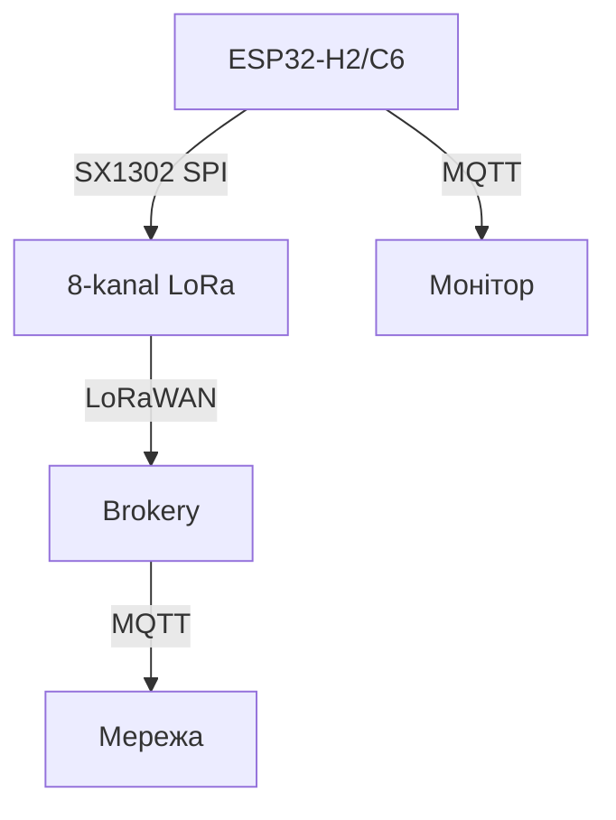

# ESP32 LoRaWAN-шлюз глибоко - SX1302, TTN and мультиканальний вузол

![[assets/img/esp32-lorawan-gateway-deep-scheme.png|600]]
*Fig. Шлюз: SX1302 8-канал + ESP32-S3 + WiFi-ETH - приймає десятки вузлів, віддає MQTT.*

> [!tip] that this for нота
> Повний розбір шлюзу: not просто module, but система with мультиплексуванням каналів, TTN-договором and розподілом живлення. Передмова: [[12-Comm-Modules/29-LoRaWAN-Gateway|LoRaWAN-шлюз оглядово]].

## 1. Мета



*Fig. Шлюз: 8 каналів + TTN + MQTT.*

Підняти шлюз, which дійсно працює:

- SX1302 приймає 8 каналів одночасно (SF7-SF12);
- ESP32-S3 обробляє пакети, формує MQTT;
- Веб-інтерфейс стану - чи працює кожен канал;
- Живлення: 5V 3A for SX1302 (пиk 2A) + ESP32.

## 2. Розпіновка шлюзу (ESP32-S3 + SX1302)

| Сигнал | Пін ESP32-S3 | Примітка |
| --- | --- | --- |
| SPI-CS | GPIO5 | SX1302-select |
| SPI-MOSI/MISO/SCK | GPIO23/19/18 | 40 МГц |
| DIO0/DIO1 | GPIO4/5 | Переривання пакету |
| RST | GPIO2 | Скидання SX1302 |
| CCA | GPIO35 | Виявлення каналу завади |
| 5V/VBUS | 5V 3A БЖ | Пік 2A at передачі |

## 3. Кани та швидкість

| ID каналу | Частота | Ширина | SF | Призначення |
| --- | --- | --- | --- | --- |
| 0 | 868.1 МГц | 125 кГц | 7 | Швидка телеметрія |
| 1 | 868.3 МГц | 125 кГц | 9 | Середня |
| 2 | 868.5 МГц | 125 кГц | 12 | Далека |
| 3 | 868.3 МГц | 250 кГц | 7 | Швидкий довгий |
| ... | ... | ... | ... | ... |

Кожен канал - окремий SX1302-module? Ні, один чип with 8 приймачами. Прийом одночасний.

## 4. Протокол: TTN / LoRaWAN

- Устрій реєструється on TTN with Device EUI and ключами;
- Пакет: MHDR + DevAddr + FCnt + FPort + Payload + MIC;

| key | Значення |
| --- | --- |
| DevEUI | 8 байт, унікальний |
| AppEUI | 8 байт, мережа |
| AppKey | 16 байт, вивірка |

Вузол with ESP32 not має TX-радіо (C3/C6/H2 окремо), але шлюз готовий до прийому.

## 5. Робочий code (MicroPython)

```python
# MicroPython: простий монитор шлюзу
import time
from machine import Pin, SPI
import esp

def check_gateway_status():
    # SPI-читання статусу SX1302 (спрощено — через регістри)
    return "READY"  # Якщо module підключено

pwr = Pin(48, Pin.OUT, value=1)
while True:
    print('Шлюз:', check_gateway_status(),
          'канали:', 8, 'час:', time.strftime('%F %T'))
    time.sleep(10)
```

Чесно: повний TTN-стек on ESP32 потребує Linux-хоста або значної оптимізації; тут - монітор статусу with резервом for дійсної обробки via C/IDF.

## 6. Живлення

- SX1302-адаптер із 5V → 3.3V/1.8V LDO; пік 2A on прийом;
- ESP32-S3 with його зовнішнім WiFi - 400 мА пік;
- Сумарно 2.5A мінімум; 5A - with запасом;
- Батарея with сонцем for зовнішнього шлюзу; PoE - for внутрішнього.

## 7. typical errors

| Symptom | Cause | Лікування |
| --- | --- | --- |
| Прийом not працює | Чужий SF або канал | verify канал зліва |
| Пакет not розшифрований | not той AppKey | Верифікація DevEUI/AppKey with TTN |
| SX1302 перегрівається | without радіатора | Радиатор on module |
| Живлення просідає | Недостатнього БЖ | 5V 3A+ with розділом |
| WiFi not зʼєднується with хмарою | IP-брандмауер | verify NAT/forward |
| Дублікати пакетів | Два шлюзи чують вузол | Дедуплікація on сервері for FCnt |
| Час дрейфує | Немає NTP on шлюзі | Синхронізація часу щогодини |

## 8. Швидка шпаргалка шлюзу

- 8 каналів, SF7-SF12, 125/250 кГц;
- Живлення 3А with запасом;
- HTTP-MQTT міст for хмари;
- Радіо in вузлі - окремо from шлюзу.

## 9. Суміжні ноти

- [[12-Comm-Modules/02-NRF24-LoRa | NRF24/LoRa]] - вузол із LoRa.
- [[05-Radio/01-WiFi-STA-AP | WiFi-STA/AP]] - WiFi in вузлі.
- [[15-Protocols/01-MQTT|передача in хмару]] - broker.
- [[01-Hardware/04-ESP32-C3-C6-H2|чипи C3/C6/H2]] - радіо-versії.
- [[Home|головна карта]] - повна навігація.

## 9.1 Антена and корпус шлюзу

- Антена 868 МГц (EU) або 915 МГц - for регіоном, not навпаки.
- Висота важливіша for потужність: дах б'є далі for вати.
- Корпус IP65 on вулиці, грозозахист on щоглі.
- Коаксіал короткий: кожен метр відбирає децибели.
- Два шлюзи with перекриттям зон - резервування прийому.

## 9.2 Живлення шлюзу in полі

- Сонячна панель 20W + MPPT + АКБ 12V 7Аг - тиждень without сонця.
- PoE-інжектор - якщо є вита пара до щогли.
- Споживання: SX1302 прийом ~100 мА, ESP32 WiFi-TX - піки 400 мА.
- Сторожовий таймер шлюзу: завис - ребут without виїзду.
- Дистанційний лог: heartbeat in MQTT кожні 5 хвилин.
- Резервний канал: другий шлюз with перекриттям зони.
- Версія firmwares шлюзу - in топіку статусу.

## Official sources

- [Waveshare SX1268 LoRa HAT (Waveshare)](https://www.waveshare.com/wiki/SX1268_433M_LoRa_HAT) - підключення HAT.
- [LoRaWAN Specification 1.0.3 (LoRa Alliance)](https://lora-alliance.org/resource_hub/lorawan-specification-v1-0-3/) - специфікація мережі.
- [STM32F4 (ST)](https://www.st.com/en/mcus-mpus/stm32f4.html) - FDCAN and DMA for шлюзу.
