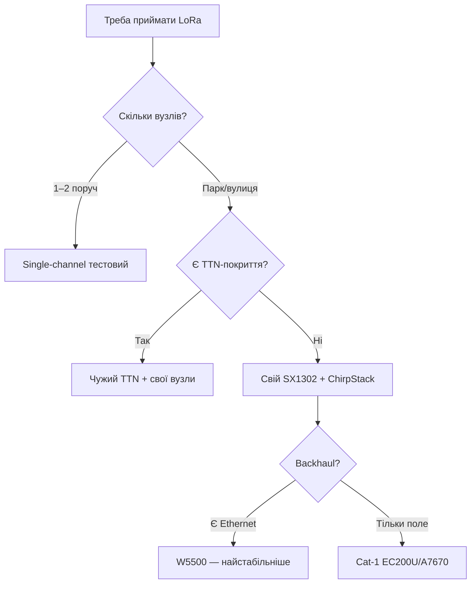

# LoRaWAN-шлюз: single-channel пастка, SX1302, ChirpStack, TTN

## Purpose

Вузли LoRa говорять - хтось має слухати. Варіанти: одноканальний «шлюз» on ESP32 ($15, але профанація), повноцінний 8-канальний on SX1302 ($80+, справжній), або чужий TTN/ChirpStack. Нота - щоб not купити not те.

База: start - [[EN/Home.en]], LoRa-база - [[12-Comm-Modules/02-NRF24-LoRa|LoRa]], Cat-1 - [[12-Comm-Modules/18-Cellular-LoRa-2|Cat-1]] (backhaul!), MQTT-SN - [[15-Protocols/14-MQTT-SN]].

> [!danger] Single-channel «шлюз» - not шлюз!
> Одноканальний приймач (ESP32+SX1276) чує 1 комбінацію (частота+SF) with ~50 можливих and not шле downlink вчасно. Вузли поруч «працюють», решта - ні, diagnostics - пекло. for 1-2 датчиків поруч - ок; називати this LoRaWAN-мережею - ні.

![[assets/img/lorawan-gateway-sx1302-scheme.png|600]]
*Fig. Вузли → 8-канальний шлюз (SX1302) → backhaul (Ethernet/Cat-1) → ChirpStack/TTN → MQTT.*

## Порівняння шлюзів

| Варіант | Залізо | Канали | Downlink | Ціна | Коли |
| --- | --- | --- | --- | --- | --- |
| Single-channel (ESP32+SX1276) | 1 demodulator | 1 | Кривий | $15 | 1-2 вузли поруч, тести |
| 8-канальний (SX1302+ESP32/RPi) | 8×SF паралельно | 8 | Повноцінний | $80-150 | Справжня мережа |
| Готовий (RAK7268, Milesight) | Все всередині | 8 | + PoE/IP65 | $150-300 | Вулиця without мороки |
| Milesight UG65/UG67 | IP65 готовий, вбудований NS | 8 | Повноцінний | $200-350 | Вуличний стовп: повісив and забув (живлення PoE/сонце) |
| TTN community | Чужий | - | - | $0 | Місто with покриттям (verify карту!) |

```text
SX1302-шлюз на ESP32 (схема):
  SX1302-плата (SPI: SCK/MOSI/MISO/CS + RST) ──► ESP32 (хост packet-forwarder!)
  Backhaul: Ethernet (W5500 — стабільно!) або Cat-1 (див. 18-Cellular-LoRa-2).
  Антена 868 МГц скловолокно 3–5 дБм ЯКОМОГА ВИЩЕ (висота = покриття!).
  GPS PPS на шлюзі — для Class-B маяків (без PPS тільки Class-A/C!).
```

### Mermaid: вибір



## 1. ChirpStack vs TTN

| Параметр | ChirpStack (свій) | TTN (спільнотний) |
| --- | --- | --- |
| Де живе | Свій сервер (RPi/VPS) | Хмара TTN |
| Ліміти | Немає | Fair use (30с ефіру/добу/вузол!) |
| Приватність | Дані свої | Дані via чужу хмару |
| MQTT-інтеграція | Вбудована | Вбудована |
| Ціна | Сервер свій | $0 (або TTI Cloud платно) |

## 2. ABP vs OTAA (вузли!)

| Режим | Join | Плюс | Мінус |
| --- | --- | --- | --- |
| OTAA | per ефіру, ключі сесійні | Безпечно, ротація | Треба downlink-вікна (single-channel кульгає!) |
| ABP | Ключі зашиті | Працює навіть with кривим шлюзом | Ключі вічні; frame-counter скидання = відмова! |

## typical errors

| # | error | Чому погано | how правильно |
| --- | --- | --- | --- |
| 1 | Single-channel how «мережа» | Чує 2% ефіру | Чесно називати тестом; мережа - SX1302 |
| 2 | Шлюз in квартирі on столі | Покриття 200 м | Якомога вище + зовнішня антена |
| 3 | ABP with скиданням лічильника | Мережа відкидає кадри | Зберігати frame-counter in NVS! |
| 4 | Backhaul per WiFi without резерву | Падіння = сліпа мережа | Ethernet або Cat-1 |
| 5 | Class-B without GPS PPS | Маяки not працюють | PPS on шлюзі або тільки A/C |
| 6 | TTN fair use перевищено | Бан пристрою | Рахувати ефір: SF12 - рідко! |

## Official sources

- [SX1302 datasheet (Semtech)](https://www.semtech.com/products/wireless-rf/lora-core/sx1302) - канали, чутливість.
- [ChirpStack docs](https://www.chirpstack.io/docs/) - шлюз-міст, інтеграції.
- [The Things Network docs](https://www.thethingsnetwork.org/docs/) - fair use, OTAA/ABP.

## Packet-forwarder: мінімальний конфіг

```json
{
  "gateway_conf": {"gateway_ID": "AA555A0000000000", "server_address": "chirpstack.local", "serv_port_up": 1700, "serv_port_down": 1700},
  "SX130x_conf": {"lorawan_public": true, "clksrc": 0, "antenna_gain": 3},
  "station_conf": {"log_file": "stderr"}
}
```

## План частот EU868 (that слухати!)

| Канал | Частота | SF | Призначення |
| --- | --- | --- | --- |
| 0-2 | 868.1 / 868.3 / 868.5 МГц | 7-12 | Дефолтні uplink (мусять бути!) |
| 3-7 | 867.1-867.9 | 7-12 | Додаткові (CFList from сервера) |
| RX2 | 869.525 МГц | SF9 | Дефолтний downlink! |
| 868.0 | FSK 50 кбіт | - | Рідко використовується |

### Висота антени = покриття (формула горизонту!)

```text
Радіогоризонт: d ≈ 4.12 × (√h1 + √h2) км, h у метрах.
Шлюз 15 м + вузол 2 м: 4.12 × (3.87 + 1.41) ≈ 21 км (ідеал!).
Шлюз на столі 1.5 м + вузол 1.5 м: ≈ 10 км теорії, 0.2–2 км міста (будинки!).
Кожні +6 м висоти ≈ подвоєння площі покриття. Щогла окупається першою.
```

### ChirpStack for 5 кроків

```text
1. ChirpStack Gateway Bridge на хості шлюзу (MQTT-міст до сервера!).
2. Network Server + Application Server (Docker-compose з офіційного репо!).
3. Додати gateway (EUI з packet-forwarder!), профіль EU868.
4. Створити application + device (OTAA: AppEUI/AppKey згенерувати!).
5. Інтеграція MQTT/HTTP → свої топіки (див. 15-01!) → Node-RED/Grafana.
```

## Діагностика шлюзу: that дивитись

| Symptom | Куди дивитись |
| --- | --- |
| Пакети in ефірі є, on сервері немає | Backhaul (ping!), firewall 1700/UDP |
| RSSI −120, SNR −15 | Межа чутливості: SF вище / антену вище |
| Join-request without accept | Ключі AppKey / CFList / час сервера! |
| Дубльовані аплінки | Два шлюзи чують - норма, дедуплікація on сервері |

## Резервування шлюзів (щоб мережа not лягла!)

```text
Два SX1302 з перекриттям зон: вузли чують обидва → сервер дедуплікує.
Backhaul різний: один Ethernet, другий Cat-1 (різні оператори!).
Живлення: UPS/PoE з батареєю на 4+ год (відключення світла ≠ зупинка мережі).
Моніторинг: heartbeat шлюзу в ChirpStack + алерт «мовчить 10 хв» у Telegram.
```

## See also

- [[Home|Головна]]
- [[12-Comm-Modules/02-NRF24-LoRa|NRF24/LoRa]]
- [[12-Comm-Modules/18-Cellular-LoRa-2|Cat-1/LoRa-2]]
- [[12-Comm-Modules/27-LPWAN-Alt|LPWAN-альтернативи]]
- [[15-Protocols/14-MQTT-SN|MQTT-SN]]
- [[12-Comm-Modules/07-SIM7600-W5500-MCP2515|W5500]]
