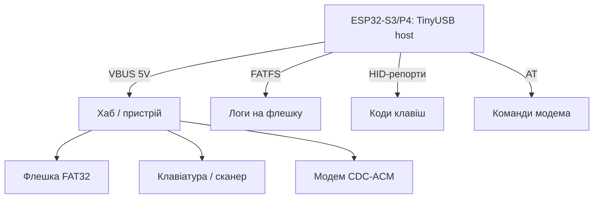

# ESP32 how USB-хост - флешки, HID and CDC via TinyUSB

![[assets/img/esp32-usb-host-scheme.png|600]]
*Fig. S3/P4 in ролі хоста: опитує флешку, клавіатуру and модем - живлення 5V on VBUS обов'язкове.*

> [!tip] that this for нота
> Зворотний бік USB: ESP32 not пристрій for ПК, but хост for периферії - логер on флешку without SD-слота, штрих-code сканером, модем per CDC. Працює on S3 (OTG FS) and P4 (OTG HS). База: [[04-Interfaces/06-USB-OTG-JTAG|USB-OTG and JTAG]], [[04-Interfaces/07-SD-SDIO|карти SD]], [[09-Firmware/01-ESP-IDF-setup|налаштування ESP-IDF]].

## 1. Мета

Освоїти три класи USB-пристроїв with ESP32:

- MSC: флешка - читання/запис FATFS, логер without SD-слота;
- HID: клавіатура/миша/сканер штрих-кодів - ввід without кнопок;
- CDC: USB-модеми and конвертери - AT-команди via USB;
- живлення VBUS 5V - хост живить пристрій, not навпаки.

| Клас | Пристрій | Бібліотека/example |
| --- | --- | --- |
| MSC | флешка FAT32 | `usb/host/msc` + FATFS |
| HID | клавіатура, сканер | `usb/host/hid` |
| CDC | модем, CP2102 | `usb/host/cdc_acm` |
| Hub | розгалужувач | каскад for потребою |

## 2. Архітектура



Стек: TinyUSB host → клас-драйвер → застосунок. Дескриптори парсимо Ready, вручну - лише in відладці.

## 3. Апаратна частина

- S3: GPIO19/20 - USB D−/D+, вбудований PHY;
- P4: окремий USB-OTG HS PHY - швидше and більше струму;
- VBUS 5V on роз'єм - хост зобов'язаний живити пристрій (до 500 мА);
- захисний key живлення (TPS2051 або поліфьюз) - КЗ on флешці not має вбити плату;
- for тестів - OTG-перехідник with живленням, not голий кабель.

## 4. MSC: флешка how диск

- example `usb/host/msc`: монтування, `fopen/fwrite/fclose` via FATFS;
- логер: відкриваємо файл раз on годину, пишемо рядками, закриваємо - флешка переживе виймання;
- безпечне виймання: кнопка «відмонтуй», світлодіод підтвердження;
- швидкість: десятки КБ/с - вистачає on логи and конфіги, not on відео.

## 5. Робочий code (IDF)

```c
#include "usb/msc_host.h"
#include "esp_log.h"

static const char *TAG = "usbmsc";

void msc_event_cb(msc_host_event_t event, void *arg) {
  if (event == MSC_DEVICE_CONNECTED) {
    ESP_LOGI(TAG, "flash connected");
    msc_host_install(NULL);
    FILE *f = fopen("/usb/log.txt", "a");
    if (f) {
      fprintf(f, "boot %lu\n", (unsigned long)esp_timer_get_time());
      fclose(f);
      ESP_LOGI(TAG, "logged to flash");
    }
  } else if (event == MSC_DEVICE_DISCONNECTED) {
    ESP_LOGI(TAG, "flash removed");
    msc_host_uninstall();
  }
}

void app_main(void) {
  msc_host_config_t cfg = {
    .event_cb = msc_event_cb,
  };
  ESP_ERROR_CHECK(msc_host_install(&cfg));
  while (1) {
    vTaskDelay(pdMS_TO_TICKS(1000));
  }
}
```

Шлях `/usb` - точка монтування with прикладу. Реальний логер пише пакетами per 512 байт - рівно сектор, without фрагментації.

## 6. HID: клавіатура and сканер

- example `usb/host/hid`: репорти 8 байт, коди клавіш HID-table;
- сканер штрих-кодів - та сама клавіатура: читаємо рядок до Enter;
- NKRO-клавіатури - довші репорти, парсимо довжину with дескриптора;
- миша - координати and кнопки for HMI without тача.

## 6.1 Хаби and живлення периферії

- хаб without живлення: максимум 2 низькоспоживчі пристрої;
- хаб with живленням: флешка + сканер + модем одночасно;
- поліфьюз 500 мА on VBUS - КЗ not вбиває плату;
- довгі кабелі USB 2.0 - до 3 м without хаба, далі активний;
- OTG-перехідник with окремим входом живлення - must-have in сумці.

## 6.2 Швидкість and межі хоста

- FS (S3): 12 Мбіт/с, реально ~1 МБ/с on флешку;
- HS (P4): 480 Мбіт/с, флешка впирається in FATFS;
- ізохронні камери (UVC-відео) - межа можливостей, брати MIPI;
- один пристрій on порт without хаба - найстабільніша configuration;
- довгі трансфери - подвійні буфери, інакше underrun.

## 7. CDC-модеми

- example `usb/host/cdc_acm`: VCP how файл - читаємо/пишемо;
- 4G-модеми in CDC-режимі - AT-команди and PPP далі;
- кілька інтерфейсів - відкриваємо кожен окремо;
- [[12-Comm-Modules/03-SIM800L-GPS|модеми SIM800L]] - AT-частина та сама.

## 8. typical errors

| Symptom | Cause | Лікування |
| --- | --- | --- |
| Пристрій not бачиться | немає 5V on VBUS | подати живлення хоста, verify key |
| Флешка монтується via раз | просадка струму | хаб with живленням, коротший кабель |
| HID мовчить | складний дескриптор пристрою | читати довжину репорту, not фіксовані 8 |
| CDC not відкривається | модем in QMI-режимі | перевести in CDC-ACM AT-командою |
| Працює on P4, not on S3 | HS проти FS таймінги | різні приклади під чип, not копіювати |
| Після виймання - паніка | немає обробки disconnect | колбек відмонтування + прапорець |

## 9. Суміжні ноти

- [[04-Interfaces/06-USB-OTG-JTAG|USB-OTG and JTAG]] - залізна сторона USB.
- [[04-Interfaces/07-SD-SDIO|карти SD]] - альтернатива флешці.
- [[12-Comm-Modules/03-SIM800L-GPS|модеми SIM800L]] - AT поверх CDC.
- [[09-Firmware/05-JTAG-Debug|налагодження JTAG]] - той же роз'єм, інша роль.
- [[14-Devboards/16-P4-DevKit|плата P4]] - OTG HS on борту.

## Official sources

- [USB Host API (Espressif)](https://docs.espressif.com/projects/esp-idf/en/latest/esp32s3/api-reference/peripherals/usb_host.html) - хост-стек, класи, події.
- [USB Host examples (Espressif, GitHub)](https://github.com/espressif/esp-idf/tree/master/examples/peripherals/usb/host) - MSC/HID/CDC приклади.
- [TinyUSB (GitHub)](https://github.com/hathach/tinyusb) - стек під капотом, дескриптори.
