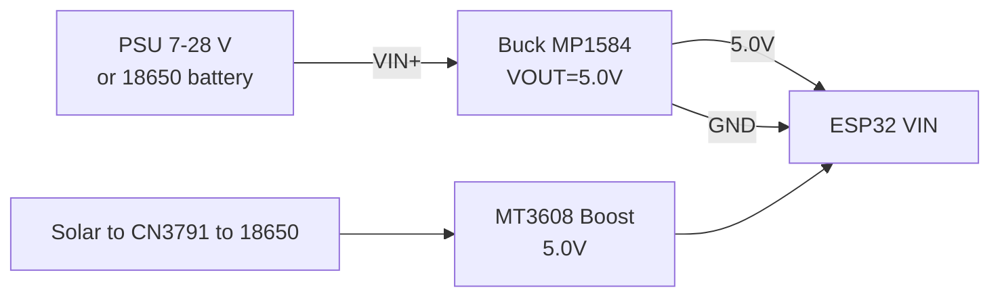

# Buck / Boost / Solar - complete power node

Base: [[EN/02-Power-Supply/01-Power-Rails.en|Power supply]], levels [[EN/13-Power-Modules/02-Level-Shifters.en]], sleep [[EN/07-Timers/03-Sleep-ULP.en]], WiFi peaks [[EN/05-Radio/01-WiFi-STA-AP.en]], checklists [[EN/99-Additions/03-Cheklisti-montazhu.en]], start [[EN/Home.en]].

## Purpose

Buck / Boost / Solar - complete power node - Buck: MP1584 vs LM2596; trimmer setup (mandatory without ESP32 load!); Boost MT3608 (battery -> 5V). Buck / Boost / Solar - complete power node. Base: [[EN/02-Power-Supply/01-Power-Rails.en|Power supply]], levels [[EN/13-Power-Modules/02-Level-Shifters.en]], sleep [[EN/07-Timers/03-Sleep-ULP.en]], WiFi peaks [[EN/05-Radio/01-WiFi-STA-AP.en]], checklists [[EN/99-Additions/03-Cheklisti-montazhu.en]], start [[EN/Home.en]].

## 1. Buck: MP1584 vs LM2596

| Parameter | MP1584 (Mini360) | LM2596 |
| --- | --- | --- |
| Topology | synchronous buck, 1.5 MHz | non-synchronous, 150 kHz |
| Current | up to 3A (really 1.5-2A with no heatsink) | up to 3A (heats up, needs a heatsink) |
| Efficiency | 85-95% | 70-85% |
| Ripple | low, small capacitors | higher, large inductor |
| Minimum input | 4.5V | 4.5-7V (dropout ~1.5V) |
| For ESP32 | better pick | fine for fixed 12V->5V setups |
| ESP32 | Buck module | Note |
| --- | --- | --- |
| VIN (5V pin) | VOUT+ buck | set exactly 5.0V |
| GND | VOUT- | thick ground |
| - | VIN+ | 7-28V (MP1584) / 7-35V (LM2596) |

### Trimmer setup (mandatory without ESP32 load!)

1. Do not connect the ESP32. Feed the input voltage into the buck.
2. Multimeter on VOUT. Turn the trimmer counter-clockwise - the voltage drops.
3. Set 5.0V (for the VIN pin) or 3.30V (for direct 3.3V rail feed, careful!).
4. Switch the input off, connect the ESP32, switch on, check under WiFi-scan load: droop under 0.15V is fine.
5. Seal the trimmer with lacquer or hot glue against vibration.

## 2. Boost MT3608 (battery -> 5V)

MT3608: 2-24V input, up to 28V output, 2A peak. For 1x18650 (3.0-4.2V) -> 5V. Efficiency 85-93%. Same trimmer routine. A 100 uF capacitor on the output + 100 nF ceramic near the ESP32 are mandatory. The boost handles 500 mA WiFi peaks, but the battery must source 1A+ with no droop.

| ESP32 | MT3608 | Note |
| --- | --- | --- |
| VIN 5V | VOUT+ 5V | set 5.0V |
| GND | VOUT- | ground |
| - | VIN+ | 3.0-4.2V from battery/TP4056 OUT |

## 3. TP4056 + DW01 (Li-ion charging) + Solar CN3791

- TP4056: linear 4.2V charge, current set by Rprog (1.2k = 1A). Board with DW01+FS8205A = protection against over-discharge/overcharge/short. Take the version with OUT+- and protection.
- TP4056 drawback: NO load-sharing - simultaneous charging and ESP32 load confuses the CC/CV algorithm. Fix: either charge with the ESP32 off, or a P-MOSFET load-sharing circuit.
- Solar: TP4056 fed from a solar panel works poorly (no MPPT). Correct: CN3791 (MPPT 1-3S) or CN3065 (1S solar). CN3791 holds the panel at the maximum power point with a resistor divider.

### Energy harvesting: BQ25570 / BQ25504 / SPV1050 / LT3652

| Chip | Source | Feature |
| --- | --- | --- |
| BQ25570 | Sun/light/thermal (nW-mW) | MPPT + buck + Li-ion/supercap charging, cold start from 330 mV! |
| BQ25504 | Same, cheaper | No built-in buck - charging only |
| SPV1050 | Sun/light | MPPT + boost, for dim indoor light |
| LT3652 | Sun 5-32 V | Powerful MPPT charge up to 2 A, for large panels |

> Levels: CN3791 - watt-class solar panel; BQ25570/SPV1050 - microwatts from room light/TEG/piezo (a reading once an hour, not a stream!).

### Complete standalone node schematic (recommended)

```text
[Solar 6V 5W] -> [CN3791 MPPT] -> [1S Li-ion 18650 3000mAh + BMS/DW01]
   -> [MT3608 boost 5.0V] -> [ESP32 VIN] + [100uF + 100nF біля ESP32]
   -> [DS18B20 / сенсор] живиться від GPIO або 3V3 через MOSFET (відсікати в deep-sleep)
Вимір батареї: VBAT+ -> дільник 100к/100к -> GPIO34 (ADC) + конденсатор 100нФ
Вимір сонця: VSOL+ -> дільник 100к/27к -> GPIO35 (ADC)
```

### Battery measurement code (3 frameworks, same idea)

```cpp
// Arduino: ADC 12 біт, attenuation 11dB, калібрування
analogReadResolution(12); analogSetAttenuation(ADC_11db);
int raw = analogRead(34); float v = raw / 4095.0 * 3.3 * 2.0; // дільник 1:1
```

```python
# MicroPython
from machine import ADC, Pin
adc = ADC(Pin(34)); adc.atten(ADC.ATTN_11DB); adc.width(ADC.WIDTH_12BIT)
v = adc.read() / 4095 * 3.3 * 2.0
```

```c
// ESP-IDF: adc_oneshot + adc_cali, дільник 1:1, curve-fitting калібрування
```

| Symptom | Cause | Fix |
| --- | --- | --- |
| Buck heats up, ESP32 reboots | LM2596 at its limit, thin wires | MP1584 + thick wires + 470 uF on the output |
| TP4056 never finishes charging | ESP32 draws current in parallel | load-sharing MOSFET or charge while off |
| Battery dead by morning | no deep-sleep / sensor draws | deep-sleep + sensor power MOSFET, see [[EN/07-Timers/03-Sleep-ULP.en]] |

## Wiring

| ESP32 | Buck MP1584 / Boost MT3608 | Note |
| --- | --- | --- |
| VIN (5V pin) | VOUT+ 5.0V | Set exactly with a multimeter WITHOUT the ESP32 |
| GND | VOUT− | Thick ground, 470 uF on the output |
| - | VIN+ | 7-28V (MP1584) / 3.0-4.2V battery (MT3608) |

### ASCII schematic

```text
БЖ / Solar              Buck MP1584 (Mini360)        ESP32 DevKit
----------              ---------------------        ------------
7–28 В ───────────────► VIN+ buck
GND ──────────────────► VIN− buck
                        [підстроєчник] → виставити 5.0 В БЕЗ ESP32!
                        VOUT+ ────────────────────► VIN (5V пін)
                        VOUT− ────────────────────► GND (товста!)
                        VOUT ◄──[470 мкФ + 100 нФ]──► GND біля ESP32
MT3608: батарея 3.0–4.2 В ──► VIN+; VOUT+ 5.0 В ──► VIN ESP32
Підстроєчник залити лаком від вібрації; просадка WiFi < 0.15 В
```

### Mermaid



![[assets/img/buck-mp1584-trim.png|500]]
*Fig. Buck MP1584 - 5.0 V trimmer setup without load, thick ground. Photo placeholder - see [[assets/README]].*

## Official sources

- [LM2596 - datasheet (TI)](https://www.ti.com/product/LM2596) - 3A buck, WEBENCH inductor calculation.
- XC6206 Datasheet (Torex, PDF search): [XC6206 search](https://www.alldatasheet.com/view.jsp?Searchword=XC6206) - 3.3V LDO, SOT-23.
- MP1584 (monolithicpower.com), MT3608, CN3791 MPPT - *verify by hand* (MPS blocks automated requests; single vendor pages for the others are unconfirmed).

### MPPT vs PWM for a solar panel

| Controller | Method | Efficiency | Use when |
| --- | --- | --- | --- |
| CN3791 | MPPT (maximum power point) | ~90% | 9-12V panel to 1S Li-Ion, cloudy weather |
| TP4056 + panel direct | None (operating point drifts) | ~70% | Small 5-6V panel, budget node |
| PWM controller | PWM limiting | ~75% | 12V systems (not the ESP32 case) |

### Buck module setup procedure (so the load survives!)

```text
1. БЕЗ навантаження: крутити trim, мультиметр на виході → потрібні вольти.
2. Вимкнути живлення, підключити навантаження через амперметр.
3. Увімкнути, перевірити струм і нагрів 5 хв.
4. Залакувати trim (крапля лаку/маркер-мітка проти вібрації!).
```

- FS8205 Datasheet (Fortune Semi, PDF search): [FS8205 search](https://www.alldatasheet.com/view.jsp?Searchword=FS8205) - dual MOSFET for BMS.

### Key power node parameters

| Parameter | Value |
| --- | --- |
| Buck (MP1584/LM2596) | 7-28V input to 5V/3A, set trim WITHOUT load |
| Boost (MT3608) | 2-24V input to 5V/2A for 1S Li-Ion |
| Charge (TP4056 + DW01) | 4.2V CC/CV, over-discharge/short protection |
| Solar (CN3791 MPPT) | 9-12V panel to 1S Li-Ion, ~90% efficiency |
| Autonomy | Calculate: mAh per day vs capacity x 0.8 |

## See also

- [[EN/Home.en]]
- [[EN/02-Power-Supply/01-Power-Rails.en|Power supply]]
- [[EN/13-Power-Modules/02-Level-Shifters.en]]
- [[EN/07-Timers/03-Sleep-ULP.en]]
- [[EN/06-Analog/01-ADC.en|ADC]]
- [[EN/99-Additions/02-Troubleshooting-FAQ.en]]
- [[EN/99-Additions/03-Cheklisti-montazhu.en]]

![[assets/img/placeholder.png]]
