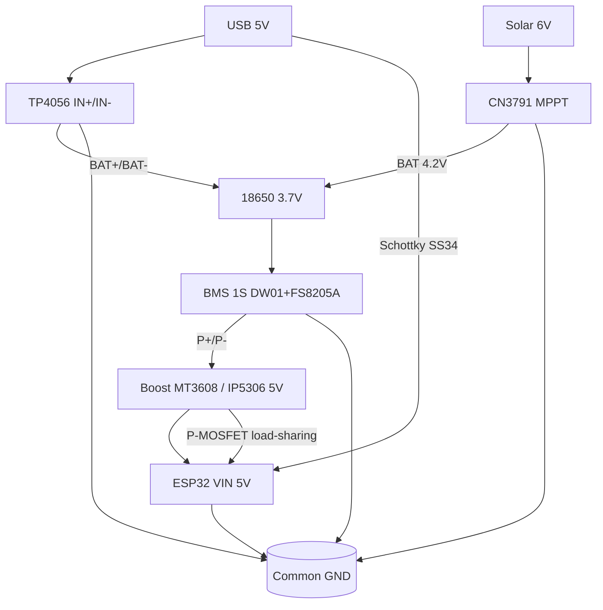

# 03 - TP4056, IP5306, BMS and UPS for ESP32

## Purpose

Standalone ESP32 power node fed from a Li-Ion 18650 cell: charging from USB 5V or a solar panel via CN3791, cell protection, boost to 5V (IP5306 / MT3608) and seamless UPS switchover (load-sharing), so the ESP32 does not reset when USB drops.

The modules cover the full cycle: CC/CV charge → over-discharge/overcharge/short protection → boost to 5V → power redundancy.

## Specifications

| Module | Input | Output / Charge | Current | Protection | Feature |
| --- | --- | --- | --- | --- | --- |
| TP4056 (micro-USB, with protection) | 4.5-5.5V (IN+/IN-) | 4.2V CC/CV to BAT | up to 1A (PROG 1.2k) | DW01 + FS8205A | OUT+/OUT- from DW01 |
| TC4056A (Type-C) | 5V Type-C | 4.2V CC/CV | up to 1A | depends on the board (often with DW01) | convenient Type-C connector |
| IP5306 powerbank | 5V micro-USB/Type-C | 5V boost 2.1A | 2.1A (2.4A peak) | against short, overheat | KEY + 4 LED indication |
| BMS 1S 3A (HX-1S-01) | B+/B- from the cell | P+/P- to load | 3A cont. | 4.25V/2.5V, short | no balancing (1S needs none) |
| BMS 2S 8A | 7.4V (2 cells) | P+/P- | 8A | 4.25x2 / 2.5x2 | balancing 4.2V/60mA |
| BMS 3S 12-25A | 11.1V | P+/P- | 12-25A | 4.25x3 / 2.5x3 | balancing, heatsink |
| UPS load-sharing (MOSFET+Schottky) | USB 5V + BAT-boost | 5V with no droop | up to 2-3A | Schottky against reverse current | seamless switchover |

TP4056 parameters (linear charger):

- Modes: trickle (<2.9V, ~100mA) → CC (const current) → CV 4.2V → cutoff C/10 → standby.
- 4.2V accuracy ±1%.
- PROG resistor sets the current: Rprog = 1200 / I(A) kOhm.
- Thermal protection: at ~145°C the current drops.

| Rprog | Charge current |
| --- | --- |
| 10k | 130 mA |
| 5k | 250 mA |
| 3k | 400 mA |
| 2k | 600 mA |
| 1.2k (stock) | 1000 mA |
| 1k | 1200 mA (overheat!) |

IP5306:

- 5V 2.1A boost, efficiency ~90%.
- Flashlight mode (double-click KEY), auto-sleep at light load (<45mA for 30s) - a problem for deep-sleep!
- 4 LEDs: 25/50/75/100%.

## Module pin legend

### TP4056 with protection (6 terminals + USB)

| Pin | Direction | Description |
| --- | --- | --- |
| IN+ | input | +5V from USB / solar panel through a diode (4.5-5.5V) |
| IN- | input | input GND |
| BAT+ | bidirectional | + of the 18650 cell (3.0-4.2V) |
| BAT- | bidirectional | - of the cell (through FS8205A to GND) |
| OUT+ | output | + to load (through DW01 protection, = BAT+ when fine) |
| OUT- | output | - to load (switches off on fault) |

LEDs:

- Red on - charging in progress.
- Green on - standby / charge done (current < C/10).
- Both blinking / dim - no cell or bad contact.

### TC4056A (Type-C version)

| Pin | Description |
| --- | --- |
| USB-C 5V / IN+ | 5V input, often 2x IN+ pads for convenience |
| GND / IN- | common |
| BAT+ / B+ | + of the cell |
| BAT- / B- | - of the cell |
| OUT+ / OUT- | as on TP4056 with DW01; on cheap boards with no protection - OUT = BAT |

Warning: some TC4056A boards are wired as charger only with no DW01 - then protection relies on a protected cell or an external BMS.

### IP5306 powerbank module

| Pin | Description |
| --- | --- |
| VIN / 5V_IN | 5V charge input |
| BAT | tap to the 3.7V cell (often a pad for a 18650 holder) |
| 5V_OUT / USB-A | 5V 2.1A boost output |
| KEY | button: click - show charge, double-click - flashlight/steady output |
| L1-L4 LED | 25/50/75/100% indication |
| EN / SET | current/mode setup (board dependent) |

### BMS 1S / 2S / 3S

| Pin | Description |
| --- | --- |
| B+ / B- (1S) | 3.7V cell |
| B+ / BM / B- (2S) | two cells in series, middle tap BM |
| B+ / B1 / B2 / B- (3S) | three cells, balancing taps |
| P+ / P- | load + charge (common port) |
| T / NTC | thermistor (on senior BMS) |

> Ready-made HX-1S (1S) / HX-2S (2S) boards: DW01 + dual MOSFET on board, nothing extra to buy. Check thresholds with a multimeter: cutoff ~2.4-2.5 V, overcharge ~4.25 V.

## Wiring

Base node: USB 5V → TP4056 → 18650 → OUT → MT3608 boost → ESP32 5V (VIN).

For a solar node the charge goes through CN3791 (MPPT), and TP4056 stays for USB service charging.

### ASCII schematic

```text
[USB 5V]----+----> IN+ TP4056
            |
           [D] Schottky SS34 (опційно від solar)
GND --------+----> IN- TP4056

TP4056:
  BAT+ ----> [+] 18650 (незахищена, 2500-3500mAh)
  BAT- ----> [-] 18650
  OUT+ ----> VIN boost MT3608 / IP5306 BAT
  OUT- ----> GND boost

[Boost MT3608]  BAT 3.0-4.2V -> 5.0V
  VIN  <---- OUT+ TP4056
  GND  <---- OUT- TP4056
  VOUT ----> VIN (5V) ESP32-DevKit
  GND  ----> GND ESP32 (спільна земля!)

LED TP4056:
  RED   ON = charging
  GREEN ON = done / standby

UPS load-sharing (щоб не ресетився):
  USB 5V --[Schottky SS34]--+--> 5V ESP32 VIN
                            |
  Boost 5V --[P-MOSFET AO3401 / Schottky]--+
```

Full solar node Solar → CN3791 → 18650 → boost → ESP32:

```text
                   +------------------+
 [Solar 6V/5W] --> | CN3791 (MPPT)    |  Rcs=0.1 Ом -> 1A charge
                   | VIN  GND  BAT FB |  MPPT R1/R2 під 6V панель
                   +--------+---------+
                            | BAT+ (4.2V CC/CV)
                            v
                     [+] 18650 [-]  (1S, бажано Samsung 35E / MJ1)
                            |
                     +------+------+
                     | BMS 1S 3A   |  B+ B- | P+ P-
                     +------+------+
                            | P+ -> boost IN+
                            | P- -> boost GND
                     +------+------+
                     | MT3608/IP5306|  3.0-4.2V -> 5.0V 2A
                     +------+------+
                            | 5V -> VIN ESP32
                            v
                      [ESP32 + датчики]
                       GND спільний по всьому вузлу!

 USB-сервісний вхід (TP4056) підключається до P+/P- через
 Schottky (load-sharing), щоб не заважати CN3791.
```

### Mermaid



![[assets/img/tp4056-ip5306-bms-ups-scheme.png|500]]

## Setup procedures

### Procedure 1: Safe 18650 charging through TP4056

1. Set the PROG current for the cell: 0.5C. For 2500mAh → 1.2A is too much, re-solder Rprog to 2k (600mA) or 3k (400mA).
2. Connect WITHOUT the cell: feed 5V to IN, measure BAT+ - idle should read ~4.17-4.22V.
3. Connect the cell (mind the polarity!). The red LED should light up.
4. Watch the TP4056 temperature for the first 10 min - hot (>70°C) = lower the current or add a heatsink.
5. End: green LED, current <100mA. Cell voltage 4.18-4.20V.
6. Connect the load ONLY to OUT+/OUT-, never to BAT - otherwise you bypass the DW01 protection.

### Procedure 2: IP5306 for ESP32 (working around auto-sleep)

1. Connect the cell to BAT, USB charge to VIN.
2. Press KEY - LEDs show the charge.
3. Check auto-sleep: put the ESP32 into deep-sleep (current <20mA). If IP5306 switches off after 30s - that is auto-sleep.
4. Workaround: a) flash IP5306 with no light-load shutdown (needs a programmer), b) add a 50mA pulsed load every 20s, c) swap to MT3608 + TP4056 for IoT.
5. For steady power hold KEY for 2s or tie KEY to GND through 100k (on some boards).

### Procedure 3: BMS 2S/3S - first power-up

1. First solder the balancing wires B-, B1, B2, B+ to the cells (equal charge!).
2. Then connect P-/P+ to the load.
3. Activate the BMS: feed 12.6V (3S) to P+/P- from a PSU for 2s - otherwise the BMS sleeps (0V on the output is normal!).
4. Check balancing: charge to 12.6V, measure each cell - spread under 50mV.

### UPS load-sharing on MOSFET + Schottky

Idea: USB 5V feeds the ESP32 directly through a Schottky, and the battery boost picks up through a P-MOSFET when USB drops. Without this the ESP32 resets for 50-200ms while the boost starts.

```cpp
// Моніторинг батареї + USB для UPS-логіки
#define PIN_BAT 34   // через дільник 100k/100k до BAT+
#define PIN_USB 35   // через дільник до USB 5V (або VBUS detect)

void setup() {
  Serial.begin(115200);
  analogReadResolution(12);
}

void loop() {
  int rawBat = analogRead(PIN_BAT);
  int rawUsb = analogRead(PIN_USB);
  float vBat = rawBat / 4095.0 * 3.3 * 2.0; // дільник 1:1
  float vUsb = rawUsb / 4095.0 * 3.3 * 2.0;
  Serial.printf("BAT=%.2fV USB=%.2fV %s\n", vBat, vUsb,
    vUsb > 4.5 ? "MAINS" : "BATTERY");
  if (vBat < 3.2) Serial.println("WARN: low battery, go deep-sleep!");
  delay(1000);
}
```

## Protected vs unprotected 18650

| Parameter | Unprotected (flat-top) + TP4056/DW01 | Protected (button-top, with PCB) |
| --- | --- | --- |
| Length | 65mm | 68-69mm (does not fit some holders!) |
| Protection | on the TP4056/BMS board | built-in (2.5V/4.28V) |
| Current | up to 10-20A (cell dependent) | limited to 3-5A by PCB |
| For ESP32 + TP4056 with DW01 | recommended (cheaper, shorter) | double protection, but longer |
| For bare TP4056 with no DW01 | UNSAFE | protected cell or external BMS mandatory |

Guideline: one protection level is the minimum. Two is the norm for an outdoor solar node.

Why OUT switches off at 2.4V: the DW01 Vovp=2.4V ±0.1V threshold turns FS8205A off (breaks B- from P-). This is protection against irreversible Li-Ion degradation (copper shunts below 2.5V). Re-enable happens only by charging (feed 5V to IN or 4.2V to BAT).

### TP5100 / IP5328P / 21700 / HX-1S - power neighbors

| Option | What it is | Difference |
| --- | --- | --- |
| TP5100 | 1S/2S charge by jumper (1-2 A) | 2S pack for 7.4 V systems; current set by resistor |
| IP5328P | PowerBank-SoC (boost + charge + indication) | Ready powerbank in one chip; for ESP32 prototypes on the go |
| 21700 | Cell format 21x70 mm (4000-5000 mAh) | +40 % capacity over 18650 with the same BMS |
| HX-1S / HX-2S (BMS board) | Ready 1S/2S protection on DW01+FS8205 | Check thresholds: cutoff 2.4 V, overcharge 4.25 V |

> IP5328P vs TP4056+MT3608: the first is compact and indicates, the second is cheaper and repairable; size the boost current in both with x1.5 margin over WiFi peaks.

## Common issues

| Symptom | Cause | Fix |
| --- | --- | --- |
| OUT=0V, cell at 3.7V | DW01 in protection (droop below 2.4V or short) | feed 5V to IN for 10s to reset |
| TP4056 heats to 80°C+ | 1A + Vin 5.5V, little copper | lower current (Rprog 2-3k), heatsink, fan |
| Green LED at once, cell empty | no BAT contact / break | check BAT+/BAT- soldering, holder |
| IP5306 switches off in deep-sleep | light-load shutdown 45mA | MT3608 instead of IP5306 or dummy-load |
| BMS 3S outputs 0V | sleeps after assembly | activate with a 12.6V charger on P+/P- |
| ESP32 resets when USB is pulled | no load-sharing, slow boost start | Schottky + MOSFET UPS, 1000uF capacitor on 5V |
| Load to BAT instead of OUT | DW01 bypassed, no cutoff at 2.4V | rewire to OUT+/OUT- |
| Protected cell does not fit | 69mm vs 65mm holder | take unprotected + BMS or a bigger holder |
| Charging 18650 from 5V direct | overcharge, fire | only through TP4056/CN3791 CC/CV 4.2V |
| 21700 in an 18650 holder | wobbles, sparks | 21700 holder only; check HX-1S for 1S |

## Official sources

- [BQ24074 - charger reference (TI)](https://www.ti.com/product/BQ24074) - linear CC/CV 1-cell charge with Power Path: charge phases, termination (a reference point for the TP4056 node).
- TP4056 / DW01 / IP5306 / BMS boards - *verify by hand* (no single vendor, many clones; compare the marking on the board).

## See also

- [[EN/02-Power-Supply/01-Power-Rails.en|Power supply]]
- [[EN/02-Power-Supply/02-LDO-DC-DC.en]]
- [[EN/09-Firmware/04-Esptool-Flash.en]]
- [[EN/Home.en]]
- [[EN/13-Power-Modules/01-Buck-Boost-Solar.en|01-Buck-Boost-Solar]] - solar nodes and CN3791 MPPT
- [[EN/13-Power-Modules/02-Level-Shifters.en|02-Level-Shifters]] - level shifting when battery powered
