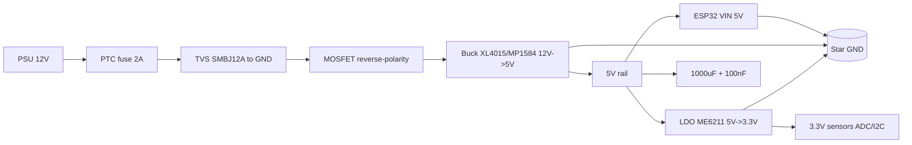

# 04 - LDO, Buck XL4015 and ESP32 power protection

## Purpose

Picking the right 5V to 3.3V regulator for ESP32 (500mA peaks at Wi-Fi TX) and stepping 12V/24V down to 5V with no overheat. LDO for clean analog nodes, buck for power. Plus - input protection against reverse polarity, overvoltage and shorts.

Guideline: 5V to 3.3V at small currents - LDO with low dropout; 12V to 3.3V or current over 500mA - buck only.

## Specifications

### LDO comparison for ESP32

| Parameter | AMS1117-3.3 | HT7333 | RT9080-33 / ME6211C33 |
| --- | --- | --- | --- |
| Type | 1A LDO, NPN | 250mA LDO, ultra-low Iq | 500mA LDO, low-dropout CMOS |
| Input | 4.5-12V (recommended up to 7V) | 4.3-12V | 3.6-6V (RT9080 up to 5.5V) |
| Dropout | 1.1V @1A (large!) | 90mV @100mA | 200-250mV @500mA |
| Iq (quiescent) | 5-10mA | 4-8uA (!) | 25-60uA |
| Max current | 1A (with heatsink) | 250mA (too little for Wi-Fi!) | 500mA (enough for ESP32) |
| Noise / PSRR | medium, 60dB | good for sleep nodes | 70dB, clean for ADC |
| Package | SOT-223 / TO-220 | SOT-89 | SOT-23-5 / SOT-89 |
| For ESP32 | heats up but handles TX peaks | ONLY for deep-sleep sensors with no Wi-Fi | best for battery nodes |
| Price | pennies | pennies | a bit more |

Result:

- DevKit ships AMS1117 by default - fine for the desk, bad for batteries (5mA Iq eats an 18650 in a month).
- HT7333 - the deep-sleep king (4uA), but switching Wi-Fi on means droop and reset. Fit only if the ESP32 sleeps and wakes rarely + a 470uF capacitor.
- RT9080 / ME6211 (500mA, 25uA) - the sweet spot for ESP32 + Wi-Fi on battery.

### Buck modules

| Parameter | XL4015 5A | LM2596 3A | MP1584 / MP2307 3A |
| --- | --- | --- | --- |
| Topology | buck, 180kHz | buck, 150kHz | buck, 500kHz-1MHz |
| Input | 4-38V | 4.5-40V | 4.5-28V |
| Output | 1.25-36V (CC/CV) | 1.23-37V (CV only) | 0.8-25V (CV only) |
| Current | 5A (with fan), really 3A long-term | 3A (really 2A, heats up) | 3A (really 2A, cool) |
| Efficiency | 85-95% | 75-85% | 90-95% |
| Size / inductor | large toroid | large toroid | tiny SMD inductor |
| Noise | medium | large | small (high frequency) |
| Price | medium | cheapest | a bit more |
| For ESP32 | 12V to 5V power nodes, lead charging | desk/breadboard, not for batteries | 12V to 5V/3.3V battery nodes, drones |

## Module pin legend

### XL4015 (blue module with 2 trimmers + LED)

| Pin | Description |
| --- | --- |
| IN+ | 4-38V input (plus from a 12/24V PSU) |
| IN- | input GND |
| OUT+ | adjustable 1.25-36V output |
| OUT- | output GND (common with IN-) |
| CV-pot (closer to terminals) | coarse/fine voltage trim |
| CC-pot | current limit (for battery / LED charging) |
| Red/green LED | CC vs CV mode |

### LM2596 / MP1584 (1 trimmer)

| Pin | Description |
| --- | --- |
| IN+ / IN- | input, 100-220uF electrolytic mandatory nearby |
| OUT+ / OUT- | output, electrolytic + 100nF ceramic nearby |
| Potentiometer | voltage only (no CC!) |
| EN (MP1584) | enable: HIGH=run, LOW=sleep (pull to IN+ through 100k) |

### LDO AMS1117 module / HT7333 / ME6211

| Pin | Description |
| --- | --- |
| VIN | input (AMS1117: 5-7V best; ME6211: up to 6V!) |
| GND | common |
| VOUT 3.3V | output, 10uF ceramic + tantalum/electrolytic nearby |
| EN (ME6211/RT9080) | enable, never leave floating |

## Wiring

Typical chain: 12V PSU → 5V buck → 3.3V LDO → ESP32. The buck takes the main drop, the LDO cleans noise for ADC/RF.

### ASCII schematic

```text
[БЖ 12V 2A] ---+---> IN+ XL4015/MP1584
              +---> TVS SMBJ12A (GND) [protection від сплесків]
              +---> PTC 2A + Fuse (послідовно!) [від КЗ]
              |
GND -----------+---> IN- buck

[Buck: виставити 5.0V БЕЗ навантаження!]
  OUT+ ---> 5V шина ---> VIN ESP32-DevKit (5V пін)
                        +-> VIN AMS1117/ME6211 -> 3.3V для датчиків
  OUT- ---> GND шина ---> GND ESP32 (зірка в одній точці!)

[LDO-гілка для чутливих датчиків:]
  5V --[ME6211]--> 3.3V_A (ADC, I2C pull-up)
   + 10uF кераміка на вході + 10uF на виході, доріжки короткі

[Reverse-polarity protection на вході 12V:]
 Варіант A (дешевий): Schottky SS54 послідовно (падіння 0.4V, гріється)
 Варіант B (правильний): N-MOSFET AO3400 / IRF540:
   12V+ -> Drain? Ні! -> Source до входу схеми, Gate до GND через 10к + стабілітрон 12V
   При правильній полярності MOSFET відкритий (Rds 30мОм, падіння мілівольти)
   При переполюсовці — закритий, схема врятована.
```

Full protected input:

```text
12V+ --[PTC 2A]--+--[TVS SMBJ12A]--+--[MOSFET reverse]--> IN+ buck
                 |   (до GND)      |
12V- (GND) ------+-----------------+--------------------> IN- buck
                          |
                    [LED + 10k до GND - індикація]
                    [1000uF електроліт + 100nF кераміка на IN+]
```

### Mermaid



![[assets/img/ldo-buck-xl4015-protect-scheme.png|500]]

## Setup procedures

### Procedure 1: XL4015 - CC/CV setup (critical order!)

1. Do NOT connect the load! Feed 12V to IN.
2. Turn the CV pot (many turns, 10-20!) until OUT reads exactly 5.00V (multimeter).
3. For charger mode: short OUT through an ammeter (10A range!), turn the CC pot to the target current (e.g. 1.0A for a 7Ah lead battery).
4. Remove the short, reconnect the real load.
5. Check under load: 5V must not drop more than 50mV at 2A.
6. Measure the inductor/diode temperature after 10 min - over 80°C = needs airflow or less current.

Danger: connecting the ESP32 first and then trimming CV down from 24V kills the ESP32 in a second!

### Procedure 2: MP1584 / LM2596 - set 5V or 3.3V

1. With no load, feed the input (7-12V).
2. Trim to 5.00V (or 3.30V when feeding the 3.3V rail directly - experts only!).
3. Solder fixed divider resistors instead of the trimmer for field nodes (vibration shifts it!).
4. Add a 10uH + 100uF LC filter when feeding ADC or radio.

### Procedure 3: LDO thermal math

Formula: P = (Vin - Vout) x I + Vin x Iq, roughly (Vin - Vout) x I.

Examples:

```cpp
// Тепловий калькулятор LDO
float calcLDO(float vin, float vout, float i) {
  return (vin - vout) * i;
}
// AMS1117 12V->3.3V @0.5A: (12-3.3)*0.5 = 4.35W -> СМЕРТЬ без радіатора!
// AMS1117 5V->3.3V @0.5A: (5-3.3)*0.5 = 0.85W -> гарячий, потрібна мідь.
// ME6211 5V->3.3V @0.3A: (5-3.3)*0.3 = 0.51W -> теплий SOT-89, ок.
// HT7333 5V->3.3V @0.05A: (5-3.3)*0.05 = 0.085W -> холодний.
```

Overheat marks (no heatsink, +25°C around):

- SOT-23: over 0.3W - overheat (over 120°C).
- SOT-89: over 0.8W - needs a copper polygon.
- SOT-223 (AMS1117): over 1.2W - needs a heatsink.
- TO-220: over 2W - heatsink mandatory.

Guideline: if (Vin-Vout) x I tops 1W - fit a buck, not an LDO!

### Procedure 4: Input protection - assembly

1. PTC (2A hold) - in series with +12V, as close to the terminal as possible.
2. TVS SMBJ5.0A (for the 5V rail) or SMBJ12A (for 12V) - across the input, cathode to +, leads as short as possible.
3. Reverse MOSFET (AO3400 for 5V, IRFZ44N for 12V/20A) - per the schematic above, check drop under 50mV.
4. Schottky SS34 on the ESP32 5V rail - against reverse USB current while flashing.
5. 1000uF electrolytic + 100nF ceramic on the buck input - against droops at Wi-Fi TX.

### XL6009 / TPS563201 / TPS25921 / MF-MSMF - power neighbors

| Option | What it is | Nuance |
| --- | --- | --- |
| XL6009 | Buck/boost 400 kHz, up to 4 A | Cheap module; noisy - not for ADC lines with no filter |
| TPS563201 | 3 A buck, D-CAP2, small package | Modern MP1584 replacement in new designs |
| TPS25921 | eFuse (electronic fuse) | Programmable current limit + overload flag to GPIO |
| MF-MSMF (PTC) | Self-recovery SMD fuse | Keep 2x margin over operating current; trips slowly - no protection for switch shorts |

## Common issues

| Symptom | Cause | Fix |
| --- | --- | --- |
| AMS1117 burns fingers, ESP32 resets | 12V to 3.3V direct, 4W of heat, thermal shutdown | buck 12V to 5V + LDO 5V to 3.3V |
| Set XL4015 under load | 24V spike killed the ESP32 | always trim with NO load! |
| MP1584 whistles/buzzes | ceramic on output with no ESR, DCM mode | add 100uF electrolytic + LC filter |
| TVS burnt short | long overvoltage, TVS is not for that | TVS + PTC + fuse as a pair, check the PSU |
| Reverse polarity killed everything | no diode / MOSFET wired wrong | SS54 or AO3400 per schematic, 2s test from a limited PSU |
| ESP32 resets at Wi-Fi TX | thin wires, droop, little capacitance | 1000uF on 5V, 22AWG wires, buck with 2A margin |
| HT7333 + Wi-Fi = reset | 250mA too little for 500mA TX peaks | swap to ME6211/RT9080 500mA |
| Trimmer drifted in the field | vibration | seal with lacquer / swap to fixed resistors |
| ADC noise with buck | 100mV ripple leaks into ADC | separate LDO for the analog part + star GND |
| XL6009 with no output LC on a sensitive node | 400 kHz ringing in measurements | ferrite + 47 uF low-ESR, or TPS563201 instead |

## Official sources

- [LM2596 - datasheet (TI)](https://www.ti.com/product/LM2596) - 3A buck for 12V to 5V, thermal math.
- [TLV1117 - datasheet (TI)](https://www.ti.com/product/TLV1117) - LDO reference (AMS1117 analog), dropout and thermal examples.
- AMS1117 / XL4015 / HT7333 / RT9080 - *verify by hand* against the chip marking.

## See also

- [[EN/02-Power-Supply/01-Power-Rails.en|Power supply]]
- [[EN/02-Power-Supply/02-LDO-DC-DC.en]]
- [[EN/09-Firmware/04-Esptool-Flash.en]]
- [[EN/Home.en]]
- [[EN/13-Power-Modules/01-Buck-Boost-Solar.en|01-Buck-Boost-Solar]] - solar buck/boost nodes
- [[EN/13-Power-Modules/03-TP4056-IP5306-BMS-UPS.en|03-TP4056-IP5306-BMS-UPS]] - Li-Ion charging and UPS
