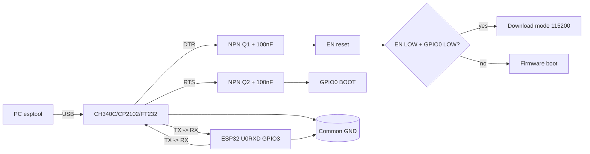

# 05 - USB-UART bridges and Auto-Reset for ESP32

## Purpose

Reliable ESP32 flashing over USB: bridge choice (CH340C / CP2102 / FT232RL / built-in USB S2/S3), correct TX/RX crossover, DTR/RTS signals for automatic bootloader entry and Failed to connect error diagnostics.

Without a working auto-reset every flash turns into BOOT+EN button juggling.

## Specifications

| Bridge | Driver | Speed | DTR/RTS | Price | Features |
| --- | --- | --- | --- | --- | --- |
| CH340C / CH340G | needed (cloned VID/PID) | up to 2Mbaud (really 921600) | yes | cheapest | CH340G needs a 12MHz crystal, CH340C has it built in |
| CP2102 / CP2104 | built into Win10+/Linux/macOS | up to 2Mbaud | yes, stable | medium | most stable for long flashes |
| FT232RL | built in (FTDI) | up to 3Mbaud | yes | expensive | + CBUS setup, clones get bricked by the driver! |
| Built-in USB (S2/S3/C3) | TinyUSB, no bridge | 12Mbit USB-OTG | software (CDC) | 0 (on silicon) | D+/D- direct, BOOT needed on first flash |

esptool flashing speeds:

| Baud | Time for 1.3MB | Stability | Use when |
| --- | --- | --- | --- |
| 115200 | ~2 min | maximum, long cables | default, clones, long lines |
| 230400 | ~1 min | good | CP2102 + short cable |
| 460800 | ~35 s | good on a quality cable | daily work, recommended |
| 921600 | ~20 s | picky (CH340 - fine, FTDI clones - no) | short cables, CP2102/CH340C |

DTR/RTS mapping in esptool: DTR to EN (RST), RTS to GPIO0 (BOOT). Sequence: EN LOW → GPIO0 LOW → EN HIGH → flashing → EN LOW → GPIO0 HIGH → EN HIGH (boot).

## Module pin legend

### Typical USB-UART module (6 pins)

| Pin | Direction | Description |
| --- | --- | --- |
| VCC (5V / 3.3V) | power | 5V to feed a DevKit or 3.3V logic; jumper! Do NOT feed 5V into a 3.3V ESP32! |
| GND | ground | common with ESP32 mandatory |
| TXD | bridge output | → to RX (GPIO3 / U0RXD) of ESP32 (crossover!) |
| RXD | bridge input | ← from TX (GPIO1 / U0TXD) of ESP32 (crossover!) |
| DTR | output | → auto-reset circuit → EN (through NPN + 100nF) |
| RTS | output | → auto-reset circuit → GPIO0 (through NPN + 100nF) |

Crossover is the main guideline: bridge TX → controller RX, bridge RX ← controller TX. A TX-TX connection means silence in the terminal!

### ESP32 side (UART0)

| ESP32 pin | Role during flashing |
| --- | --- |
| GPIO1 (TX0) | controller logic → bridge RX |
| GPIO3 (RX0) | bridge logic → controller |
| GPIO0 (BOOT) | LOW at reset = bootloader, HIGH = flash boot |
| EN (CHIP_PU) | LOW over 50ms = reset; RC chain 10k + 100nF |
| D+/D- (S2/S3) | built-in USB: GPIO19/20 (S3), GPIO20/19 (S2) straight to the USB connector |

### Built-in USB S2/S3/C3

| Signal | Where to |
| --- | --- |
| D- | GPIO19 (S3) / GPIO20 (S2) through 22 Ohm to USB D- |
| D+ | GPIO20 (S3) / GPIO19 (S2) through 22 Ohm to USB D+ |
| 5V / VBUS | USB detect (divider to GPIO) + power |
| BOOT (GPIO0) | button to GND for the first download entry |

## Wiring

Minimal flashing wiring: USB-UART + 2 NPN auto-reset + BOOT/EN buttons.

### ASCII schematic

```text
[USB-UART module]              [ESP32]
  VCC (3.3V!) ---------------> 3V3 (або 5V -> VIN, дивись перемичку!)
  GND -----------------------> GND (товстий, короткий!)
  TXD -----------------------> RX0 (GPIO3)
  RXD <----------------------- TX0 (GPIO1)
  DTR --+                     RTS --+
        |                           |
   [Auto-Reset на 2 NPN + 100нФ:]
   DTR --[1k]--> B Q1 (NPN 3904)    RTS --[1k]--> B Q2
                C --> EN                         C --> GPIO0
                E --> GND                        E --> GND
   EN --[10k]--> 3.3V  + [100nF] до GND (RC для авторесету)
   GPIO0 --[10k]--> 3.3V + кнопка BOOT до GND
   EN ---- кнопка EN до GND (ручний ресет)

Ручний режим (немає DTR/RTS):
  1. Утримувати BOOT (GPIO0 -> GND)
  2. Клікнути EN (ресет)
  3. Відпустити EN, потім відпустити BOOT
  4. ESP32 у download mode, шити esptool.

Вбудований USB S2/S3:
  USB D- --[22 Ом]--> GPIO19(S3)/GPIO20(S2)
  USB D+ --[22 Ом]--> GPIO20(S3)/GPIO19(S2)
  USB GND -----------> GND
  USB 5V -> AMS1117/ME6211 -> 3.3V + VBUS-detect дільник
```

Classic DevKit auto-reset (two emitter-coupled transistors):

```text
         DTR o---+----[100nF]----+----> EN
                 |               |
                [10k]           Q1 NPN (DTR керує EN)
                 |               | C=EN, E=GND, B через 1k до RTS?*
         RTS o---+----[100nF]----+----> GPIO0
                                 |
                                Q2 NPN (RTS керує GPIO0)

 * Точна схема DevKit V1: DTR через діод/транзистор на EN,
   RTS через транзистор на GPIO0, емітери перехресно заблоковані,
   щоб EN і GPIO0 не просаджували один одного.
   Конденсатори 100нФ перетворюють рівень DTR/RTS в імпульс ресету.
```

### Mermaid



![[assets/img/usb-uart-autoreset-scheme.png|500]]

## Setup procedures

### Procedure 1: Bridge and driver check

```bash
# Linux: міст видно?
lsusb | grep -i -E "1a86|10c4|0403"
# 1a86 = CH340 (QinHeng), 10c4 = CP210x (Silabs), 0403 = FTDI
dmesg | tail -20
ls -l /dev/ttyUSB*
# Права на порт:
sudo usermod -a -G dialout $USER
# Перелогінитись!
```

Why cloned CH340 chips need a driver: the stock Windows Update driver trusts only VID 1A86/PID 7523 signed by QinHeng. Clones with a re-flashed VID or an old release get rejected (Code 10). Fix: official CH341SER.EXE driver from wch.cn + switch driver auto-update off. On Linux the ch341 driver is in kernels 5.x and up - works out of the box.

macOS: CH340 needs a signed kext, allow it in Privacy → Allow. CP2102 works out of the box (AppleUSBSLab).

### Procedure 2: First flash / manual BOOT

```bash
# Стерти flash (при смітті у NVS/OTA):
esptool.py --chip esp32 --port /dev/ttyUSB0 erase_flash
# Записати firmware на 460800:
esptool.py --chip esp32 --port /dev/ttyUSB0 --baud 460800 write_flash -z 0x1000 firmware.bin
# Якщо auto-reset немає — ручний режим:
# 1. Утримувати BOOT, клікнути EN, відпустити BOOT
# 2. Виконати команду вище на 115200
esptool.py --chip esp32 --port /dev/ttyUSB0 --baud 115200 write_flash -z 0x1000 firmware.bin
# Монітор:
esptool.py --port /dev/ttyUSB0 monitor --baud 115200
```

### Procedure 3: Speed and cable choice

1. Start at 115200 - it must always work.
2. If stable - raise to 460800 (time/reliability optimum).
3. 921600 - only a short (<50cm) ferrite cable + CP2102/CH340C.
4. Long cables (over 2m): 115200 only, shielded cable, ferrite ring near the ESP32, separate 5V 2A power (USB cannot handle it!).
5. Unpowered hub + long cable = guaranteed Failed to connect.

Ferrite rings: 1-2 USB cable turns through a ring remove HF ringing from nearby buck converters. Especially critical for S2/S3 native USB (12Mbit is sensitive to ringing).

## Common issues

| Message / Symptom | Cause | Fix |
| --- | --- | --- |
| Failed to connect to ESP32: Timed out | GPIO0 not LOW, no auto-reset | manual BOOT+EN, check DTR/RTS and the NPN circuit |
| CH343/FT4232H not visible in the system | No vendor driver | Driver from the WCH/FTDI site; CH343 is not CH340 in VID/PID |
| Failed to connect: Wrong boot mode | EN RC chain broken / button stuck | measure EN=3.3V, GPIO0=3.3V idle; replace 100nF |
| Silence in the monitor, flash fine | TX/RX not crossed (TX-TX) | swap TX/RX |
| Garbage at 74880 baud and reset loop | supply droops at RF calibration | separate 5V 2A PSU, 1000uF on 5V, short wires |
| CH340 Code 10 (Windows) | clone, unsigned driver | CH341SER from wch.cn, driver rollback |
| /dev/ttyUSB0 drops at TX | thin cable, droop, hub auto-sleep | short cable, powered hub, capacitor |
| A fatal error occurred: Packet content transfer stopped | 921600 too much for the cable | drop to 115200/460800 |
| FTDI brick (PID 0000) | clone blocked by a new driver | old 2.10 driver, or swap to CP2102 |
| S3 not visible as USB | BOOT not pressed at power-up | hold BOOT, plug USB in, release; esptool --chip esp32s3 |
| RTS/DTR tug the ESP32 in operation | monitor opens the port with DTR | switch DTR/RTS off in the terminal or add a 100nF filter |

### CH343 / FT4232H - USB bridge neighbors

| Option | What it is | Nuance |
| --- | --- | --- |
| CH343 (WCH) | USB HS 480 Mbit/s, 2x UART + parallel bus | CH340 successor for fast jobs; driver from the WCH site |
| FT4232H (FTDI) | 4 ports: UART/FIFO/JTAG/SPI in one | One chip instead of 4 bridges on the bench; 5x the CH340 price |

> CH340 vs CH343: no difference for ESP32 flashing (12 Mbit/s Full-Speed is enough for both); CH343 fits fast logs/two UARTs over one cable.

Tip: keep one proven short cable for flashing only and label it. 80% of Failed to connect cases are charge-only cables with no data wires!

## Official sources

- [CH340 - vendor (WCH)](https://www.wch.cn/products/CH340.html) - datasheet, drivers.
- [CH340 - English page (WCH)](https://www.wch-ic.com/products/CH340.html) - C/G versions, photos.
- [CP2102 - datasheet (Silicon Labs)](https://www.silabs.com/interface/usb-bridges/classic/device.cp2102) - VCP drivers, EK.
- FT232RL (ftdichip.com) - *verify by hand*: the site blocks automated requests.

## See also

- [[EN/02-Power-Supply/01-Power-Rails.en|Power supply]]
- [[EN/02-Power-Supply/02-LDO-DC-DC.en]]
- [[EN/09-Firmware/04-Esptool-Flash.en]]
- [[EN/Home.en]]
- [[EN/13-Power-Modules/01-Buck-Boost-Solar.en|01-Buck-Boost-Solar]] - field node power
- [[EN/13-Power-Modules/04-LDO-Buck-XL4015-Protect.en|04-LDO-Buck-XL4015-Protect]] - 5V rail regulators and protection
