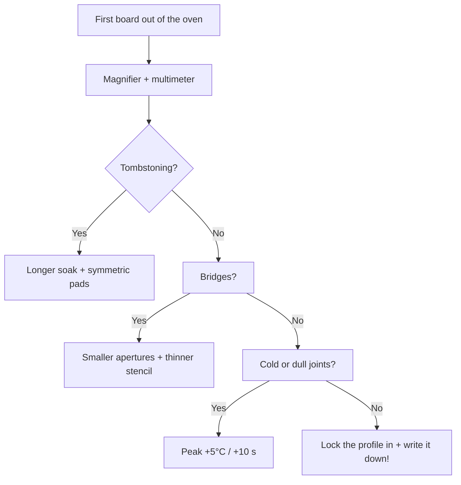

# Stencil and reflow: stencil, paste, reflow profile

## Purpose

Hand soldering ends at around 50 boards. Next come the stencil (paste on the whole board in 30 seconds) + reflow (oven or hot air). This note covers the full garage SMD assembly cycle: aperture design, paste choice, profile, defects and their fixes.

Base: start - [[EN/Home.en]], hand soldering - [[EN/17-Lab/02-Soldering-Connectors.en|Soldering and connectors]], PCB design - [[EN/17-Lab/04-PCB-Design.en|PCB design]], factory/ATE - [[EN/17-Lab/03-Enclosure-Cert-Factory.en|Enclosure, certification and factory]], power - [[EN/02-Power-Supply/01-Power-Rails.en|Power supply]].

> [!warning] Lead and ventilation
> Leaded paste (Sn63/Pb37) solders easier, but flux fumes are toxic either way. Oven/hot air - ONLY with extraction. Store paste in a fridge, before work - 2 h at room temperature (condensation!).

![[assets/img/stencil-reflow-profile-scheme.png|600]]
*Fig. Chain: stencil to paste to placement to reflow profile (preheat/soak/reflow/cooling) to inspection.*

## Material specifications

| Parameter | Hobby (garage) | Series (JLCPCB) |
| --- | --- | --- |
| Stencil | Polyimide (film $5) / framed | Laser stainless 0.1-0.12 mm |
| Paste | SAC305 Type 3 (25-45 um balls) | Type 4 for 0201/0.4 mm QFN |
| Application | Spatula by hand | Machine/semi-auto |
| Reflow | Hot air / IR oven / toaster oven with controller | Conveyor oven 5-8 zones |
| Inspection | Magnifier + multimeter | AOI + X-ray (BGA/QFN) |

## 1. Stencil aperture design (what to draw in KiCad!)

| Guideline | Value | Why |
| --- | --- | --- |
| Aperture size | 90% of pad (1:1 minus 10%) | Extra paste = bridging |
| Stencil thickness | 0.1 mm (small 0402/QFN) / 0.12 mm (universal) | Paste volume = area x thickness |
| QFN thermal pad | 4-9 windows (windowpane!) instead of one | One large window = paste excess = chip floating |
| Pitch under 0.5 mm | Reduce to 80% + Type 4 paste | Bridges guaranteed otherwise |
| Fiducials | 2-3 round 1 mm with no mask at corners | Hand stencil alignment |
| Cutout for connectors | Mask THT connectors with Kapton | No paste needed in THT holes |

```text
QFN-48 thermal pad 5×5 мм — правильно:
  ┌───┬───┬───┐
  │   │   │   │   9 вікон 1.2×1.2 мм, перемички 0.3 мм
  ├───┼───┼───┤   (паста виходить газами через щілини → менше voiding!)
  │   │   │   │
  ├───┼───┼───┤
  │   │   │   │
  └───┴───┴───┘
```

## 2. Reflow profile: 4 phases (SAC305, lead-free!)

| Phase | Board temperature | Time | What happens |
| --- | --- | --- | --- |
| Preheat | 25 to 150°C, ramp at most 3°C/s | 60-90 s | Solvents evaporate, NO thermal shock |
| Soak | 150-180°C (plateau!) | 60-120 s | Flux activation, board temperature equalizes |
| Reflow (peak) | 235-250°C (above 217°C!) | 30-60 s above liquidus | Paste melts, surface tension centers chips |
| Cooling | Fall at most 4°C/s down to under 100°C | 60-120 s | Crack-free crystallization; do NOT blow with a fan! |

```text
Профіль (намалюй на папірці біля печі!):
250°C ─┤              ╭───╮ пік 245°C
       │             ╱     ╲
217°C ─┤────────────╱───────╲──── ліквідус SAC305 (30–60 с вище!)
180°C ─┤      ╭─────╯ soak  ╰──╮
150°C ─┤─────╯  60–120 с       ╰──╮
 25°C ─┤╱ preheat ≤3°C/с          ╲╲ cooling
       └──────────────────────────────► t (~4–6 хв весь цикл)
```

> For leaded paste (Sn63/Pb37): peak 210-220°C, liquidus 183°C. The profile is LOWER - do not overcook boards tuned for lead!

## 3. Defects and fixes (poster above the desk!)

| Defect | Look | Cause | Fix |
| --- | --- | --- | --- |
| Tombstoning | 0402 stands upright | Uneven heating / different pad areas | Symmetric pads, slower preheat |
| Bridging | Paste between neighbor pins | Too much paste / thick stencil | 80-90% apertures, wick + hot air |
| Voiding (voids under QFN) | X-ray shows bubbles | Flux gases never left | Windowpane apertures + longer soak |
| Cold joint | Dull, crumbles | Underheat (low/short peak) | Raise peak +5°C or +10 s |
| Solder balling | Balls around | Old/cold paste, fast preheat | Fresh room-temperature paste |
| Skewed chip | Chip drifted | Pushed with tweezers / oven vibration | Surface tension centers on its own - do NOT TOUCH during reflow! |

### Mermaid: profile debugging



## 4. Garage assembly procedure step by step

1. Paste from the fridge → 2 h warming up closed (condensation kills!).
2. Fix the board, stencil by fiducials, 45° spatula - ONE pass.
3. Check the print: every pad has paste, no smearing. Smeared - wipe with alcohol and redo.
4. Place with tweezers (0402 → QFN → large), do not press (paste is glue!).
5. Oven by profile (thermocouple ON THE BOARD, not in oven air!). Hot air - spiral moves, 250°C, not point-blank.
6. Cool down WITH NO motion (crystals grow!). Wash flux off unless no-clean.
7. Inspection: magnifier → supply beep-test → first power-up through a CC limit (see [[EN/17-Lab/01-Instruments.en|Instruments]]).

## Common issues

| # | Issue | Why it is bad | Correct way |
| --- | --- | --- | --- |
| 1 | Cold paste straight to work | Condensation → balls/voids | 2 h at room temperature |
| 2 | Old paste (open over 6 months) | Flux dried, does not wet | Date on the syringe + glass test |
| 3 | One spatula pass back and forth | Smearing under the stencil | One confident 45° pass |
| 4 | Oven with no thermocouple on the board | Oven air is not board temperature | Thermocouple with Kapton on a GND polygon |
| 5 | Blowing to cool | Seam cracks, dull crystallization | Natural cooling |
| 6 | Touching the board in reflow | Chip shift | Hands off until under 100°C |
| 7 | Whole thermal pad as one window | QFN floating | Windowpane 4-9 windows |
| 8 | THT connectors in the oven with no masks | Plastic melts | Kapton + hand touch-up after |
| 9 | No extraction | Flux fumes + lead | Extraction always |
| 10 | Profile "from the ceiling" with no record | Not repeatable | Write the 4 phases on paper near the oven |

## Official sources

- [IPC-7530 - Guidelines for Temperature Profiling](https://www.ipc.org/TOC/IPC-7530.pdf) - reflow profiles (TOC of a paid standard).
- [JLCPCB - SMT Assembly Capabilities](https://jlcpcb.com/capabilities/smt-assembly-capabilities) - tolerances, apertures, pastes.
- [SAC305 Solder Paste datasheets (ChipQuik/Amtech)](https://chipquik.com/datasheets/SMD291AX.pdf) - paste vendor profiles (they beat generic ones!).

### Paste storage and incoming inspection

| Parameter | Norm |
| --- | --- |
| Storage | Fridge +2 to +10°C, sealed |
| Warm-up before work | 2 h closed to room temperature (condensation!) |
| Opened shelf life | 3-6 months (date on the syringe!) |
| Test | Smear on glass: shiny, balls do not scatter |

### Post-oven inspection checklist

```text
[ ] Лупа: всі виводи змочені, конус-філе, без кульок
[ ] QFN: немає спливання/зсуву (шовкографія-орієнтир!)
[ ] Продзвонка: VCC-GND не коротять (омметр, БЕЗ живлення!)
[ ] Живлення: CC-ліміт 100–200 мА при першому ввімкненні
[ ] Прошивка: blink → self-test → функціонал
```

## See also

- [[EN/Home.en|Main page]]
- [[EN/17-Lab/02-Soldering-Connectors.en|Soldering and connectors]]
- [[EN/17-Lab/04-PCB-Design.en|PCB design]]
- [[EN/17-Lab/03-Enclosure-Cert-Factory.en|Enclosure, certification and factory]]
- [[EN/17-Lab/01-Instruments.en|Instruments (first power-up)]]
- [[EN/02-Power-Supply/01-Power-Rails.en|Power supply]]
