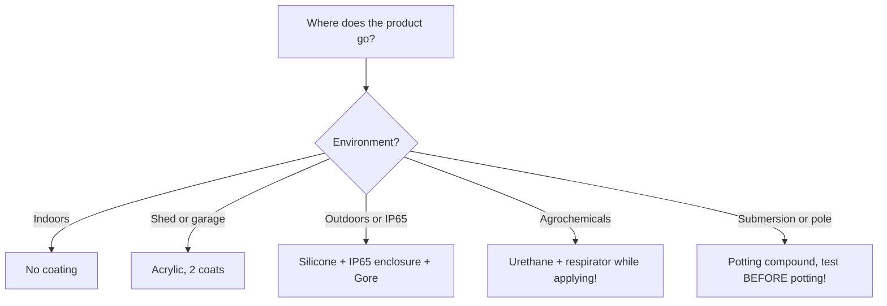

# Conformal coating and sealing: lacquer, compound, IP65

## Purpose

An outdoor ESP32 dies from moisture rather than code: morning condensation, rain in gaps, salt near the sea. Two lines of defense: conformal lacquer on the board + sealed enclosure. For extremes - potting compound (no right to repair). This note covers all three in practice.

Base: start - [[EN/Home.en]], enclosures overview - [[EN/17-Lab/03-Enclosure-Cert-Factory.en|Enclosure, certification and factory]] (section 4 - brief, here - in detail), PCB - [[EN/17-Lab/04-PCB-Design.en|PCB design]], stencil/assembly - [[EN/13-Power-Modules/07-Stencil-Reflow.en|Stencil and reflow]].

> [!warning] Lacquer is not an enclosure sealant!
> Conformal coating protects AGAINST condensation and dust, but does NOT hold water pressure and does NOT replace an enclosure gasket. Running water under pressure wicks under any lacquer through capillaries. Formula: lacquer on the board + IP65 enclosure with a gasket - only together.

![[assets/img/conformal-coating-ip65-scheme.png|600]]
*Fig. Three lines: masking to 25-75 um lacquer to IP65 enclosure with a membrane; potting compound is a separate extreme path.*

## Material specifications

| Material | Thickness | Plus | Minus | Use when |
| --- | --- | --- | --- | --- |
| Acrylic (AR) | 25-75 um | Cheap, easy to remove (repair!), dries fast | Soft, fears solvents | 90% of outdoor nodes - default pick |
| Silicone (SR) | 50-200 um | -60 to +200°C, elastic, UV-proof | Expensive, collects dust, hard to remove | Outdoor sensors with swings, solar stations |
| Urethane (UR) | 25-75 um | Chemical-proof, hard | Toxic while applying (respirator!), unrepairable | Agrochemicals, garages with fumes |
| Epoxy compound | 5-30 mm potting | Absolute sealing, vandal-proof | No repair, weight, exotherm while curing! | Submerged sensors, meters on a pole |
| Polyurethane potting | Potting | Softer than epoxy, tears parts less | Pricier, cures longer | Outdoor PSUs, LED drivers |

## 1. Lacquer application step by step (acrylic, brush/aerosol)

1. The board is WASHED (alcohol/ultrasonic bath) and dried - lacquer over flux peels off in a month.
2. Masking (see section 2!) - Kapton + silicone caps.
3. 2-3 THIN coats with 15-30 min drying between, not one thick coat (bubbles!).
4. Thickness: "wet shine" with no runs; check - UV lamp (lacquer fluoresces!).
5. Cure 24 h at room temperature (or 2 h at 60°C - with NO battery parts!).
6. Remove masks, beep-test contacts, flash the test.

## 2. What to mask (wall of shame!)

| Mask MANDATORY | Why | With what |
| --- | --- | --- |
| Connectors (USB, JST, terminals) | Lacquer = insulator in the contact | Kapton/caps |
| Buttons, jumpers | Stick | Kapton |
| Humidity/pressure/gas sensors (BME/SHT/MQ) | They need AIR! | Shaped cap/Kapton |
| PCB/ceramic antennas | Detuning | Kapton with 5 mm margin |
| Programming contacts (TX/RX/BOOT) | No flashing after lacquer | Caps |
| LEDs/optocouplers/photodiodes | Lacquer clouds optics | Spot Kapton |
| Heatsinks/thermal pads | Overheat | Mask + thermal paste after |
| Battery contacts | Contact resistance | Caps |

> A BME280 covered in lacquer reads a flat 50% humidity forever - a classic everyone second has seen. Post-lacquer check: sensors breathe (blow - humidity rises!).

## 3. Compound: when and how to pot

When: submersion, pole/manhole, vandal-proofing, selling "with no opening".

```text
Процедура заливки:
  1. Форма/корпус БЕЗ щілин (компаунд тече всюди — герметизувати форму!).
  2. Плату з лаком-праймером (адгезія!) + маскування роз'ємів-назовні.
  3. Змішати A+B СТРОГО за вагою (кухонні ваги 0.1 г!), перемішати без бульбашок.
  4. Заливати тонким струменем з кута (не лити зверху — бульбашки!).
  5. Вакуум/вібрація для вигону бульбашок (опційно, для глибини).
  6. Твердіння за даташитом (екзотермія! товстий шар гріється до 80–100°C —
     електроліти і батареї всередині НЕ ховати!).
  7. Після — тільки викинути: ремонту НЕМАЄ. Тому перед заливкою — 100% тест!
```

## 4. IP65 enclosure in practice (brief, details - Factory note)

```text
IP65-вузол: коробка з прокладкою + кабельні вводи PG (за діаметром КАБЕЛЮ!) +
  заглушки на порожні + Gore-мембрана M12 (випускає пару, не впускає воду) +
  плата ВЕРТИКАЛЬНО (конденсат стікає, не стоїть) + силікагель-індикатор всередину.
Дренаж: отвір 2–3 мм у найнижчій точці (з сіткою від комах) — парадокс, але без нього
  гірше: вода, що зайшла, не має куди вийти. Див. [[17-Lab/03-Enclosure-Cert-Factory]].
```

### Mermaid: protection choice



## Common issues

| # | Issue | Why it is bad | Correct way |
| --- | --- | --- | --- |
| 1 | Lacquer over flux | Peels in a month | Wash + dry before lacquer |
| 2 | One thick coat | Bubbles, cracks | 2-3 thin coats |
| 3 | Lacquered BME/SHT/MQ | Sensor blind | Mask (table in sect. 2) |
| 4 | Lacquer in USB/JST | No contact | Caps + beep-test after |
| 5 | Lacquer instead of a gasket | Pressurized water passes | Lacquer + IP65 together |
| 6 | Compound with no primer | Peels off the board | Lacquer primer + degreasing |
| 7 | Battery in compound | Exotherm + explosion hazard | Batteries - ONLY outside |
| 8 | Potting with no 100% test | Defect forever | ATE/self-test BEFORE (Factory note) |
| 9 | Urethane with no respirator | Isocyanates in lungs | A2 respirator + extraction |
| 10 | No Gore membrane | Condensation inside IP65 | Membrane + drain + silica gel |

## Official sources

- [Conformal coating guide (Wikipedia)](https://en.wikipedia.org/wiki/Conformal_coating) - coating criteria (paid, look for reviews).
- [MG Chemicals / Electrolube - application guides](https://mgchemicals.com/products/conformal-coatings/acrylic/419d/) - acrylic/silicone/urethane, thicknesses, curing.
- [Hammond/Bopla - IP enclosure catalogs](https://www.hammfg.com/electronics/small-case/plastic/1591) - sizes, glands, membranes.

### Coating thickness control and repair

| Method | How |
| --- | --- |
| UV lamp | Lacquer fluoresces: dark spots = misses |
| Wet comb | Measure on a glass witness nearby (25-75 um acrylic) |
| Acrylic repair | Remove locally with a scalpel/solvent → re-solder → touch up |
| Silicone/urethane repair | Mechanical only; urethane is nearly unrepairable! |

> A lacquered test witness board riding the oven/cycle with the batch is thickness proof for the customer.

### Alcohol tropicalization: when no lacquer is at hand

```text
Польовий мінімум (похід/хакатон, на 1 сезон):
  1. Плата вимита, висушена.
  2. Каніфольний лак / цапонлак у 2 шари пензлем (НЕ нітролак — їсть пластик роз'ємів!).
  3. Краї плати і ніжки роз'ємів — додатковий шар.
Живе 3–6 місяців на вулиці; далі — нормальний акрил. Краще за голий текстоліт!
```

### Silica gel indicator: eyes inside the enclosure

```text
Пакетик 5–10 г біля плати + віконце або перевірка при ТО:
  синій = сухо; рожевий = вологий → замінити + шукати щілину!
Регенерація: 2 год при 120°C у духовці — індикатор знову синій.
```

## See also

- [[EN/Home.en|Main page]]
- [[EN/17-Lab/03-Enclosure-Cert-Factory.en|Enclosure, certification and factory]]
- [[EN/17-Lab/04-PCB-Design.en|PCB design]]
- [[EN/13-Power-Modules/07-Stencil-Reflow.en|Stencil and reflow]]
- [[EN/17-Lab/02-Soldering-Connectors.en|Soldering]]
- [[EN/10-Sensors/36-Agro.en|Agro (outdoor nodes)]]
