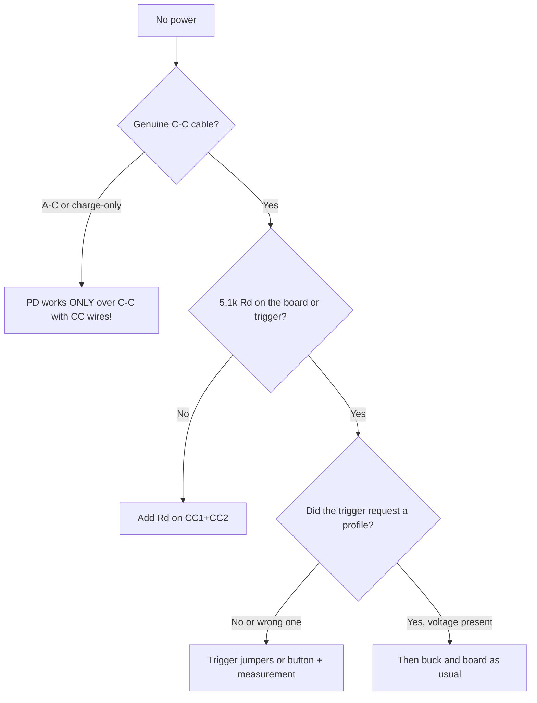

# USB Power Delivery for ESP32: triggers, profiles, traps

## Purpose

A plain USB-C port gives 5V/3A (with 5.1k Rd, see [[EN/17-Lab/04-PCB-Design.en|PCB design]]). USB-PD negotiates 9/12/15/20V - handy when 12V peripherals (motors, relays, PoE splitters) must run from one powerbank. ESP32 does not speak PD - a trigger or a controller is needed.

Base: start - [[EN/Home.en]], USB-C Rd - [[EN/17-Lab/04-PCB-Design.en|PCB design]] (sect. 17), buck - [[EN/13-Power-Modules/01-Buck-Boost-Solar.en|Buck and solar]], protection - [[EN/13-Power-Modules/04-LDO-Buck-XL4015-Protect.en|Protection]].

> [!danger] 20V into a 5V input = dead board
> The TRIGGER signs the PD contract, not the ESP32. A wrong contract divider (wrong profile!) feeds 20V where 5V was expected. Test the trigger WITHOUT the board (multimeter!), then connect.

![[assets/img/usb-pd-trigger-profiles-scheme.png|600]]
*Fig. PD charger to trigger (12V contract) to buck to 5V/3.3V boards; the ESP32 takes no part in the contract.*

## PD profile specifications

| Profile | Voltage | Current (typ.) | For ESP32 projects |
| --- | --- | --- | --- |
| PDO 5V (default) | 5V | up to 3A | Always present; default with no contract |
| PDO 9V | 9V | up to 2-3A | Relay/motor feed through a buck |
| PDO 12V | 12V | up to 3-5A | 12V LED strips, solenoids |
| PDO 15/20V | 15/20V | up to 5A | Laptop chargers; for ESP32 - through a buck only! |
| PPS (programmable) | 3.3-21V in 20 mV steps | up to 5A | Exact voltage with no buck (rarely needed) |

## 1. Rd/Rp in 30 seconds (the base with no PD start)

```text
Плата-приймач (sink): Rd 5.1к з CC1 і CC2 на GND → джерело дає 5V.
Плата-джерело (source): Rp 56к/22к/10к до 5V (500мА/1.5A/3A).
Помилка: два Rp назустріч (кабель C–C з двома хостами) = конфлікт, можливий дим.
PD-договір іде ПОВЕРХ цього: спочатку 5V за Rd, потім BMC-повідомленнями просять вище.
```

## 2. Triggers: CH224K / SW2303 / analogs

| Trigger | Profile | How it is set | Price |
| --- | --- | --- | --- |
| CH224K (trigger board) | By jumpers: 9/12/15/20V | Jumpers/soldering on the board | $1-2 |
| SW2303 | By button/auto (remembers) | Button + LED indication | $2-4 |
| FUSB302 + MCU | Any (in software) | I2C from ESP32! | $3 + code |

```text
Схема з тригером (без участі ESP32):
  PD-зарядка (C–C кабель!) ──► [CH224K-тригер, джампер 12V] ──► 12V ──► buck 12→5V ──► плата
  Перевірка: мультиметр на виході тригера ДО підключення плати! Має бути рівно 12.0V.
  Запобіжник 3A + TVS 15V між тригером і buck (договір іноді «стрибає» при перетиканні!).
```

### Mermaid: diagnosing "no power from PD"



## 3. FUSB302 + ESP32: software PD (advanced level)

```text
FUSB302 (I2C) — PD-PHY: ESP32 сам веде BMC-діалог і просить потрібний PDO.
Коли: виріб з USB-C, якому треба 12V без зовнішнього тригера.
Ціна: ~200 рядків PD-стека (парсинг Source_Capabilities → Request → Accept).
Пастка: таймінги PD жорсткі (мс!) — вести на окремій задачі FreeRTOS з пріоритетом.
Для 95% проєктів тригер CH224K дешевший за розробку. FUSB — тільки серія.
```

## Common issues

| # | Issue | Why it is bad | Correct way |
| --- | --- | --- | --- |
| 1 | A-C cable for PD | PD never starts (no CC) | C-C full cable only |
| 2 | No Rd | Source stays silent | 5.1k on CC1+CC2 |
| 3 | Profile unchecked | 20V into a 5V input | Multimeter BEFORE the board! |
| 4 | Two Rp facing each other | Source conflict | Sink - Rd only |
| 5 | No fuse/TVS | Contract spike = smoke | 3A + TVS past the trigger |
| 6 | PD feeding 3.3V direct | Extra complexity | PD to 12V to buck (cascade) |
| 7 | FUSB with no RT task | Contract timings break | Separate priority task |

## Official sources

- [USB Power Delivery spec (USB-IF)](https://www.usb.org/document-library/usb-power-delivery) - PDO, BMC, timings.
- [CH224K datasheet (WCH)](https://www.wch.cn/products/CH340.html) - trigger, profile jumpers.
- [FUSB302 datasheet (onsemi)](https://www.onsemi.com/products/interfaces/usb-type-c-products/fusb302) - PD-PHY, I2C.

## 4. PD contract step by step (what happens on CC)

```text
1. Підключив C–C: джерело бачить Rd → дає 5V (Safe 5V).
2. Тригер/FUSB читає Source_Capabilities: список PDO (5/9/12/15/20V + струми).
3. Тригер шле Request на вибраний PDO (напр. 12V/3A).
4. Джерело відповідає Accept → PS_RDY → лінія переходить на 12V (стрибок ~мс!).
5. Далі: контракт тримається; перетикання/скидання → все спочатку з 5V.
Пастка: деякі зарядки після PS_RDY дають викид +2V на мікросекунди — TVS після тригера обов'язковий!
```

## 5. Cable E-marker: when 5A will not flow

| Cable | Current | How to tell |
| --- | --- | --- |
| No e-marker | up to 3A | Thin, cheap; not for 60W+ |
| With e-marker chip | up to 5A | Thicker, 100W marking; needed for 15/20V-5A |
| Charge-only C-C | 3A, but with no CC wires | PD never starts at all! |

```text
Тест кабелю: USB-C тестер (див. 17-Lab/01!) показує PDO джерела І наявність e-marker.
Немає тестера — проба з тригером: якщо вище 5V не домовляється, кабель під підозрою.
```

Note the tester reference above points at [[EN/17-Lab/01-Instruments.en|Instruments]].

## PPS mode: programmed voltage with no buck

```text
PPS (Programmable Power Supply): джерело видає 3.3–21V кроком 20 мВ за запитом.
Тригер з PPS (SW2303 та аналоги): виставити рівно 5.2V (компенсація падіння!)
або 7.0V під свій buck з малим dropout.
Коли: точна напруга + мінімум компонентів; коли НЕ: більшість дешевих зарядок
PPS не вміють — перевіряти маркування на корпусі (PPS явно пишуть!).
```

## Contract check with a multimeter (protocol!)

```text
[ ] Кабель C–C, зарядка 65W+ з маркуванням PD
[ ] Тригер БЕЗ плати: замір = заданий профіль ±0.3V
[ ] Підключити buck БЕЗ плати: замір 5.0V на виході buck
[ ] Підключити плату: струм у нормі, нагрів тригера/buck за 10 хв
[ ] Перетикання 5 разів: профіль стабільний щоразу (ловити стрибки!)
```

## See also

- [[EN/Home.en|Main page]]
- [[EN/17-Lab/04-PCB-Design.en|PCB (section 17, Rd and Rp)]]
- [[EN/13-Power-Modules/01-Buck-Boost-Solar.en|Buck and solar]]
- [[EN/13-Power-Modules/04-LDO-Buck-XL4015-Protect.en|Protection]]
- [[EN/02-Power-Supply/01-Power-Rails.en|Power supply rails]]
