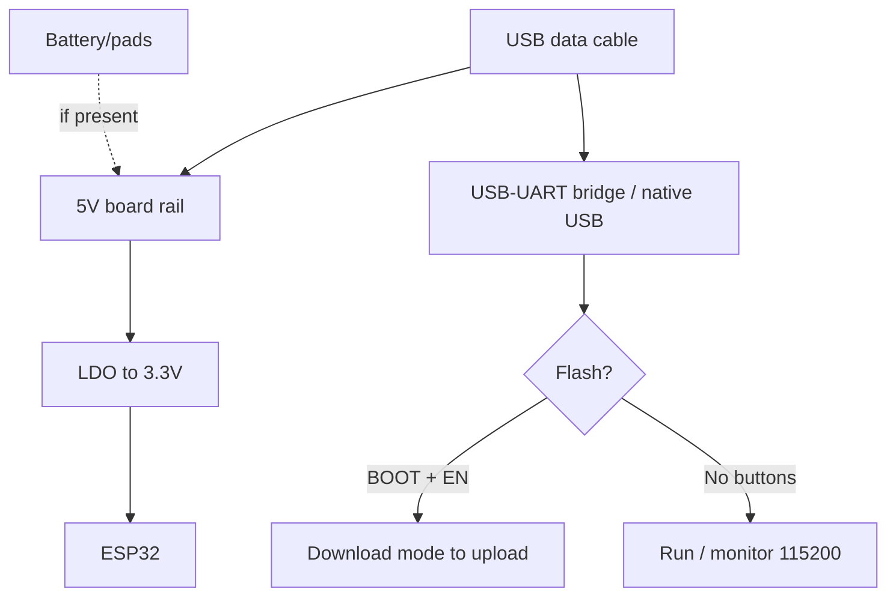

# DOIT DevKitV1 / NodeMCU-32S - 30-pin classic

> [!tip] Reference board for beginners
> This is the board meant in 90% of internet examples. If an example fails on another board - check it on the DOIT V1 first. Chip comparison - [[00-Start/03-Chip-Comparison.en | Chip comparison]], board overview - [[00-Start/04-Dev-Boards.en | DevKit boards]], environment - [[00-Start/05-Environment-Choice.en | Environment choice]].
>
> [!warning] 3.3V logic!
> All GPIO are 3.3V, **not 5V-tolerant**. The `5V/VIN` pin is a power input only. Level details - [[03-GPIO/03-Pull-Ups-Levels.en | 3.3V/5V levels]].

## Purpose

DOIT ESP32 DevKit V1 (cloned as NodeMCU-32S, ESP32 DEVKITV1, MH-ET LIVE) - the most common development board on the ESP32 Classic chip (WROOM-32). Purpose: learning, prototyping, IoT nodes with Wi-Fi + Bluetooth, flashing over USB-UART with auto-reset. The wide form factor (52x28 mm) takes much space on a breadboard, but all 30 pins are labeled and repeat the "canonical" pinout from tutorials.

| Parameter | Value |
| --- | --- |
| Purpose | Learning, prototypes, reference for examples |
| Chip | ESP32-D0WDQ6 Classic, 240 MHz dual-core |
| Example compatibility | Maximum (all tutorials target it) |

## Specifications

| Specification | Value | Note |
| --- | --- | --- |
| Module | ESP32-WROOM-32 (4 MB Flash) | No PSRAM |
| Pin count | 30 (2x15) | Wide version; narrow is also 30 but 52x25 mm |
| USB-UART | CP2102 (original) or CH340G/C (clones) | See differences below |
| USB connector | Micro-USB | Data cable only, not charge-only! |
| LDO | AMS1117-3.3, up to 1 A (really about 500 mA without heatsink) | Heats up at Wi-Fi TX + peripherals |
| Buttons | BOOT (GPIO0) + EN | Auto-flash via DTR/RTS |
| Power supply | USB 5V / VIN 5V / 3V3 (LDO bypass) | VIN min about 4.75V due to AMS1117 dropout |
| Size | About 52x28 mm (wide) / about 52x25 mm (narrow) | Wide version covers both breadboard rows |
| Current | About 80 mA idle, up to 500 mA Wi-Fi TX peak | 470-1000 uF electrolytic cap against brownout |

> [!tip] Power supply
> USB gives 500 mA. AMS1117 has a dropout of about 1.1V, so feed 4.75-5.5V into VIN. For relays/servos/motors use a separate 5V 2A supply with common GND, see [[02-Power-Supply/01-Power-Rails.en | Power rails]].

## Pinout features

Classic DOIT V1 pinout (left row top to bottom): EN, VP(36), VN(39), 34, 35, 32, 33, 25, 26, 27, 14, 12, GND, 13. Right row: 23, 22, 21, 19, 18, 5, TX2(17), RX2(16), TX0(1), RX0(3), 4, 2, 15, GND, 5V/VIN. Note: on some clones the 5V/GND order is swapped - check the silkscreen!

| Feature | DOIT V1 | DevKitC V4 reference |
| --- | --- | --- |
| Width | Wide, covers breadboard | Narrow, leaves one row free |
| GPIO34-39 | Routed, inputs only | Same |
| GPIO6-11 | NOT routed (used by Flash) | Same |
| Strapping | GPIO0/2/5/12/15 available | Same, see [[03-GPIO/02-Strapping-Pins.en | Strapping]] |
| LED | Blue LED on GPIO2 | Same |

Do not use GPIO6-GPIO11 (SPI Flash); GPIO34-39 are input-only with no pull-up/pull-down. ADC2 (GPIO4/0/2/15/13/12/14/27/25/26) conflicts with Wi-Fi - for analog measurements with Wi-Fi take ADC1, see [[06-Analog/01-ADC.en | ADC]].

## Power supply features

| Source | Where to feed | Limits |
| --- | --- | --- |
| USB Micro 5V | Connector | 500 mA, thin cable means brownout |
| External 5V | VIN (5V) + GND | 4.75-5.5V, then AMS1117 to 3.3V |
| External 3.3V | 3V3 + GND | LDO bypass, only stable 3.2-3.4V! |
| 3V3 output for sensors | 3V3 pin | Up to about 400 mA total, then it heats up |

> [!warning] AMS1117 heats up
> At (5V-3.3V)x400 mA = about 0.7 W the SOT-223 package without heatsink warms to 70-90 C. This is normal, but at 500 mA and more add a heatsink or a separate buck, see [[13-Power-Modules/04-LDO-Buck-XL4015-Protect | XL4015/Protection]].

## USB-UART features

| Board version | Bridge | Driver | Differences |
| --- | --- | --- | --- |
| DOIT V1 original | CP2102 | SiLabs CP210x (Win - install, Linux/macOS - out of the box) | Crystal next to the chip, stable 921600 baud |
| NodeMCU-32S clone | CH340G | WCH CH341SER | No crystal on CH340C, cheaper, 460800 more reliable |
| MH-ET LIVE | CH340C | WCH CH341SER | Same, often better silkscreen |

How to tell apart: CP2102 is a QFN-28 package with a 12 MHz crystal nearby; CH340G is SOP-16 with crystal; CH340C is SOP-16 without crystal. Fakes labeled CP2102 with a CH340 inside are fixed with the WCH driver and 115200 speed. More details - [[13-Power-Modules/05-USB-UART-AutoReset | USB-UART]].

## BOOT/EN buttons

Both buttons are always present. The auto-reset circuit on 2 NPN transistors (DTR to EN, RTS to GPIO0) lets esptool flash hands-free. If auto-reset fails (cheap clone): hold BOOT, click EN, release BOOT, then flash. After flashing click EN to run.

| Action | BOOT (GPIO0) | EN | Result |
| --- | --- | --- | --- |
| Run | Released | Click | Reset, firmware start |
| Manual download | Hold | Click, then release BOOT | `waiting for download` |
| Erase flash | Hold | Click | Then `erase_flash` |

## What it fits

- Learning Arduino/ESP-IDF/MicroPython - all examples match pin-to-pin.
- Home IoT nodes powered from a USB charger (temperature sensors, relays, MQTT).
- Breadboard prototypes with I2C/SPI modules: [[10-Sensors/03-BME280-BMP280-SHT31.en | BME280]], [[11-Vivid/01-OLED-SSD1306.en | OLED]], [[12-Comm-Modules/01-RC522-RFID.en | RC522]].
- NOT a fit: tiny battery devices (AMS1117 eats about 5 mA idle, the board is wide), projects with PSRAM/camera (take an S3), 5V Arduino shields (take a Wemos D1 R32 with caveats).

## Flashing

Arduino IDE: `DOIT ESP32 DEVKIT V1` board, default settings, Partition `Default 4MB`, Upload Speed `921600` (clones - `460800` or `115200`).

```ini
; PlatformIO (platformio.ini)
[env:doit-v1]
platform = espressif32
board = esp32dev
framework = arduino
upload_speed = 460800
monitor_speed = 115200
```

```bash
# Esptool безпосередньо
esptool.py --chip esp32 --port /dev/ttyUSB0 --baud 460800 write_flash -z 0x1000 firmware.bin
# Якщо Failed to connect — ручний BOOT+EN і 115200
esptool.py --chip esp32 --port /dev/ttyUSB0 --baud 115200 write_flash -z 0x1000 firmware.bin
```

MicroPython: flashes normally over USB-UART, see [[09-Firmware/03-MicroPython.en | MicroPython]]. ESP-IDF: `esp32` target, see [[09-Firmware/01-ESP-IDF-Setup.en | IDF]].

## Common issues

| Symptom | Cause | Fix |
| --- | --- | --- |
| `Failed to connect` | Charge-only cable, no driver, stuck EN | Data cable, WCH/SiLabs driver, manual BOOT+EN |
| Brownout at Wi-Fi start | Thin USB cable, weak LDO | Short cable, 470 uF on VIN+GND, 5V 2A supply |
| Board heats up | AMS1117 under load | Normal up to about 70 C; unload 3V3 |
| GPIO34-39 fail as outputs | These are inputs with no pull-up | Use as inputs/ADC only |
| ADC2 reads nonsense with Wi-Fi | Hardware conflict | Move to ADC1, see [[06-Analog/01-ADC.en | ADC]] |
| 5V sensor burned a pin | 5V on GPIO | Only via divider/TXS0108E |

## Power and flashing schematic

> [!example] Photo/schematic: ![[assets/img/devboard-doit-v1.png|600]]

```text
[USB 5V / Зарядка 5V 2A] ──► Micro-USB ──► AMS1117-3.3 ──► 3.3V (ESP32 + піни 3V3)
        │                                                     │
        └────────► VIN (5V) ──► реле/серво 5V (ОКРЕМИЙ БЖ!) ──┘
GND спільна для всіх модулів! Електроліт 470–1000 мкФ між VIN і GND.

[ПК] ─USB─► CP2102/CH340 ─TX─► RX0(GPIO3) / ─RX─◄ TX0(GPIO1)
                        ─DTR─► EN / ─RTS─► GPIO0 (авто-програмування)
Кнопки: BOOT(GPIO0→GND) + EN(ресет). Ручний режим: тримати BOOT, клік EN.
```

## Official sources

- Espressif - ESP32-DevKitC board page (reference, schematic and docs): <https://www.espressif.com/en/products/devkits/esp32-devkitc>
- Espressif - ESP32-DevKitC user guide (pinout, power supply): <https://docs.espressif.com/projects/esp-idf/en/latest/esp32/hw-reference/esp32/get-started-devkitc.html>

### Mermaid: board power and first flash



## See also

- [[Home.en | Home map]]
- [[00-Start/04-Dev-Boards.en | DevKit boards]]
- [[00-Start/03-Chip-Comparison.en | Chip comparison]]
- [[00-Start/05-Environment-Choice.en | Environment choice]]
- [[13-Power-Modules/05-USB-UART-AutoReset | USB-UART and Auto-Reset]]
- [[02-Power-Supply/01-Power-Rails.en | Power rails]]
- [[03-GPIO/02-Strapping-Pins.en | Strapping pins]]
- [[06-Analog/01-ADC.en | ADC]]
- [[09-Firmware/02-Arduino-PlatformIO.en | Arduino/PlatformIO]]
- [[09-Firmware/04-Esptool-Flash.en | Esptool]]
- [[99-Additions/02-Troubleshooting-FAQ.en | FAQ]]
