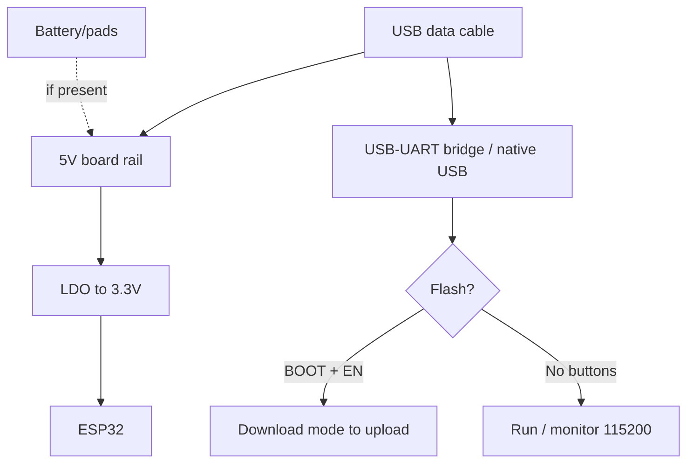

# WeMos D1 R32 - UNO form factor

> [!tip] Why this board
> The only ESP32 board in the Arduino UNO form factor: fits UNO cases and accepts some 5V shields. But "accepts" does not mean "safe": GPIO pins are still 3.3V. Board overview - [[00-Start/04-Dev-Boards.en | DevKit boards]], signal levels - [[03-GPIO/03-Pull-Ups-Levels.en | 3.3V/5V levels]].
>
> [!warning] 5V shields - caution!
> Feeding 5V power to a shield is allowed, but 5V signal lines into ESP32 GPIO are **forbidden**. Check every shield pin before powering on. Level shifting - [[13-Power-Modules/02-Level-Shifters | Level-shifters]].

## Purpose

WeMos D1 R32 (also sold as ESPDuino-32) - an ESP32-WROOM-32 board in Arduino UNO R3 dimensions: the same header pitch, 7-12V supply via DC jack / VIN, Arduino-style D0-D13 / A0-A5 labels. Purpose: migrating UNO projects to Wi-Fi/Bluetooth without rewiring, using mechanically compatible shields (buttons, LCD keypad with divider, relay shields via optocouplers), learning after Arduino.

| Parameter | Value |
| --- | --- |
| Purpose | UNO replacement with Wi-Fi/BT, mechanically compatible shields |
| Chip | ESP32-D0WDQ6 Classic (WROOM-32, 4 MB Flash) |
| Form factor | Arduino UNO R3 (68.6x53.4 mm) |

## Specifications

| Specification | Value | Note |
| --- | --- | --- |
| Module | ESP32-WROOM-32, 4 MB Flash | No PSRAM |
| USB-UART | CH340G | WCH driver mandatory |
| USB connector | Micro-USB | Plus DC jack 7-12V and VIN |
| LDO | AMS1117-3.3 (5V rail) + 5V regulator | Two stages: 7-12V to 5V to 3.3V |
| Buttons | BOOT + EN (small, on the side) | Auto-reset present |
| Analog | A0-A5 to GPIO2/4/35/34/36/39 | Only 0-3.3V, not 0-5V as on UNO! |
| Digital | D0-D13 to GPIO1/3/10/9/16/5/23/18/19/13/12/14/27/26/25 | Mapping does NOT match ATmega |
| I2C / SPI | SDA to GPIO21, SCL to GPIO22; MOSI 23/MISO 19/SCK 18 | On UNO pins D11-D13/SDA/SCL |
| Shield power | 5V and 3.3V on the header | 5V up to about 800 mA from the regulator |
| Size | 68.6x53.4 mm | Fits UNO cases |

> [!tip] Pin mapping
> The D5 silkscreen label is NOT GPIO5! Check the vendor table: for example D9 goes to GPIO13, D10 to GPIO5 (CS), A0 to GPIO2. I2C shields work at once (SDA/SCL in the standard UNO R3 spots).

## Pinout features

Main trap: Arduino D/A numbers are just labels. Real GPIO pins:

| UNO pin | ESP32 GPIO | Feature |
| --- | --- | --- |
| D0 / D1 | GPIO3 / GPIO1 | UART0, console + flashing, keep free |
| D2-D4 | GPIO26 / GPIO25(DAC) / GPIO10 | GPIO9/10 go to Flash - caution! |
| D5 / D6 | GPIO16 / GPIO27 | PWM servos here |
| D9 / D10 | GPIO13 / GPIO5 | Hardware SPI CS on D10 |
| D11-D13 | GPIO23 / GPIO19 / GPIO18 | Hardware SPI (VSPI) |
| A0 / A1 | GPIO2 / GPIO4 | GPIO2 is strapping + LED, GPIO4 is touch |
| A2-A5 | GPIO35 / GPIO34 / GPIO36 / GPIO39 | Inputs only, no pull-up! |

Pin limits: GPIO34-39 are inputs only (shield buttons with pull-up to 5V are **dangerous**!). GPIO6-11 are used by Flash (D4 on some boards is GPIO10, avoid it). Strapping pins GPIO0/2/5/12/15 are sensitive at boot - a shield must not pull them to the active level during start. Details - [[03-GPIO/02-Strapping-Pins.en | Strapping]].

## Power supply features

| Source | Where | Limits |
| --- | --- | --- |
| USB Micro 5V | Connector | 500 mA, flashing + power |
| DC jack 7-12V | Barrel connector | 5V regulator heats up above 800 mA |
| VIN | VIN pin | 7-12V (through the same regulator) |
| 5V rail | 5V header pins | Shield power, not logic input! |
| 3.3V | 3V3 pins | Up to about 500 mA for sensors |

> [!warning] Two stages of heat
> The 12V to 5V to 3.3V chain at 300 mA dissipates (12-5)x0.3 + (5-3.3)x0.3 = about 2.6 W. When powered from 12V do not load 5V shields above 300-400 mA, or feed the board from a 7.5V supply. An electrolytic cap on the 5V rail is mandatory with relays/motors.

## USB-UART features

CH340G bridge (SOP-16 with 12 MHz crystal). Driver: Windows - CH341SER.EXE from the WCH site; Linux - built-in `ch341`; macOS - needs a Privacy approval. Working flash speed 460800, with a long cable 115200. Auto-reset on DTR/RTS is wired, esptool flashes without buttons. If a shield sits on D0/D1 (UART0) - remove it while flashing, else `Failed to connect`.

## BOOT/EN buttons

Small tactile buttons labeled IO0 and EN near the USB connector. Logic is the same as on DOIT: hold IO0, click EN, then flash. After flashing click EN. Note: on some revisions the labels are swapped - check the silkscreen against the schematic.

## What it fits

- Moving UNO projects to Wi-Fi: same case, same mounting.
- Mechanically compatible shields: passive ProtoShield boards, relay shields with opto-isolation, L298P motor shields (separate power!).
- Classrooms after Arduino: students already know the form factor.
- NOT a fit: 5V-logic shields without a level shifter (5V LCD Keypad, old touch shields), precise 0-5V analog measurements (the ADC here is 0-3.3V, see [[06-Analog/01-ADC.en | ADC]]), battery projects (two LDO regulators eat current idle).

## Flashing

Arduino IDE: `WEMOS D1 R32` board (esp32 package). If missing - take `ESP32 Dev Module`. Upload Speed `460800`.

```ini
; PlatformIO (platformio.ini)
[env:wemos-d1-r32]
platform = espressif32
board = wemos_d1_r32
framework = arduino
upload_speed = 460800
monitor_speed = 115200
```

```bash
esptool.py --chip esp32 --port /dev/ttyUSB0 --baud 460800 write_flash -z 0x1000 firmware.bin
```

Blink example: the built-in LED on D13 (GPIO18 on some revisions) may be missing - check your revision; safer to blink an external LED on D5 (GPIO16) via 220 Ohm. I2C scanner: `Wire.begin(21, 22)`.

## Common issues

| Symptom | Cause | Fix |
| --- | --- | --- |
| UNO shield smokes/heats up | Shield expects 5V logic, pulls GPIO | Remove shield, check levels of every pin |
| Analog reads max at 3.3V | ADC is 0-3.3V, not 0-5V | Divider for 5V sensors, calibration |
| Shield buttons unreadable on A2-A5 | Pins are inputs-only with no pull-up | External pull-up to 3.3V (not 5V!) |
| `Failed to connect` with shield on | Shield holds GPIO0/2/12 or UART0 | Remove shield while flashing |
| Board fails to boot with shield | Shield pulls a strapping pin | Cut/rework the shield circuit |
| Overheating at 12V | Two LDO regulators dissipate watts | 7.5V supply, lower the 5V load |

## Power and flashing schematic

> [!example] Photo/schematic: ![[assets/img/devboard-wemos-d1r32.png|600]]

```text
[DC 7.5V (краще) / USB 5V] ──► стаб. 5V ──► AMS1117 ──► 3.3V (ESP32)
        │                          │
        └─► 5V-шилд (≤400 мА!)      └─► 3V3-датчики (≤400 мА)
GND спільна! UNO-шилд: ЖИВЛЕННЯ 5V можна, СИГНАЛИ 5V→GPIO — НІ!

[ПК] ─USB─► CH340G ─TX─► GPIO3 / ─RX─◄ GPIO1 (D0/D1 — зняти шилд!)
                ─DTR─► EN / ─RTS─► GPIO0 (кнопки IO0 + EN поруч з USB)
Аналог: A0–A5 = 0–3.3V MAX! 5V-сенсор тільки через дільник.
```

## Official sources

- WEMOS - vendor documentation (D1/D32 boards, schematics, drivers): <https://www.wemos.cc/en/latest/>
- WEMOS LOLIN D32 - related board specs (power, CH340, battery): <https://www.wemos.cc/en/latest/d32/d32.html>
- RIOT-OS - Wemos D1 R32 / ESPDuino-32 board (UNO-pin to GPIO mapping, live photo): <https://api.riot-os.org/group__boards__esp32__wemos__d1__r32.html>

### Mermaid: board power and first flash



## See also

- [[Home.en | Home map]]
- [[00-Start/04-Dev-Boards.en | DevKit boards]]
- [[14-Devboards/01-DOIT-DevKitV1-NodeMCU32S.en | DOIT DevKitV1]]
- [[03-GPIO/03-Pull-Ups-Levels.en | 3.3V/5V levels]]
- [[13-Power-Modules/02-Level-Shifters | Level-shifters]]
- [[06-Analog/01-ADC.en | ADC]]
- [[04-Interfaces/03-I2C.en | I2C]]
- [[04-Interfaces/02-SPI.en | SPI]]
- [[09-Firmware/02-Arduino-PlatformIO.en | Arduino/PlatformIO]]
- [[11-Vivid/03-NeoPixel-Servo-Rele-MOSFET.en | NeoPixel/Servo/Relay]]
- [[99-Additions/02-Troubleshooting-FAQ.en | FAQ]]
