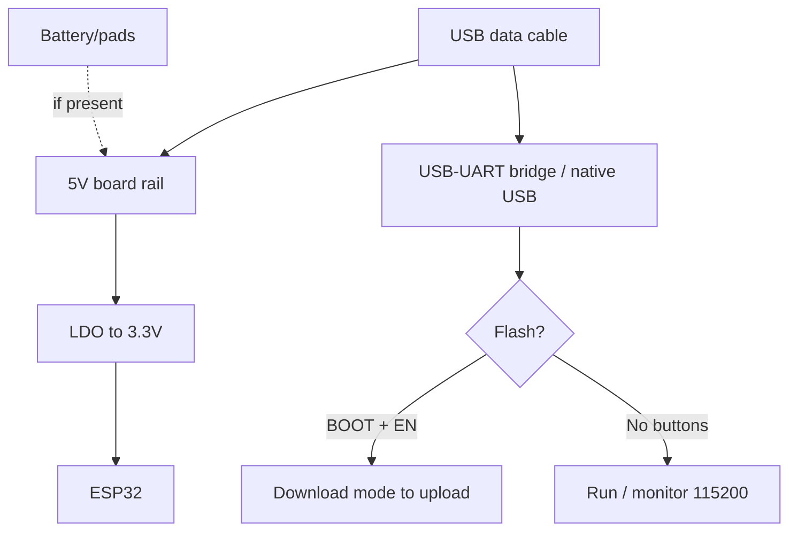

# LILYGO T-Display / T-Beam

> [!tip] When to take LILYGO
> T-Display - when you need a screen out of the box with no display soldering. T-Beam - when you need a LoRa tracker with GPS and 18650 power. Board overview - [[00-Start/04-Dev-Boards.en | DevKit boards]], displays - [[11-Vivid/02-TFT-LCD-Epaper.en | TFT/LCD]], LoRa - [[12-Comm-Modules/02-NRF24-LoRa.en | NRF24/LoRa]].
>
> [!warning] Many revisions - check yours!
> T-Display comes as Classic (ESP32) and S3; T-Beam as V0.7 / V1.1 / V1.2 (AXP2101) / S3 Supreme. Display, GPS and PMU pinout differs! Read the silkscreen of your board.

## Purpose

LILYGO (TTGO) T-Display - an ESP32 board with built-in color TFT 1.14" (ST7789, 135x240) and two buttons: a ready HMI node for menus, sensor graphs, clocks. LILYGO T-Beam - an ESP32 board + LoRa transceiver (SX1276/SX1262 by revision) + GPS (NEO-6M/NEO-M8N) + 18650 holder with charging: a ready tracker for Meshtastic, APRS, field sensors.

| Parameter | T-Display Classic | T-Beam V1.1/V1.2 |
| --- | --- | --- |
| Purpose | Screen UI, dashboards | LoRa tracker, Meshtastic node |
| Chip | ESP32 Classic (S3 version exists) | ESP32 Classic / S3 Supreme |
| Radio | Wi-Fi + BT | Wi-Fi + BT + LoRa + GPS |

## Specifications

| Specification | T-Display Classic | T-Beam V1.1 / V1.2 |
| --- | --- | --- |
| Module | ESP32-WROOM-32, 4 MB Flash | ESP32-WROOM-32, 4/8 MB Flash + 8 MB PSRAM (V1.2/Supreme) |
| Display | TFT 1.14" ST7789 135x240 (SPI) | OLED 0.96" SSD1306 (some revisions) / no screen |
| LoRa | None | SX1276 (433/868/915 MHz versions!) + IPEX antenna |
| GPS | None | NEO-M8N (V1.2) / NEO-6M (old), UART |
| Battery | LiPo JST 2.0 connector (no charging on some revisions) | 18650 holder + charging (AXP192/AXP2101 PMU) |
| USB-UART | CH9102 / CP2104 (by batch) | CP2104 + auto-reset |
| USB | USB-C (new) / Micro-USB (old) | Micro-USB (V1.x) / USB-C (Supreme) |
| Buttons | 2x (GPIO35 + GPIO0) | BOOT + RESET + PWR (PMU) |
| Size | 51x26 mm | 73x30 mm + antennas |

> [!warning] LoRa frequency is chosen at purchase!
> 433 MHz and 868/915 MHz boards are hardware-different (filters). Reflashing 433 to 868 is impossible. For Ukraine take 868 MHz. Connect the antenna MANDATORY before enabling TX, else the output burns, see [[12-Comm-Modules/02-NRF24-LoRa.en | NRF24/LoRa]].

## T-Display pinout features

The built-in ST7789 is hardwired (VSPI):

| Display signal | GPIO | Note |
| --- | --- | --- |
| TFT_MOSI | GPIO19 | Data |
| TFT_SCLK | GPIO18 | Clock |
| TFT_CS | GPIO5 | Chip Select |
| TFT_DC | GPIO16 | Data/Command |
| TFT_RST | GPIO23 | Reset |
| TFT_BL | GPIO4 | Backlight (PWM dimming!) |
| BUTTON1 | GPIO35 | Input only! |
| BUTTON2 | GPIO0 | BOOT - careful pressing at start |
| ADC Power | GPIO14 | Battery divider power |

Roughly GPIO21/22 (I2C), 25/26/27/32/33 stay free. TFT_eSPI library, T-Display config. Drive the backlight (GPIO4) via `ledcWrite` to save battery. SPI details - [[04-Interfaces/02-SPI.en | SPI]].

## T-Beam pinout features

| Node | Signals | Note |
| --- | --- | --- |
| LoRa DIO/RESET | NSS GPIO18, RST GPIO14, DIO0 GPIO26, SCK/MOSI/MISO 5/27/19 | SX1276 over SPI |
| GPS | TX to GPIO34, RX to GPIO12, 9600 baud | GPS power via separate PMU switch |
| OLED (where present) | SDA GPIO21, SCL GPIO22, 0x3C | SSD1306 |
| SD card (V1.2+) | MOSI 23/MISO 19/SCK 18/CS by revision | Check your revision schematic! |
| PMU AXP192/AXP2101 | I2C GPIO21/22, IRQ GPIO35 | Controls charging, GPS power, OLED power |
| 18650 | Holder on board | Both flat-top unprotected and protected cells fit |

> [!tip] PMU is the key to the battery
> On T-Beam V1.2 the GPS/OLED/SD power goes via AXP2101. Without PMU init in code the GPS "does not answer" though wired correctly. Use LILYGO examples with PMU setup or ready Meshtastic firmware.

## Power supply features

| Source | T-Display | T-Beam |
| --- | --- | --- |
| USB | 5V, flashing + power | 5V, 18650 charging + power |
| Battery | JST LiPo 3.7V (check polarity! Chinese JST are sometimes swapped) | 18650 in holder, charge about 500 mA |
| 5V pin | 5V rail output/input | 5V input for field power |
| 3V3 | Up to about 300 mA for sensors | Up to about 300 mA (PMU limits) |

> [!warning] JST polarity!
> On some T-Display boards the JST connector has + and - swapped vs standard LiPo packs. Before first power-on check with a multimeter: battery + must land on the pin labeled BAT+/+. Reverse polarity kills the PMU/LDO.

## USB-UART features

New-batch T-Display - CH9102 (WCH driver), old - CP2104 (SiLabs). T-Beam V1.x - CP2104. Flash speed 921600 for CP2104, 460800 for CH9102. Auto-reset on both lines. If the port does not appear - install the bridge driver and check the cable (data!).

## Buttons

T-Display: BUTTON1 (GPIO35, input only - no external pull-up needed, but pull-down does not work either!), BUTTON2 = BOOT (GPIO0). Holding BUTTON2 at start means download mode. T-Beam: RST (EN), BOOT (GPIO0), PWR (hold 2 s to power on from battery; short press in run is programmable). Without pressing PWR the board may "not start" from battery - this is normal, designed to save power.

## What it fits

- T-Display: wrist clock/thermometer with graph, relay control menu, MQTT topic monitor, badges. Matches [[10-Sensors/03-BME280-BMP280-SHT31.en | BME280]], [[10-Sensors/07-AHT10-AHT20-SHT40.en | AHT/SHT40]].
- T-Beam: Meshtastic node, skier/cyclist GPS tracker, field sensor with LoRa link, APRS beacon. Matches [[12-Comm-Modules/02-NRF24-LoRa.en | LoRa]], [[12-Comm-Modules/03-SIM800L-GPS.en | GPS]].
- NOT a fit: T-Display for LoRa (it has none); T-Beam as a first learning board (complex PMU, antennas, price).

## Flashing

Arduino IDE: T-Display - `ESP32 Dev Module`, 4MB Flash; T-Beam - `ESP32 Dev Module` or `T-Beam` (esp32 package + LILYGO libraries). Meshtastic: ready `tbeam` binaries from the Meshtastic site, flash via web-flasher or esptool.

```ini
; PlatformIO — T-Display
[env:lilygo-t-display]
platform = espressif32
board = esp32dev
framework = arduino
upload_speed = 921600
monitor_speed = 115200
lib_deps = bodmer/TFT_eSPI@^2.5.0
build_flags = -DUSER_SETUP_LOADED -DST7789_DRIVER -DTFT_WIDTH=135 -DTFT_HEIGHT=240

; PlatformIO — T-Beam (RadioLib LoRa)
[env:lilygo-t-beam]
platform = espressif32
board = esp32dev
framework = arduino
upload_speed = 921600
monitor_speed = 115200
lib_deps = jgromes/RadioLib@^6.6.0
```

```cpp
// T-Display: мінімум TFT_eSPI
#include <TFT_eSPI.h>
TFT_eSPI tft;
void setup() {
  tft.init();
  tft.setRotation(1);
  tft.fillScreen(TFT_BLACK);
  tft.drawString("Pryvit!", 20, 60, 4);
  pinMode(4, OUTPUT); // BLK
}
```

ESP-IDF: `esp32` (Classic) / `esp32s3` (Supreme) targets. MicroPython runs on T-Display, ST7789 driver is an external module.

## Common issues

| Symptom | Cause | Fix |
| --- | --- | --- |
| T-Display black screen | Wrong TFT_eSPI driver/config | T-Display User_Setup, ST7789 135x240 |
| White screen after flash | GPIO4 (BLK) not enabled | `digitalWrite(4, HIGH)` or PWM |
| BUTTON1 fails as output | GPIO35 is input-only | `digitalRead` only |
| T-Beam sees no GPS | PMU did not power GPS | Init AXP2101 / flash Meshtastic |
| LoRa does not transmit | No antenna / wrong frequency | Fit your-frequency antenna BEFORE power-on |
| Board fails to start from 18650 | PWR not pressed / cell flat | Hold PWR 2 s, charge over USB |
| JST polarity swapped | Chinese connector | Check with multimeter before power-on! |
| `Failed to connect` | Wrong USB-UART driver | CH9102 to WCH, CP2104 to SiLabs |

## Power and flashing schematic

> [!example] Photo/schematic: ![[assets/img/devboard-ttgo-tdisplay-tbeam.png|600]]

```text
T-Display: [USB-C 5V / LiPo JST 3.7V] ──► LDO ──► 3.3V ──► ESP32 + ST7789
  Перевірити полярність JST! BLK(GPIO4)=HIGH вмикає підсвітку.
  Кнопки: B1=GPIO35 (вхід), B2=GPIO0 (BOOT). I2C датчиків: 21/22.

T-Beam: [USB 5V] ──► AXP2101 ──► заряд 18650 + живлення вузлів (GPS/OLED/SD)
  PWR утримати 2с для старту від батареї. LoRa-антена 868МГц ОБОВ'ЯЗКОВА!
[ПК] ─USB─► CP2104/CH9102 ─TX/RX─► GPIO3/GPIO1, DTR/RTS авторесет.
GPS: TX→GPIO34 @9600. LoRa: NSS18/RST14/DIO26 + SPI 5/27/19.
```

## Official sources

- LILYGO - vendor official site (T-Display / T-Beam catalog, live photos): <https://lilygo.cc/>
- LILYGO TTGO-T-Display - repository (schematic, ST7789 pinout, examples): <https://github.com/Xinyuan-LilyGO/TTGO-T-Display>
- LILYGO LoRa-Series - T-Beam repository (schematics, PMU, GPS, LoRa examples): <https://github.com/Xinyuan-LilyGO/LilyGo-LoRa-Series>

### Mermaid: board power and first flash



## See also

- [[Home.en | Home map]]
- [[00-Start/04-Dev-Boards.en | DevKit boards]]
- [[11-Vivid/02-TFT-LCD-Epaper.en | TFT/LCD/E-paper]]
- [[12-Comm-Modules/02-NRF24-LoRa.en | NRF24/LoRa]]
- [[12-Comm-Modules/03-SIM800L-GPS.en | SIM800L/GPS]]
- [[04-Interfaces/02-SPI.en | SPI]]
- [[04-Interfaces/03-I2C.en | I2C]]
- [[EN/11-Vivid/01-OLED-SSD1306.en]]
- [[02-Power-Supply/04-Batteries-TP4056.en | TP4056 batteries]]
- [[09-Firmware/02-Arduino-PlatformIO.en | Arduino/PlatformIO]]
- [[99-Additions/02-Troubleshooting-FAQ.en | FAQ]]
