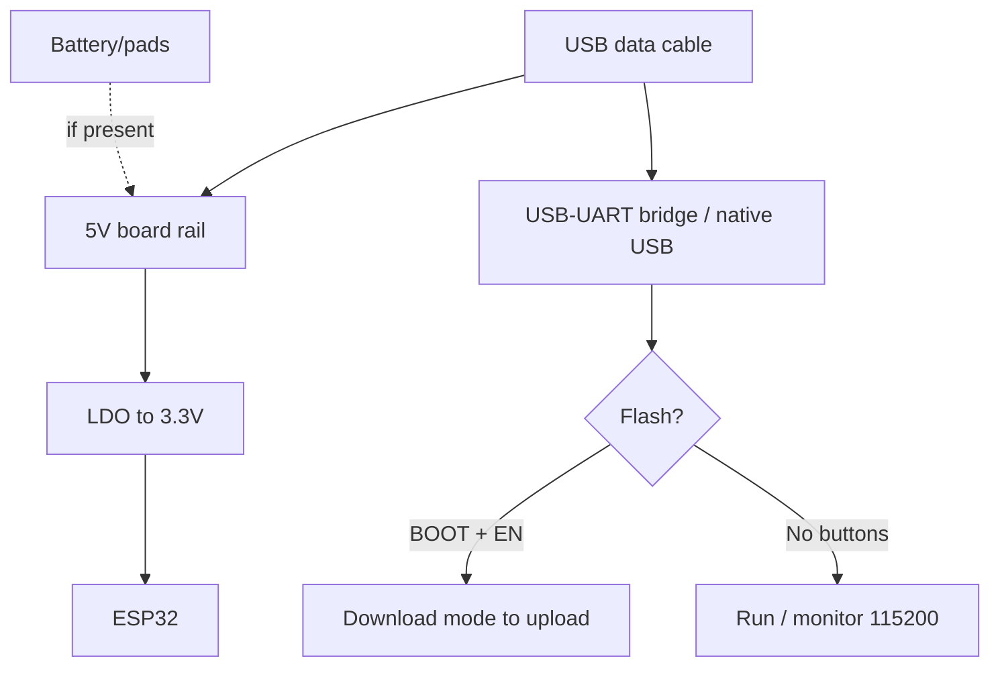

# Heltec WiFi LoRa 32

> [!tip] Why Heltec
> The most convenient board to start with LoRa: OLED for debugging "without a PC", decent docs and the Heltec ESP32 Arduino library with LoRa/LoRaWAN examples. Overview - [[00-Start/04-Dev-Boards.en | DevKit boards]], LoRa basics - [[12-Comm-Modules/02-NRF24-LoRa.en | NRF24/LoRa]], OLED - [[11-Vivid/01-OLED-SSD1306.en | OLED]].
>
> [!warning] V2 is not V3!
> V2 is ESP32 Classic + SX1276. V3 is ESP32-S3 + SX1262, different pinout and power. V2 code will not run on V3 without edits. Check the silkscreen text on the board.

## Purpose

Heltec WiFi LoRa 32 (V2: Classic, V3: S3) - a compact 51x26 mm board with built-in OLED 0.96" (SSD1306, 128x64), LoRa transceiver with IPEX antenna and LiPo battery connector with charging. Purpose: LoRa nodes with status screen, Meshtastic/MeshCore terminals, LoRaWAN sensors with display, LoRa point-to-point training rigs.

| Parameter | Value |
| --- | --- |
| Purpose | LoRa node with screen, Meshtastic, LoRaWAN |
| Chip | V2: ESP32 Classic / V3: ESP32-S3FN8 |
| Trick | OLED + LoRa + battery on one small board |

## Specifications

| Specification | V2 | V3 |
| --- | --- | --- |
| Module | ESP32-WROOM-32, 4 MB Flash | ESP32-S3FN8, 8 MB Flash (SiP), no PSRAM |
| LoRa | SX1276 (433/470/868/915 versions) | SX1262 (same bands) |
| TX power | Up to +20 dBm | Up to +21 dBm |
| Sensitivity | -139 dBm at SF12 | -134 dBm at SF12 |
| OLED | 0.96" SSD1306 128x64, I2C 0x3C | Same |
| USB-UART | CP2102 | CP2102 |
| USB | Micro-USB | USB-C |
| Battery | JST 3.7V LiPo + charging | SH1.25-2P 3.7V + charging, auto-switch USB/battery |
| Buttons | RST + PRG(BOOT) | RST + BOOT |
| Size | 51x26 mm | 50x26 mm |
| Power supply | USB 5V / LiPo 3.7V | USB-C 5V / LiPo 3.7V |

> [!warning] Frequency - at purchase!
> 433 and 868 MHz are different hardware versions. An IPEX antenna of your frequency is mandatory before the first TX. Without antenna the output stage burns in seconds.

## Pinout features

The OLED is hardwired and eats the I2C bus:

| Node | V2 (Classic) | V3 (S3) |
| --- | --- | --- |
| OLED RST | GPIO16 | GPIO21 |
| OLED SCL | GPIO15 | GPIO18 |
| OLED SDA | GPIO4 | GPIO17 |
| LoRa NSS | GPIO18 | GPIO8 |
| LoRa RST | GPIO14 | GPIO12 |
| LoRa DIO0 | GPIO26 | GPIO14 |
| LoRa SCK/MOSI/MISO | GPIO5/27/19 | GPIO9/10/11 |
| Battery ADC | GPIO13 (divider) | GPIO1/ADC (divider) |

Free GPIO on V2: 0/2/12/13/17/21/22/23/25/32/33/34-39 (with strapping/ADC limits). Free GPIO on V3: comfortable 1-7, 33-48 (S3 has many pins, but some are used by USB/JTAG). Hang I2C sensors on the same SDA/SCL as the OLED (shared bus, different addresses). Bus details - [[04-Interfaces/03-I2C.en | I2C]], [[04-Interfaces/02-SPI.en | SPI]].

## Power supply features

| Source | Parameters | Note |
| --- | --- | --- |
| USB | 5V 500 mA and more | Flashing + run + charging |
| LiPo | 3.7V, JST/SH1.25 connector | Charging about 300-500 mA, overcharge protection |
| 5V pin | 5V input | For field power without USB |
| 3V3 pin | Output about 200-300 mA | Sensors, not relays! |

> [!tip] Battery mode
> The board can run from LiPo without USB (auto-switch). But ESP32 Classic + LoRa in receive eats 30-80 mA - 1000 mAh lasts about 12-20 h of receive. Months of run need deep-sleep with LoRa and OLED off, see [[07-Timers/03-Sleep-ULP.en | Sleep]] and [[02-Power-Supply/04-Batteries-TP4056.en | Batteries]].

## USB-UART features

Both versions use CP2102: the most stable bridge, SiLabs driver (Linux/macOS out of the box, Windows - install). 921600 speed works on a short cable, for reliability take 460800. Auto-reset on DTR/RTS is wired. Port monitor at 115200.

## Buttons

RST (EN, reset) + PRG/BOOT (GPIO0, download). Manual-mode combo is standard: hold PRG, click RST, release PRG. On V3 the buttons are labeled BOOT/RESET. In the optional Heltec case shell the buttons press through holes - with a matchstick/paperclip.

## What it fits

- First LoRa project: two Heltec boards, LoRaSender/LoRaReceiver example from the library - link in 10 minutes.
- Meshtastic node with screen: V3 is an officially supported board (`heltec-v3` target).
- LoRaWAN sensor with readings display (temperature/humidity/pressure).
- Field beacon with battery: GPS from [[12-Comm-Modules/03-SIM800L-GPS.en | GPS modules]] + LoRa.
- NOT a fit: as a cheap learning board (costs more than DOIT), video/camera (no PSRAM on V3 - careful with big buffers), 5V peripherals without level shifter.

## Flashing

Arduino IDE: V2 - `Heltec WiFi LoRa 32(V2)` board; V3 - `Heltec WiFi LoRa 32(V3)` board (Heltec ESP32 package). The `Heltec ESP32 Dev-Boards` library is mandatory for OLED+LoRa examples.

```ini
; PlatformIO — Heltec V2
[env:heltec-v2]
platform = espressif32
board = heltec_wifi_lora_32_V2
framework = arduino
upload_speed = 921600
monitor_speed = 115200

; PlatformIO — Heltec V3 (S3 + SX1262)
[env:heltec-v3]
platform = espressif32
board = heltec_wifi_lora_32_V3
framework = arduino
upload_speed = 921600
monitor_speed = 115200
lib_deps = heltecautomation/Heltec ESP32 Dev-Boards@^2.1.0
```

```cpp
// Мінімум Heltec: OLED + LoRa (V2/V3 уніфіковано бібліотекою)
#include "heltec.h"
void setup() {
  Heltec.begin(true /*Display*/, true /*LoRa*/, true /*Serial*/, 915E6 /*частота!*/);
  Heltec.display->drawString(0, 0, "Heltec ready");
  Heltec.display->display();
  LoRa.beginPacket(); LoRa.print("hello"); LoRa.endPacket();
}
void loop() {}
```

Meshtastic: `heltec-v3` target, flash via flasher.meshtastic.org. ESP-IDF: V2 - `esp32` target, V3 - `esp32s3`. Environment details - [[09-Firmware/02-Arduino-PlatformIO.en | Arduino/PlatformIO]].

## Common issues

| Symptom | Cause | Fix |
| --- | --- | --- |
| V2 code fails to build on V3 | Different LoRa/OLED pins, different SX1262 chip | Take the V3 example from the Heltec library |
| LoRa silent | Wrong frequency / no antenna / wrong SF | Match board and code frequency, fit antenna |
| OLED black | `display()` never called / wrong address | `Heltec.display->display()`, address 0x3C |
| Board heats from battery | LoRa in constant TX, OLED at max | Lower TX power, blank OLED, sleep |
| Fast LiPo drain | 24/7 receive with no sleep | Deep-sleep + periodic wake |
| `Failed to connect` | Charge-only cable / CP2102 driver | Data cable, SiLabs driver |
| Battery does not charge | Unpowered USB hub | Direct PC port or 5V 1A+ charger |

## Power and flashing schematic

> [!example] Photo/schematic: ![[assets/img/devboard-heltec-lora32.png|600]]

```text
[USB-C/Micro 5V] ──► зарядка ──► LiPo 3.7V (JST/SH1.25) ─┐
        │                                               ├─► 3.3V ──► ESP32 + OLED + LoRa
        └──────────────► 5V пін (польове живлення) ──────┘
GND спільна! OLED на I2C (адр. 0x3C), LoRa-антена IPEX ОБОВ'ЯЗКОВА до TX!

[ПК] ─USB─► CP2102 ─TX─► RX / ─RX─◄ TX, DTR→EN, RTS→GPIO0 (авторесет)
Кнопки: PRG/BOOT(GPIO0) + RST(EN). Монітор 115200.
LoRa SPI: NSS/RST/DIO0 + SCK/MOSI/MISO (див. таблицю версії!).
```

## Official sources

- Heltec - WiFi LoRa 32 V3 page (specs, photos, frequency options): <https://heltec.org/project/wifi-lora-32-v3/>
- Heltec Docs - WiFi LoRa 32 (docs, schematics, LoRaWAN examples): <https://docs.heltec.org/en/node/esp32/wifi_lora_32/index.html>

### Mermaid: board power and first flash



## See also

- [[Home.en | Home map]]
- [[00-Start/04-Dev-Boards.en | DevKit boards]]
- [[12-Comm-Modules/02-NRF24-LoRa.en | NRF24/LoRa]]
- [[EN/11-Vivid/01-OLED-SSD1306.en]]
- [[04-Interfaces/03-I2C.en | I2C]]
- [[04-Interfaces/02-SPI.en | SPI]]
- [[02-Power-Supply/04-Batteries-TP4056.en | TP4056 batteries]]
- [[07-Timers/03-Sleep-ULP.en | Sleep/ULP]]
- [[09-Firmware/02-Arduino-PlatformIO.en | Arduino/PlatformIO]]
- [[05-Radio/01-WiFi-STA-AP.en | WiFi]]
- [[99-Additions/02-Troubleshooting-FAQ.en | FAQ]]
