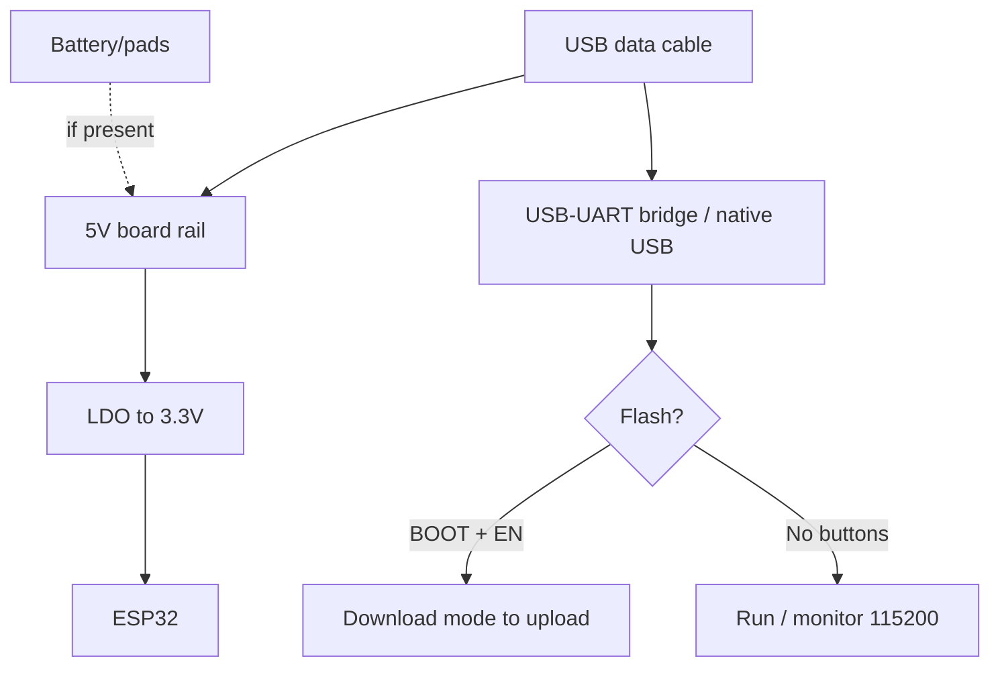

# ESP32-CAM - camera without USB

> [!tip] Why ESP32-CAM
> The cheapest Wi-Fi camera ($6-9): video doorbell, timelapse, face recognition, ESP-WHO. But expect some struggle: no USB, a separate FTDI is needed. Overview - [[00-Start/04-Dev-Boards.en | DevKit boards]], cameras - [[12-Comm-Modules/04-RS485-CAN-Ethernet-Kamera.en | RS485/CAN/Cam]].
>
> [!warning] No flash without FTDI!
> The board has no USB-UART. You need a 3.3V FTDI programmer (FT232RL/CP2102 module) + a GPIO0 to GND jumper while flashing. A 5V FTDI kills the board!

## Purpose

ESP32-CAM (AI-Thinker) - an ESP32-S board (240 MHz, 520 KB SRAM + 4 MB PSRAM) with OV2640 camera (2 MP), microSD slot, bright flash LED (GPIO4) and routed GPIO pins. Purpose: IP camera, PIR photo traps, baby monitor, QR/face recognition, timelapse to SD. 5V supply, up to 250-300 mA draw with camera.

| Parameter | Value |
| --- | --- |
| Purpose | Wi-Fi camera, photo traps, video surveillance |
| Chip | ESP32-S, 240 MHz + 4 MB PSRAM (mandatory for camera!) |
| Camera | OV2640 2 MP (UXGA 1600x1200), replaceable M12 lens |

## Specifications

| Specification | Value | Note |
| --- | --- | --- |
| Module | ESP32-S, 4 MB Flash + 4 MB PSRAM | Without PSRAM the camera fails above QVGA |
| Camera | OV2640, SCCB (I2C-like) + DVP parallel bus | Focus turns by hand! |
| Resolution | UXGA 1600x1200 max, working SVGA/VGA/QVGA | UXGA only with PSRAM + good power |
| microSD | Slot, 1/4-bit SDMMC | Photo/video storage, see [[04-Interfaces/07-SD-SDIO.en | SD]] |
| Flash LED | White LED on GPIO4 | Bright, blinding - do not stare! |
| Red LED | GPIO33 (inverted logic) | Status |
| USB | None! | FTDI 3.3V only |
| Power supply | 5V pin (recommended) / 3.3V pin | Up to 300 mA draw with camera + flash |
| Buttons | RST (EN) | No BOOT - GPIO0 to GND jumper instead! |
| Free GPIO | GPIO1/3 (UART), 12/13/14/15/16, 2, 4 | Most are used by camera/SD |

> [!tip] Focus
> From the factory the lens is often out of focus (soft image). Gently turn the lens clockwise/counter-clockwise while watching the stream. Do not press the sensor!

## Pinout features

The camera eats almost everything. Map of used pins:

| Pin | Role | Free? |
| --- | --- | --- |
| GPIO0 | Camera XCLK + BOOT (flashing!) | No - jumper while flashing |
| GPIO5/18/19/21/36/39/34/35 | Camera D0-D7 (DVP) | No |
| GPIO22/23/25 | Camera PCLK/HREF/VSYNC | No |
| GPIO26/27 | SCCB (camera SDA/SCL) | No |
| GPIO32 | Camera PWDN | No |
| GPIO14/15/2/12/13 | SD card (CLK/CMD/DATA) | Yes, if no SD needed |
| GPIO4 | Flash + SD DATA1 | Partly (conflicts with flash) |
| GPIO16 | PSRAM CS (!) | Never touch! |
| GPIO1/3 | UART TX/RX (flashing, monitor) | Yes, after flashing |
| GPIO33 | Red LED | Yes (inverted) |

Practical result: without SD the free pins are GPIO12/13/14/15/2 (plus 1/3 after flashing). With SD - only GPIO1/3, and 16 is forbidden... so almost nothing. Hang sensors (PIR, BME280) on GPIO13/14/15 with pull-ups. Never touch the camera I2C (26/27).

## Power supply features

| Source | Where | Limits |
| --- | --- | --- |
| 5V 2A supply | 5V pin + GND | RECOMMENDED. Camera + Wi-Fi is 250-300 mA peaks |
| FTDI 5V | 5V pin | Only if the FTDI gives honest 500 mA |
| 3.3V | 3V3 pin | Only stable 3.3V 1A+, LDO bypass |
| On-board AMS1117 | 5V to 3.3V | Weak, heats up; 470 uF electrolytic helps |

> [!warning] Power causes 80% of problems
> Brown screen, reboots at stream start, `Camera probe failed` - almost always weak power. Take a 5V 2A supply, thick short wires, a 470-1000 uF cap between 5V and GND near the board. It will not fly from a laptop USB port over a thin cable.

## USB-UART (FTDI) features

No USB bridge - an external 3.3V FTDI is needed:

| Element | Connection | Note |
| --- | --- | --- |
| FTDI VCC | Board 5V pin (if FTDI powers) or separate PSU | Jumper 3.3V/5V on FTDI to 5V? No: 3.3V logic! |
| FTDI GND | Board GND | Common mandatory |
| FTDI TX | Board U0R (GPIO3) | Crossed! |
| FTDI RX | Board U0T (GPIO1) | Crossed! |
| GPIO0 | Jumper to GND | Only while flashing! |
| RST | Button on board | Press after connecting GPIO0 |

Flash sequence: 1) connect GPIO0 to GND; 2) press RST; 3) flash in Arduino; 4) remove jumper; 5) press RST to run. Alternative - ESP32-CAM-MB extender board (micro-USB + buttons + auto-reset): insert CAM and flash like a normal board.

## Buttons

Only RST (EN). There is no BOOT/FLASH button - a GPIO0 to GND jumper plays its role. ESP32-CAM-MB has RST + IO0 buttons, which makes life easier. Red LED (GPIO33) and flash (GPIO4) are code-driven.

## What it fits

- IP camera from the CameraWebServer example (stream + browser flash control).
- Photo trap: PIR on GPIO13 to photo to SD to deep-sleep.
- Construction/plant timelapse: photo every N minutes to SD.
- QR/recognition: ESP-WHO examples (needs good light).
- Doorbell with photo to Telegram.
- NOT a fit: as a first board (FTDI struggle), battery projects (250 mA active, deep-sleep about 6 mA - battery dies fast), precise analog measurements (almost no free ADC), 24/7 video with no cooling (heats up).

## Flashing

Arduino IDE: `AI Thinker ESP32-CAM` board, Partition `Huge APP (3MB No OTA)`, PSRAM `Enabled`. Example: File to Examples to ESP32 to Camera to CameraWebServer (SSID/password + `CAMERA_MODEL_AI_THINKER` model).

```ini
; PlatformIO (platformio.ini)
[env:esp32cam]
platform = espressif32
board = esp32cam
framework = arduino
upload_speed = 460800
monitor_speed = 115200
board_build.partitions = huge_app.csv
build_flags = -DBOARD_HAS_PSRAM -mfix-esp32-psram-cache-issue
```

```cpp
// Перевірка PSRAM — обов'язково перед камерою
#include "esp_camera.h"
void setup() {
  Serial.begin(115200);
  Serial.printf("PSRAM: %d bytes\n", ESP.getPsramSize());
  // Камера без PSRAM вище QVGA не піде!
}
```

ESP-IDF: `esp-idf/examples/peripherals/camera` example. MicroPython with camera is limited, Arduino/IDF is better.

## Common issues

| Symptom | Cause | Fix |
| --- | --- | --- |
| `Camera probe failed` | Weak power / wrong pin mapping | 5V 2A supply + 470 uF, AI_THINKER model |
| Brown screen in stream | Sag at Wi-Fi TX | Power + cap, SVGA instead of UXGA |
| Reboots at start | Brownout | Same + short thick USB/wires |
| `Failed to connect` | No GPIO0 to GND / TX/RX swapped | Jumper + TX/RX cross + RST |
| Blurry image | Out-of-focus lens | Turn the lens by hand |
| Flash glows dim constantly | GPIO4 conflicts with SD DATA1 | Init SD in 1-bit mode or no SD |
| No free pins | All used by camera/SD | Use GPIO13/14/15 or a second board for sensors |
| Overheating | Long UXGA stream | SVGA, heatsink on module shield, pauses |

## Power and flashing schematic

> [!example] Photo/schematic: ![[assets/img/devboard-esp32cam.png|600]]

```text
[БЖ 5V 2A] ──► пін 5V + GND плати (+ 470–1000 мкФ між 5V і GND!)
  НЕ живити від тонкого USB ноутбука! Піки 300 мА (камера + Wi-Fi + спалах).

[FTDI 3.3V] ─TX─► U0R(GPIO3) / ─RX─◄ U0T(GPIO1) / GND──►GND
  GPIO0 ──[перемичка]──► GND (ТІЛЬКИ на час firmwares!)
  1) перемичка → 2) RST → 3) шити 460800 → 4) зняти перемичку → 5) RST.
ESP32-CAM-MB: вставити плату — шити як звичайну (авторесет є).
Вільні піни: 13/14/15/2 (без SD), 1/3 (після firmwares). GPIO16 НЕ ЧІПАТИ!
```

## Official sources

- Random Nerd Tutorials - ESP32-CAM AI-Thinker Pinout (pinout, GPIO, camera, live photos): <https://randomnerdtutorials.com/esp32-cam-ai-thinker-pinout/>
- CircuitPython - Ai Thinker ESP32-CAM (board specs, PSRAM, power): <https://circuitpython.org/board/ai-thinker-esp32-cam/>

### Mermaid: board power and first flash



## See also

- [[Home.en | Home map]]
- [[00-Start/04-Dev-Boards.en | DevKit boards]]
- [[12-Comm-Modules/04-RS485-CAN-Ethernet-Kamera.en | RS485/CAN/Camera]]
- [[04-Interfaces/07-SD-SDIO.en | SD/SDIO]]
- [[04-Interfaces/01-UART.en | UART]]
- [[13-Power-Modules/05-USB-UART-AutoReset | USB-UART]]
- [[02-Power-Supply/01-Power-Rails.en | Power rails]]
- [[09-Firmware/02-Arduino-PlatformIO.en | Arduino/PlatformIO]]
- [[09-Firmware/04-Esptool-Flash.en | Esptool]]
- [[07-Timers/03-Sleep-ULP.en | Sleep/ULP]]
- [[99-Additions/02-Troubleshooting-FAQ.en | FAQ]]
