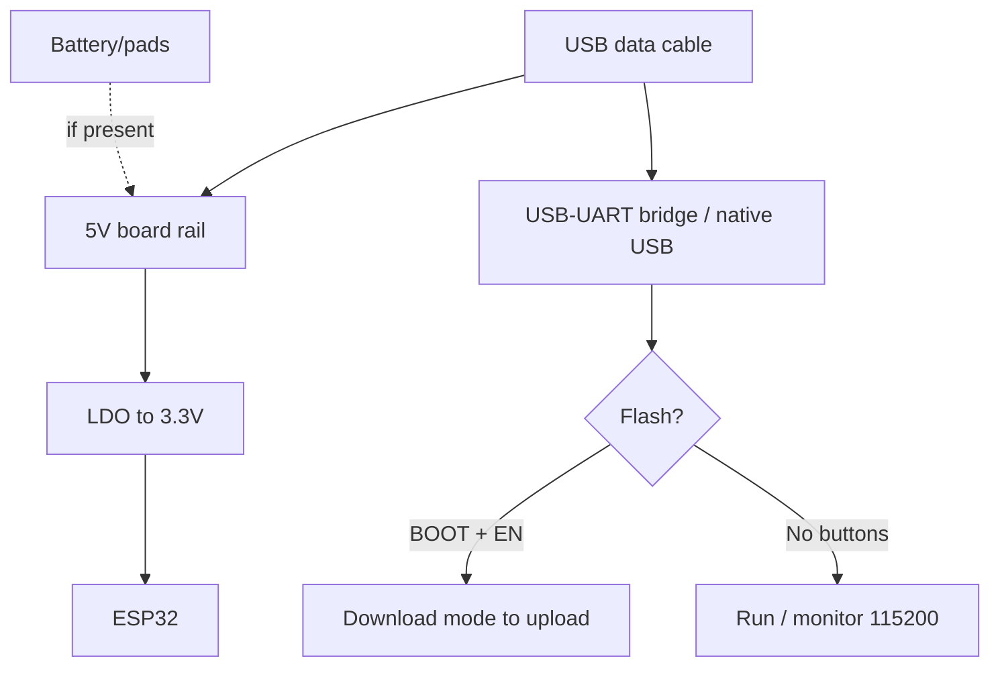

# M5Stack Core / Stick

> [!tip] Why M5Stack
> A ready product "out of the box": display + battery + case + Stack/Unit module ecosystem. A prototype looks like a product, not a breadboard with wires. Higher price, but huge time savings. Overview - [[00-Start/04-Dev-Boards.en | DevKit boards]], displays - [[11-Vivid/02-TFT-LCD-Epaper.en | TFT/LCD]].
>
> [!warning] Ecosystem partly closed
> M-Bus/Grove pinout is custom, M5Unified/M5Stack libraries are custom. Standard Arduino examples need pin adaptation. But UIFlow allows block programming with no code.

## Purpose

M5Stack Basic/Core2 - stackable 54x54 mm controllers: ESP32 + 2.0" IPS display (320x240) + battery + microSD slot + speaker + 3 buttons + Grove ports. Modules stack as a "sandwich" via M-Bus. M5StickC Plus - a miniature 48x24 mm stick: ESP32-PICO + 1.14" TFT (135x240) + 120 mAh battery + IMU + microphone + LED. Purpose: fast IoT product prototypes, learning (STEM), wearables, remotes, dashboards.

| Parameter | M5Stack Basic/Core2 | M5StickC Plus |
| --- | --- | --- |
| Purpose | Desktop controller, sensor hub | Wearable node, mini remote |
| Chip | ESP32-D0WDQ6 (Basic) / ESP32-D0WD (Core2) | ESP32-PICO-D4 |
| Display | 2.0" 320x240 IPS | 1.14" 135x240 TFT (ST7789v2) |

## Specifications

| Specification | M5Stack Basic | M5Stack Core2 | M5StickC Plus |
| --- | --- | --- | --- |
| Chip/module | ESP32-D0WDQ6, 16 MB Flash | ESP32-D0WD, 16 MB Flash + 8 MB PSRAM | ESP32-PICO-D4, 4 MB Flash |
| Display | 2.0" ILI9342C 320x240 | 2.0" ILI9342C 320x240 + FT6336 touch | 1.14" ST7789v2 135x240 |
| Battery | 110 mAh, IP5306 | 390 mAh, AXP192 | 120 mAh, AXP192 |
| Sound | 1 W speaker (DAC) | Speaker (I2S) + microphone | Buzzer + SPM1423 microphone |
| Buttons | 3x programmable + Power | 3x touch + Power + Reset | 2x (A/B) + Power/Reset |
| Ports | Grove A/B/C + M-Bus 30p | Grove A/B/C + M-Bus | Grove (I2C+IO+UART) + HAT |
| SD | microSD up to 16 GB | microSD | None |
| USB | USB-C (CP2104/CH9102) | USB-C | USB-C |
| IMU | None (as module) | MPU6886 (6-axis) | MPU6886 |
| RTC | None (as module) | BM8563 | BM8563 |
| Size | 54x54x17 mm | 54x54x16 mm | 48x24x14 mm |

> [!tip] Power via M-Bus
> The bottom cover (Base) holds the battery and the M-Bus connector: all stack modules get 5V/3.3V/GND + I2C/SPI/UART through it. Connect external sensors via Grove cables (no soldering!), see [[04-Interfaces/03-I2C.en | I2C]].

## Pinout features

M-Bus (30 pins) routes almost everything, but some is used:

| Signal | Basic/Core2 | Note |
| --- | --- | --- |
| LCD MOSI/MISO/CLK | GPIO23/19/18 | Used by display |
| LCD CS/DC/RST/BL | GPIO14/27/33/32 | Used, BL is PWM |
| SD MOSI/MISO/CLK/CS | GPIO23/19/18/4 | Shared SPI with LCD |
| Buttons A/B/C | GPIO39/38/37 | Inputs only! |
| Speaker | GPIO25 (DAC, Basic) / I2S (Core2) | Used |
| Grove A (I2C) | GPIO21/22 | Free bus for sensors! |
| Grove B | GPIO26/36 | ADC/DAC |
| Grove C (UART) | GPIO16/17 | UART2 |
| Free M-Bus | GPIO2/5/12/13/15/0/1/3 | With strapping limits |

M5StickC Plus: Grove port G32/G33 + pins G0/G25/G26/G36 (G36/G25 share the port - one at a time!). HAT connector adds more pins. Internal: TFT (15/13/23/18/5), IMU+PMU (21/22 I2C), microphone (0/34), LED/IR (10/9), RTC (21/22). Strapping details - [[03-GPIO/02-Strapping-Pins.en | Strapping]].

## Power supply features

| Source | Parameters | Note |
| --- | --- | --- |
| USB-C 5V | 500 mA, charging + run | C2C cables fail on old Basic! |
| Battery | Basic 110 / Core2 390 / Stick 120 mAh | Lasts 1-4 h of active screen |
| Grove 5V | Output for Unit modules | PMU limit (about 500 mA total) |
| Deep-sleep | AXP192/IP5306 cut node power | Stick sleeps weeks on RTC timer |

> [!warning] USB-C to USB-C on old Basic
> Revisions before 2018.2A have no CC resistors - they do not power from C2C cables and PD chargers. Use an A to C cable. Core2/StickC Plus have no such problem.

## USB-UART features

Basic: CP2104 (old) / CH9102 (new). Core2: CP2104. StickC Plus: FTDI (built-in). M5 upload speed is specific: 1500000 / 750000 / 500000 / 250000 / 115200 (other speeds glitch!). Auto-reset present. Drivers: CP210x - SiLabs, CH9102 - WCH, FTDI - FTDIChip. Details - [[13-Power-Modules/05-USB-UART-AutoReset | USB-UART]].

## Buttons

Basic: A/B/C (GPIO39/38/37) + red Power (on - click, off - double-click; with USB connected it will not switch off!). Core2: touch A/B/C + Power + Reset. StickC Plus: A (GPIO37) / B (GPIO39) + Power (click - on/reset, hold - off). In UIFlow the buttons map to ready blocks.

## What it fits

- Evening product prototype: Core + ENV Unit (temperature) + Relay Unit = thermostat with screen, no soldering.
- STEM learning: UIFlow blocks, kids build programs with a mouse.
- Wearable badge/remote: StickC Plus with IMU (gestures) + IR (TV control).
- MQTT/Home Assistant dashboard: Core2 with touch as a desktop panel.
- NOT a fit: minimal price (DOIT is 5 times cheaper), deep hardware (some pins hidden), battery months with screen (screen eats tens of mA).

## Flashing: UIFlow vs Arduino

UIFlow (blocks/MicroPython): connect over USB to M5Burner to flash UIFlow firmware to write blocks in the browser. Ideal to start and for STEM. Arduino: `M5Stack` package (`M5Stack-Core-ESP32` / `M5Stick-C` board), `M5Unified` library (new, universal) or `M5Stack`/`M5StickCPlus` (old).

```ini
; PlatformIO — M5Stack Core
[env:m5stack-core]
platform = espressif32@6.7.0
board = m5stack-core-esp32
framework = arduino
upload_speed = 1500000
monitor_speed = 115200
lib_deps = m5stack/M5Unified@^1.1.0

; PlatformIO — M5StickC Plus
[env:m5stickc-plus]
platform = espressif32@6.7.0
board = m5stick-c
framework = arduino
upload_speed = 1500000
monitor_speed = 115200
lib_deps = m5stack/M5Unified@^1.1.0
```

```cpp
// Arduino + M5Unified (працює на Core і Stick)
#include <M5Unified.h>
void setup() {
  M5.begin();
  M5.Display.fillScreen(BLACK);
  M5.Display.drawString("Pryvit M5!", 20, 60);
}
void loop() {
  M5.update(); // кнопки!
  if (M5.BtnA.wasPressed()) M5.Display.fillScreen(RED);
  delay(50);
}
```

ESP-IDF: supported via M5Unified. MicroPython: UIFlow is MicroPython with a wrapper.

## Common issues

| Symptom | Cause | Fix |
| --- | --- | --- |
| Fails to flash at 921600 | M5 wants its own speeds | 1500000 or 750000 or 115200 |
| No power from C2C | Old Basic with no CC resistors | USB-A to USB-C cable |
| Will not switch off by button | USB connected (by design) | Unplug USB, then double-click Power |
| G36 reads nothing when G25 is output | Shared port (StickC) | Second pin to floating input |
| White screen/inverted colors | Old library (TN to IPS change) | Update M5Stack lib 0.2.8+ / M5Unified |
| Grove sensor invisible | Wrong port (A/B/C are different buses) | I2C sensor only into port A (21/22) |
| Fast drain | Screen + Wi-Fi always on | Dim backlight, sleep, bigger Base battery |

## Power and flashing schematic

> [!example] Photo/schematic: ![[assets/img/devboard-m5stack.png|600]]

```text
[USB-C 5V] ──► PMU (IP5306/AXP192) ──► заряд батареї + 5V/3.3V шини
  Батарея: Basic 110 / Core2 390 / Stick 120 мА·г. Від USB не вимикається!
  M-Bus/Grove: 5V+GND+I2C(21/22)+SPI+UART — модулі без паяння.

[ПК] ─USB-C─► CP2104/CH9102/FTDI ─► UART0, авторесет є.
  Швидкість ТІЛЬКИ: 1500000/750000/500000/250000/115200!
Кнопки: A/B/C + Power (дабл-клік = викл, без USB). Дисплей: BLK-PWM.
UIFlow: M5Burner → блоки в браузері. Arduino: M5Unified + M5.begin().
```

## Official sources

- M5Stack - vendor official site (Core/Stick catalog, live photos): <https://m5stack.com/>
- M5Stack Docs - M5Stack Basic (schematic, M-Bus, Grove, power): <https://docs.m5stack.com/en/core/basic>
- M5Stack Docs - M5StickC Plus (pinout, AXP192, examples): <https://docs.m5stack.com/en/core/m5stickc_plus>

### Mermaid: board power and first flash



- MPU6886 (TDK InvenSense): <https://invensense.tdk.com/products/motion-tracking/6-axis/mpu-6886/> - 6-axis IMU (custom for M5Stack).
- BM8563 Datasheet (NXP, PDF search): [BM8563 search](https://www.alldatasheet.com/view.jsp?Searchword=BM8563) - alarm RTC, I2C.

## See also

- [[Home.en | Home map]]
- [[00-Start/04-Dev-Boards.en | DevKit boards]]
- [[11-Vivid/02-TFT-LCD-Epaper.en | TFT/LCD/E-paper]]
- [[04-Interfaces/03-I2C.en | I2C]]
- [[04-Interfaces/02-SPI.en | SPI]]
- [[10-Sensors/03-BME280-BMP280-SHT31.en | BME280]]
- [[02-Power-Supply/04-Batteries-TP4056.en | TP4056 batteries]]
- [[07-Timers/03-Sleep-ULP.en | Sleep/ULP]]
- [[09-Firmware/02-Arduino-PlatformIO.en | Arduino/PlatformIO]]
- [[09-Firmware/03-MicroPython.en | MicroPython]]
- [[99-Additions/02-Troubleshooting-FAQ.en | FAQ]]
