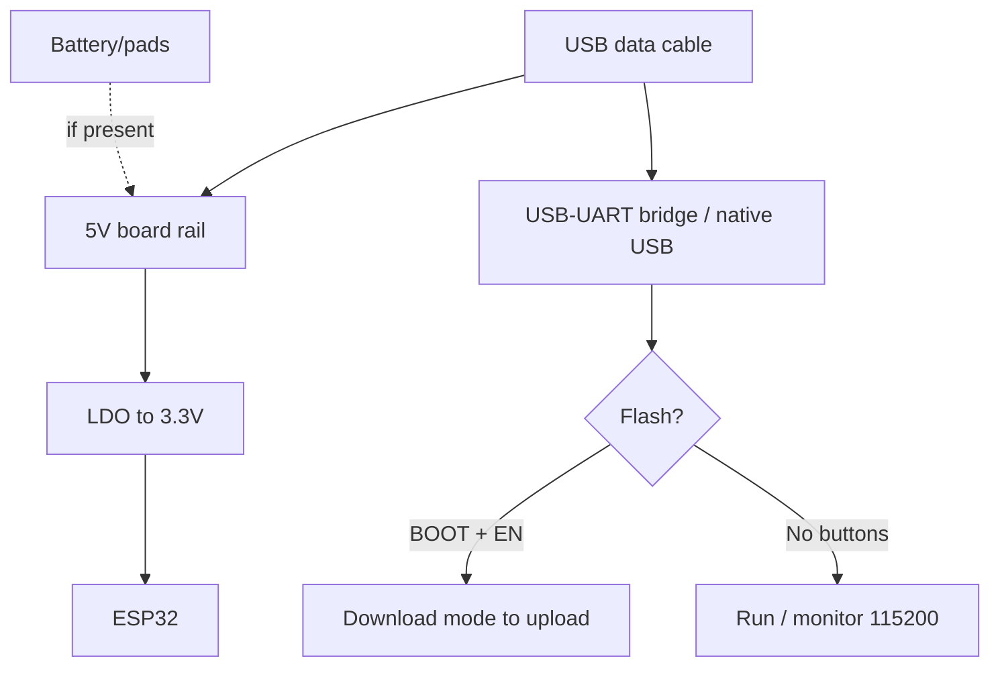

# Feather HUZZAH32 / Thing

> [!tip] Why American boards
> Feather HUZZAH32 and SparkFun Thing are "gentleman" boards: built-in LiPo charging, stable LDO regulators, textbook-grade docs, FeatherWings / Qwiic ecosystems with no soldering. Cost more than DOIT but save nerves on power. Overview - [[00-Start/04-Dev-Boards.en | DevKit boards]], batteries - [[02-Power-Supply/04-Batteries-TP4056.en | Batteries]].
>
> [!warning] 3.3V here too!
> Both boards are 3.3V logic. The LiPo connector is power, not "feed 5V". Levels - [[03-GPIO/03-Pull-Ups-Levels.en | 3.3V/5V levels]].

## Purpose

Adafruit Feather HUZZAH32 - an ESP32-WROOM-32 board in Feather form factor (51x23 mm): USB-UART with auto-reset, LiPo charging (MCP73831), Reset button, room for FeatherWings (displays, GPS, relays - over 50 wings). SparkFun ESP32 Thing - same philosophy (58x25 mm): FTDI FT231X, 500 mA LiPo charging, button, JST connector, Qwiic connector (on Thing Plus) for solderless sensors. Purpose: battery prototypes, learning from English guides, builds with wings/cables.

| Parameter | Feather HUZZAH32 | SparkFun Thing / Thing Plus |
| --- | --- | --- |
| Purpose | Feather ecosystem, LiPo prototypes | Qwiic sensors, learning guides |
| Chip | ESP32 Classic (WROOM-32, 4 MB) | Thing: ESP32 Classic; Plus: WROOM / S3 |
| Trick | 50+ FeatherWings | Qwiic/STEMMA I2C cables |

## Specifications

| Specification | Feather HUZZAH32 | SparkFun ESP32 Thing |
| --- | --- | --- |
| Module | WROOM-32, 4 MB Flash | WROOM-32, 4 MB Flash |
| USB-UART | CP2104 + auto-reset | FTDI FT231X + auto-reset (DTR) |
| USB | Micro-USB | Micro-USB (Thing) / USB-C (Plus) |
| LiPo charging | MCP73831, 200 mA default (up to 500 mA by rework) | MCP73831, up to 500 mA |
| Battery connector | JST-PH 2.0 | JST-PH 2.0 |
| 3.3V LDO | AP2112, 600 mA | AP2112, 600 mA |
| Buttons | Reset (EN); no BOOT - via auto-reset | Reset + "0" (GPIO0/BOOT) |
| LED | Red charging + blue GPIO13/USB | Power LED + GPIO5 (blink) |
| Ecosystem | FeatherWings (stackable wings) | Qwiic (I2C cables) / XBee socket (old) |
| Size | 51x23 mm | 58x25 mm |

> [!tip] AP2112 vs AMS1117
> AP2112 has about 0.4V dropout (vs 1.1V on AMS1117) and a quiet output - a 3.7V LiPo feeds the board down to about 3.5V with no sag, and the ADC is less noisy. 600 mA covers ESP32 + Qwiic sensors, but not relays - they need a separate switch, see [[11-Vivid/03-NeoPixel-Servo-Rele-MOSFET.en | NeoPixel/Servo/Relay]].

## Pinout features

Feather numbering is NOT GPIO! On the Feather silkscreen: A0-A5, SCK/MOSI/MISO, SDA/SCL, RX/TX:

| Feather pin | GPIO (HUZZAH32) | Note |
| --- | --- | --- |
| A0 | GPIO26 (DAC2/ADC2) | Analog, ADC2 Wi-Fi conflict! |
| A1-A5 | GPIO25/34/39/36/4 | A2-A4 inputs only |
| SCK/MOSI/MISO | GPIO5/19/18 | Default SPI |
| SDA/SCL | GPIO23/22 | Default I2C (Wire-compatible) |
| RX/TX | GPIO3/1 | UART0 console |
| 13 (blue LED) | GPIO13 | Adafruit Blink example |

SparkFun Thing: almost all GPIO routed with number labels (0/2/4/5/12-19/21-23/25-27/32-36/39), LED on GPIO5, "0" button on GPIO0. Input-only 34-39 with no pull-up - buttons only with an external resistor to 3.3V. Multiplexing details - [[03-GPIO/01-GPIO-Overview.en | GPIO overview]].

## Power supply features

| Source | Parameters | Note |
| --- | --- | --- |
| USB 5V | Power + LiPo charging at once | USB priority, battery is backup |
| LiPo 3.7V | JST-PH, 400-2500 mAh | 1S only! Check JST polarity (Adafruit/SparkFun standard: + on the left) |
| Charge current | Feather 200 mA / Thing 500 mA | Feather charges slowly but safely for small 400 mAh cells |
| 3V3 output | Up to about 400 mA for peripherals | 600 mA minus about 200 mA for the board itself |
| VBAT/VUSB pins | Monitoring/alternate input | VBAT is battery voltage via divider (see schematic) |

> [!warning] JST-PH polarity
> Adafruit/SparkFun standard: red (+) on the left when looking at the connector from above with the latch up. Chinese batteries are sometimes reversed! Check with a multimeter before power-on. Reversed polarity burns the charger.

## USB-UART features

Feather HUZZAH32 - CP2104 (SiLabs, stable, 921600 baud). Thing - FTDI FT231X (FTDI drivers, also stable). Both with auto-reset: flashing with one Upload button. On Thing the "0" (BOOT) button is rarely needed - only if auto-reset fails. Monitor at 115200. Bridge details - [[13-Power-Modules/05-USB-UART-AutoReset | USB-UART]].

## Buttons

Feather: one Reset (EN). No manual download mode button - auto-reset only; worst case a GPIO0 to GND jumper + Reset. Thing: Reset + "0" button (GPIO0 to GND) - full manual download: hold "0", click Reset, release "0".

## What it fits

- Battery prototype out of the box: insert LiPo - it runs; insert USB - it charges. Trackers, door sensors, badges.
- Learning from Adafruit Learn / SparkFun Hookup Guide: step-by-step guides with photos.
- Solderless Qwiic/STEMMA sensors: [[10-Sensors/03-BME280-BMP280-SHT31.en | BME280]], [[10-Sensors/10-VL53L0X-TCS34725-TSL2561.en | ToF]], OLED - over one cable.
- FeatherWings: GPS-Wing + OLED-Wing + HUZZAH32 = tracker sandwich.
- NOT a fit: lowest price (Chinese clones are many times cheaper), PSRAM/camera (none), 5V peripherals without shifter.

## Flashing: Qwiic/STEMMA

Arduino IDE: Feather - `adafruit/esp32` package, `Adafruit ESP32 Feather` board; Thing - esp32 package, `SparkFun ESP32 Thing` board. Adafruit examples (A0 analog, Wire) work at once.

```ini
; PlatformIO — Feather HUZZAH32
[env:featheresp32]
platform = espressif32
board = featheresp32
framework = arduino
upload_speed = 921600
monitor_speed = 115200

; PlatformIO — SparkFun Thing
[env:esp32thing]
platform = espressif32
board = esp32thing
framework = arduino
upload_speed = 921600
monitor_speed = 115200
```

```cpp
// Qwiic/STEMMA I2C — той самий Wire, без паяння
#include <Wire.h>
void setup() {
  Serial.begin(115200);
  Wire.begin(); // SDA/SCL за замовчуванням плати
  byte err, addr = 0x76;
  Wire.beginTransmission(addr);
  err = Wire.endTransmission();
  Serial.println(err == 0 ? "BME280 found" : "not found");
}
void loop() {}
```

ESP-IDF: `esp32` targets. CircuitPython on Feather HUZZAH32 is supported by Adafruit (UF2 bootloader on select revisions).

## Common issues

| Symptom | Cause | Fix |
| --- | --- | --- |
| Battery does not charge | Unpowered USB hub / swapped JST polarity | Direct port, check + and - |
| Feather charges long | 200 mA default | Normal for 400 mAh; for big cells rework Rprog (see schematic) |
| Analog noisy with Wi-Fi | ADC2 + Wi-Fi conflict | Measure on ADC1 (A2-A5 inputs) |
| Button on 34-39 "floats" | No internal pull-ups | External 10k to 3.3V |
| Qwiic sensor invisible | Long cable / two same addresses | Shorter cable, change address by jumper |
| `Failed to connect` | Charge-only cable | Data cable + CP2104/FTDI driver |
| 5V sensor burned an input | 5V on GPIO | Only via [[13-Power-Modules/02-Level-Shifters | level-shifter]] |

## Power and flashing schematic

> [!example] Photo/schematic: ![[assets/img/devboard-feather-huzzah32.png|600]]

```text
[USB 5V] ─┬─► 5V шина ──► AP2112 ──► 3.3V (плата + Wings/Qwiic ≤400 мА)
          └─► MCP73831 ──► LiPo 3.7V (JST-PH, полярність перевірити!)
Без USB: LiPo ──► AP2112 ──► 3.3V. GND спільна для всіх модулів!

[ПК] ─USB─► CP2104/FT231X ─TX─► RX / ─RX─◄ TX, DTR/RTS авторесет.
Thing: кнопки Reset + «0»(BOOT). Feather: Reset, BOOT — перемичкою за потреби.
Qwiic/STEMMA: 4-пін кабель (3V3/GND/SDA/SCL) — датчики без паяння.
VBAT — моніторинг батареї через дільник (див. схему плати).
```

## Official sources

- Adafruit Learn - HUZZAH32 ESP32 Feather (guide, pinout, live photos): <https://learn.adafruit.com/adafruit-huzzah32-esp32-feather>
- Adafruit - HUZZAH32 product page (specs, revisions): <https://www.adafruit.com/product/3405>
- SparkFun - ESP32 Thing Hookup Guide (power, LiPo, flashing): <https://learn.sparkfun.com/tutorials/esp32-thing-hookup-guide/all>

### Mermaid: board power and first flash



## See also

- [[Home.en | Home map]]
- [[00-Start/04-Dev-Boards.en | DevKit boards]]
- [[02-Power-Supply/04-Batteries-TP4056.en | TP4056 batteries]]
- [[04-Interfaces/03-I2C.en | I2C]]
- [[10-Sensors/03-BME280-BMP280-SHT31.en | BME280]]
- [[10-Sensors/10-VL53L0X-TCS34725-TSL2561.en | ToF/Color]]
- [[EN/11-Vivid/01-OLED-SSD1306.en]]
- [[13-Power-Modules/05-USB-UART-AutoReset | USB-UART]]
- [[09-Firmware/02-Arduino-PlatformIO.en | Arduino/PlatformIO]]
- [[07-Timers/03-Sleep-ULP.en | Sleep/ULP]]
- [[99-Additions/02-Troubleshooting-FAQ.en | FAQ]]
