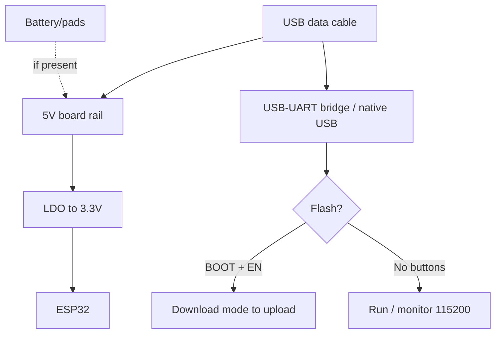

# S3-DevKitC / C3-SuperMini / XIAO

> [!tip] Why the new generation
> S3-DevKitC-1 is for cameras, displays, USB-OTG and neural networks. C3 SuperMini / XIAO C3 are tiny battery sensors with BLE 5. XIAO S3/Sense is a camera + microphone in 21x18 mm. Chip comparison - [[00-Start/03-Chip-Comparison.en | Chip comparison]], board overview - [[00-Start/04-Dev-Boards.en | DevKit boards]].
>
> [!warning] Native USB instead of bridge!
> On S3/C3 flashing goes via built-in USB-CDC, not a separate chip. First flash needs BOOT held, speeds differ, the monitor "vanishes" in sleep. Details - [[04-Interfaces/06-USB-OTG-JTAG.en | USB/JTAG]].

## Purpose

ESP32-S3-DevKitC-1 - a full-size development board (68x54 mm) for S3: 45 programmable GPIO, Octal PSRAM, 2x USB-C (UART + native), RGB LED, BOOT/RESET buttons. Purpose: cameras, parallel displays, USB devices, TinyML. C3 SuperMini (23x18 mm) - the cheapest Wi-Fi/BLE node: 4 MB Flash, native USB-C, deep-sleep about 15 uA. XIAO ESP32C3/S3 (21x18 mm, Seeed) - the "branded" mini: quality antenna (U.FL + PCB), charging LED, Grove expansion shields, Adafruit-grade docs.

| Parameter | S3-DevKitC-1 | C3 SuperMini | XIAO C3 / S3 |
| --- | --- | --- | --- |
| Purpose | Camera/displays/USB | Mini sensors, beacons | Quality mini builds |
| Chip | S3 dual-core 240 MHz + AI | C3 RISC-V 160 MHz | C3 / S3R8 (8 MB PSRAM on S3) |
| Size | 68x54 mm | 23x18 mm | 21x18 mm |

## Specifications

| Specification | S3-DevKitC-1 | C3 SuperMini | XIAO ESP32C3 | XIAO ESP32S3 (Sense) |
| --- | --- | --- | --- | --- |
| Flash / PSRAM | 8-32 MB / 8-16 MB Octal | 4 MB / none | 4 MB / none | 8 MB / 8 MB |
| USB | 2x USB-C: UART (CP2102N) + native | 1x USB-C native | 1x USB-C native | 1x USB-C native |
| LED | RGB (GPIO48) + power | Blue (GPIO8) + power | Orange user + red charging | Same + expansion |
| Buttons | BOOT (GPIO0) + RESET | BOOT + RESET (tiny!) | BOOT + RESET | BOOT + RESET |
| Battery | None (solder yourself) | BAT/GND pads (no charging!) | BAT pads + charging IC | BAT pads + charging IC |
| ADC | About 20 channels, calibrated | 6 ADC1 channels | 4 channels | 9 channels |
| Camera | Connector for OV2640/5640 module | None | None | OV2640/3660 on Sense board + microphone |
| Size | 68x54 mm | 23x18 mm | 21x18 mm | 21x18 mm (+21x39 Sense) |

> [!tip] XIAO Sense
> XIAO ESP32S3 Sense = mini + expansion board with OV3660 camera, microphone and SD slot. The CameraWebServer example runs. Note: the camera eats about 100 mA - a 300 mAh LiPo lasts about 2 h of streaming.

## Pinout features

S3-DevKitC-1: almost all GPIO 0-48 routed (except Flash/PSRAM-used 26-37). USB-UART port separate, native port separate - do not mix up (flash via the UART port!). RGB LED on GPIO48 (NeoPixel library). JTAG built in over USB - debugging with no adapter, see [[09-Firmware/05-JTAG-Debug.en | JTAG]].

C3 SuperMini (typical pinout): GPIO0-10 + 20/21 + RX/TX(20/21), I2C 8/9? - varies by vendor! Note: many SuperMini clones exist, schematics differ. C3 strapping: GPIO2/8/9 - do not pull at boot. ADC: ADC1 only (6 channels), but with no Wi-Fi conflict. C3 details - [[01-Hardware/04-ESP32-C3-C6-H2.en | C3/C6/H2]].

XIAO (Seeed standard): D0-D10 to GPIO1-10 (C3) / GPIO1-9,43,44 (S3), SDA/SCL, SCK/MISO/MOSI labeled. Charging LED goes out at full charge. User LED (orange) on a separate GPIO (see board wiki). BAT pads on the back: + and - for 3.7V LiPo.

## Power supply features

| Source | S3-DevKitC-1 | C3 SuperMini / XIAO |
| --- | --- | --- |
| USB-C 5V | 500 mA+, LDO to 3.3V | Same, small ME6211/LDO regulator |
| 5V pin | 5V rail input/output | 5V input (SuperMini), USB output (XIAO) |
| 3V3 pin | Output about 500 mA | Output about 300-500 mA (XIAO up to 700 mA peak) |
| Battery | None stock | SuperMini: BAT pads with no charging (TP4056 needed!); XIAO: pads + 100 mA charging IC |
| Deep-sleep | About 10 uA (S3, USB off) | C3 about 15 uA, XIAO C3 about 44 uA (charging IC eats!) |

> [!warning] SuperMini + raw LiPo means fire/dead board
> On C3 SuperMini the BAT pads are a 3.7-5V INPUT with no protection and no charging! LiPo is allowed there, but charge only with an external TP4056, see [[13-Power-Modules/03-TP4056-IP5306-BMS-UPS | Charging/BMS]]. XIAO has built-in charging - safe there.

## USB-UART features

S3-DevKitC-1 has BOTH: CP2102N (UART port, SiLabs driver) + native S3 USB (second connector). Flash via either; native needs BOOT on first flash. C3 SuperMini / XIAO - native USB-CDC only: no driver needed, but a data cable and the right sequence are: hold BOOT, plug USB, release, then flash. Native speed is full, baud is not critical. If the port vanishes after sleep - press Reset. Details - [[13-Power-Modules/05-USB-UART-AutoReset | USB-UART]].

## Buttons

S3-DevKitC-1: big BOOT + RESET - convenient. SuperMini: microscopic, need tweezers/fingernail; hold BOOT at power-on for download. XIAO: small but reachable; double-click Reset on some firmware means UF2 bootloader (drag the .uf2 file!). RGB/user/charging LEDs show the mode.

## What it fits

- S3-DevKitC-1: camera projects, square 480x480 displays, USB keyboards/microphones, TinyML (gesture/speech recognition), debugging via built-in JTAG.
- C3 SuperMini: BLE beacons, door/temperature sensors on battery, cheapest Wi-Fi nodes (coffee price).
- XIAO C3: same + quality and docs, Grove expansion ecosystem.
- XIAO S3 Sense: mini camera with microphone, wildlife ML tracker, doorbell.
- NOT a fit: S3 for miniatures (big), SuperMini for cameras/displays (no PSRAM/pins), XIAO for 5V peripherals (still 3.3V!).

## Flashing

Arduino IDE: S3 - `ESP32S3 Dev Module`, USB CDC On Boot `Enabled`, PSRAM `OPI PSRAM`; C3 - `ESP32C3 Dev Module` / `XIAO_ESP32C3`; S3 XIAO - `XIAO_ESP32S3`. esp32 package 2.0.8+ (for XIAO).

```ini
; PlatformIO — S3 DevKitC
[env:s3-devkitc]
platform = espressif32
board = esp32-s3-devkitc-1
framework = arduino
upload_speed = 921600
monitor_speed = 115200
board_build.psram_type = opi
build_flags = -DBOARD_HAS_PSRAM

; PlatformIO — XIAO C3 / C3 SuperMini
[env:xiao-c3]
platform = espressif32
board = seeed_xiao_esp32c3
framework = arduino
monitor_speed = 115200

; PlatformIO — XIAO S3
[env:xiao-s3]
platform = espressif32
board = seeed_xiao_esp32s3
framework = arduino
monitor_speed = 115200
board_build.psram_type = opi
```

First native-USB flash: hold BOOT, connect USB, flash, Reset. ESP-IDF: `esp32s3` / `esp32c3` targets. UF2 (XIAO): double-click Reset to disk to drag firmware over.

## Common issues

| Symptom | Cause | Fix |
| --- | --- | --- |
| Port missing (C3/XIAO) | Not in download mode / charge cable | BOOT+connect, data cable |
| Port gone after flash | USB CDC off / sleep | USB CDC On Boot Enabled, Reset |
| S3 flashes on one port, monitor on other | Two connectors mixed up | UART port to flash, native for USB projects |
| S3 camera fails without PSRAM | PSRAM off in menu | OPI PSRAM + `BOARD_HAS_PSRAM` |
| SuperMini fails to start from LiPo | No charging/protection, flat battery | External TP4056 + protected cell |
| XIAO heats while charging | Normal (charging IC) | Do not cover, 100 mA stock current |
| GPIO8/9 break boot (C3) | Strapping pins | Do not pull up at start |
| Old examples fail to build | Stale esp32 package | Update to 2.0.8+ (XIAO) / 3.x+ (S3) |

## Power and flashing schematic

> [!example] Photo/schematic: ![[assets/img/devboard-s3-c3-xiao.png|600]]

```text
S3-DevKitC-1: [USB-C UART-порт] ─► CP2102N ─► прошивка. [USB-C native] ─► S3-USB.
  5V ──► LDO ──► 3.3V (≤500 мА датчикам). Кнопки BOOT+RESET великі. RGB=GPIO48.
  Камера/дисплей — через PSRAM (OPI). JTAG — через native USB без адаптера!

C3 SuperMini: [USB-C native] ─► C3-USB (BOOT при вмиканні для 1-ї firmwares).
  BAT-пади БЕЗ зарядки — LiPo тільки через зовнішній TP4056!
XIAO C3/S3: [USB-C] ─► native + charging-IC ─► LiPo-пади (charging-LED гасне=100%).
  User-LED помаранчевий. Дабл-Reset = UF2-диск. I2C-датчики на SDA/SCL.
```

## Official sources

- Espressif - ESP32-S3-DevKitC-1 guide (pinout, 2xUSB, power): <https://docs.espressif.com/projects/esp-idf/en/latest/esp32s3/hw-reference/esp32s3/user-guide-devkitc-1.html>
- Espressif - ESP32-C3-DevKitM-1 guide (C3 power, native USB, strapping): <https://docs.espressif.com/projects/esp-idf/en/latest/esp32c3/hw-reference/esp32c3/user-guide-devkitm-1.html>
- Seeed Wiki - XIAO ESP32C3 Getting Started (mini, battery, charging LED): <https://wiki.seeedstudio.com/XIAO_ESP32C3_Getting_Started/>
- Seeed Wiki - XIAO ESP32S3 Getting Started (Sense camera, PSRAM, UF2): <https://wiki.seeedstudio.com/xiao_esp32s3_getting_started/>

### Mermaid: board power and first flash



## See also

- [[Home.en | Home map]]
- [[00-Start/04-Dev-Boards.en | DevKit boards]]
- [[00-Start/03-Chip-Comparison.en | Chip comparison]]
- [[01-Hardware/04-ESP32-C3-C6-H2.en | C3/C6/H2]]
- [[04-Interfaces/06-USB-OTG-JTAG.en | USB/JTAG]]
- [[09-Firmware/05-JTAG-Debug.en | JTAG]]
- [[12-Comm-Modules/04-RS485-CAN-Ethernet-Kamera.en | RS485/CAN/Camera]]
- [[13-Power-Modules/03-TP4056-IP5306-BMS-UPS | Charging/BMS]]
- [[07-Timers/03-Sleep-ULP.en | Sleep/ULP]]
- [[09-Firmware/02-Arduino-PlatformIO.en | Arduino/PlatformIO]]
- [[99-Additions/02-Troubleshooting-FAQ.en | FAQ]]
