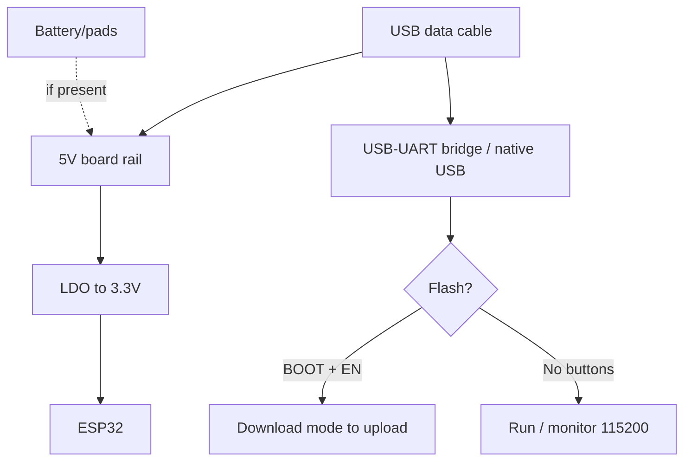

# WT32-ETH01 / Olimex

> [!tip] Why Ethernet on ESP32
> Wired Ethernet gives stability Wi-Fi never gives: long uptimes, PoE power over the same cable, Wi-Fi to Ethernet backup. WT32-ETH01 is the cheapest such board, Olimex is industrial with relays and cases. Overview - [[00-Start/04-Dev-Boards.en | DevKit boards]], Ethernet basics - [[12-Comm-Modules/04-RS485-CAN-Ethernet-Kamera.en | RS485/CAN/Cam]] and [[12-Comm-Modules/07-SIM7600-W5500-MCP2515.en | 4G/Ethernet/CAN]].
>
> [!warning] Classic ESP32 only!
> RMII Ethernet (LAN8720) works only on ESP32 Classic. S2/S3/C3 have no EMAC on these boards - take SPI modules (W5500). And no 5V on GPIO!

## Purpose

WT32-ETH01 (Wireless-Tag) - a miniature 60x26 mm module: ESP32 + LAN8720A Ethernet-PHY + Wi-Fi/BLE, no USB (flashing via external FTDI + GPIO0). Purpose: cheap wired nodes (MQTT gateways, access controllers, Modbus bridges). Olimex ESP32-EVB - an industrial 75x75 mm board: Ethernet + 2x 10A relays + CAN + IR + microSD + UEXT + LiPo UPS. ESP32-GATEWAY - a more compact 50x62 mm: Ethernet + microSD + UEXT, no relays. Purpose: building automation, control cabinets, outdoor controllers.

| Parameter | WT32-ETH01 | Olimex EVB | Olimex GATEWAY |
| --- | --- | --- | --- |
| Purpose | Cheap Ethernet node | Control cabinet with relays | Compact gateway |
| Chip | ESP32 Classic (WT32-S1) | ESP32-WROOM-32E/UE | ESP32-WROOM-32E/UE |
| Ethernet | LAN8720A, RJ45 | LAN8710A, RJ45 | LAN8710A, RJ45 |

## Specifications

| Specification | WT32-ETH01 | ESP32-EVB | ESP32-GATEWAY |
| --- | --- | --- | --- |
| Flash | 4 MB, no PSRAM | 4 MB (16 MB versions exist) | 4 MB (16 MB exist) |
| Antenna | PCB (U.FL version exists) | PCB or external (-EA) | PCB or external (-EA) |
| USB | None! FTDI only | Micro-USB + CH340 | USB-C + CH340 |
| Relays | None | 2x 10A/250VAC + LED | None |
| CAN | None | TJA1050 + connector | None |
| IR | None | Receiver + transmitter | None |
| SD | None | microSD | microSD |
| UEXT | None | Yes (I2C/SPI/UART modules) | Yes |
| LiPo | None | Charging + UPS mode | None (separate PoE versions) |
| Buttons | None (EN/IO0 pads) | Reset + User (GPIO34) | Reset + User |
| Power supply | 5V or 3.3V (jumper!) | 5V jack/USB/LiPo | 5V USB-C / PoE (on PoE versions) |
| Size | 60x26 mm | 75x75 mm | 50x62 mm |

> [!tip] Olimex variants
> -EA means external antenna (metal cabinets mute PCB antennas!). -IND means industrial range -40 to +85 C. ESP32-POE / PoE-ISO are separate Power-over-Ethernet boards (1500V isolation on ISO!). For outdoor cabinets take -EA-IND.

## Pinout features

WT32-ETH01: little routed - EN, GPIO0/1/3/5/12/14/15/17/32/33/35/36/39 + 5V/3.3V/GND. Ethernet takes the RMII pins internally (GPIO19/21/22/25/26/27 - NEVER touch!). GPIO0 is flashing (hold LOW at start). GPIO1/3 is flash UART. About 32/33/35/36/39/14/15/12/17/5 stay for sensors (with strapping limits!). Strapping details - [[03-GPIO/02-Strapping-Pins.en | Strapping]].

Olimex EVB/GATEWAY: everything routed via headers + UEXT. Used: Ethernet RMII pins (same), relays (GPIO32/33 on EVB - check your revision!), CAN TX/RX, SD (SPI), IR. Free pins via UEXT modules: dozens ready (relays, sensors, GSM, LoRa). UEXT is 3.3V I2C/SPI/UART + power in one 10-pin connector - solderless peripherals.

## Power supply features

| Source | WT32-ETH01 | Olimex |
| --- | --- | --- |
| 5V | 5V pin (LDO to 3.3V) | 5V jack / USB / UEXT |
| 3.3V | 3V3 pin (LDO bypass) | Output for modules only |
| PoE | None (splitter only!) | PoE/PoE-ISO versions: 48V to 5V isolated |
| PoE splitter (for WT32 with no PoE) | Passive 48V to 5V or active 802.3af (negotiation!) | Active costs more but will not burn the PHY on mistake |
| LiPo UPS | None | EVB: LiPo charging, power on 5V loss |

> [!warning] PoE caution!
> A passive 24V PoE injector into a plain WT32-ETH01/GATEWAY (no PoE) means instant death (48V on data pairs punches the PHY). Feed PoE ONLY to boards labeled PoE/PoE-ISO and only via an 802.3af switch or a matched injector. PoE pinout: power goes over spare pairs 4-5/7-8 (Mode B) or phantom (Mode A) - Olimex PoE boards take both. Check the power class: relays + Wi-Fi can eat 5-8 W, take margin.

## USB-UART features

WT32-ETH01: NO bridge. Flashing via external 3.3V FTDI: TX to GPIO3, RX to GPIO1, GPIO0 to GND while flashing, EN reset by button/jumper. Same settings as ESP32-CAM (see schematic below). Olimex: built-in CH340 (WCH driver), auto-reset present, 460800-921600 speed. A connected Ethernet cable does not disturb flashing.

## Buttons

WT32-ETH01: no buttons - EN and IO0 pads. For comfort solder two tactile buttons (IO0 to GND, EN to GND) or use a programmer with auto-reset (DTR to EN, RTS to IO0 via NPN). Olimex: Reset (EN) + User button (GPIO34, input only - read with pull-up!). EVB also has relay/power/LiPo LEDs.

## What it fits

- WT32-ETH01: wired MQTT sensors in the office, Modbus-TCP bridges, backup channel to Wi-Fi (failover in code), intercoms/turnstiles.
- EVB: control cabinet: 2 relays (boiler/light) + CAN (automation) + IR (air conditioner) + Ethernet - all on one board with a BOX-ESP32-EVB case.
- GATEWAY: compact RS485/Ethernet gateway, outdoor controller in BOX plastic, LoRa gateway via UEXT-LoRa.
- NOT a fit: battery months (Ethernet eats about 150 mA constantly!), S3/C3 projects (EMAC on Classic only), 5V sensors without shifter.

## Flashing

Arduino IDE: WT32-ETH01 - `ESP32 Dev Module` (no separate profile in old packages; new/PlatformIO has `wt32-eth01`). Olimex - `ESP32 Dev Module` or `OLIMEX ESP32-EVB/GATEWAY` (esp32 package). Ethernet in Arduino: `ETH.h` library with board pins.

```ini
; PlatformIO — WT32-ETH01
[env:wt32-eth01]
platform = espressif32
board = wt32-eth01
framework = arduino
upload_speed = 115200
monitor_speed = 115200

; PlatformIO — Olimex GATEWAY/EVB
[env:olimex-gateway]
platform = espressif32
board = esp32-gateway
framework = arduino
upload_speed = 460800
monitor_speed = 115200
```

```cpp
// Ethernet WT32-ETH01 (LAN8720, RMII)
#include <ETH.h>
void setup() {
  Serial.begin(115200);
  ETH.begin(1, 16, 23, 18, ETH_PHY_LAN8720, ETH_CLOCK_GPIO0_IN);
  // addr=1, power=16, mdc=23, mdio=18 — саме для WT32-ETH01!
  while ((uint32_t)ETH.localIP() == 0) delay(200);
  Serial.println(ETH.localIP());
}
// Olimex EVB/GATEWAY: той самий виклик, power=-1 (див. приклад виробника).
```

ESP-IDF: `esp_eth` + `esp_netif` components, `ethernet/basic` example. ESPHome: `esp32` platform, `ethernet:` with LAN8720 type and the same pins. Tasmota: `tasmota32-ethernet` build.

## Common issues

| Symptom | Cause | Fix |
| --- | --- | --- |
| Ethernet does not link | Wrong PHY pins / cross cable with no Auto-MDIX | Pins 1/16/23/18/0, plain patch cord |
| Board fails to flash (WT32) | No GPIO0 to GND / 5V FTDI | Jumper + 3.3V FTDI + reset |
| Death after PoE injector | Passive PoE into non-PoE board | PoE versions + 802.3af only |
| Relay clicks at boot (EVB) | Relay GPIO floats at start | External pull-down, init early |
| Passive PoE splitter instead of active | No 802.3af negotiation - PHY risk | Active splitter or PoE board version |
| Wi-Fi muted in metal cabinet | PCB antenna shielded | -EA version + remote antenna |
| Ethernet eats the battery | PHY about 150 mA constantly | Not for batteries; or switch ETH off in sleep |
| CH340 parasitic power (EVB) | GPIO3 as output feeds the bridge | GPIO3 to input on USB-less power (see Olimex FAQ) |
| `wrong chip ID lan87xx` | PHY missed its start | `delay(500)` at `setup()` start |

## Power and flashing schematic

> [!example] Photo/schematic: ![[assets/img/devboard-wt32-eth01.png|600]]

```text
WT32-ETH01: [FTDI 3.3V] ─TX─► GPIO3 / ─RX─◄ GPIO1 / GND──►GND
  GPIO0 ──[перемичка]──► GND (на час firmwares!) → EN-ресет → шити 115200.
  Живлення: 5V пін (LDO) АБО 3V3 (обхід). PoE — ЗАБОРОНЕНО (немає розв'язки)!
  ETH.begin(1, 16, 23, 18, LAN8720, GPIO0_IN). RMII-піни 19/21/22/25-27 НЕ ЧІПАТИ!

Olimex: [5V jack / USB / PoE(тільки PoE-версії!)] ──► плата ──► реле/CAN/IR/SD/UEXT
  Прошивка через вбудований CH340 (460800). delay(500) перед ETH.begin()!
  -EA: виносна антена для метал-шаф. LiPo на EVB = UPS при пропаданні 5V.
```

## Official sources

- Wireless-Tag - WT32-ETH01 page (datasheet, Getting Started, live photos): <https://en.wireless-tag.com/product-item-2.html>
- Egnor - WT32-ETH01 unofficial guide (pinout, RMII pins, USB-less flashing): <https://github.com/egnor/wt32-eth01>
- Olimex - ESP32-EVB (relays, CAN, UEXT, LiPo UPS, schematics): <https://www.olimex.com/Products/IoT/ESP32/ESP32-EVB/open-source-hardware>
- Olimex - ESP32-GATEWAY (compact gateway, -EA/-IND versions): <https://www.olimex.com/Products/IoT/ESP32/ESP32-GATEWAY/open-source-hardware>
- LAN8720A - Microchip (RMII PHY): <https://www.microchip.com/en-us/product/LAN8720A>
- LAN8710A - Microchip (RMII PHY): <https://www.microchip.com/en-us/product/LAN8710A>

### Mermaid: board power and first flash



## See also

- [[Home.en | Home map]]
- [[00-Start/04-Dev-Boards.en | DevKit boards]]
- [[12-Comm-Modules/04-RS485-CAN-Ethernet-Kamera.en | RS485/CAN/Camera]]
- [[12-Comm-Modules/07-SIM7600-W5500-MCP2515.en | 4G/Ethernet/CAN]]
- [[04-Interfaces/01-UART.en | UART]]
- [[13-Power-Modules/05-USB-UART-AutoReset | USB-UART]]
- [[11-Vivid/03-NeoPixel-Servo-Rele-MOSFET.en | NeoPixel/Servo/Relay]]
- [[09-Firmware/02-Arduino-PlatformIO.en | Arduino/PlatformIO]]
- [[09-Firmware/04-Esptool-Flash.en | Esptool]]
- [[99-Additions/02-Troubleshooting-FAQ.en | FAQ]]
