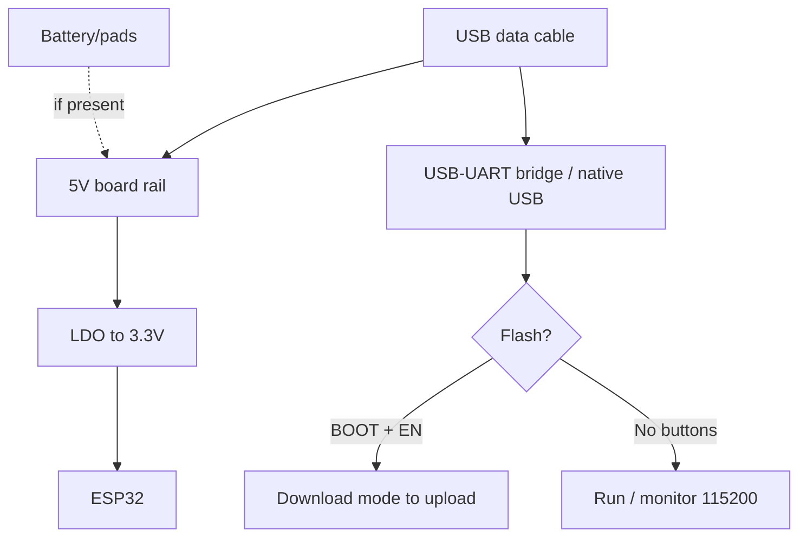

# Mini-Boards: QT Py / TinyS3 / Lolin mini / Nano ESP32

> [!tip] Why the mini format
> When a DOIT DevKit is too big and XIAO (see [[14-Devboards/08-S3-DevKitC-C3-SuperMini-XIAO.en | S3/C3/XIAO]]) is too small in features, take the "middle babies": Adafruit QT Py (STEMMA ecosystem!), Unexpected Maker TinyS3/FeatherS3 (premium + LiPo + battery monitor!), Lolin S2/S3 mini (Wemos heritage, D1-mini footprint), Arduino Nano ESP32 (official, Arduino ecosystem). Overview - [[00-Start/04-Dev-Boards.en | DevKit boards]], chip comparison - [[00-Start/03-Chip-Comparison.en | Chip comparison]].
>
> [!warning] Few pins and native USB!
> All heroes of this note (except Nano ESP32 with its bridge) flash via built-in USB-S3/S2, not a separate UART chip: first flash wants BOOT, a data cable is a must. Pins are 11-27, so cameras/parallel displays do not belong here. Details - [[04-Interfaces/06-USB-OTG-JTAG.en | USB/JTAG]].

## Purpose

Adafruit QT Py ESP32-S2/S3 (22x18 mm) are babies with a STEMMA QT connector (SparkFun Qwiic-compatible): I2C sensors attach by ribbon with no soldering. XIAO-compatible footprint with castellated pads - the board solders flat onto your own PCB. Unexpected Maker TinyS3 (36x18 mm) / FeatherS3 (52x23 mm) are "premium babies" from Australia: 8-16 MB Flash, 8 MB PSRAM, LiPo charging, I2C fuel gauge (battery monitor!), dual antennas (PCB + u.FL). Lolin S2 mini / S3 mini (34x25 mm) carry the Wemos D1 mini heritage: same pitch, D1-mini-shield compatibility, MicroPython out of the box. Arduino Nano ESP32 is the official Arduino board on the u-blox NORA-W106 module (ESP32-S3 inside): Nano form factor, USB-C, 16 MB Flash, official MicroPython and Arduino Cloud support.

| Parameter | QT Py S2/S3 | TinyS3 / FeatherS3 | Lolin S2/S3 mini | Nano ESP32 |
| --- | --- | --- | --- | --- |
| Purpose | STEMMA sensors, wearables | Premium battery products | Cheap mini nodes, D1 shields | Arduino ecosystem, education |
| Chip | S2 (no BLE!) / S3 | S3 | S2 / S3 | S3 (NORA-W106) |
| Size | 22x18 mm | 36x18 / 52x23 mm | 34x25 mm | 45x18 mm (Nano) |

## Specifications

| Specification | QT Py S2 | QT Py S3 | TinyS3 | FeatherS3 | S2 mini / S3 mini | Nano ESP32 |
| --- | --- | --- | --- | --- | --- | --- |
| Chip | ESP32-S2, 1 core 240 MHz | ESP32-S3, 2 cores 240 MHz | ESP32-S3FN8 | ESP32-S3 | S2FN4R2 / S3FH4R2 | S3 (NORA-W106) |
| Flash / PSRAM | 4 MB / 2 MB | 8 MB / 0 or 4 MB / 2 MB (2 versions!) | 8 MB / 8 MB | 16 MB / 8 MB | 4 MB / 2 MB | 16 MB / 8 MB |
| BLE | None (S2 with no BLE!) | BLE 5 | BLE 5 + Mesh | BLE 5 + Mesh | S2: none / S3: BLE 5 | BLE 5 |
| USB | USB-C native | USB-C native | USB-C native + Serial/JTAG | USB-C native + Serial/JTAG | USB-C native + OTG | USB-C (bridge + native) |
| GPIO routed | 13 (11 pads + 2 on QT) | 13 (11 pads + 2 on QT) | 17 | 21 | 27 | ~20 (Nano header) |
| I2C connector | STEMMA QT (Qwiic-compatible!) | STEMMA QT | None | 2x STEMMA QT (on different LDOs!) | None (D1 shields) | None |
| Battery/charging | LiPo pads (diode, no charging!) | LiPo pads (diode, no charging!) | JST + charging + fuel gauge! | JST PH + charging + fuel gauge! | Pads (no charging!) | Pads (no charging) |
| RGB LED | NeoPixel + power pin | NeoPixel + power pin | RGB (via IO) | RGB (LDO2!) | S3 mini: RGB on IO47 | RGB + built-in LED |
| Size | 22x18 mm | 22x18 mm | 36x18 mm | 52x23 mm | 34x25 mm | 45x18 mm |
| Price landmark | ~$10 | ~$13-15 | ~$25-30 | ~$35-40 | ~$5-8 | ~$22-25 |

> [!tip] Two QT Py S3 versions
> There is an 8 MB Flash version with no PSRAM (for CircuitPython with BLE) and a 4 MB Flash + 2 MB PSRAM version. For Arduino/camera/display take the PSRAM version; for CircuitPython+BLE take the 8-MB one.
>
> [!tip] Lolin relatives
> Besides mini, the Wemos line has a full-size Lolin S3 and a compact S3 Zero - same S3FH4R2, different form factor. All docs (PDF schematics, dimensions, Arduino/MicroPython tutorials) sit on wemos.cc in the S2/S3 sections.

## Pinout features

QT Py: 11 pads + SDA/SCL on the STEMMA QT connector. About 10 analog inputs (high-speed SPI pads have no ADC). PWM/I2C/SPI/UART/I2S on any pins (S2/S3 matrix), 5x capacitive touch with no extra parts. Castellated edges mean XIAO compatibility. NeoPixel with a separate power pin - switch it off for ultra-low sleep (~70 uA with the board).

TinyS3: 17 GPIO on the header, TinyPICO-compatible. FeatherS3: 21 GPIO in Feather format (Feather-shield compatible!), 2x STEMMA QT - one on LDO1, second on LDO2 (sensors on LDO2 die in deep-sleep automatically!). The RGB diode feeds from a controlled pin/LDO2 - switch power on before use (see the board pinout card).

Lolin S2/S3 mini: 27 IO on D1 mini pitch - fit a breadboard and D1 shields (relays, sensors, displays). S2 strapping: GPIO0/45/46; S3: GPIO0/3/45/46 - do not pull at boot. RGB on S3 mini is IO47. Strapping details - [[03-GPIO/02-Strapping-Pins.en | Strapping]].

Nano ESP32: classic Nano header (Arduino-shield pitch compatible, but 3.3V logic!). Some pins are busy with the USB bridge and RGB. The official pinout is the PDF on the board page.

## Power supply features

| Source | QT Py | TinyS3 / FeatherS3 | Lolin mini | Nano ESP32 |
| --- | --- | --- | --- | --- |
| USB-C 5V | Work + sensor power | Work + battery charging | Work | Work + logic charging |
| 5V pin | Bus input/output | Input 4.8-5.2V / output ~4.9V | Input/output | Input/output (Vin) |
| 3V3 pin | Output up to 600 mA peak (AP2112) | Output 700 mA (LDO, on Feather 2x!) | Output ~500 mA | Output (bridge limit) |
| Battery | Pads + diode to 6V, NO charging | JST + charging + fuel gauge (I2C!) | Pads with no charging | Pads with no charging |
| Deep-sleep | ~70 uA (NeoPixel off) | Single uA (LEDs isolated from battery!) | Hundreds of uA (depends on revision) | Higher (bridge + RGB eat) |

> [!warning] Battery is NOT charging
> QT Py and Lolin mini have only a battery INPUT with no charging-IC: charge LiPo with an external TP4056, see [[13-Power-Modules/03-TP4056-IP5306-BMS-UPS.en | Charge/BMS]]. Only TinyS3/FeatherS3 charge LiPo stock and can wake S3 on fuel-gauge interrupt (low charge!).
>
> [!warning] Not into 3V3 and not into 5V!
> Battery goes only on BAT/VBAT pads. Into 3V3 it kills S3 (4.2V over 3.3V!). Into 5V only stable 4.8-5.2V, else power wobble and "weird" reboots.

## USB-UART features

QT Py / Lolin mini: native USB-CDC only. No driver needed, but the cable must carry data. First flash: hold BOOT to plug USB to flash to Reset. After deep-sleep the port "vanishes" - press Reset. Lolin ships with MicroPython firmware - the port shows as CDC at once.

TinyS3/FeatherS3: native USB + USB Serial/JTAG. Out of the box CircuitPython with UF2 bootloader: double-click Reset gives a drag-and-drop .uf2 disk. Moving between CircuitPython/MicroPython/Arduino: erase Flash to BOOT+Reset to flash new. RX/TX pins are NOT tied to USB - that is a free UART0 for modules! Details - [[13-Power-Modules/05-USB-UART-AutoReset.en | USB-UART]].

Nano ESP32: classic bridge (driver needed) + native S3. Arduino IDE flashes via the bridge with no BOOT dance. For MicroPython use the official Arduino Lab for MicroPython installer.

## Buttons

QT Py: Reset + BOOT/GPIO0 (small but reachable). Double-Reset on CircuitPython gives a UF2 disk. Lolin mini: tiny BOOT + RST - tweezers help; hold BOOT at power-on for first flash. TinyS3/FeatherS3: BOOT + Reset + RGB mode indication (purple means CircuitPython boot, green means UF2 disk mounted). Nano ESP32: Reset + BOOT under USB-C, plus an RGB flash-status LED for Arduino IDE.

## Comparison table: size / pins / battery / price

| Board | Size, mm | GPIO | Battery / charging | Battery monitor | Price landmark |
| --- | --- | --- | --- | --- | --- |
| QT Py S2 | 22x18 | 13 | Pads, no charging | None | ~$10 |
| QT Py S3 | 22x18 | 13 | Pads, no charging | None | ~$13-15 |
| TinyS3 | 36x18 | 17 | JST + charging | I2C fuel gauge! | ~$25-30 |
| FeatherS3 | 52x23 | 21 | JST PH + charging | I2C fuel gauge! | ~$35-40 |
| S2 mini | 34x25 | 27 | Pads, no charging | None | ~$5-6 |
| S3 mini | 34x25 | 27 | Pads, no charging | None | ~$6-8 |
| Nano ESP32 | 45x18 | ~20 | Pads, no charging | None | ~$22-25 |

> [!tip] How to read the table
> Prices are street landmarks (check shops). Cheapest entry is Lolin mini; best battery is TinyS3/FeatherS3; smallest is QT Py; best Arduino compatibility is Nano ESP32.

## What it fits

- QT Py S2: cheapest BLE-... no, S2 has no BLE! QT Py S2 is for Wi-Fi sensors with no BLE, USB-HID (keyboard/mouse), solderless STEMMA prototypes.
- QT Py S3: BLE+Wi-Fi babies, wearables, USB-MIDI/HID, sensors on STEMMA ribbons.
- TinyS3: battery products "set and forget" (mailbox sensor, tracker, beacon) - the fuel gauge tells when to swap LiPo.
- FeatherS3: Feather ecosystem + 2 LDOs (sensors that die in sleep) + 16 MB Flash for big firmware (LVGL, audio).
- S2/S3 mini: D1 mini replacement in existing projects, cheap room sensors, 5-minute MicroPython start.
- Nano ESP32: education (Arduino Cloud, MicroPython 101), moving from AVR-Nano to ESP32 with no pitch change.
- NOT a fit: cameras/big displays (too few pins and PSRAM - see [[14-Devboards/08-S3-DevKitC-C3-SuperMini-XIAO.en | S3/C3/XIAO]]); 5V periphery with no level shifters; S2 boards for BLE (it is missing there!).

## Flashing

Arduino IDE: `Adafruit QT Py ESP32-S2 / S3`, `Unexpected Maker TinyS3`, `LOLIN S2/S3 Mini`, `Arduino Nano ESP32` boards. For S3: USB CDC On Boot `Enabled`, PSRAM per board version. esp32 package 2.0.8 or newer, Arduino ESP32 Boards for Nano.

```ini
; PlatformIO — QT Py S3
[env:qtpy-s3]
platform = espressif32
board = adafruit_qtpy_esp32s3
framework = arduino
monitor_speed = 115200
board_build.psram_type = qspi

; PlatformIO — TinyS3 / FeatherS3
[env:tinys3]
platform = espressif32
board = um_tinys3
framework = arduino
monitor_speed = 115200

; PlatformIO — Lolin S2 mini / S3 mini
[env:lolin-s3-mini]
platform = espressif32
board = lolin_s3_mini
framework = arduino
monitor_speed = 115200

; PlatformIO — Arduino Nano ESP32
[env:nano-esp32]
platform = espressif32
board = arduino_nano_esp32
framework = arduino
monitor_speed = 115200
```

MicroPython/CircuitPython: Lolin mini has MicroPython preload (WebREPL/ampy at once); Nano ESP32 gets official MicroPython via Arduino Lab; QT Py / UM run CircuitPython + UF2 (drag .uf2 onto the mounted disk). ESP-IDF: `esp32s2` / `esp32s3` targets. Environment details - [[09-Firmware/02-Arduino-PlatformIO.en | Arduino/PlatformIO]].

## Common issues

| Symptom | Cause | Fix |
| --- | --- | --- |
| Port missing | Charge cable / not in download mode | Data cable, BOOT + plug USB |
| Port gone after sleep | Native USB sleeps with S2/S3 | Press Reset; USB CDC On Boot Enabled |
| S2 misses BLE devices | ESP32-S2 has no BLE at all! | Take an S3 board version |
| QT Py S3: RAM short for display | 8 MB version with no PSRAM | 4 MB + 2 MB PSRAM version |
| UM RGB dark | LED power off (IO/LDO2) | Switch on power pin / LDO2 per pinout card |
| LiPo on QT Py/Lolin does not charge | No charging-IC there! | External TP4056 |
| Battery at 0 killed Lolin | No over-discharge protection | Protected battery or BMS board |
| D1 shield misses mini | Different pitch/pin set on clones | Check PDF schematic from wemos.cc |
| Nano ESP32 refuses to flash | Old board package / wrong port | Arduino ESP32 Boards 2.0.x or newer, bridge port |
| UF2 disk missing (UM) | CircuitPython wiped by Arduino | Reflash UF2 bootloader per UM guide |

## Power and flashing schematic

> [!example] Photo/schematic: ![[assets/img/devboard-mini-s2s3-scheme.png|600]]

```text
QT Py: [USB-C native] ─► S2/S3-USB (BOOT при вмиканні для 1-ї firmwares).
  3V3 ≤600 мА датчикам. STEMMA QT: SDA/SCL/GND/3V3 — шлейф замість паяння!
  BAT-пади + діод (до 6V) БЕЗ зарядки — LiPo тільки через зовнішній TP4056!

TinyS3/FeatherS3: [USB-C] ─► S3-USB + charging-IC ─► JST-LiPo + I2C fuel gauge.
  5V-rail 4.8–5.2V. Feather: LDO2 (STEMMA №2, RGB) гасне в deep-sleep сам!
  Дабл-Reset = UF2-диск. VBUS-sense пін каже кодові, чи є 5V.

Lolin mini: [USB-C native] ─► S2/S3-USB, D1-формфактор 27 IO.
  MicroPython з коробки — REPL одразу. Зарядки немає!
Nano ESP32: [USB-C] ─► міст ─► UART0 (шити без BOOT) + native S3 для USB-проєктів.
  Nano-крок, логіка 3.3V! MicroPython — через Arduino Lab.
```

## Official sources

- Adafruit Learn - QT Py ESP32-S3 (pins, STEMMA QT, NeoPixel, power, sleep ~70 uA): <https://learn.adafruit.com/adafruit-qt-py-esp32-s3>
- Unexpected Maker - ESP32-S3 docs (TinyS3/FeatherS3: comparison matrix, fuel gauge, power, UF2): <https://esp32s3.com/>
- Wemos - Lolin S3 mini (specs, PDF schematic, MicroPython/Arduino tutorials): <https://www.wemos.cc/en/latest/s3/s3_mini.html>
- Arduino - Nano ESP32 (NORA-W106, USB-C, 16 MB Flash, MicroPython): <https://docs.arduino.cc/hardware/nano-esp32/>
- Adafruit Learn - QT Py ESP32-S2 (pins, DAC, 6x touch, power, sleep ~70 uA, uFL version): <https://learn.adafruit.com/adafruit-qt-py-esp32-s2> (verified webfetch 2026-09-29)
- Adafruit products - S2 hardware revisions (5325) / S3 8MB no PSRAM (5426) / S3 4MB+2MB PSRAM (5700): <https://www.adafruit.com/product/5325>, <https://www.adafruit.com/product/5426>, <https://www.adafruit.com/product/5700>
- Wemos - Lolin S2 mini (S2FN4R2, D1 shields, schematic/dimension PDFs, MicroPython/Arduino/CircuitPython tutorials): <https://www.wemos.cc/en/latest/s2/s2_mini.html> (verified webfetch 2026-09-29)
- Wemos - S3 tutorials (MicroPython / Arduino start for the S3 series): <https://www.wemos.cc/en/latest/tutorials/s3/get_started_with_micropython_s3.html>, <https://www.wemos.cc/en/latest/tutorials/s3/get_started_with_arduino_s3.html>
- Wemos - S2 tutorials (MicroPython / Arduino / CircuitPython for the S2 series): <https://www.wemos.cc/en/latest/tutorials/s2/get_started_with_micropython_s2.html>, <https://www.wemos.cc/en/latest/tutorials/s2/get_started_with_arduino_s2.html>
- Espressif - ESP32-S3 Datasheet (strapping pins, native USB, ADC): <https://www.espressif.com/sites/default/files/documentation/esp32-s3_datasheet_en.pdf>
- Espressif - ESP32-S2 Datasheet (strapping pins, DAC, USB): <https://www.espressif.com/sites/default/files/documentation/esp32-s2_datasheet_en.pdf>
- Diodes AP2112 (QT Py LDO, 600 mA peak): <https://www.diodes.com/assets/Datasheets/AP2112.pdf>

## Full board cards (expanded)

> [!tip] How to use the cards
> Each card is a self-sufficient minimum to start: pin table, power supply, buttons/BOOT mode, USB, exact board name in Arduino IDE + ready PlatformIO-ini, antenna, sleep, traps. Check exact GPIO numbers of pads against PDF schematics and Pinout pages in "Official sources" - board revisions differ! General topics: strapping - [[03-GPIO/02-Strapping-Pins.en | Strapping]], USB/JTAG - [[04-Interfaces/06-USB-OTG-JTAG.en | USB/JTAG]], sleep - [[07-Timers/03-Sleep-ULP.en | Sleep/ULP]], batteries - [[02-Power-Supply/04-Batteries-TP4056.en | Batteries]], antennas - [[01-Hardware/08-Antennas-RF.en | Antennas/RF]], ADC - [[06-Analog/01-ADC.en | ADC]].

### Card 1 - Adafruit QT Py ESP32-S2

Single-core S2 baby (240 MHz, Wi-Fi, **no BLE!**) with 4 MB Flash + 2 MB PSRAM. Product 5325; a u.FL-antenna version exists instead of PCB. Chip details - [[01-Hardware/02-ESP32-S2.en | ESP32-S2]].

| Pad / port | Signal | Functions | Notes |
| --- | --- | --- | --- |
| A0-A3 | Analog inputs | 12-bit ADC, touch, GPIO | Part of the S2 ADC matrix |
| SDA / SCL (pads) | I2C No.1 | Sensors, displays | + second I2C on STEMMA QT! |
| TX / RX | UART | Console, GPS, modules | Hardware UART |
| SCK / MOSI / MISO | SPI | Displays, SD, radio | High-speed SPI pads with **no ADC!** |
| STEMMA QT (JST SH 4-pin) | SDA/SCL/GND/3V3 | Qwiic-compatible I2C ribbon | No soldering! Grove via adapter cable |
| NeoPixel + power pin | RGB LED | Status, indication | **Kill the power pin before sleep**, else sleep is not ~70 uA! |
| DAC | 8-bit analog output | Sound/control | Only on S2 (S3 has no DAC!) |
| Touch | 6x capacitive touch | Buttons with no parts | No external wiring |
| Reset / BOOT (GPIO0) | Buttons | Reset / ROM bootloader | Small but reachable |
| Castellated edges | XIAO footprint | Flat soldering onto your PCB | Seeed XIAO pitch compatible |

Power: USB-C 5V; 3V3 regulator AP2112 up to **600 mA peak** (sensors + NeoPixel); BAT pads on the back **with diode, input to 6V, NO charging** - LiPo only via external TP4056 (see [[13-Power-Modules/03-TP4056-IP5306-BMS-UPS.en | Charge/BMS]]). Do not push a battery into 3V3 (4.2V over 3.3V is S2 death!).

Buttons/BOOT: first flash - hold BOOT to plug USB to flash to Reset. CircuitPython: double Reset gives a UF2 disk (if wiped by Arduino, reflash the UF2 bootloader per the Adafruit guide).

USB: **native CDC** only, no driver needed, cable must carry data. After deep-sleep the port vanishes - press Reset.

Arduino board-definition: `Adafruit QT Py ESP32-S2` boards, USB CDC On Boot `Enabled`, esp32 package 2.0.8 or newer.

```ini
; PlatformIO — QT Py S2 (окремий env, не плутати з S3!)
[env:qtpy-s2]
platform = espressif32
board = adafruit_qtpy_esp32s2
framework = arduino
monitor_speed = 115200
board_build.psram_type = qspi
```

Antenna: PCB antenna (on the uFL version a connector for external). Keep the antenna zone over the board edge, no copper/metal above or below, see [[01-Hardware/08-Antennas-RF.en | Antennas/RF]].

Sleep: deep-sleep **~70 uA** (Adafruit measurement, NeoPixel off); light sleep single mA. Wi-Fi modem in active takes ~100+ mA, count the battery (see [[02-Power-Supply/03-Power-Consumption.en | Power consumption]]).

Traps: S2 **has no BLE at all** (BLE scanners stay mute!); only 13 GPIO; no 5V tolerance (max ~3.6V per pin!); high-speed SPI pads with no ADC - no analog sensors there.

### Card 2 - Adafruit QT Py ESP32-S3 (two versions!)

Dual-core S3 (240 MHz, Wi-Fi + **BLE 5**), native USB (HID keyboard/mouse, MIDI, disk!). **Watch out - two memory-incompatible versions** (Adafruit Learn measurement):

| Version | Flash / PSRAM | For what | Limit |
| --- | --- | --- | --- |
| 8 MB Flash, no PSRAM (product 5426) | 8 MB / 0 | CircuitPython + BLE (fits BLE!) | No PSRAM - display/camera/audio buffers miss |
| 4 MB Flash + 2 MB PSRAM (product 5700) | 4 MB / 2 MB | Arduino, displays, sound | On the 4-MB board CircuitPython has **no room for BLE!** |

| Pad / port | Signal | Functions | Notes |
| --- | --- | --- | --- |
| A0-A3 | Analog inputs | 12-bit ADC (~10 channels on board), GPIO | As S2 but **no DAC** (S3 has no DAC!) |
| SDA / SCL + STEMMA QT | 2x I2C | Ribbon sensors | Qwiic-compatible |
| TX / RX | UART | Console, modules | Free, not tied to a USB bridge (no bridge!) |
| SCK / MOSI / MISO | SPI | Displays, SD | High-speed pads with no ADC |
| Touch | 5x capacitive touch | Buttons | One fewer than S2 |
| NeoPixel + power-pin | RGB | Status | Switch off before sleep! |
| Reset / BOOT | Buttons | Reset / download | Double-Reset is UF2 (CircuitPython) |

Power: as S2 (AP2112 600 mA peak, BAT pads + diode to 6V with no charging). Buttons/BOOT and USB as S2 (native CDC, data cable, Reset after sleep).

Arduino board-definition: `Adafruit QT Py ESP32-S3` boards, USB CDC On Boot `Enabled`, PSRAM per version (QIO/QSPI for the 2-MB version).

```ini
; PlatformIO — QT Py S3, ВЕРСІЯ 4МБ + 2МБ PSRAM (дисплеї/Arduino)
[env:qtpy-s3-psram]
platform = espressif32
board = adafruit_qtpy_esp32s3
framework = arduino
monitor_speed = 115200
board_build.psram_type = qspi
board_upload.flash_size = 4MB

; PlatformIO — QT Py S3, ВЕРСІЯ 8МБ без PSRAM (CircuitPython + BLE)
[env:qtpy-s3-8mb]
platform = espressif32
board = adafruit_qtpy_esp32s3
framework = arduino
monitor_speed = 115200
board_upload.flash_size = 8MB
```

Antenna: PCB (point the antenna zone out of the product, see [[01-Hardware/08-Antennas-RF.en | Antennas/RF]]). Sleep: deep-sleep **~70 uA**, light sleep **2-4 mA** (Adafruit measurements).

Traps: mixing up versions (buying 8-MB for a display - the buffer misses!); S3 with no Bluetooth Classic (BLE only!); CircuitPython-BLE only on 8-MB; 13 GPIO means no camera/RGB panels here.

### Card 3 - Unexpected Maker TinyS3

Premium 36.3x18 mm baby: S3FN8, **8 MB Flash + 8 MB PSRAM**, TinyPICO-compatible, stock LiPo charging + **I2C fuel gauge with interrupt to RTC-IO** (wakes S3 on discharge!). [D] series has dual antennas (PCB + u.FL) with a code RF switch. S3 details - [[01-Hardware/03-ESP32-S3.en | ESP32-S3]].

| Pin / port | Signal | Functions | Notes |
| --- | --- | --- | --- |
| 17x GPIO header | General IO | ADC1, touch, PWM, I2C/SPI/UART/I2S (S3 matrix) | Among them strapping IO0/3/45/46 - see [[03-GPIO/02-Strapping-Pins.en | Strapping]] |
| VBAT (JST + back pads) | Battery input | 1S LiPo + stock charging + fuel gauge | **Only here**, not into 5V/3V3! |
| 5V | Input/output 4.8-5.2V | External 5V / output ~4.9V on USB (diode drop!) | Input range is strict: 4.8-5.2V |
| 3V3 | Output 700 mA (LDO) | Sensors, periphery | Beefy LDO, no sag |
| VBUS-sense pin | Digital input | "5V present" flag | Code decides: mains or battery work |
| Fuel gauge (internal I2C) | Battery monitor | Charge %, voltage + INT to RTC-IO | Wake on low charge! |
| RGB LED (power via IO!) | Status | NeoPixel-like | **Pull the power IO HIGH first**, else dark! |
| RX / TX | UART0 (free!) | Modules, GPS, RS485 | NOT tied to USB - for periphery! |
| USB-C | Native + USB Serial/JTAG | Flashing, JTAG debug, OTG | UF2 bootloader out of the box (CircuitPython) |

Power: USB-C to charging-IC to JST-LiPo; power/charge LEDs **isolated on the 5V domain** (they do not glow or eat from battery - by design!). Empty battery: orange charge LED blinks - normal (the chip cannot tell "full" from "missing"). No boost converter: from battery the 5V pin carries **no voltage** - 5V sensors need their own step-up.

Buttons/BOOT: BOOT + Reset. UF2 mode (CircuitPython on board): Reset to wait for purple RGB to press BOOT to green means disk mounted, drag .uf2. Environment change (CircuitPython to MicroPython to Arduino to IDF): **erase Flash** to hold BOOT to click Reset to release BOOT to flash new.

USB: native CDC (no drivers) + USB Serial/JTAG (debug with no probe!, see [[09-Firmware/05-JTAG-Debug.en | JTAG]]).

Arduino board-definition: `Unexpected Maker TinyS3` boards, USB CDC On Boot `Enabled`, PSRAM `QSPI`.

```ini
; PlatformIO — TinyS3
[env:tinys3]
platform = espressif32
board = um_tinys3
framework = arduino
monitor_speed = 115200
board_build.psram_type = qspi
board_build.flash_size = 8MB
```

Antenna: 3D high-gain PCB + u.FL ([D] series); antenna choice in code via RF switch (see UM examples). Orientation: PCB antenna with the board edge out, do not coil the u.FL pigtail in a ring near digital lines.

Sleep: **ultra-low** (single-uA class; LEDs off battery by circuit). No LDO2 nuances (one LDO) - dim sensors yourself with MOSFET/pin.

Traps: dark RGB means the power IO is off; battery into 5V means LED current plus logic death; battery into 3V3 is S3 death (4.2V!); strapping IO0 - the BOOT button doubles as user: do not hold it pressed at power-on, else ROM-download instead of start (see [[01-Hardware/07-Boot-Strapping-Reset.en | Boot/Reset]]).

### Card 4 - Unexpected Maker FeatherS3

Feather-format 52.3x23 mm for Feather shields: **16 MB Flash + 8 MB PSRAM**, **2x 700 mA LDO** (LDO2 controlled + **auto-off in deep-sleep!**), **2x STEMMA QT on different LDOs** (sensors on LDO2 die in sleep by themselves!), fuel gauge + VBUS-sense, JST PH on top.

| Pin / port | Signal | Functions | Notes |
| --- | --- | --- | --- |
| 21x GPIO (Feather row) | IO + Feather standard (A0-A5, SCK/MOSI/MISO, RX/TX, SDA/SCL) | Feather-ecosystem shields | Strapping IO0/3/45/46 - check against the shield! |
| STEMMA QT No.1 (LDO1) | I2C always alive | Sensors that must live in sleep (clock, wakeup) | Fed from LDO1 |
| STEMMA QT No.2 (LDO2) | I2C with auto-off | Hungry sensors | **Dies in deep-sleep automatically** (LDO2 tied to IO + Flash/PSRAM power) |
| RGB LED (power from LDO2!) | Status | Indication | **Switch LDO2 on before use**, else dark! |
| VBAT (Header + JST PH) | LiPo + charging + fuel gauge | Battery products | As TinyS3 |
| 5V / 3V3 | 4.8-5.2V input / 2x 700 mA output | Heavy periphery | Two independent LDOs |
| USB-C | Native + Serial/JTAG | UF2 / flashing / debug | As TinyS3 |

Power/buttons/USB/BOOT: identical to TinyS3 (UF2 double-Reset via purple to green, Flash erase on environment change, 5V range, battery on VBAT only).

Arduino board-definition: `Unexpected Maker FeatherS3` boards, CDC On Boot `Enabled`, PSRAM `QSPI`.

```ini
; PlatformIO — FeatherS3
[env:feathers3]
platform = espressif32
board = um_feathers3
framework = arduino
monitor_speed = 115200
board_build.psram_type = qspi
board_build.flash_size = 16MB
```

Antenna: dual PCB + u.FL as TinyS3. Sleep: ultra-low + **LDO2 dies by itself** - perfect for "set and forget" with sensors on STEMMA No.2.

Traps: a sensor on STEMMA No.2 "vanishes" after sleep - by design (re-init the bus after wake!); mute RGB means LDO2 is off; a 5V-logic Feather shield goes via [[13-Power-Modules/02-Level-Shifters.en | level shifter]], S3 is not 5V-tolerant!

### Card 5 - Lolin S2 mini

Wemos heritage 34.3x25.4 mm, 2.4 g: S2FN4R2, 4 MB Flash + 2 MB PSRAM, **27 IO**, D1 mini pitch (fits D1 shields!), **MicroPython out of the box** (REPL at once), Arduino/ESP-IDF/**CircuitPython** support (separate Wemos S2 tutorials!). No RGB LED, no charging.

| Pin / port | Signal (D1 convention) | Functions | Notes |
| --- | --- | --- | --- |
| D1 / D2 | I2C (SDA/SCL) | Sensors, displays | Classic D1 layout |
| D5-D8 | SPI | Displays, SD, radio | Check GPIO against the wemos Pin picture! |
| D0, D3, D4 | GPIO | Buttons, LED, interrupts | D3/D4 often have pull-ups - watch strapping! |
| A0 | Analog input | ADC, battery divider | One routed ADC - value it! |
| DAC (S2!) | 8-bit output | Sound/control | Present because the chip is S2 |
| Touch | S2 capacitive touch | Buttons | No extra parts |
| USB-C | Native + OTG | Flashing, USB devices | Data cable! |

Power: USB-C 5V; 3V3 output ~500 mA; BAT pads **with no charging** (TP4056 outside!). S2 strapping: **GPIO0/45/46** - do not pull at boot (see [[03-GPIO/02-Strapping-Pins.en | Strapping]]).

Buttons/BOOT: tiny BOOT + RST (tweezers help); first flash holds BOOT at power-on. MicroPython preload: port shows as CDC at once.

USB: native CDC. After sleep the port vanishes - Reset.

Arduino board-definition: `LOLIN S2 Mini` boards, CDC On Boot `Enabled`.

```ini
; PlatformIO — Lolin S2 mini
[env:lolin-s2-mini]
platform = espressif32
board = lolin_s2_mini
framework = arduino
monitor_speed = 115200
board_build.psram_type = qspi
```

Antenna: PCB (keep-out zone on silkscreen - do not flood with copper!). Sleep: hundreds of uA by revision (LDO + wiring not tuned for sleep).

Traps: **S2 with no BLE**; a clone D1 shield misses - check the PDF schematic from wemos.cc; MicroPython out of the box is overwritten by the first Arduino sketch (back up scripts!); 5V sensors only via divider/level shifter.

### Card 6 - Lolin S3 mini

Same D1 form factor 34.3x25.4 mm, 3 g, but S3FH4R2: Wi-Fi + **BLE 5**, 4 MB Flash + 2 MB PSRAM, **27 IO**, **RGB LED on IO47**, MicroPython out of the box.

| Pin / port | Signal | Functions | Notes |
| --- | --- | --- | --- |
| D1 / D2 | I2C | Sensors | D1 convention |
| D5-D8 | SPI | Displays/SD | GPIO per the wemos Pin picture! |
| A0 | ADC | Battery/sensors | Divider in the monitor section below |
| IO47 | RGB LED | Status (NeoPixel-type) | Addressable, switch off before sleep! |
| USB-C | Native + OTG | Flashing, HID/MIDI | Data cable |
| Touch | Capacitive S3 | Buttons | **No DAC** (it is S3!) |

Power: as S2 mini (no charging!). S3 strapping: **GPIO0/3/45/46**. Buttons/BOOT/USB: as S2 mini.

Arduino board-definition: `LOLIN S3 Mini` boards, CDC On Boot `Enabled`, PSRAM `QSPI`.

```ini
; PlatformIO — Lolin S3 mini
[env:lolin-s3-mini]
platform = espressif32
board = lolin_s3_mini
framework = arduino
monitor_speed = 115200
board_build.psram_type = qspi
```

Antenna/sleep/traps: as S2 mini, plus: IO47-RGB draws current in sleep (switch off!); BLE is present for beacons/scanners (see [[05-Radio/02-BLE-Bluetooth.en | BLE]]).

### Card 7 - Lolin S3 Zero / Lolin S3 (mini relatives)

Same **S3FH4R2** chip, different form factor: Zero is even more compact for narrow cases, full-size S3 fits breadboards with pin margin. All docs (PDF schematics, dimensions, Arduino/MicroPython tutorials) are in the wemos.cc S3 section.

Arduino board-definition: `LOLIN S3 Mini`-compatible settings or the nearest S3 profile; the registry may have no separate PIO-board for Zero - then fallback:

```ini
; PlatformIO — Lolin S3 Zero (fallback, якщо нема vendor-board)
[env:lolin-s3-zero]
platform = espressif32
board = esp32-s3-devkitc-1
framework = arduino
monitor_speed = 115200
board_build.psram_type = qspi
board_build.flash_size = 4MB
```

Antenna/sleep/traps/power: as S3 mini (PCB antenna, no charging, native USB, S3 strapping). Before ordering a case check the Dimension-PDF of your exact board!

### Card 8 - Arduino Nano ESP32

Official Arduino on the **u-blox NORA-W106 module (ESP32-S3 inside)**: Nano pitch 45x18 mm (fits Arduino shields by pitch, but **3.3V logic!**), USB-C, **16 MB Flash**, USB-UART bridge + native S3, official MicroPython (Arduino Lab for MicroPython, MicroPython 101 course), Arduino Cloud, **debug out of the box with no probe**, ESP-NOW. Board package is Arduino ESP32 Boards (ESP32 core 2.x branch, IDF v5.1.4).

| Pin / port | Signal (Nano convention) | Functions | Notes |
| --- | --- | --- | --- |
| D0-D13 | Digital (~20 free with A pins total) | GPIO, PWM, interrupts | 3.3V! 5V shields via level shifter! |
| A0-A7 | Analog | ADC | Reference is 3.3V |
| I2C / SPI / UART | Buses | Sensors, displays, modules | S3 matrix - see [[04-Interfaces/03-I2C.en | I2C]], [[04-Interfaces/02-SPI.en | SPI]], [[04-Interfaces/01-UART.en | UART]] |
| RGB LED + built-in LED | Status | IDE flash indication | Bridge + RGB eat in sleep! |
| BOOT + Reset under USB-C | Buttons | Download / reset | Flashes via bridge **with no BOOT dance** |
| USB-C | Bridge (driver needed!) + native S3 | Flashing / USB projects | Two ports - do not mix up in IDE! |

Power: USB-C; Vin 5V input/output; 3V3 output with bridge limit; BAT pads with no charging.

Arduino board-definition: `Arduino Nano ESP32` boards (board manager - Arduino ESP32 Boards 2.0.x or newer, **bridge** port).

```ini
; PlatformIO — Arduino Nano ESP32
[env:nano-esp32]
platform = espressif32
board = arduino_nano_esp32
framework = arduino
monitor_speed = 115200
board_build.psram_type = qspi
board_build.flash_size = 16MB
```

Antenna: integrated in NORA-W106 (PCB type) - put the board with the antenna edge out of the case, no metal nearby. Sleep is higher than the babies (bridge + RGB); for battery months take another board. MicroPython installs with the official Arduino Lab installer.

Traps: old board package (update!); native port picked instead of bridge - refuses to flash; 5V AVR-shield logic into Nano pins (halved at best - kills!); RGB/bridge give no honest deep-sleep.

## Power in detail: LiPo charging and battery monitor

> [!warning] Who charges and who does not
> Stock charging-IC lives **only** in TinyS3/FeatherS3 (JST + fuel gauge). QT Py (pads + diode to 6V), Lolin mini (pads), Nano ESP32 (pads) have **no charging**: charge LiPo with an external TP4056, see [[13-Power-Modules/03-TP4056-IP5306-BMS-UPS.en | Charge/BMS]]. Over-discharge protection is either a protected battery or a BMS board, else Lolin/QT Py kill LiPo to zero.

| Current / parameter | QT Py S2/S3 | TinyS3 | FeatherS3 | Lolin mini | Nano ESP32 |
| --- | --- | --- | --- | --- | --- |
| LiPo charging | None (external TP4056!) | Stock, JST | Stock, JST PH | None (external TP4056!) | None |
| Charge current | - | ~500 mA typical (CC/CV 1S) | ~500 mA typical | - | - |
| Battery monitor | Own divider on ADC (code below!) | I2C fuel gauge + INT to RTC-IO | I2C fuel gauge + INT to RTC-IO | Own divider on ADC | Own divider on ADC |
| VBUS-sense (is 5V present) | None | Present (pin per pinout card!) | Present | None | None |

Divider for a DIY monitor (QT Py / Lolin / Nano): LiPo 3.0-4.2V must fit the ADC range. Take **100k + 100k (divide by 2)**: 4.2V to 2.1V on ADC is safe for 11dB attenuation. Resistors 100k or more so the divider does not eat the battery (4.2V/200k is about 21 uA - fine; for ultra-saving take 470k+470k + 100 nF capacitor to the middle point!). Middle point to a **free ADC1 pin** (GPIO1-GPIO10 on S3; with Wi-Fi on use ADC1 only!). Calibrate against a multimeter - factory ADC spread is +-5-10%.

```cpp
// Arduino: монітор LiPo через дільник 100к/100к (×2). Плата: будь-яка міні.
// Пін підставте СВІЙ вільний ADC1! Перевірка: аналоговий вхід — [[06-Analog/01-ADC|ADC]].
#define VBAT_PIN 1          // <-- ваш ADC1-пін (S3: GPIO1..GPIO10)
#define DIVIDER_RATIO 2.0   // 100к/100к
#define V_EMPTY 3.0         // 0% — нижче не розряджати!
#define V_FULL  4.2         // 100%

void setup() {
  Serial.begin(115200);
  analogSetAttenuation(ADC_11db);   // повна шкала ~3.3V
}

float readVbat() {
  long sum = 0;
  for (int i = 0; i < 32; i++) sum += analogReadMilliVolts(VBAT_PIN);
  float vAdc = (sum / 32.0) / 1000.0;
  return vAdc * DIVIDER_RATIO;
}

int batPercent(float v) {
  if (v <= V_EMPTY) return 0;
  if (v >= V_FULL) return 100;
  return (int)((v - V_EMPTY) / (V_FULL - V_EMPTY) * 100.0);  // грубо, лінійно!
}

void loop() {
  float v = readVbat();
  Serial.printf("VBAT=%.2fV (%d%%)\n", v, batPercent(v));
  if (v < 3.3) Serial.println("(!) Низький заряд — спати!");
  delay(2000);
}
```

```python
# MicroPython (Lolin mini з коробки!): той самий дільник ×2
from machine import ADC, Pin
import time
adc = ADC(Pin(1))            # <-- ваш ADC1-пін
adc.atten(ADC.ATTN_11DB)
adc.width(ADC.WIDTH_12BIT)
while True:
    raw = sum(adc.read_u16() for _ in range(32)) // 32
    v = raw / 65535 * 3.3 * 2.0   # грубо! відкалібруйте за мультиметром
    print("VBAT=%.2fV" % v)
    time.sleep(2)
```

Fuel gauge on TinyS3/FeatherS3 (exact % and wake on discharge - better than a divider!):

```cpp
// 1) VBUS-sense: чи є 5V? Номер піна — З PINOUT-КАРТКИ вашої ревізії UM!
#define VBUS_SENSE_PIN 34  // <-- ПРИКЛАД, підставте свій!
bool onUsbPower() { return digitalRead(VBUS_SENSE_PIN); }

// 2) Fuel gauge читається штатною helper-бібліотекою плати
// (приклад UM: функції battery/voltage — див. приклади до вашої плати на esp32s3.com).
// INT-ніжка gauge заведена на RTC-IO: можна будити S3 при низькому заряді:
#define FG_INT_PIN 33      // <-- ПРИКЛАД RTC-піна INT, підставте свій!
esp_sleep_enable_ext0_wakeup((gpio_num_t)FG_INT_PIN, 0);  // wake по LOW
esp_deep_sleep_start();
```

> [!tip] Divider vs fuel gauge
> A divider is cheap but lies (LiPo voltage is nonlinear + drifts with temperature/current). A fuel gauge counts coulombs and gives an honest %. For "set and forget for half a year" take gauge + wake on INT only.

## Antennas: PCB vs chip vs u.FL + orientation

| Board | Antenna type | External antenna? |
| --- | --- | --- |
| QT Py S2 / S3 | PCB antenna | Only the uFL S2 version (pigtail + 2.4 GHz remote antenna!) |
| TinyS3 / FeatherS3 ([D] series) | PCB 3D high-gain + u.FL (dual!) | Yes, code choice via RF switch |
| Lolin S2/S3 mini, S3 Zero | PCB antenna | No (soldering u.FL yourself ruins matching!) |
| Nano ESP32 (NORA-W106) | Integrated PCB in module | No |

Orientation rules (all boards!): antenna zone **over the board/case edge**, no copper, batteries or metal standoffs under or above it; antennas on both link ends in **one polarization** (both vertical); do not coil the u.FL pigtail in a ring or lay it on digital ribbons; a metal case means an external antenna outside (that is why uFL versions exist!). Theory and range - [[01-Hardware/08-Antennas-RF.en | Antennas/RF]].

## Deep-sleep: current comparison table

| Board | Deep-sleep, typical | Measurement conditions / notes |
| --- | --- | --- |
| QT Py S2 | **~70 uA** (Adafruit measurement!) | NeoPixel power pin off |
| QT Py S3 | **~70 uA** (Adafruit measurement!) | Light sleep 2-4 mA; NeoPixel off |
| TinyS3 | Single uA | Power/charge LEDs isolated on the 5V domain - they do not eat from battery! |
| FeatherS3 | Single uA | Plus **LDO2 dies by itself** (sensors on STEMMA No.2 take 0 uA!) |
| Lolin S2/S3 mini | Hundreds of uA (by revision) | LDO + wiring not for sleep; switch RGB (S3 mini, IO47) off! |
| Nano ESP32 | Higher than all babies | USB bridge + RGB do not sleep - skip it for battery months |

```cpp
// Класичний цикл «прокинувся — поміряв — заснув» (будь-яка міні-плата)
#include <esp_sleep.h>
#define NEO_POWER_PIN  ...  // <-- пін живлення NeoPixel/RGB ВАШОЇ плати, LOW = вимкнено

void goSleep(uint64_t sec) {
  digitalWrite(NEO_POWER_PIN, LOW);   // згасити RGB-діод!
  // FeatherS3: LDO2 згасне сам; TinyS3/QT Py/Lolin: периферію гасіть самі!
  esp_sleep_enable_timer_wakeup(sec * 1000000ULL);
  esp_deep_sleep_start();             // прокидання = reset, setup() з нуля
}
```

> [!warning] Native USB and sleep
> After `esp_deep_sleep_start()` the native-CDC port vanishes from the system - for a log after wake press **Reset** (the port reappears). A monitor that "hangs" after sleep is not a firmware bug! USB CDC On Boot stays `Enabled`, else the first seconds of log stay invisible.

## Small-board traps (expanded)

1. **Few pins - plan the matrix ahead.** 11-27 GPIO sounds plenty until you subtract strapping (4), USB (2), RGB (1-2), I2C/SPI. A camera/parallel display will not fit here - they belong to [[14-Devboards/08-S3-DevKitC-C3-SuperMini-XIAO.en | S3/C3/XIAO minis]] or HMI (see [[14-Devboards/11-HMI-Boards.en | HMI boards]]).
2. **Strapping on small boards hits more often.** The BOOT button sits on GPIO0: hold it at power-on and the board starts in ROM-download, not your code. GPIO45/46 (S2/S3) with shield/sensor pull-ups cause the same "refuses to start until I unplug the sensor". The rake map is [[03-GPIO/02-Strapping-Pins.en | Strapping]], the start sequence [[01-Hardware/07-Boot-Strapping-Reset.en | Boot/Reset]].
3. **No 5V tolerance anywhere.** Max ~3.6V on any GPIO. A sensor with 5V output goes via [[13-Power-Modules/02-Level-Shifters.en | shifter]] or divider, else "works a week and dies".
4. **S2 is NOT BLE.** QT Py S2 / S2 mini will never see a BLE device - not a library bug, you cannot teach a chip with no BLE (comparison - [[00-Start/03-Chip-Comparison.en | Chip comparison]], BLE - [[05-Radio/02-BLE-Bluetooth.en | BLE]]).
5. **Version with no PSRAM.** QT Py S3 8-MB will not take a display/camera/audio (buffers have nowhere to live); but only it gives CircuitPython + BLE. See [[01-Hardware/06-Flash-PSRAM.en | Flash/PSRAM]].
6. **Battery in the wrong pin.** VBAT pads take LiPo; 5V takes 4.8-5.2V only; 3V3 is a 3.3V output only (4.2V of battery kills S3!). UM boards survive it silently, Lolin/QT Py with smoke.
7. **Charge cable.** A third of "refuses to flash" cases is a cable with no data wires. 10-second check: same cable + phone - does data flow?
8. **ADC2 + Wi-Fi.** Hang the battery monitor on **ADC1** only (S3: GPIO1-GPIO10), else readings drift with Wi-Fi on. Details - [[06-Analog/01-ADC.en | ADC]].
9. **UF2 wiped.** UM/QT Py lose the UF2 disk after Arduino flashing - not a defect, reflash the bootloader per the vendor guide and carry on.
10. **Wrong port / wrong package.** Nano ESP32 flashes via the **bridge** port (driver!), the native port is for USB projects. Arduino ESP32 Boards package 2.0.x or newer, fresh esp32 core for UM/Lolin/Adafruit. Environments - [[09-Firmware/02-Arduino-PlatformIO.en | Arduino/PlatformIO]], low level - [[09-Firmware/04-Esptool-Flash.en | Esptool]].

### Mermaid: board power and first flash



## See also

- [[Home.en | Home map]]
- [[00-Start/04-Dev-Boards.en | DevKit boards]]
- [[00-Start/03-Chip-Comparison.en | Chip comparison]]
- [[14-Devboards/08-S3-DevKitC-C3-SuperMini-XIAO.en | S3/C3/XIAO minis]]
- [[14-Devboards/11-HMI-Boards.en | HMI boards]]
- [[14-Devboards/12-Retro-Wearable.en | Retro and wearables]]
- [[04-Interfaces/06-USB-OTG-JTAG.en | USB/JTAG]]
- [[03-GPIO/02-Strapping-Pins.en | Strapping]]
- [[07-Timers/03-Sleep-ULP.en | Sleep/ULP]]
- [[13-Power-Modules/03-TP4056-IP5306-BMS-UPS.en | Charge/BMS]]
- [[09-Firmware/02-Arduino-PlatformIO.en | Arduino/PlatformIO]]
- [[99-Additions/02-Troubleshooting-FAQ.en | FAQ]]
