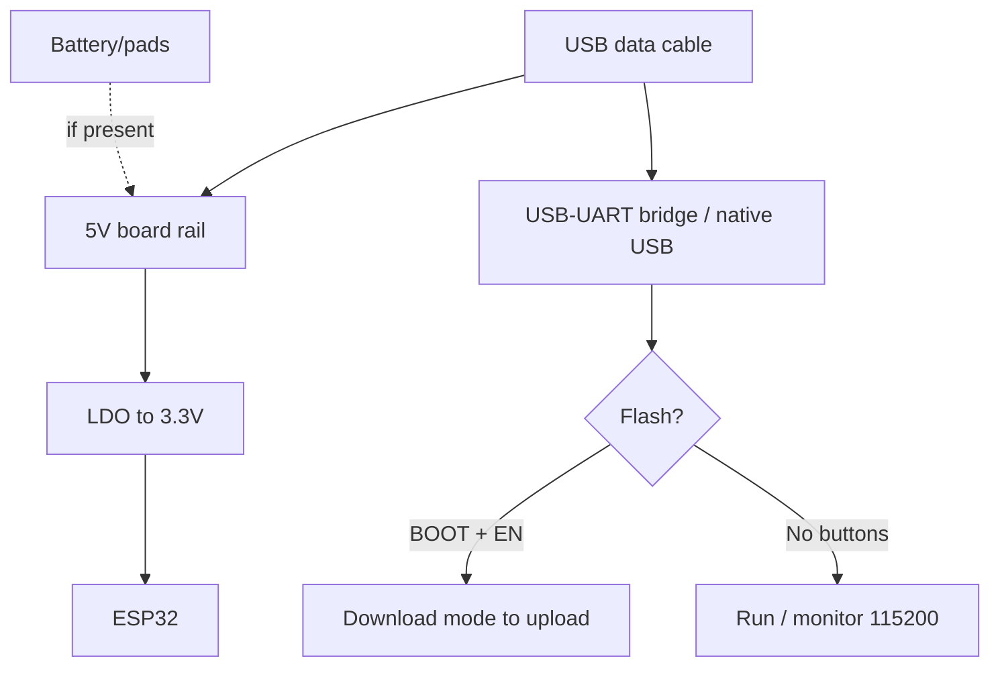

# HMI-Boards: Guition / CrowPanel / WT32-SC01 / T-Embed

> [!tip] Why ready-made HMI
> A control panel with display + touch + ESP32 on one PCB costs less than a kit of separate modules and needs no ribbon soldering: Guition JC8048W550/JC3248W535 (cheap S3-HMI "with demo from the factory"!), Elecrow CrowPanel (wiki docs + LVGL examples), Wireless-Tag WT32-SC01 (thin 3.5 inch + separate power LDOs!), LilyGO T-Embed (S3 + encoder + sound!). Drawing interfaces - [[11-Vivid/12-LVGL-SquareLine.en | LVGL/SquareLine]], board overview - [[00-Start/04-Dev-Boards.en | DevKit boards]].
>
> [!warning] The display is a separate load!
> A 5-7 inch RGB panel eats 250-500 mA on backlight alone: feed HMI from a 5V/2A brick, not from a laptop USB port. Dim the backlight with PWM, do not budget a battery for 7 inch. Details in the power section below.

## Purpose

Guition JC8048W550 (5.0 inch 800x480) / JC3248W535 (3.5 inch 480x320) are budget ESP32-S3 HMI panels: ESP32-S3-WROOM-1 module (16 MB Flash, 8 MB PSRAM), capacitive/resistive touch to choose, TF slot, LiPo circuit, factory demo firmware ("switched on - works"). Development: Arduino/ESP-IDF/MicroPython or the branded Guition GUI editor (drag-and-drop + OTA). CrowPanel (Elecrow) is a 2.4-7.0 inch line on ESP32/S3 with wiki docs per size: schematics, pinout, LVGL demos, SquareLine projects, ESPHome examples. WT32-SC01 is a thin 3.5 inch 320x480 (ST7796S + FT6336U) on ESP32-WROVER-B; the Plus version is ESP32-S3, 16 MB Flash, IPS. Its trick is two separate 3.3V LDOs (board apart, expansion shields apart - no sag!). T-Embed (LilyGO) is a pocket S3 media panel: 1.9 inch TFT + encoder with button + I2S speaker + 2 microphones + SD + 1300 mAh battery. The CC1101 version adds Sub-GHz radio and NFC.

| Parameter | Guition JC8048W550 | Guition JC3248W535 | CrowPanel 7.0 inch | WT32-SC01 / Plus | T-Embed |
| --- | --- | --- | --- | --- | --- |
| Purpose | Cheap 5 inch panel | Compact 3.5 inch panel | Documented HMI line | Thin built-in display | Pocket remote with encoder |
| Chip | ESP32-S3-N16R8 | ESP32-S3 | ESP32-S3-WROOM-1-N4R8 | ESP32 / ESP32-S3 (Plus) | ESP32-S3 |
| Diagonal | 5.0 inch 800x480 | 3.5 inch 480x320 | 7.0 inch 800x480 (2.4-5.0 exist) | 3.5 inch 320x480 | 1.9 inch 320x170 |

## Specifications

| Specification | JC8048W550 | JC3248W535 | CrowPanel 7.0 inch | WT32-SC01 (classic) | WT32-SC01 Plus | T-Embed |
| --- | --- | --- | --- | --- | --- | --- |
| Chip/module | S3-N16R8, 240 MHz | S3, 240 MHz | S3-WROOM-1-N4R8 | ESP32-WROVER-B (4 MB + 8 MB PSRAM) | S3, 16 MB + PSRAM | S3, 16 MB + 8 MB |
| Display | 5.0 inch IPS 800x480, ST7262, RGB | 3.5 inch 480x320, touch | 7.0 inch 800x480 TN, EK9716+EK73002 | 3.5 inch 320x480 ST7796S, SPI | 3.5 inch IPS, parallel | 1.9 inch ST7789V 320x170, SPI |
| Touch | None / resistive / capacitive (3 SKUs!) | Capacitive | Capacitive GT911 (I2C 19/20) | Capacitive FT6336U, 2 points | Multitouch | None (encoder!) |
| Sound | None (I2S free) | None | I2S speaker (18/42/17) | None | None | MAX98357A + speaker + 2 microphones! |
| Encoder | None | None | None | None | None | 24 steps + button! |
| SD | TF slot | TF slot | TF (SPI 11/13/12/10) | None | microSD | MicroSD (SPI) |
| Battery | LiPo circuit on board | LiPo circuit | BAT connector + charging (PH2.0) | None | None | Li-Po port + 1300 mAh in box |
| USB | USB-C / UART connector | USB-C | USB-C (UART0) + HY2.0 | Type-C | Type-C | USB-C |
| Power supply | 5V, ~320 mA | 5V | External DC 5V-2A! | DC 5V/2A, 2x 3.3V LDO | DC 5V/2A | 5V USB / battery |
| Buttons | BOOT/RESET | BOOT/RESET | BOOT + Reset | RST (touch!) + power | RST + power | Encoder button + BOOT/RST |
| Size | 134x80 mm | ~105x74 mm | ~165x110 mm | 92x60 mm (thin!) | 92x60 mm | 95x36 mm |

> [!tip] CYD legend
> Guition makes the "Cheap Yellow Display" (ESP32-2432S028, 2.8 inch on classic ESP32). If you see a yellow 2.8 inch board, it is the ancestor of the JC series: cheap but with no PSRAM for big LVGL.

## Pinout features

Guition: the RGB display eats ~20 GPIO (B0-B4, G0-G5, R0-R4 + HSYNC/VSYNC/PCLK/DE - as in the CrowPanel example below). About 10 IO stay free on the header + I2C for touch (GT911 typically 0x5D). TF card on SPI. Before a project check the Interface Description in the PDF datasheet of your exact model (N/R/C - no touch/resistive/capacitive!).

CrowPanel 7.0 inch (typical for the whole S3 line): the S3 RGB bus is routed as in the LovyanGFX example (pins 0/1/3-9/14-16/21/39-48 - busy!). User pins: GPIO_D (IO38), UART RX43/TX44, I2C SDA19/SCL20 (shared with touch - you can hang sensors on the same bus!), SPK-I2S (18/42/17), SD-SPI (11/13/12/10), backlight IO2 (PWM!), BAT connector. Sensors go only on free HY2.0 ports, not on RGB pins!

WT32-SC01: display on HSPI (up to 80 MHz), FT6336U touch on I2C. Side 2x40-pad expansion: GPIO, I2C, I2S, UART, 5V/3.3V/GND - buttons, voice, camera attach by ribbon. Shield power comes from a separate LDO (does not sag the S3!).

T-Embed: ST7789V display (SPI), encoder (rotation + press), 7x APA102 RGB (SPI-driven!), MAX98357A (I2S), 2x MEMS microphones (PDM), SD, 2x QWIIC (I2C expansion!), 8-pin 2.54 GPIO header. The CC1101 version adds Sub-GHz radio + NFC PN532. Its cousin in spirit is M5Stack Dial (round display + encoder + RFID, see [[14-Devboards/06-M5Stack-Core-Stick.en | M5Stack]]).

## Power supply features

| Source | Guition 5.0 inch | CrowPanel 7.0 inch | WT32-SC01 | T-Embed |
| --- | --- | --- | --- | --- |
| External 5V | 5V input, ~320 mA with display | DC 5V-2A mandatory! | DC 5V/2A | USB-C 5V |
| USB | Power + flashing (a weak PC port is marginal!) | USB-C: flashing + log, power from the brick! | Type-C: power + data | Charging + work |
| Backlight | Brightness control (BL pin) | IO2 PWM - dim when idle! | BL control | BL + 7x RGB (hungry!) |
| Battery | LiPo circuit (charge/protect) | BAT connector + charging | None stock | 1300 mAh + BQ management (CC1101 version) |
| LDO | Built-in 3.3V | Built-in 3.3V | 2x 3.3V separate (board / shields!) | Built-in + power hold pin |

> [!warning] The display feeds apart from logic
> The classic mistake is driving a 7 inch panel from a laptop USB (500 mA): on white screens the panel takes a peak and the S3 reboots. The right scheme: 5V/2A brick to the board; USB for flashing/log only. Always hang the backlight on PWM and dim to 30-50% when idle - that is minus 150-200 mA at once.
>
> [!tip] Two LDOs in WT32-SC01
> One LDO feeds the board itself, the second feeds the expansion headers. An external module with sags (GSM, motor) will not lay down the ESP32 - rare care for stability in this class.

## USB-UART features

Guition/CrowPanel: flashing over USB-C (UART bridge or native S3 - depends on revision) + "one-click download" in the Guition utility. Speeds 921600/1500000. The CrowPanel wiki gives its own schematic and display init example per diagonal - do not drag an example from 5.0 inch onto 7.0 inch (RGB timings differ!). WT32-SC01: Type-C with auto-reset, Arduino/TFT_eSPI/LovyanGFX with no dance. T-Embed: native S3 USB-C (USB CDC On Boot Enabled!), BOOT/RST reachable. Bridge details - [[13-Power-Modules/05-USB-UART-AutoReset.en | USB-UART]].

## Buttons

Guition: BOOT + RESET (download entry is classic: BOOT at power-on). CrowPanel: BOOT + Reset + separate power button with LED. WT32-SC01: touch RST (EN pin!) + power key for the whole board with shields. T-Embed: encoder with press is the main UI element (rotation + click), plus BOOT/RST. In LVGL the encoder maps as an input device (focus group!) - the menu turns with a physical knob.

## What it fits

- Guition 5.0 inch/3.5 inch: thermostats, 3D-printer panels, queue boards, home automation - where cheap with factory demo is needed.
- CrowPanel: projects where docs and repeatability matter (wiki + schematics + LVGL examples per size), ESPHome panels.
- WT32-SC01: built-in remotes (thin case!), wall switches with a screen, 8MS GUI builder for a customer with no code.
- T-Embed: portable remote/audio player (I2S speaker + microphones!), Sub-GHz remote (CC1101 version), LVGL toys with an encoder.
- NOT a fit: battery months with a big screen (the screen eats any LiPo in hours); outdoors with no protection (TN panels go blind in sun, working range -20...+70 C); exact analog measurements nearby (backlight noises ground - route apart).

## Flashing for LVGL/SquareLine

Three paths, from simple to flexible:

1. Branded GUI (Guition tool / WT32 8MS): drag-and-drop widgets to one-click download / OTA. Fast but vendor-locked.
2. SquareLine Studio + LVGL: draw UI with a mouse to export C code to an Arduino/ESP-IDF project with LovyanGFX/Arduino_GFX driver. The CrowPanel-wiki and T-Embed-example path. Libraries: `lvgl`, `LovyanGFX` / `Arduino_GFX`.
3. Plain Arduino_GFX/TFT_eSPI with no LVGL: buttons/text in code - enough for simple boards and lighter than RAM.

```ini
; PlatformIO — Guition JC8048W550 (S3, 16 МБ Flash, 8 МБ Octal PSRAM)
[env:guition-s3]
platform = espressif32
board = esp32-s3-devkitc-1
framework = arduino
upload_speed = 921600
monitor_speed = 115200
board_build.flash_size = 16MB
board_build.psram_type = opi
lib_deps = lvgl/lvgl@^9.1.0, lovyan03/LovyanGFX@^1.1.0

; PlatformIO — CrowPanel 7.0 / WT32-SC01 Plus (S3 + LVGL)
[env:crowpanel-s3]
platform = espressif32
board = esp32-s3-devkitc-1
framework = arduino
upload_speed = 921600
monitor_speed = 115200
board_build.psram_type = opi
lib_deps = lvgl/lvgl@^9.1.0, lovyan03/LovyanGFX@^1.1.0

; PlatformIO — LilyGO T-Embed (S3, дисплей + енкодер + I2S)
[env:t-embed]
platform = espressif32
board = esp32-s3-devkitc-1
framework = arduino
monitor_speed = 115200
board_build.psram_type = opi
lib_deps =
  lvgl/lvgl@^8.3.0
  moononournation/Arduino_GFX@^1.1.0
  schreibfaul1/ESP32-audioI2S@^2.0.0
```

> [!warning] PSRAM is mandatory for LVGL
> An 800x480 RGB panel at 16 bit is 768 KB per frame - with no PSRAM (OPI, 80 MHz) LVGL will not start. In menuconfig/Arduino menu: PSRAM `OPI PSRAM`, Partition Scheme with margin for factory + OTA. LVGL details - [[11-Vivid/12-LVGL-SquareLine.en | LVGL/SquareLine]].

## Common issues

| Symptom | Cause | Fix |
| --- | --- | --- |
| Reboots on white screen | 5V sag (laptop USB) | 5V/2A brick, thick cable |
| Example from another diagonal gives stripes/shift | Different RGB timings and drivers | Take the example of your exact model from the wiki |
| Touch mute, display alive | Wrong I2C address (GT911 0x5D/0x14) / wrong bus | I2C scanner, SDA19/SCL20 for CrowPanel |
| LVGL does not fit RAM | PSRAM off / QSPI instead of OPI | OPI PSRAM + `BOARD_HAS_PSRAM` flag |
| Guition misses the board | Not in download mode | BOOT at power-on, one-click tool |
| WT32 colors split (RGB/BGR) | Panel byte order | `setColorDepth` / swap bytes in driver |
| T-Embed: "two-step" encoder | Contact bounce | RotaryEncoder library with debounce |
| I2S hiss in speaker | Ground shared with backlight | Separate ground wire, ferrite on power |
| OTA bricks HMI | Small factory partition | Partition with OTA (2x app), test on USB |
| Cyrillic shows "krakozyabry" | No glyphs in the LVGL font | Add Cyrillic range in the font converter |

## Power and flashing schematic

> [!example] Photo/schematic: ![[assets/img/devboard-hmi-guition-scheme.png|600]]

```text
[Блок 5V/2A] ──► плата HMI ──► LDO 3.3V ──► S3-логіка
                          └─► підсвітка (PWM! IO2/BL) 150–300 мА окремо!
  USB-C від ПК — ТІЛЬКИ шити/лог, не живити 7" панель!

Guition: [USB] ─► one-click-tool ─► S3 (16МБ/8МБ). TF-слот під картинки/шрифти.
  Тач: N/R/C-версії різні! I2C-адрес перевірити сканером.
CrowPanel: RGB-шина S3 (20+ пінів ЗАЙНЯТО) + I2C19/20 (тач GT911 + ваші датчики!).
  Вільні: IO38, UART43/44, SD-SPI. Приклади — строго своєї діагоналі з вікі!
WT32-SC01: [Type-C] ─► LDO-А (плата) + LDO-Б (шилди) — просадки шилдів не валять S3.
  Дисплей HSPI ≤80 МГц. Тонкий корпус — у стіну/пульт!
T-Embed: [USB-C / LiPo 1300] ─► S3 ─► TFT-SPI + енкодер + APA102 + MAX98357A(I2S).
  LVGL input = енкодер-група. CC1101-версія: +Sub-GHz радіо + NFC.
```

## Official sources

- Guition - CYD/HMI modules (JC series: specs, 5V power, Arduino/ESP-IDF/MicroPython): <https://www.guition.com/esp32-display-module/cyd-display-module>
- Elecrow Wiki - CrowPanel ESP32 HMI 7.0 inch (pinout, RGB timings, LVGL examples, schematics): <https://www.elecrow.com/wiki/esp32-display-702727-intelligent-touch-screen-wi-fi26ble-800480-hmi-display.html>
- Wireless-Tag - WT32-SC01 GitHub (ESP-IDF example, LVGL partitions, firmware): <https://github.com/wireless-tag-com/WT32-SC01>
- LilyGO Wiki - T-Embed (S3, ST7789V, encoder, MAX98357A, battery, Arduino/PIO settings): <https://wiki.lilygo.cc/products/t-embed-series/t-embed>
- LilyGO Wiki - T-Embed (verified webfetch 2026-09-29: ST7789V 320x170, 24-step encoder, 7x APA102, MAX98357A + 2 microphones, 16 MB Flash + 8 MB PSRAM, 1300 mAh Li-Po, 2x QWIIC, Arduino settings ESP32S3 Dev Module / QIO 80MHz / OPI PSRAM / 921600)
- Wireless-Tag - WT32-SC01 GitHub (repo exists, ESP-IDF v4.4 base, LVGL partitions, build `idf.py build` / `idf.py flash`): <https://github.com/wireless-tag-com/WT32-SC01> (verified webfetch 2026-09-29)
- Elecrow Wiki - CrowPanel 7.0 inch (verified webfetch 2026-09-29: S3-WROOM-1-N4R8, TN 800x480 EK9716BD3+EK73002ACGB, GT911 on SDA19/SCL20, SD-SPI 11/13/12/10, backlight IO2, I2S 18/42/17, UART 43/44, BAT PH2.0 + charging, DC 5V-2A power, full LovyanGFX RGB pin map; board materials in the Github Link / Schematic & PCB section of the wiki page)
- Guition (verified webfetch 2026-09-29 on the 4.3 inch ESP32-S3R8 800x480 ST7265 card: 16 MB Flash + 8 MB PSRAM, 5V ~260 mA power, TF slot, one-click download, Arduino/ESP-IDF/MicroPython/Mixly, factory demo)
- Espressif - ESP32-S3 Datasheet (RGB-LCD peripheral and timings, strapping, ADC): <https://www.espressif.com/sites/default/files/documentation/esp32-s3_datasheet_en.pdf>

## Full HMI board cards (expanded)

> [!tip] How to use the cards
> Each card is a self-sufficient minimum to start: pin table, power supply, buttons/BOOT mode, USB, exact board name in Arduino IDE + ready PlatformIO-ini, antenna, sleep, traps. Check exact GPIO numbers of pads against PDF schematics and Pinout pages in "Official sources" - board revisions differ! General topics: strapping - [[03-GPIO/02-Strapping-Pins.en | Strapping]], USB/JTAG - [[04-Interfaces/06-USB-OTG-JTAG.en | USB/JTAG]], sleep - [[07-Timers/03-Sleep-ULP.en | Sleep/ULP]], batteries - [[02-Power-Supply/04-Batteries-TP4056.en | Batteries]], antennas - [[01-Hardware/08-Antennas-RF.en | Antennas/RF]], ADC - [[06-Analog/01-ADC.en | ADC]].

### Card 1 - Guition JC8048W550 (5.0 inch 800x480)

Budget S3-HMI: ESP32-S3R8 module (dual 240 MHz, 512KB SRAM, **16 MB Flash + 8 MB PSRAM**), IPS 800x480 16-bit (65K colors), **ST7262**-class driver (RGB interface!), three touch SKUs - **N (none) / R (resistive XPT2046) / C (capacitive GT911)**. Power **5V, ~260-320 mA with display** (vendor measurement on the 4.3 inch relative - ~260 mA). TF slot, LiPo circuit, factory demo ("switched on - works"), one-click download, OTA updates, UTF-8 (Cyrillic in the issues section!).

| Parameter | Value |
| --- | --- |
| Display | 5.0 inch IPS 800x480, RGB interface (~20 GPIO busy: R0-R4/G0-G5/B0-B4 + HSYNC/VSYNC/PCLK/DE!) |
| Touch | N - none / R - XPT2046 (SPI) / C - GT911 (I2C, typically 0x5D) |
| Free IO | ~10 on header + TF on SPI |
| Power supply | 5V input; backlight with BL control; LiPo circuit on board |
| Environments | Arduino / ESP-IDF / MicroPython / Mixly / branded Guition GUI editor |

LVGL/SquareLine step by step (Arduino path): 1) install Arduino IDE + esp32 core 2.0.8 or newer; 2) board `ESP32S3 Dev Module`, PSRAM `OPI`, Flash 16MB, Partition with OTA; 3) libraries `lvgl` + `LovyanGFX`; 4) draw UI in SquareLine to Export to copy `ui_*.c/h` into the project; 5) init the RGB panel (pins from the **Interface Description PDF of JC8048W550 exactly**!); 6) bind flush + touch I2C; 7) compile to BOOT at power-on to one-click-tool or esptool at 921600. Codeless alternative: Guition GUI editor (drag-and-drop to one-click download / OTA) - fast but vendor-locked.

LovyanGFX: RGB-bus skeleton (exact pins from your model PDF, timings are sensitive!):

```cpp
// Guition 5.0" ST7262: RGB-панель. ПІНИ І ТАЙМІНГИ — З INTERFACE DESCRIPTION PDF!
auto cfg = _bus_instance.config();
cfg.panel = &_panel_instance;
// cfg.pin_d0..d15 = B0-B4, G0-G5, R0-R4  (див. PDF!)
// cfg.pin_hsync / pin_vsync / pin_pclk / freq_write ~15-16 МГц
// cfg.hsync_front_porch / pulse_width / back_porch — з PDF, інакше смуги!
```

Case: open 134x80 mm PCB with mounting holes - on M3 standoffs or a printed frame; for a wall use a frame with a window + 5V/2A brick next to it. Issues: white screen = wrong driver/timings (fixed by the JC8048W550 example exactly!); touch mute = mixed-up SKU (the N version has no touch physically!) or GT911 address; reboots on white = laptop-USB power (5V/2A brick!).

### Card 2 - Guition JC3248W535 (3.5 inch 480x320) + CYD 2.8 inch great-grandfather

Compact S3-HMI 3.5 inch 480x320 (~105x74 mm): the same recipe (S3 + PSRAM + TF + LiPo circuit + USB-C + factory demo) but eats less and fits in easier. Touch is capacitive (C-SKU, GT911-class). RGB/SPI interface depends on revision - check the PDF!

A separate line about the "yellow" legend: **CYD ESP32-2432S028 2.8 inch** - the ancestor on classic ESP32 (no PSRAM!): typically ILI9341 320x240 SPI display + resistive XPT2046. Cheap, but big LVGL will not fit - take it as a "text/button terminal", not a graphics station. SPI display details - [[11-Vivid/02-TFT-LCD-Epaper.en | TFT/LCD]].

```ini
; PlatformIO — Guition JC8048W550 / JC3248W535 (S3, 16МБ, OPI PSRAM)
[env:guition-s3]
platform = espressif32
board = esp32-s3-devkitc-1
framework = arduino
upload_speed = 921600
monitor_speed = 115200
board_build.flash_size = 16MB
board_build.psram_type = opi
lib_deps = lvgl/lvgl@^9.1.0, lovyan03/LovyanGFX@^1.1.0
```

> [!warning] LVGL 8 vs 9
> CrowPanel/Guition wiki examples are often on LVGL v8 (old-style `lv_...` API), while PIO pulls v9 by default (a different display/event model!). Do not mix: either pin `lvgl@^8.3.0` for an old example or port the code to v9. The symptom of mixing is hundreds of compile errors in `lv_hal`/`lv_indev`.

### Card 3 - Elecrow CrowPanel (2.4-7.0 inch line, focus 7.0 inch)

The best-documented HMI line: each diagonal gets its own wiki (schematic, pinout, LVGL demo, SquareLine project, ESPHome example!). The 7.0 inch flagship (DIS08070H module): **S3-WROOM-1-N4R8**, **7.0 inch TN 800x480, EK9716BD3 + EK73002ACGB**, capacitive GT911, DC **5V-2A mandatory**, BAT PH2.0 connector + charging, speaker via on-board I2S amplifier.

| 7.0 inch port (wiki measurement!) | Pins | Where |
| --- | --- | --- |
| RGB display (20+ pins BUSY!) | B0-B4: 15/7/6/5/4; G0-G5: 9/46/3/8/16/1; R0-R4: 14/21/47/48/45; HSYNC 39, VSYNC 40, DE/henable 41, PCLK 0, ~15 MHz | Display only, no sensors here! |
| GT911 touch | SDA 19 / SCL 20 | Same bus - you can hang your own I2C sensors! |
| SD card (SPI) | MOSI 11 / MISO 13 / CLK 12 / CS 10 | Pictures, fonts, logs |
| Sound (I2S) | LRCLK 18 / BCLK 42 / SDIN 17 | Speaker via on-board amplifier (PH2.0-2P) |
| UART | RX 44 / TX 43 (HY2.0-4P) | Modules, receipt printers |
| GPIO_D | IO38 (HY2.0-4P) | Only free digital + I2C ports! |
| Backlight | IO2 (PWM!) | Dim to 30-50% when idle - minus ~150 mA! |
| Power/buttons | BAT PH2.0 (+charging), BOOT + Reset + power button with LED | USB-C for flashing/log, power from the brick! |

> [!warning] V3 revision and touch timings
> V3 CrowPanel 7.0 inch adds touch timing control (PCA9557 expander): before GT911 init you must reset the expander (OUT LOW to HIGH, ~20/100 ms per the wiki example), else "touch is dead" with a live display. Write code on top of the **V2 + timing patch** example, not from zero!

LovyanGFX for 7.0 inch - full map from the wiki (webfetch-verified, works as is):

```cpp
class LGFX : public lgfx::LGFX_Device {
public:
  lgfx::Bus_RGB _bus_instance;
  lgfx::Panel_RGB _panel_instance;
  LGFX(void) {
    { auto cfg = _bus_instance.config();
      cfg.panel = &_panel_instance;
      cfg.pin_d0 = GPIO_NUM_15; cfg.pin_d1 = GPIO_NUM_7;
      cfg.pin_d2 = GPIO_NUM_6;  cfg.pin_d3 = GPIO_NUM_5;
      cfg.pin_d4 = GPIO_NUM_4;  cfg.pin_d5 = GPIO_NUM_9;
      cfg.pin_d6 = GPIO_NUM_46; cfg.pin_d7 = GPIO_NUM_3;
      cfg.pin_d8 = GPIO_NUM_8;  cfg.pin_d9 = GPIO_NUM_16;
      cfg.pin_d10 = GPIO_NUM_1; cfg.pin_d11 = GPIO_NUM_14;
      cfg.pin_d12 = GPIO_NUM_21; cfg.pin_d13 = GPIO_NUM_47;
      cfg.pin_d14 = GPIO_NUM_48; cfg.pin_d15 = GPIO_NUM_45;
      cfg.pin_henable = GPIO_NUM_41; cfg.pin_vsync = GPIO_NUM_40;
      cfg.pin_hsync = GPIO_NUM_39;   cfg.pin_pclk = GPIO_NUM_0;
      cfg.freq_write = 15000000;
      cfg.hsync_polarity = 0; cfg.hsync_front_porch = 40;
      cfg.hsync_pulse_width = 48; cfg.hsync_back_porch = 40;
      cfg.vsync_polarity = 0; cfg.vsync_front_porch = 1;
      cfg.vsync_pulse_width = 31; cfg.vsync_back_porch = 13;
      cfg.pclk_active_neg = 1; cfg.de_idle_high = 0; cfg.pclk_idle_high = 0;
      _bus_instance.config(cfg); }
    { auto cfg = _panel_instance.config();
      cfg.memory_width = 800; cfg.memory_height = 480;
      cfg.panel_width = 800;  cfg.panel_height = 480;
      cfg.offset_x = 0; cfg.offset_y = 0;
      _panel_instance.config(cfg); }
    _panel_instance.setBus(&_bus_instance);
    setPanel(&_panel_instance);
  }
};
LGFX lcd;
// Тач: #define TOUCH_GT911_SDA 19 / SCL 20 (див. touch.h прикладу!)
```

```ini
; PlatformIO — CrowPanel 7.0" (S3 + LVGL)
[env:crowpanel-s3]
platform = espressif32
board = esp32-s3-devkitc-1
framework = arduino
upload_speed = 921600
monitor_speed = 115200
board_build.psram_type = opi
lib_deps = lvgl/lvgl@^9.1.0, lovyan03/LovyanGFX@^1.1.0
```

Case: ~165x110 mm board - into a printed wall frame or a desk stand. ESPHome path: CrowPanel supports ESPHome (sensors/buttons in YAML, display in an `lvgl:` section) - the fastest path to Home Assistant with no C++.

### Card 4 - Wireless-Tag WT32-SC01 (classic, ESP32)

Thin built-in 3.5 inch 92x60 mm: ESP32-WROVER-B (4 MB Flash + 8 MB PSRAM), **320x480 ST7796S over HSPI (up to 80 MHz!)**, capacitive **FT6336U** (2 points, I2C), its trick is **two separate 3.3V LDOs** (board apart / expansion shields apart - GSM/motor sags do not kill the ESP32!). Side 2x40 pads: GPIO/I2C/I2S/UART/5V/3.3V - buttons, voice, camera on ribbons. No stock battery. Flashing: Arduino/TFT_eSPI/LovyanGFX with no dance, ESP-IDF example and LVGL partitions in the vendor GitHub repo (IDF v4.4 base, `idf.py build` / `idf.py flash`).

LovyanGFX (SPI template, pins from the vendor example!):

```cpp
// WT32-SC01: ST7796S 320x480, HSPI до 80 МГц. ПІНИ — З ПРИКЛАДУ WIRELESS-TAG!
{ auto cfg = _bus_instance.config();
  cfg.spi_mode = 0; cfg.freq_write = 80000000; cfg.freq_read = 20000000;
  cfg.spi_3wire = false; cfg.use_lock = true; cfg.dma_channel = 1;
  // cfg.pin_sclk / pin_mosi / pin_miso / pin_dc — з прикладу!
}
{ auto cfg = _panel_instance.config();
  cfg.pin_cs = ...; cfg.pin_rst = ...; cfg.pin_busy = -1;
  cfg.memory_width = 320; cfg.memory_height = 480;
  cfg.panel_width = 320;  cfg.panel_height = 480;
  cfg.color_mode = rgb565_2Byte; }
// Тач FT6336U — I2C-адрес сканером (див. розділ тачу!), 2 точки.
```

Case: thin - into a wall/sub-box/remote; 8MS GUI builder gives a customer an interface with no code. Issues: split colors = panel byte order (`setColorDepth`/`swapBytes`!); mute touch = wrong I2C bus; a shield sags power = check the shield sits on LDO-B, not on logic.

### Card 5 - WT32-SC01 Plus (S3 version)

The same thin 92x60 mm, but **ESP32-S3, 16 MB Flash + PSRAM, IPS panel with parallel interface**, microSD on board. Touch is multitouch (capacitive). Power is the same DC 5V/2A + 2x LDO philosophy. Environments are Arduino/LVGL as on the classic, partitions with OTA margin.

```ini
; PlatformIO — WT32-SC01 Plus (S3 + LVGL)
[env:wt32sc01-plus]
platform = espressif32
board = esp32-s3-devkitc-1
framework = arduino
upload_speed = 921600
monitor_speed = 115200
board_build.flash_size = 16MB
board_build.psram_type = opi
lib_deps = lvgl/lvgl@^9.1.0, lovyan03/LovyanGFX@^1.1.0
```

Case/issues: as the classic, plus S3 nuances (USB CDC On Boot `Enabled`, OPI PSRAM mandatory - LVGL will not start without it, the 320x480x2 byte RGB buffer is heavy by itself!).

### Card 6 - LilyGO T-Embed (pocket S3 media panel)

95.4x36.4 mm, **S3 dual 240 MHz + 16 MB Flash + 8 MB PSRAM**: **1.9 inch ST7789V IPS 320x170 (SPI!)**, **24-step encoder + button** (the main UI element!), **7x APA102 RGB** (SPI-driven, hungry!), **MAX98357A I2S + speaker**, **2x MEMS PDM microphones**, MicroSD (SPI), **2x QWIIC**, Li-Po port + **1300 mAh in box**. The **CC1101** version adds Sub-GHz radio + NFC PN532 (see [[12-Comm-Modules/06-HC05-HM10-CC1101-HC12.en | CC1101]]). Libraries: FastLED, ESP32-audioI2S, LVGL, RotaryEncoder. Plays MP3/AAC/WAV from microSD via MAX98357A!

Arduino settings (wiki measurement!): `ESP32S3 Dev Module` board, USB CDC On Boot `Enable`, CPU 240MHz (WiFi), Flash Mode QIO 80MHz, Flash Size 16MB, Partition `16M Flash (3MB APP/9.9MB FATFS)`, PSRAM `OPI PSRAM`, Upload Mode UART0/Hardware CDC, Upload Speed 921600.

```ini
; PlatformIO — LilyGO T-Embed (дисплей + енкодер + I2S)
[env:t-embed]
platform = espressif32
board = esp32-s3-devkitc-1
framework = arduino
monitor_speed = 115200
board_build.flash_size = 16MB
board_build.psram_type = opi
lib_deps =
  lvgl/lvgl@^8.3.0
  moononournation/Arduino_GFX@^1.1.0
  schreibfaul1/ESP32-audioI2S@^2.0.0
```

```cpp
// LVGL + енкодер: меню крутиться фізичною ручкою (LVGL v8 API!)
lv_group_t *g = lv_group_create();
lv_group_add_obj(g, ui_menu);            // віджети екрана — в групу фокусу
// lv_indev_drv_t enc_drv; ... enc_drv.type = LV_INDEV_TYPE_ENCODER;
// читання енкодера — через RotaryEncoder з дебаунсом (інакше «двокроки»!)
```

LovyanGFX (ST7789V 320x170, pins/offsets from the LilyGO example!): SPI-bus + `memory_width 320 / memory_height 170` + `offset_x/offset_y` per the example + `setRotation()` for orientation + PWM backlight.

Case: a pocket remote/audio player with battery; the encoder is the only control (design UI for "twist + press", not for touch!). Issues: "two-step" encoder = bounce (debounce library!); I2S hiss = ground shared with backlight (separate ground wire + ferrite!); 7x APA102 at max eat more than the display (cap brightness!).

### Card 7 - Encoder relatives: LilyGO T-Dial / M5Stack Dial (short)

Round display + encoder + RFID - the "desk knob" form factor. M5Stack Dial in detail - [[14-Devboards/06-M5Stack-Core-Stick.en | M5Stack]] (same place for the stack ecosystem). The logic is the same as T-Embed: LVGL focus group on the encoder, 5V/battery power, desk case. Pick by ecosystem (M5 for stack modules, LilyGO for an open board).

## Touch controllers: GT911 vs FT6336U vs CST816 vs XPT2046

| Controller | Interface | Where it sits in our HMI | Features |
| --- | --- | --- | --- |
| GT911 | I2C (addresses 0x5D/0x14!) | CrowPanel (SDA19/SCL20), Guition C-SKU | 5-point multitouch; address depends on revision - **I2C scanner mandatory!** |
| FT6336U | I2C | WT32-SC01 (2 points) | Compact, stable; bus shared with sensors |
| CST816 | I2C | Small SPI displays (landmark for expansion!) | 1 point/gestures; not the main one on the big HMI of this note - do not confuse! |
| XPT2046 | SPI | Guition R-SKU, CYD 2.8 inch (resistive!) | Works with stylus/gloves; needs calibration + separate CS/IRQ pins |

```cpp
// I2C-сканер тачу за 30 секунд (будь-яка HMI! SDA/SCL підставте свої)
#include <Wire.h>
void setup() {
  Serial.begin(115200);
  Wire.begin(19, 20);  // <-- SDA/SCL ВАШОЇ плати (CrowPanel: 19/20!)
  for (uint8_t a = 1; a < 127; a++) {
    Wire.beginTransmission(a);
    if (!Wire.endTransmission()) Serial.printf("I2C: 0x%02X\n", a);
  }
}
```

> [!warning] Touch mirrors / axes swapped
> The display is alive but presses are "mirrored" - not a defect but orientation flags! Fixed by the pair: display `setRotation(n)` + touch driver `swap_xy / mirror_x / mirror_y` (in LovyanGFX - `touch_instance.config()` / `setTouch()`). Algorithm: set display rotation to tap 4 corners to pick flags to pin in code. GT911 sometimes wants re-init after a rotation change!

## Display power in detail: separate LDO and backlight current

| Board | Power chain | Backlight current, typical |
| --- | --- | --- |
| Guition 5.0 inch/4.3 inch | Built-in 3.3V + BL control; 5V input | ~260-320 mA with display (white screen = peak!) |
| CrowPanel 7.0 inch | Built-in 3.3V; backlight IO2 PWM | 150-300 mA backlight alone; DC 5V-2A input! |
| WT32-SC01 / Plus | **2x 3.3V LDO** (board / shields apart!) | BL control; 5V/2A input |
| T-Embed | Built-in + 1300 mAh Li-Po (+ hold logic) | TFT + 7x APA102 - brightness is runtime! |

Battery math (honest): T-Embed 1300 mAh at ~250 mA (display + quiet sound) is about 5 hours; CrowPanel 7.0 inch on battery is hours, not days (the screen eats any LiPo in an evening!). Conclusion: big HMI runs from a 5V/2A brick only; a battery is only for pocket boards (T-Embed) and as UPS.

```cpp
// Дімування підсвітки (CrowPanel: BL = IO2; Guition/T-Embed: свій BL-пін!)
#define BL_PIN 2
void setup() {
  ledcAttach(BL_PIN, 5000, 8);   // 5 кГц, 8 біт
  ledcWrite(BL_PIN, 128);        // 50% — мінус ~150 мА одразу!
}
// У простої: ledcWrite(BL_PIN, 40); по дотику/енкодеру — назад 128+.
```

> [!warning] White screens kill power
> Peak draw is a full white screen at full brightness. Powering 7 inch from laptop USB (500 mA) means a reboot exactly on white. The right scheme: 5V/2A brick to the board; PC USB for flashing/log only. Thick short cable!

## Flashing for LVGL/SquareLine: full route

1. Pick a path: branded GUI (Guition/8MS - no code, locked in) / SquareLine + LVGL (flexible) / plain Arduino_GFX with no LVGL (simple boards).
2. Install Arduino IDE + esp32 core (for S3 boards) or PlatformIO (ini files in the cards above!).
3. Enable **OPI PSRAM** + a partition with OTA margin (RGB 800x480x2 bytes = 768 KB per frame - no way with no PSRAM!). LVGL buffers go to PSRAM.
4. Install `lvgl` + `LovyanGFX` (or `Arduino_GFX` for the T-Embed path) + `ESP32-audioI2S`/`RotaryEncoder` as needed.
5. Draw UI in SquareLine Studio to Export to copy `ui_*.c/h` into the project (SquareLine LVGL version = `lvgl` version in `lib_deps`!).
6. Init the panel with the LovyanGFX config of **your exact diagonal** (CrowPanel 7.0 inch code above is ready; Guition pins from the PDF!).
7. Bind the `flush` callback + touch driver (GT911/FT6336U) or encoder group (T-Embed!).
8. Add Cyrillic glyphs (LVGL font converter, Cyrillic range - else "krakozyabry"!).
9. Flash at 921600, first time via BOOT/download mode; OTA only after a USB test and with a double app partition (see [[08-Memory/03-OTA.en | OTA]], partitions - [[08-Memory/01-Partitions-NVS.en | Partitions]]).
10. ESPHome alternative (CrowPanel!): display via the `lvgl:` YAML section + sensors as plain platforms - Home Assistant in an evening with no C++.

## Case and mounting

| Board | Form factor | How to mount |
| --- | --- | --- |
| Guition 5.0 inch/3.5 inch | Open PCB 134x80 / ~105x74 mm | M3 standoffs / printed frame; 5V/2A brick next to it |
| CrowPanel 7.0 inch | ~165x110 mm | Wall frame or desk stand; HY2.0 ribbons for sensors |
| WT32-SC01 / Plus | Thin 92x60 mm | Into a wall, wall box, remote; shields on ribbons |
| T-Embed | Pocket 95x36 mm + battery | Wearable remote/player; QWIIC sensors on ribbons |

No unprotected outdoors (TN goes blind in sun, IPS is better, but the working range is typically -20...+70 C + condensate!). Exact analog measurements next to a backlight need separate grounds (the backlight noises!). Screens are fragile: a frame with a window is mandatory, peel the touch film last.

## HMI common issues (expanded)

| Symptom | Cause | Fix |
| --- | --- | --- |
| **White screen** after flashing | Wrong driver / wrong RGB timings (example from another diagonal!) | Take the example of **your exact model** from the wiki; check the init sequence |
| Stripes / picture shift | Foreign porch/pulse-width timings | Copy timings 1:1 from the factory example |
| Touch mute, display alive | Wrong I2C address (GT911 0x5D/0x14) / wrong bus / V3 with no timing patch | I2C scanner; SDA19/SCL20 (CrowPanel); PCA9557 patch on V3 |
| Touch mirrors / axes swapped | Orientation flags | `setRotation` + `swap_xy/mirror` (algorithm in the touch section!) |
| Colors split (red is blue) | RGB/BGR panel byte order | `setColorDepth` / `swapBytes` in driver |
| LVGL does not fit RAM / Guru Meditation | PSRAM off or QSPI instead of OPI | OPI PSRAM + `BOARD_HAS_PSRAM` flag + buffers in PSRAM |
| Reboots on white screen | 5V sag | 5V/2A brick + thick cable + 50% dim |
| Guition misses the board | Not in download mode | BOOT at power-on + one-click tool |
| OTA bricks HMI | Small factory partition / no second app | OTA partition (2x app), USB test |
| Cyrillic shows "krakozyabry" | No glyphs in the LVGL font | Add Cyrillic range in the font converter |
| T-Embed: "two-step" encoder | Contact bounce | RotaryEncoder library with debounce |
| I2S hiss in speaker | Ground shared with backlight | Separate ground wire, ferrite on power |
| ESPHome: display does not refresh | Wrong `update_interval` / wrong driver in YAML | YAML example of your exact diagonal from the wiki |

> [!example] White-screen diagnosis in 5 minutes
>
> 1) Brick 5V/2A power? 2) Example of exactly my diagonal? 3) PSRAM = OPI? 4) RGB pins match the schematic? 5) Backlight (BL pin) on at all - maybe the picture is there but dark? Half of "white screens" are a switched-off backlight or a foreign example!

### Mermaid: board power and first flash



## See also

- [[Home.en | Home map]]
- [[00-Start/04-Dev-Boards.en | DevKit boards]]
- [[11-Vivid/12-LVGL-SquareLine.en | LVGL/SquareLine]]
- [[11-Vivid/02-TFT-LCD-Epaper.en | TFT/LCD/E-paper]]
- [[14-Devboards/06-M5Stack-Core-Stick.en | M5Stack (Dial encoder!)]]
- [[14-Devboards/10-Mini-Boards.en | Mini boards]]
- [[14-Devboards/12-Retro-Wearable.en | Retro and wearables]]
- [[04-Interfaces/04-I2S.en | I2S sound]]
- [[04-Interfaces/03-I2C.en | I2C (touch + sensors)]]
- [[09-Firmware/02-Arduino-PlatformIO.en | Arduino/PlatformIO]]
- [[99-Additions/02-Troubleshooting-FAQ.en | FAQ]]
