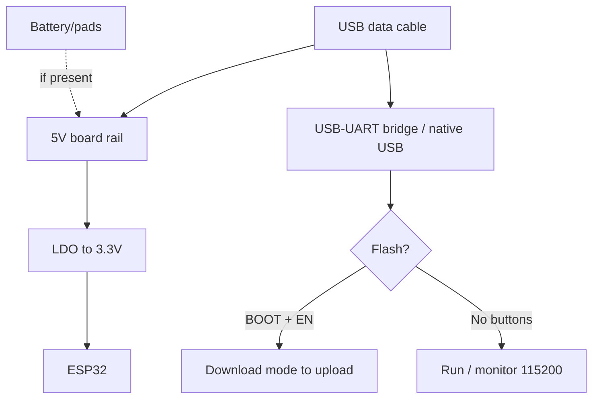

# Retro-Wearable: FabGL / Odroid-GO / T-Watch S3 / T-Deck

> [!tip] Why retro and wearables
> ESP32 can be an "80s computer" (FabGL: VGA + PS/2 keyboard + sound!), a game console (Odroid-GO: gamepad + emulators!), a watch (LilyGO T-Watch S3!) and a pocket LoRa terminal with a keyboard (T-Deck: BlackBerry style + GPS!). All are full devboards, just with a human interface. Overview - [[00-Start/04-Dev-Boards.en | DevKit boards]], sound - [[04-Interfaces/04-I2S.en | I2S]].
>
> [!warning] Toys with adult appetite
> VGA + sound + Wi-Fi is 300-500 mA; emulators heat the chip; a watch lives a day, not a month. Plan battery and heatsink at once, not "later".

## Purpose

FabGL + VGA32 board (TTGO VGA32 / Olimex ESP32-SBC-FabGL) is a retro PC on ESP32: VGA output (resistor DAC!), PS/2 mouse and keyboard, sound engine, GUI with windows, ANSI terminal, emulators (Altair 8800, VIC-20, IBM PC!). Odroid-GO (HardKernel, 2018, for the 10th ODROID anniversary) is a DIY gamepad kit: ESP32-WROVER, 2.4 inch TFT 320x240, speaker, SD, 1200 mAh battery (~10 hours of play!), 10-pin expansion. Launcher firmware (GO-Play, RetroESP32) runs emulators straight from memory. LilyGO T-Watch S3 is an open smartwatch on ESP32-S3: touch TFT, LoRa option, RTC + IMU + battery in a wrist case. T-Deck is a pocket BlackBerry-style S3 terminal: 2.8 inch LCD + physical keyboard (I2C!) + trackball + LoRa SX1262 + GPS (Plus) + microphone/speaker + 2000 mAh battery. Its stock niche is the Meshtastic messenger with no phones.

| Parameter | FabGL/VGA32 | Odroid-GO | T-Watch S3 | T-Deck / Plus |
| --- | --- | --- | --- | --- |
| Purpose | Retro PC: VGA + PS/2 | Game console kit | Wrist sensor watch | LoRa terminal with keyboard |
| Chip | ESP32 (classic!) | ESP32-WROVER | ESP32-S3 | ESP32-S3FN16R8 + C3 (keyboard!) |
| Input | PS/2 keyboard + mouse | D-pad + A/B + Menu | Touch screen | Keyboard + trackball |

## Specifications

| Specification | FabGL / VGA32 | Odroid-GO | T-Watch S3 | T-Deck | T-Deck Plus |
| --- | --- | --- | --- | --- | --- |
| Chip | ESP32-D0WD (S3 NOT supported!) | ESP32-WROVER, 16 MB Flash, 4 MB PSRAM | ESP32-S3 | ESP32-S3FN16R8, 16 MB + 8 MB | Same S3 |
| Display | VGA (external monitor!) + optional TFT | 2.4 inch 320x240 TFT, SPI | Touch TFT (round/rect by version) | 2.8 inch ST7789 320x240, SPI, no touch! | Same + MIA-M10Q GPS |
| Input | PS/2 keyboard + mouse, GPIO joystick | D-pad, A/B, Menu/Volume/Select/Start | Touch + buttons | Physical keyboard (I2C 0x55!) + trackball | Same |
| Sound | DAC/Sigma-Delta engine (mono) | 0.5W 8 ohm speaker + amplifier | Buzzer/speaker (by version) | ES7210 microphone + I2S speaker | Same |
| Radio | Wi-Fi/BT (terminal, OTA) | Wi-Fi/BT 4.2 | Wi-Fi/BLE 5 + LoRa option | Wi-Fi/BLE 5 + SX1262 433-915 MHz | Same |
| SD | Optional (emulators from SD!) | microSD, SPI 20 MHz | TF (by version) | TF (SPI, CS39) | TF |
| Battery | None (stationary!) | 1200 mAh, ~10 hours | Built-in Li-Po + charging | 2000 mAh | 2000 mAh + GPS antenna path |
| USB | USB-UART of programmer | Micro-USB: 500 mA charge + UART | USB-C | USB-C | USB-C |
| Buttons | PS/2 + optional buttons | 8+ gamepad buttons | Side + touch | Trackball-center is BOOT! + RST | Same + power switch |
| Size | Board + monitor next to it | 121x76 mm (gamepad) | Watch case | 100x68x11 mm | 100x68x11 mm |

> [!warning] FabGL on classic ESP32 only!
> The library is written for LX6 timings and dual-core ESP32; it does not work on S2/S3/C3. The official requirement is ESP32 Arduino package 2.0.17 or older (newer ones eat RAM and FabGL will not start!). Take exactly a VGA32/SBC-FabGL board, not "any ESP32".
>
> [!tip] Two brains of T-Deck
> A separate ESP32-C3 drives the keyboard (I2C slave); the main S3 only reads bytes on INT interrupt. Keyboard firmware flashes separately via a 6-pin header (3V3/GND/RST/BOOT/RX/TX) near RST!

## Pinout features

FabGL/VGA32: VGA on fixed GPIO via resistors (8 colors - 3x270 ohm; 64 colors - 6 resistors!): exact mapping in the `fabgl GPIOs assignment.txt` repo file. PS/2 keyboard/mouse takes 2 GPIO per device (Clock+Data, 5V-tolerant via diodes!). Sound on DAC pins (25/26) or Sigma-Delta on any pin. Composite video needs no parts (maybe a 5 MHz LPF). Remaining pins go to joystick/SD.

Odroid-GO: display/buttons/speaker routed inside; the user gets a 10-pin port: I2C (SDA15/SCL4!), SPI (18/19/23/22), IRQ, 3.3V, VBUS. Buttons are already on the matrix (Menu/Volume/Select/Start/A/B/D-pad) - no separate GPIO spent. Watch out: GPIO15 is strapping with pull-up, do not pull it down at boot!

T-Watch S3: inside the case are display (SPI), touch, RTC, IMU, LoRa module (in the LoRa version!), or QWIIC/header outside (by version). Few free pins - it is an end device, not a breadboard. Exact mapping is the LilyGO wiki T-Watch S3 section (S3 and S3 Plus versions differ!).

T-Deck (full wiki mapping): shared SPI bus - TFT CS12, LoRa CS9, SD CS39 (drive all spare CS HIGH before a transaction!). I2C: SDA18/SCL8 (keyboard 0x55 + INT46). Trackball: 13/22/15/?? (quadrature) + center GPIO0 (BOOT!). I2S microphone ES7210: MCLK48/LRCK21/SCK47/DIN14. GPS (Plus): TX43/RX44. TFT backlight: GPIO42. Power periphery: GPIO10 (POWERON - HIGH when on battery!). Battery ADC: GPIO4. Strapping details - [[03-GPIO/02-Strapping-Pins.en | Strapping]].

## Power supply features

| Source | VGA32 | Odroid-GO | T-Watch S3 | T-Deck |
| --- | --- | --- | --- | --- |
| External 5V | 5V/1A+ brick (VGA monitor has its own!) | Micro-USB 500 mA charge | USB-C 5V | USB-C 5V |
| Battery | None (desktop PC!) | 1200 mAh, ~10 hours of play | Built-in + charging | 2000 mAh |
| Draw | 300-500 mA (VGA + sound + Wi-Fi) | ~100-200 mA play, sleep in uA | Tens of mA active, sleep on RTC timer | ~200+ mA (screen + LoRa TX peak!) |
| Sleep | No point (it is a PC!) | Deep sleep with RTC/button | Mandatory (it is a watch!) | Light-sleep between receives |
| LDO/PMU | Board LDO + external monitor PSU | Built-in charging | PMU + RTC alarm | POWERON pin + battery ADC |

> [!warning] LoRa transmit + screen is a current peak
> SX1262 at +22 dBm takes ~120 mA alone; with backlight the T-Deck asks half an amp peak. A weak battery/thin wires means reboots exactly at TX time. Fixed with a fresh battery and a 470+ uF capacitor on 5V.
>
> [!tip] A watch lives by sleep
> T-Watch S3 with no tuned deep-sleep (RTC-wake + display off + rare BLE advertising) lives a day. With right sleep it lives weeks as a watch + pedometer. Sleep patterns - [[07-Timers/03-Sleep-ULP.en | Sleep/ULP]].

## USB-UART features

VGA32: classic bridge + BOOT/RESET (old boards) or native boot. FabGL examples flash as plain Arduino sketches; the terminal talks over Serial. Odroid-GO: Micro-USB (charge + UART), flashing with esptool/Arduino, launchers as .bin via the factory utility or SD! T-Watch S3: native S3 USB-C (USB CDC On Boot Enabled), BOOT on first flash. T-Deck: native USB-C; if it refuses to flash use trackball-center (BOOT) + plug USB + flash + RST. The Meshtastic web flasher can "1200bps reset" for auto download entry. Details - [[13-Power-Modules/05-USB-UART-AutoReset.en | USB-UART]].

## Buttons

FabGL: minimum buttons on board - input comes from a PS/2 keyboard and mouse (a full GUI with windows!). Optional GPIO joystick. Odroid-GO: full gamepad - D-pad, A/B, Menu, Volume +/-, Select, Start: emulators map one to one. T-Watch S3: side buttons (power/user) + touch gestures. T-Deck: 40+ BlackBerry-style keys with backlight (Alt+B!), trackball navigation, trackball center is BOOT (hold at power-on for flashing!), separate RST. In Meshtastic: Alt+C+M for notifications, Alt+C+Q to quit (Base UI!).

## What it fits

- FabGL/VGA32: retro terminal for a server (ANSI/VT!), learning "PC" for kids (BASIC emulators!), scoreboard with a flea-market VGA monitor, PS/2 keyboard as input for an ESP32 project.
- Odroid-GO: first console for a kid (build it yourself + screen!), NES/GameBoy emulators from SD, Arduino learning with screen and buttons "out of the box".
- T-Watch S3: watch tracker (steps/pulse by version sensors), LoRa watch for hikes (direction/range!), wrist MQTT remote for a smart home.
- T-Deck: Meshtastic messenger (link with no networks!), field LoRa terminal with GPS track, pocket console for ESP32 diagnostics.
- NOT a fit: FabGL for battery (stationary!) and for S3 (does not work!); Odroid-GO as "serious" gaming (240 MHz, retro up to PS1 max); a watch for months of autonomy with the screen on; T-Deck for quiet carry (keyboard clicks, screen glows!).

## Flashing

FabGL: Arduino IDE, ESP32 package 2.0.17 or older (!), `ESP32 Dev Module` board, examples from File to Examples to FabGL (VGA, PS2, Sound, GUI, Emulators). First test is `VGA_TextTerminal`: a PS/2 keyboard types on the VGA monitor.

```ini
; PlatformIO — Odroid-GO (класичний ESP32!)
[env:odroid-go]
platform = espressif32
board = odroid_esp32
framework = arduino
monitor_speed = 115200

; PlatformIO — LilyGO T-Watch S3
[env:t-watch-s3]
platform = espressif32
board = esp32-s3-devkitc-1
framework = arduino
monitor_speed = 115200
board_build.psram_type = opi
lib_deps = lovyan03/LovyanGFX@^1.1.0

; PlatformIO — LilyGO T-Deck (S3 + LoRa + клавіатура)
[env:t-deck]
platform = espressif32
board = esp32-s3-devkitc-1
framework = arduino
monitor_speed = 115200
board_upload.flash_size = 16MB
board_build.psram_type = opi
lib_deps =
  jgromes/RadioLib@^6.6.0
  moononournation/Arduino_GFX@^1.1.0
```

T-Deck + Meshtastic: simplest is the web flasher (pick `T-Deck`, LoRa antenna connected MANDATORY!), manual download is switch OFF to hold trackball to switch ON to release after 2-3 s (black screen is flash mode). T-Watch S3: Arduino `ESP32S3 Dev Module` + USB CDC On Boot, or ready LilyGO watchfaces from GitHub. Environments - [[09-Firmware/02-Arduino-PlatformIO.en | Arduino/PlatformIO]].

## Common issues

| Symptom | Cause | Fix |
| --- | --- | --- |
| FabGL: black VGA | Wrong GPIO / ESP32 package over 2.0.17 | Mapping from `fabgl GPIOs assignment.txt`, package 2.0.17 or older |
| FabGL: wrong colors (8 instead of 64) | 3 resistors instead of 6 | Solder the second DAC resistor row |
| PS/2 keyboard mute | Clock/Data swapped / 3.3V instead of 5V | Check pairs, feed PS/2 with 5V |
| Odroid-GO misses ROMs | Wrong FAT/SD speed | SD 32 GB or less, FAT32, SPI mode |
| T-Watch lives a day | Display + BLE always on | Deep-sleep + RTC-wake, dim BL |
| T-Deck refuses to flash | Not in download mode | Trackball-center + plug USB + RST after |
| T-Deck: LoRa TX kills the board | Current peak, weak battery | Charged battery, capacitor on 5V |
| T-Deck keyboard mute | C3 keyboard not flashed / wrong address | Reflash C3 via header, I2C scanner (0x55) |
| Microphone holds BOOT | GPIO0 busy with ES7210 while recording | Do not press trackball-center while recording |
| Meshtastic with no antenna | TX with no load burns SX1262! | Antenna first, then power |
| GPS Plus gets no fix | Antenna inside the case / cold start | Window/street, 5-15 min first fix |

## Power and flashing schematic

> [!example] Photo/schematic: ![[assets/img/devboard-retro-wearable-scheme.png|600]]

```text
FabGL/VGA32: [Блок 5V] ─► ESP32 ─► VGA-резистори ─► монітор (8/64 кольори!).
  PS/2: Clock+Data на 2 GPIO (5V живлення клавіатури!). Звук: DAC25/26.
  ТІЛЬКИ класичний ESP32 + пакет ≤2.0.17! S3 не підтримується!

Odroid-GO: [Micro-USB 500мА] ─► зарядка ─► Li-Po 1200 ─► ESP32-WROVER.
  2.4" TFT-SPI + динамік 0.5W + SD (FAT32!) + 10-пін розширення (I2C/SPI).
  Лаунчери (GO-Play/RetroESP32) — .bin з SD або esptool.

T-Watch S3: [USB-C] ─► S3 ─► тач-TFT + RTC/IMU/LoRa(опц.) ─► зап'ястя.
  Живе сном: RTC-wake + BL-OFF, інакше доба, а не тижні!

T-Deck: [USB-C / LiPo 2000] ─► S3 ─► TFT-SPI(CS12) + SX1262(CS9) + SD(CS39).
  CS-дісципліна: зайві CS HIGH перед кожною транзакцією!
  Клавіатура: окремий C3 (I2C 0x55, INT46). Трекбол-центр = BOOT.
  GPIO10 HIGH при живленні від батареї! Meshtastic: спочатку АНТЕНА!
```

## Official sources

- FabGL - fdivitto GitHub (VGA/PS2/sound/GUI/emulators, ESP32 lib 2.0.17 or older required): <https://github.com/fdivitto/FabGL>
- HardKernel - ODROID-GO GitHub (specs, schematics, examples, GO-Play/RetroESP32 launchers): <https://github.com/hardkernel/ODROID-GO>
- LilyGO - T-Watch S3 (open watch, LoRa + ESP32-S3, specs): <https://lilygo.cc/products/t-watch-s3?variant=43328511865675>
- LilyGO Wiki - T-Deck (S3FN16R8, pin mapping, SPI CS discipline, keyboard, GPS, battery): <https://wiki.lilygo.cc/products/t-deck-series/t-deck>
- FabGL API docs (fabglib.org, VGAController/PS2Controller/SoundEngine/Terminal classes): <http://www.fabglib.org>
- FabGL GPIOs assignment (exact VGA/PS2/SD/UART mapping for VGA/Composite/SPI/I2C boards): <https://github.com/fdivitto/FabGL/blob/master/fabgl%20GPIOs%20assignment.txt>
- Olimex ESP32-SBC-FabGL (open board for FabGL, power/UEXT/SD): <https://www.olimex.com/Products/Retro-Computers/ESP32-SBC-FabGL/open-source-hardware>
- LilyGO Wiki - T-Watch S3 (S3, 1.54 inch 240x240, BMA423, AXP2101, sleep draw): <https://wiki.lilygo.cc/products/t-watch-series/t-watch-s3/>
- LilyGO T-Deck GitHub (Keyboard/Microphone/GPS/UnitTest examples, TFT_eSPI init commit 2024-07-26): <https://github.com/Xinyuan-LilyGO/T-Deck>
- LilyGO TTGO_TWatch_Library t-watch-s3 branch (watchfaces, sensors, LoRa examples): <https://github.com/Xinyuan-LilyGO/TTGO_TWatch_Library/tree/t-watch-s3>
- Meshtastic LoRa regions and duty-cycle (EU_868 10%, LONG_FAST presets and more): <https://meshtastic.org/docs/configuration/radio/lora/>
- Meshtastic web flasher (pick T-Deck, Erase+Install): <https://flasher.meshtastic.org>

## FabGL/VGA32 - in detail

FabGL (by Fabrizio Di Vittorio, GPLv3) is at once a video controller, PS/2 controller, graphics library, sound engine, GUI with windows, game engine and ANSI/VT terminal. Its trick is that VGA is generated in software by two LX6 cores of classic ESP32: one core feeds the DMA/I2S pixel pipeline strictly on timing (pixel-clock ~25 MHz for 640x480@60), the second runs the sketch. So any Wi-Fi burst, flash operation or "heavy" interrupt jitters the picture - normal for bit-bang VGA.

> [!warning] Classic ESP32 + Arduino core 2.0.17 or older only
> The official warning from the FabGL README: newer Espressif packages leave too little free RAM, and a project the size of FabGL no longer starts. S2/S3/C3 are not supported at all (different timers, different DMA, different cache). If you see a black screen after a platform update, in 99% the guilty one is core 2.0.18+/3.x, not the board. How to roll back: Arduino IDE to Boards Manager to esp32 by Espressif to pick 2.0.17; PlatformIO - pin `platform = espressif32@6.4.0` (that is the branch for core 2.0.x) and do not run `pio update` blindly. Environments - [[09-Firmware/02-Arduino-PlatformIO.en | Arduino/PlatformIO]].

Boards: TTGO VGA32 v1.0/v1.1/v1.4 (most common, PS/2 connectors on board, SD slot, audio jack, buttons), Olimex ESP32-SBC-FabGL (open hardware, UEXT, LiPo charging, more solid VGA path, recommended by the author for donations), DIY on ESP32-WROOM + breadboard (works, but VGA "soaps" over long wires). ESP32 must be revision 1 or newer.

### VGA pinout and resistor DAC

Exact VGA-board mapping from the `fabgl GPIOs assignment.txt` file:

| VGA signal | GPIO | Purpose |
| --- | --- | --- |
| HSync | 23 | Line sync, straight to DB15 pin 13 |
| VSync | 15 | Frame sync, DB15 pin 14 (watch out: strapping! do not pull down at boot) |
| R0 (red low bit) | 21 | Via resistor to DB15 pin 1 |
| R1 (red high bit) | 22 | Via resistor to DB15 pin 1 |
| G0 | 18 | Via resistor to DB15 pin 2 |
| G1 | 19 | Via resistor to DB15 pin 2 |
| B0 | 4 | Via resistor to DB15 pin 3 |
| B1 | 5 | Via resistor to DB15 pin 3 |
| GND | GND | DB15 pins 5/6/7/8/10 + braid |

Resistors are the DAC (simplified R-2R):

- 8 colors: one 270 ohm resistor per channel (R1/G1/B1), low bits not routed. Cheap, enough for a terminal.
- 64 colors (FabGL standard): 6 resistors - high bits via ~270 ohm, low bits via ~540 ohm (in practice 510-560 ohm or 2x270 ohm in series). 5% tolerance is enough, but take both channels of one color from one strip.
- VGA ground on a thick wire, else "shadows" right of vertical lines.
- VGA tail up to 30 cm is fine; a meter-long "flea-market extension" blurs and rings - put the board closer to the monitor.
- Resolutions: 640x480@60 (80x30 text sharp), 320x200 (double buffering + sprites with no flicker!), 512x384 compromise. Higher resolution means less RAM for the program.
- Composite variant (CVBS pin 25, sound 23) needs no external parts except maybe a ~5 MHz LPF; quality is worse but works with old TVs over RCA.

Strapping reminder: VSync on GPIO15 is a strapping pin with pull-up. The monitor must not pull it down during reset, else ESP32 goes to the wrong boot mode. Details - [[03-GPIO/02-Strapping-Pins.en | Strapping]].

### PS/2 keyboard and mouse

| Device | DATA | CLOCK | Power supply |
| --- | --- | --- | --- |
| Keyboard | GPIO32 | GPIO33 | 5V from the board! |
| Mouse | GPIO27 | GPIO26 | 5V from the board! |

PS/2 is an open-collector bus: both lines pulled to 5V (in the keyboard/board), two-way talk. So:

- Feed PS/2 devices from 5V, not 3.3V! On 3.3V half the keyboards stay "mute" though LEDs blink.
- Do not swap Clock/Data - the classic mistake gives "fully mute" with no partial symptoms.
- A USB keyboard via a passive adapter will NOT work - you need either a native PS/2 keyboard or an active USB to PS/2 converter. Mice likewise.
- PS/2 cable up to 2 m is fine; Clock+Data twists together with no shield at 3+ m drop keypresses.
- FabGL handles scancodes, N-key rollover (within PS/2 protocol), wheel mouse for GUI windows.

### Sound (DAC / Sigma-Delta / I2S)

Stock FabGL output is GPIO25 (AUD on VGA boards; on Composite builds sound moves to GPIO23 because 25 is busy with video!). Engine: up to 8 channels mixed to mono - sine/square/sawtooth/triangle/noise/RAM samples. Three output ways:

- Internal DAC GPIO25/26 (8 bit, simplest - straight to amplifier/headphones via a 10 uF capacitor).
- Sigma-Delta on any GPIO (1-bit PWM + RC filter 10 kohm + 100 nF, better quality than DAC on quiet sounds).
- External I2S amplifier (e.g. Max98357A) - the loudest and cleanest option; FabGL streams, the amplifier makes analog. Sound - [[04-Interfaces/04-I2S.en | I2S]].

Plan loudness with margin: a 0.5W mono speaker on a desk next to a VGA monitor hums from the switching PSU - split grounds in a star.

### SD card

HSPI bus: MOSI 17, MISO 16, CLK 14, CS 13. Exceptions: TTGO/WROVER - MOSI 12, MISO 2 or 35 (depends on revision!). UART2 (RX34/TX2) on TTGO/WROVER conflicts with an active SD - TX2 is busy with the card. Card is FAT32, 32 GB or less, class 10 with no exotic. SD holds Altair/CP/M disk images, VIC-20 ROMs, sound samples, fonts. If an emulator "misses the disk", in 90% exFAT or a 64+ GB card is guilty.

### What to run: from terminal to IBM PC

- `VGA_TextTerminal` - first test: PS/2 typing on VGA. If it works, power, VGA and PS/2 are whole.
- `NetworkTerminal` / `LoopbackTerminal` - ANSI/VT terminal to a Linux server over Serial/Wi-Fi; escape sequences draw graphics and beep sound (demo on the author YouTube).
- `Modeline Studio` - VGA timing tuning for a fussy monitor.
- `GUI` - windows/buttons/checkboxes/comboboxes/listboxes with a mouse.
- `SpaceInvaders` / `CollisionDetection` / `DoubleBuffering` - game engine, sprites with no count limit (but big sprites sag FPS).
- Emulators: Altair 8800 (CP/M text games!), VIC-20, IBM PC (yes, DOS on ESP32!), Multitasking CP/M Plus. Images on SD.
- Fonts: built-in fixed and proportional, several sizes; Cyrillic via a custom font from tools/.

### FabGL init code (minimum)

```cpp
#include "fabgl.h"

fabgl::VGAController DisplayController;
fabgl::PS2Controller PS2Controller;
fabgl::SoundEngine   SoundEngine;
fabgl::Terminal      Terminal;

void setup() {
  // PS/2: клавіатура на 32/33, миша на 27/26 (див. таблицю вище)
  PS2Controller.begin(PS2Preset::KeyboardPort0_MousePort1, KbdMode::GenerateVirtualKeys);

  // VGA 640x480, 64 кольори (6 резисторів!), подвійний буфер на 320x200
  DisplayController.begin();
  DisplayController.setResolution(VGA_640x480_60Hz);

  // Термінал поверх VGA + PS/2
  Terminal.begin(&DisplayController);
  Terminal.connectLocally();  // локальна клавіатура/екран, без UART
  Terminal.clear();
  Terminal.write("FabGL OK: VGA + PS/2 + Sound\r\n");

  // Звук: DAC GPIO25, 8 каналів у моно
  SoundEngine.begin();
  SoundEngine.playTone(440, 200);  // A4, 200 мс — перевірка динаміка
}

void loop() {
  Terminal.service();  // обов'язково крутити в loop!
}
```

After that open File to Examples to FabGL examples and build on top of this frame. Do not forget the `ESP32 Dev Module` board, PSRAM Enabled, 4MB+ partition.

## Odroid-GO - in detail

A DIY kit from HardKernel for the 10th ODROID anniversary (2018): you assemble the gamepad yourself and see the console "insides" - so it is a learning tool, not just a toy. Its heart is a custom ESP32-WROVER: 16 MB Flash + 4 MB PSRAM, CPU 80-240 MHz (adjustable - emulators stall at 80 MHz, heat up and eat battery at 240 MHz).

### Controls - as a table

Buttons are routed inside; the user spends no GPIO. See the exact mapping in the `src/odroid_go.h` file of your library version and in the repo `Documents/` (board revisions differ!). Typical ODROID-GO Arduino-library layout (check the schematic before soldering to buttons!):

| Control | Typical GPIO | How to read / note |
| --- | --- | --- |
| D-pad Up / Down / Left / Right | 12 / 15 / 14 / 2 (digital, active LOW) | `GO.JOY_Y.isAxisPressed()` or `digitalRead`; simultaneous diagonals supported |
| A (right) | 32 | Main action in games/menus |
| B (left) | 33 | Cancel/alternate action |
| Menu | 13 | Launcher call/game exit (hold!) |
| Select | 27 | Item pick/service button |
| Start | 39 (input only, no pullup!) | Pause/start; GPIO39 is input-only, external pull-up mandatory |
| Volume + / Volume - | Hardware, on amplifier | Change speaker loudness independent of code |
| Speaker Mute / Enable | 25 (amplifier enable) | LOW is mute, HIGH is sound; else hiss in pause |

> [!warning] GPIO15 and GPIO2 are strapping!
> The D-pad can pull them at power-on. Do not press buttons at reset/flash time, else the board goes to download or "mute" boot. Details - [[03-GPIO/02-Strapping-Pins.en | Strapping]].

Launcher combos: Menu+Volume for brightness, Menu+Start to quit to menu, holding Menu at power-on for launcher recovery.

### ILI9340 2.4 inch 320x240 display

SPI interface, bus shared with SD (MOSI 23 / MISO 19 / SCK 18; display CS 5, DC 21, backlight 14 with PWM!). 320x240 resolution is the golden middle: enough for NES/GameBoy emulation (1:1 or 4:3 scale with fields), and FPS holds 30-60 at 240 MHz. Brightness is the main load (see batteries below): half backlight adds +1-2 hours of play. The display ribbon is fragile - do not bend 90 degrees when disassembling.

SPI of the SD slot is up to 20 MHz, FAT32 cards 32 GB or less. Speed matters: a slow card means freezes while ROMs load.

### LiPo and charging

Li-Polymer 3.7V 1200 mAh battery. Charge over Micro-USB 5V at ~500 mA (full cycle ~2.5-3 hours). The claimed "up to 10 hours of play" means medium brightness, quiet sound, Wi-Fi off, CPU 160 MHz, a GameBoy-level game. Real scenarios: NES at full brightness + Wi-Fi is 4-5 hours; 50% brightness + quiet sound is 7-8 hours; deep-sleep with RTC is months (uA). Storage half-charged (~3.8V), top up every 3 months; do not puncture a swollen battery - recycle it.

### Launchers and firmware

A launcher is "trampoline" firmware that starts .bin/emulators straight from RAM/SD with no USB reflash each time.

- Stock/factory - button/screen/sound/SD test.
- GO-Play (OtherCrashOverride) - minimal menu, fast start, NES/GB/SMS.
- RetroESP32 (retro-esp32) - "heavy" build with ROM manager, covers, saves.
- MicroPython (loboris port) - display/buttons as modules, handy for learning: `import odroid_go` and draw.
- Arduino "from zero" - your game as a plain sketch (see below).

How to install: option 1 - .bin via the factory utility/esptool (`esptool.py write_flash 0x10000 go-play.bin`); option 2 - copy `firmware.bin` + `roms/` folder (subfolders `nes/`, `gb/`, `sms/`) to a FAT32-SD root and reboot holding Menu. ROMs from your own dumps only!

### Your own game step by step (7 steps)

1. Install the `odroid-go` library (Arduino Library Manager or `lib_deps = odroid-go` in PlatformIO) and pick the `odroid_esp32` board.
2. Draw a 16x16 player sprite (any RGB565 array) and background - keep all in PSRAM (`ps_malloc`), else RAM runs out.
3. Poll buttons with 20 ms debounce; D-pad moves, A jumps/fires, Start pauses.
4. Game loop: `update()` (physics) + `draw()` (changed sprites only!) + `delay(33)` is about 30 FPS. Full `fillScreen` each frame is a slideshow.
5. Sound: `GO.Speaker.tone(880, 100)` on events; background music as a small tracker, not WAV from SD (bus stalls!).
6. High scores on SD (`/highscore.txt`), FAT32, close the file after write.
7. Sleep menu: hold Menu 2 s to `esp_deep_sleep_start()` with wake on Menu; wakeup means full display re-init.

```cpp
#include <odroid_go.h>

void setup() {
  GO.begin();  // дисплей + кнопки + динамік + SD + батарея
  GO.lcd.setBrightness(180);          // 0-255; 180 ≈ +1 год автономності
  GO.lcd.fillScreen(BLACK);
  GO.lcd.setCursor(10, 10);
  GO.lcd.println("My Game: A=jump START=pause");
}

void loop() {
  GO.update();  // опитування кнопок + звук, обов'язково!
  if (GO.JOY_X.isAxisPressed() || GO.JOY_Y.isAxisPressed()) {
    // рух гравця...
  }
  if (GO.BtnA.wasPressed()) {
    GO.Speaker.tone(880, 100);
  }
  if (GO.BtnStart.wasPressed()) {
    GO.lcd.fillScreen(BLACK);  // пауза
  }
  delay(33);
}
```

The 10-pin expansion (I2C SDA15/SCL4, SPI 18/19/23/CS22, IRQ, 3.3V, VBUS) takes sensors for "physics games" (I2C accelerometer!) with no soldering to buttons.

## T-Watch S3 - in detail

An open ESP32-S3 smartwatch (dual LX7 240 MHz, 16 MB Flash, 8 MB OPI PSRAM, Wi-Fi + BLE 5). Case 51.5x42x20 mm with no strap. Versions: base S3, S3 Plus (different sensor/LoRa set), Ultra (bigger screen/battery) - pin mapping differs, see exactly your schematic from the `TTGO_TWatch_Library` `t-watch-s3` branch!

### Display and touch

1.54 inch 240x240 LCD, SPI. Touch is capacitive, I2C (FT6336/CST816-class controller depending on batch - find the address with an I2C scanner!). Gestures: tap, swipe up/down (curtain/notifications), swipe left/right (watchfaces), long tap (settings). Important wiki nuance: the touch reset pin is NOT connected - if you put the touch controller to sleep, no tap will wake it (button/timer only!). So "wake on touch" works only while the controller is awake - and that is 1.08 mA in deep-sleep (see the sleep table). LVGL watchfaces from `TTGO_TWatch_Library` already account for this (tickless + partial refresh).

Backlight is PWM; 100% brightness indoors is not needed (255 vs 120 is hours of autonomy).

### RTC: where is PCF8563?

Frequent question: "where is PCF8563?". Answer: T-Watch S3 has NO separate PCF8563 - old T-Watch 2020/2021 had one. In S3 the built-in ESP32-S3 RTC + AXP2101 PMU hold time (backup domain). Consequences: with no sync it drifts seconds-minutes per day (depends on wrist temperature!), after a full discharge time flies to 1970. Fixed by syncing on every Wi-Fi/BLE connect (NTP or phone) and periodic RTC-wake. The watch alarm is `esp_sleep_enable_timer_wakeup()`, not a separate chip. Patterns - [[07-Timers/03-Sleep-ULP.en | Sleep/ULP]].

### BMA423 accelerometer (steps and sleep!)

The Bosch BMA423 3-axis accelerometer on I2C is the heart of fitness and power saving:

- Pedometer - a hardware step counter inside BMA423 (no CPU counting!). Read the register once a minute after wake.
- Tilt-wake - wrist lift raises an interrupt to wake S3 to switch the screen on for 5 s. Without it you would poke a button.
- Double-tap - double knock on the case as a button (handy in gloves!).
- Activity/inactivity - tells "walking" vs "sitting" for different pulse/GPS poll rates.
- Sleep: BMA423 can sleep itself (uA) and wake S3 by interrupt - so the watch counts steps for weeks, not a day.

The typical mistake is a wrong I2C address/uninitialized `SensorsLib` library to "0 steps always". Fixed with the repo example and an I2C scanner.

### Sound, vibration, LoRa option

- Audio out is Max98357A (I2S amplifier) + speaker; in is a PDM microphone. Voice notes/voice alarm are real.
- Vibration is DRV2605 (I2C) with effects (click/horn/rhythm), quieter than a motor but more exact.
- LoRa versions: SX1262 (Sub-GHz 433-923 MHz, long range) or SX1280 (2.4 GHz, faster, shorter). Pick for your region: the 868 MHz variant for Ukraine! Antenna in strap/case, street range in kilometers, in buildings in floors.

### Battery and watch deep-sleep

PMU is AXP2101 (charge/discharge/protect/channels). MicroUSB input 3.9-6V, charge current programmable 0-1024 mA, but under 130 mA recommended - else the 470 mAh 3.8V battery degrades in months! Buttons: POWER (2 s on, 6 s off) + built-in BOOT (flashing: hold BOOT, poke RST, release RST, flash). If unused for weeks put the physical battery switch to OFF, else self-discharge + PMU eat it to zero.

Official draw table (T-Watch S3 wiki, LilyGO measurements, reality depends on firmware!):

| Mode | Wake source | Current |
| --- | --- | --- |
| Light-sleep | Power+Boot buttons + touch | 2.38 mA |
| Deep-sleep | Buttons (backup ON) | 530 uA |
| Deep-sleep | Buttons (backup OFF) | 460 uA |
| Deep-sleep | Touch panel (not asleep!) | 1.08 mA |
| Deep-sleep | Timer (backup ON) | 510 uA |
| Deep-sleep | Timer (backup OFF) | 460 uA |
| Power OFF | Backup only | 50 uA |

What it means: with screen + BLE on it is a day; light-sleep with touch is ~8 days (470/2.38 is about 197 hours); deep-sleep with a once-a-minute timer is ~40 days (470/0.46 is about 1020 hours) as a "dumb" watch + pedometer. Long-life recipe: BL OFF, CPU 80 MHz, BLE advertising every 1-2 s, LVGL tickless, BMA-wake instead of polling, screen only on tilt/tap for 5 s.

```cpp
// Годинник-довгожитель: спати, прокидатися раз на хвилину або по BMA423
#include <esp_sleep.h>

void goToSleep() {
  // дисплей спати, підсвітку в нуль — окремими викликами вашої lib
  // display.sleep(); setBrightness(0);
  esp_sleep_enable_timer_wakeup(60ULL * 1000000ULL);  // раз на хвилину
  esp_sleep_enable_ext0_wakeup((gpio_num_t)38 /*BMA_INT — звірте зі схемою!*/, 1);
  esp_deep_sleep_start();
}
```

### Straps and sealing - warnings

- Standard 22 mm strap (quick-release pins) - swaps in a minute, silicone for sport, leather/metal for town.
- The case is NOT sealed! No IPX7/IP68 - "splash-proof" at best. Swimming, shower, sauna are FORBIDDEN: button membranes and MicroUSB leak water, condensate kills the display in days.
- Sweat is electrolyte too: wipe dry after training, clean charge contacts with alcohol.
- Charging a wet watch means USB electro-corrosion in weeks. Dry first, then plug in.
- Frost: LiPo at -10 C temporarily loses half its capacity - wear under a sleeve in winter.

## T-Deck - in detail

A pocket BlackBerry-style S3 terminal: 2.8 inch ST7789 320x240 (SPI, NO touch! navigation is trackball) + physical QWERTY keyboard with backlight + trackball + LoRa SX1262 + GPS (Plus) + microphone/speaker + 2000 mAh battery + TF slot. 100x68x11 mm size fits a chest pocket. Stock niche is the Meshtastic messenger with no phones or networks.

### Keyboard: which controller?

A separate ESP32-C3 is the I2C slave at address 0x55, INT interrupt to GPIO46 of the main S3. S3 only reads ready bytes (`Wire.requestFrom(0x55, 1)` on falling INT). Pros: the keyboard does not stall LoRa/GPS, works even while S3 sleeps (wakes it!). C3 firmware is SEPARATE (`Keyboard_ESP32C3`), flashed via a 6-pin header near RST (top to bottom: 3V3/GND/RST/BOOT/RX/TX - check your revision silkscreen! needs a USB-TTL with no auto-reset: short BOOT+GND before power-on, open after flashing). Reading from S3 is the `Keyboard_T_Deck_Master` example. If the keyboard is mute, first run an I2C scanner - is 0x55 visible? Missing means reflash C3; present but garbage means wrong baud/INT conflict.

Trackball: 4 quadrature outputs (GPIO3/2/15/1 - move/direction) + center on GPIO0 = BOOT! Holding center at power-on is download mode. Watch out: with the ES7210 microphone on, trackball center is unavailable (GPIO0 is busy with the audio path while recording - do not press it then!).

### LoRa + GPS + display together: SPI bus conflicts

The trio sits on ONE SPI bus (SCK 40 / MOSI 41 / MISO 38), selection by separate CS: TFT CS12, LoRa CS9, SD CS39. The wiki rule: before EVERY transaction drive all spare CS HIGH! Else LoRa receive "draws garbage" on screen, and SD write hangs LoRa. Extra LoRa signals: BUSY 13, RST 17, DIO1/IRQ 45. TFT backlight is GPIO42, DC is GPIO11. I2C bus is separate: SDA18/SCL8 (keyboard + INT46 + sensors). GPS (Plus only, MIA-M10Q): TX43/RX44, antenna in case - first fix 5-15 min outdoors/near a window, do not wait in concrete. The Plus Grove connector is given to GPS - it does NOT work as universal GPIO!

```cpp
// CS-дисципліна T-Deck — перед кожною SPI-операцією!
#define BOARD_TFT_CS 12
#define BOARD_LORA_CS 9
#define BOARD_SD_CS  39

void spiSelect(uint8_t cs) {
  digitalWrite(BOARD_TFT_CS,  HIGH);
  digitalWrite(BOARD_LORA_CS, HIGH);
  digitalWrite(BOARD_SD_CS,   HIGH);
  digitalWrite(cs, LOW);
}
```

Display traps: the ST7789 init sequence was updated by commit 2024-07-26 - with old `TFT_eSPI` the screen is white/inverted/striped. Fixed with a fresh `lib/` from the T-Deck repo (do NOT update libraries "because the IDE asks"!). `T-Deck` has no touch by definition - do not hunt a touch example, it is for other boards.

Audio: ES7210 (MCLK48/LRCK21/SCK47/DIN14) + I2S out (WS5/BCK7/DOUT6) - noise meter/voice notes. SD on SPI CS39, FAT32.

### Meshtastic firmware step by step

Meshtastic is a mesh messenger over LoRa: nodes relay each other; a phone is needed only for setup (then T-Deck runs standalone with its keyboard!).

1. Screw on the antenna of the MATCHING band (868 MHz for Ukraine!) BEFORE applying power. TX with no antenna burns the SX1262 output in seconds!
2. Open <https://flasher.meshtastic.org> in Chrome/Edge (WebSerial!), pick `T-Deck`, the latest stable release.
3. If the board misses download by itself (1200bps-reset failed): switch OFF to press and hold trackball center (BOOT) to switch ON to hold 2-3 s more to release. Black screen is normal - that is download mode. After flashing press RST.
4. Erase + Install (a clean install wipes old keys/channels - needed when moving from factory firmware!).
5. First boot: in menu/web client set Region `EU_868` (while UNSET the node stays mute and warns!), Modem Preset `LONG_FAST` (default for compatibility), Max Hops 3.
6. Node name (User to Long/Short name, callsign!), position (GPS Plus - Fixed/Smart, plain one manually).
7. Channels: Primary with default PSK for an open group or your own key for private; switch `OK to MQTT` on only for an internet gateway.
8. Node power (Power): `is_power_saving` + 30-60 s screen timeouts - else T-Deck lives half a day.
9. Base UI keyboard shortcuts: Alt+C+M for notifications, Alt+C+Q to quit, Alt+B for backlight (by firmware version!).
10. Link check: two nodes on a desk, send a DM, wait for "seen"? Then spread 100 m to 1 km. Broken means check Region+Preset (must match byte to byte!) and CS/antenna.

Regions and duty-cycle are in the Meshtastic docs (EU_868: 10% per hour; past the limit the node stays mute till the next window - not a bug!).

### Power supply: NOT 18650 but LiPo + node sleep

Clarification: inside T-Deck is a flat 2000 mAh LiPo pack (NOT a cylindrical 18650! An 18650 physically misses it without hacks). Charge over USB-C 5V. On battery power `GPIO10 (POWERON) = HIGH` is MANDATORY, else periphery switches off mid-work! On USB you can skip it, but doing it always is safer. Battery voltage is ADC GPIO4 (divider formula in the UnitTest example `utilities.h`, do not invent the factor!).

```cpp
pinMode(10, OUTPUT);
digitalWrite(10, HIGH);  // POWERON — обов'язково на батареї!
```

Meshtastic node sleep: light-sleep between LoRa receives + Wi-Fi/BLE modem-sleep + GPS in backup (ephemeris holds, fix is fast) + screen OFF on timeout + LoRa RX duty-cycle. With no sleep (screen+GPS+LoRa RX always) it is 6-10 hours; with tuned sleep and screen off it is 2-3 days as a pager. TX peak (+22 dBm is about 120 mA for SX1262 alone + backlight + GPS) is half an amp! A weak battery means a reboot exactly at transmit. Fixed with a fresh charge and a 470+ uF capacitor on 5V near the board if fed from an external source.

Case/cover is in the repo `shell/` folder (STL for printing); a printed cover does not close the antenna connector - do not flood it with glue!

## Comparison: what for games, watch, Meshtastic

| Task | FabGL/VGA32 | Odroid-GO | T-Watch S3 | T-Deck / Plus |
| --- | --- | --- | --- | --- |
| Retro games on the couch | ★★★★☆ (emulators + big screen, but no battery) | ★★★★★ (gamepad + SD + 10 hours, top!) | ★★☆☆☆ (small screen, awkward touch) | ★★☆☆☆ (screen present, but keyboard controls) |
| Teaching kids (build+code) | ★★★★☆ (PC with BASIC!) | ★★★★★ (build it + Arduino) | ★★★☆☆ (watch as code) | ★★★☆☆ (radio as physics) |
| Watch/fitness on wrist | ☆☆☆☆☆ | ☆☆☆☆☆ | ★★★★★ (only wrist one!) | ☆☆☆☆☆ |
| Meshtastic / LoRa link | ★☆☆☆☆ (no LoRa) | ★☆☆☆☆ (no LoRa) | ★★★☆☆ (LoRa version, but no keyboard) | ★★★★★ (keyboard+GPS+screen, top!) |
| Server terminal | ★★★★★ (VGA 80x30 + PS/2!) | ★★☆☆☆ | ★★☆☆☆ | ★★★★☆ (keyboard+screen, but small) |
| Autonomy | ☆☆☆☆☆ (stationary) | ★★★★☆ | ★★★★★ (weeks by sleep) | ★★★★☆ |
| Price/availability | ★★★★☆ | ★★★☆☆ (rare already!) | ★★★★☆ | ★★★★☆ |

### Batteries and runtime by math

Formula: `T(hours) is about C(mAh) x 0.8 / I_avg(mA)`. Factor 0.8 is LDO/DC-DC efficiency + aging + cold. Always count the TX peak apart!

| Board | Battery | Scenario / average current | Math | Result |
| --- | --- | --- | --- | --- |
| Odroid-GO | 1200 mAh | NES game, 50% brightness, quiet sound, Wi-Fi OFF about 120 mA | 1200x0.8/120 | ~8 hours (claimed up to 10 hours on minimum - matches!) |
| Odroid-GO | 1200 mAh | NES max + Wi-Fi about 220 mA | 1200x0.8/220 | ~4.4 hours |
| T-Watch S3 | 470 mAh | Screen+BLE active about 80 mA | 470x0.8/80 | ~4.7 hours (so "lives a day" by sleep only!) |
| T-Watch S3 | 470 mAh | Light-sleep with touch 2.38 mA | 470x0.8/2.38 | ~158 hours (~6.5 days) |
| T-Watch S3 | 470 mAh | Deep-sleep timer 0.46 mA | 470x0.8/0.46 | ~817 hours (~34 days!) |
| T-Deck | 2000 mAh | Meshtastic RX + screen ON about 140 mA | 2000x0.8/140 | ~11.4 hours |
| T-Deck | 2000 mAh | Pager (screen OFF, LoRa RX duty) about 30 mA | 2000x0.8/30 | ~53 hours (~2.2 days) |
| T-Deck | 2000 mAh | TX peak +22 dBm about 400-500 mA (seconds!) | - | Battery must source the peak with no sag, else reboot! |
| FabGL/VGA32 | None (5V/1A+ PSU) | VGA+sound+Wi-Fi 300-500 mA | - | From a 10000 mAh bank: 10000x0.8/400 is about 20 hours, but the monitor wants its own 220V! |

Saving tips: 50% brightness (+30-50% time for all!), Wi-Fi/BLE OFF when unneeded, CPU 80-160 MHz instead of 240, screen OFF on a 30 s timeout, GPS outdoors only, quiet sound (the amplifier eats more than CPU!).

## Common issues - expanded

Expanded table (base 11 above in "Common issues"; here another 16 rakes from practice):

| # | Symptom | Cause | Fix |
| --- | --- | --- | --- |
| 12 | VGA: picture "floats", monitor clicks relays | Wrong modeline/resolution, monitor misses 60 Hz | Modeline Studio example, try 640x480@60, another cable/monitor |
| 13 | FabGL builds but boot-loops | Core over 2.0.17 or S3/C3 picked in Tools to Board | ESP32 package 2.0.17, `ESP32 Dev Module` board, PSRAM Enabled |
| 14 | USB keyboard via adapter mute | Passive adapter with no converter (USB is NOT PS/2!) | Native PS/2 keyboard or active USB to PS/2 adapter |
| 15 | Odroid-GO: 64 GB SDXC invisible | exFAT instead of FAT32 | Card 32 GB or less, format FAT32 (not quick!), ROMs in `/roms/` |
| 16 | RetroESP32 hangs on splash | Broken .bin / wrong flash address / dead battery | Re-download release, `esptool erase_flash` + clean flash, charge |
| 17 | T-Watch swelled after "fast" 1A charge | Current far over 130 mA for 470 mAh | Cap charge in PMU under 130 mA, charge with the stock cable, do not leave overnight |
| 18 | Wake on tap broken | Touch put to sleep with reset unconnected - nothing to wake with! | Do not sleep the touch, or wake with button/BMA/timer |
| 19 | BMA423 always "0 steps" | Not initialized / wrong I2C address / old lib | Example from the t-watch-s3 branch, I2C scanner, update SensorsLib |
| 20 | T-Deck: white/inverted TFT | Old ST7789 init sequence (before commit 2024-07-26) | Take `lib/` from the fresh T-Deck repo, do not update TFT_eSPI |
| 21 | T-Deck: LoRa TX reboots | 400-500 mA peak, weak battery/thin wires | Charge, 470+ uF capacitor, matching-band antenna |
| 22 | SX1262 heats/dies after first TX | Transmit with no antenna (SWR is infinite!) | Antenna first, then power; a burnt module is for replacement |
| 23 | T-Deck Plus: Grove sensor mute | Grove is given to GPS, not GPIO! | Sensor on another I2C/10-pin, hands off Grove |
| 24 | T-Deck dies on battery in a minute | GPIO10 (POWERON) not HIGH | `pinMode(10,OUTPUT); digitalWrite(10,HIGH);` at start |
| 25 | Meshtastic mute, all assembled | Region UNSET or different Preset on nodes | Set EU_868 + LONG_FAST same for all, Max Hops 3 |
| 26 | EU node transmits in jerks, minutes of pause | 10%/hour duty-cycle spent - node waits for a window | Less telemetry/hops; that is law, not a bug |
| 27 | GPS Plus hours with no fix | Antenna in case + concrete + cold start | Street/window, 5-15 min still, do not cut GPS backup power |

If nothing helped, the general power/wiring/SD checklist is [[99-Additions/02-Troubleshooting-FAQ.en | FAQ]].

### Mermaid: board power and first flash



- DRV2605 Datasheet (TI): <https://www.ti.com/product/DRV2605> - ERM/LRA haptic driver, I2C.
- BMA423 Datasheet (Bosch, PDF search): [BMA423 search](https://www.alldatasheet.com/view.jsp?Searchword=BMA423) - accelerometer + pedometer.

## See also

- [[Home.en | Home map]]
- [[00-Start/04-Dev-Boards.en | DevKit boards]]
- [[14-Devboards/10-Mini-Boards.en | Mini boards]]
- [[14-Devboards/11-HMI-Boards.en | HMI boards]]
- [[14-Devboards/03-LILYGO-TDisplay-TBeam.en | TDisplay/TBeam (T-Deck relatives!)]]
- [[04-Interfaces/04-I2S.en | I2S (retro sound)]]
- [[04-Interfaces/02-SPI.en | SPI (TFT/SD)]]
- [[12-Comm-Modules/04-RS485-CAN-Ethernet-Kamera.en | RS485/CAN/Camera]]
- [[07-Timers/03-Sleep-ULP.en | Sleep/ULP (clock!)]]
- [[09-Firmware/02-Arduino-PlatformIO.en | Arduino/PlatformIO]]
- [[99-Additions/02-Troubleshooting-FAQ.en | FAQ]]
