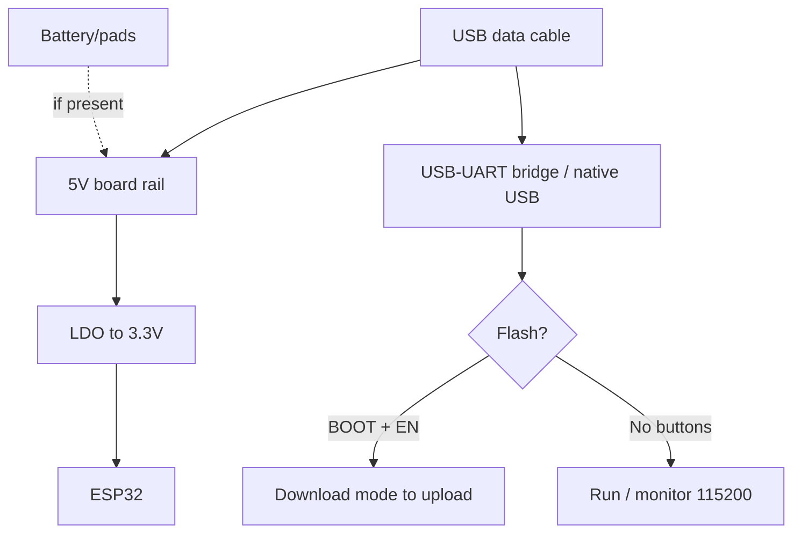

# C6/C61 DevKit boards: DevKitC, Beetle, XIAO, SuperMini

## Purpose

ESP32-C6 is the first mass-market Espressif chip with WiFi 6 + BLE 5 + Zigbee + Thread (802.15.4) in one package. Boards for it bridge the WiFi world and the mesh world: the same node serves Matter and listens to sensors. C61 is the younger sibling (cheaper, trimmed RF).

Base: start - [[Home.en | Home]], chips - [[01-Hardware/04-ESP32-C3-C6-H2.en | C3/C6/H2]] and [[01-Hardware/10-ESP32-C5-C61.en | C5/C61]], C3/XIAO predecessors - [[14-Devboards/08-S3-DevKitC-C3-SuperMini-XIAO.en | 08: S3/C3/XIAO]], Matter - [[15-Protocols/09-Matter-Thread-Zigbee.en | Matter/Thread/Zigbee]], sleep - [[07-Timers/03-Sleep-ULP.en | Sleep]].

| Parameter | C6-DevKitC-1 | Beetle C6 | XIAO C6 | SuperMini C6 | C3-DevKitC-02 |
| --- | --- | --- | --- | --- | --- |
| Purpose | Reference, 802.15.4 development | Compact mesh nodes | Branded mini + Grove | Cheapest C6 | Classic full-size C3 |
| Chip | C6 RISC-V 160 MHz | C6 | C6 | C6 | C3 RISC-V 160 MHz |
| Radio | WiFi6 + BLE5 + 802.15.4 | Same | Same | Same | WiFi4 + BLE5 (NO 15.4!) |
| Size | 68x54 mm | ~25x21 mm | 21x18 mm | 23x18 mm | 68x54 mm |

![[assets/img/devboard-c6-boards-scheme.png|600]]
*Fig. C6 lineup: DevKitC for the bench, Beetle/XIAO/SuperMini for products; all have native USB and an 802.15.4 antenna.*

## Specifications

| Specification | C6-DevKitC-1 | Beetle C6 (DFRobot) | XIAO ESP32C6 | SuperMini C6 | C3-DevKitC-02 |
| --- | --- | --- | --- | --- | --- |
| Flash / PSRAM | 8 MB / 512 KB HP + LP | 4 MB / 512 KB | 4 MB / 512 KB | 4 MB / 512 KB | 4-8 MB / none |
| USB | 2x USB-C (UART + native) | 1x USB-C native | 1x USB-C native | 1x USB-C native | micro-USB UART + native |
| LED | RGB (GPIO8!) + power | Blue user + power | Orange + charging | Blue (GPIO8) | RGB + power |
| Buttons | BOOT + RESET large | BOOT + RESET small | BOOT + RESET | Microscopic! | BOOT + RESET |
| Battery | Pads (no charging) | BAT pads + charging | BAT pads + charging-IC | BAT pads with no charging! | None |
| Antenna | PCB + U.FL optional | PCB | PCB + U.FL | PCB | PCB |
| Size | 68x54 mm | ~25x21 mm | 21x18 mm | 23x18 mm | 68x54 mm |

> [!warning] GPIO8 is RGB and strapping at the same time!
> On C6 the built-in RGB LED hangs on GPIO8, which is a strapping pin (JTAG/Boundary). Do not pull GPIO8 externally at boot - the board will hang in download. After startup it is an ordinary NeoPixel LED for status.

## Pinout features

C6-DevKitC-1: GPIO 0-23 routed (except SPI-flash pins 24-30). USB-Serial-JTAG is built in - no separate UART bridge needed, but an external one is better for an 802.15.4 sniffer. Beetle C6: DFRobot pinout D0-D8 + labeled I2C/UART/SPI, 3.3V tolerant ONLY at 3.3V! XIAO C6: Seeed standard D0-D10 (GPIO 0-7, 15-23 depending on revision - check the wiki!), Grove I2C connector. SuperMini C6: clones differ - GPIO20/21 = UART, I2C on 6/7 on most, but verify your own board with a multimeter! C6 strapping: GPIO8/9 - do not touch at boot. Chip details - [[01-Hardware/04-ESP32-C3-C6-H2.en | C3/C6/H2]].

## Power supply features

| Source | C6-DevKitC-1 | Beetle/XIAO/SuperMini C6 |
| --- | --- | --- |
| USB-C 5V | 500 mA+, LDO to 3.3V | Same |
| 5V pin | Bus input/output | Input (SuperMini/Beetle), USB output (XIAO) |
| 3V3 pin | Output ~500 mA | ~300-500 mA |
| Battery | Pads with no charging | XIAO/Beetle: charging-IC; SuperMini: external TP4056 ONLY! |
| Deep-sleep | ~7-15 uA (modem off) | XIAO ~40+ uA (charging-IC eats, as on C3!) |
| 802.15.4 RX | +~90 mA on top of budget | Count in mesh mode: a router NEVER sleeps! |

> A mesh node comes in two kinds: sleepy end device (sleeps, battery lasts years) and router (NEVER sleeps, mains only!). Do not design a router on battery - it is physically impossible.

## USB-UART features

All C6 boards use native USB (USB-Serial-JTAG built into the chip). No driver needed, a data cable is required. First flash: BOOT -> USB -> flash -> Reset (as on C3, see note 08). C6-DevKitC-1 has a second port via CP2102N - flash through it if native is busy with the 802.15.4 log console. Native speed is full; keep 115200 for a Zigbee sniffer.

## Buttons

DevKitC: large BOOT+RESET. Beetle/XIAO: small but reachable. SuperMini C6: microscopic (tweezers!). Double-click Reset on XIAO = UF2 (drag the .uf2 over). RGB on GPIO8 is the mode indicator after boot.

## What it fits

- C6-DevKitC-1: Zigbee/Thread/Matter development, 802.15.4 sniffer, WiFi 6 tests.
- Beetle C6: mesh sensors in cases (small + screw holes).
- XIAO C6: Grove ecosystem, fast Matter prototypes.
- SuperMini C6: cheapest mesh nodes in large batches.
- C3-DevKitC-02: when Thread is NOT needed and a mature C3 ecosystem is.
- NOT a fit: C6 for cameras (no DVP!), for USB-host (no OTG!), for 5V peripherals.

## Flashing

Arduino: `ESP32C6 Dev Module`, USB CDC On Boot `Enabled`. Zigbee: esp-zigbee library via Arduino-C6 (see [[10-Sensors/39-Wireless-Sensors.en | Wireless]]). ESP-IDF: target `esp32c6`.

```ini
; PlatformIO — C6-DevKitC-1
[env:c6-devkitc]
platform = espressif32
board = esp32-c6-devkitc-1
framework = arduino
monitor_speed = 115200
build_flags = -DARDUINO_USB_CDC_ON_BOOT=1

; PlatformIO — XIAO C6 / Beetle C6 / SuperMini C6
[env:xiao-c6]
platform = espressif32
board = seeed_xiao_esp32c6
framework = arduino
monitor_speed = 115200
build_flags = -DARDUINO_USB_CDC_ON_BOOT=1
```

> C61: support lands in newer Arduino-core/IDF - before buying a batch check that your core version knows the chip (see [[99-Additions/07-Versions.en | Versions]])!

## Common issues

| Symptom | Cause | Fix |
| --- | --- | --- |
| Hangs in download, BOOT does not help | GPIO8/9 pulled externally | Disconnect peripherals from 8/9 at boot |
| Port gone after sleep | Native USB fell asleep | Reset; use an external UART for logs |
| Zigbee does not join | No coordinator / wrong channel | Permit join + same channel 11-26 |
| Router dead in a day | A router never sleeps by definition | Router on mains only |
| C61 does not flash | Old core without C61 | Update Arduino-core/IDF (Versions) |
| SuperMini C6 heats from LiPo | BAT pads with no protection | External TP4056 + BMS |

## Power and flashing schematic

```text
USB-C (data!) ──► native USB C6 ──► шити (BOOT при першій)
5V ──► LDO ──► 3.3V ──► кристал + антена 802.15.4 (не екранувати!)
BAT-пади ──► [XIAO/Beetle: charging-IC] / [SuperMini: ЗОВНІШНІЙ TP4056!]
GPIO8 (RGB/strapping) ──► вільний при boot, далі NeoPixel-статус
```

## Official sources

- [ESP32-C6 DevKitC (Espressif)](https://docs.espressif.com/projects/esp-dev-kits/en/latest/esp32c6/esp32-c6-devkitc-1/user_guide.html) - schematic, pins.
- [XIAO ESP32C6 (Seeed)](https://wiki.seeedstudio.com/xiao_esp32c6_getting_started/) - wiki, Grove, UF2.
- [Beetle ESP32-C6 (DFRobot)](https://wiki.dfrobot.com/dfr1117/) - pinout, examples.
- [ESP Zigbee SDK](https://docs.espressif.com/projects/esp-zigbee-sdk/) - C6 as coordinator/node.

### Mermaid: board power and first flash



## See also

- [[Home.en | Home]]
- [[01-Hardware/04-ESP32-C3-C6-H2.en | C3/C6/H2]]
- [[01-Hardware/10-ESP32-C5-C61.en | C5/C61]]
- [[14-Devboards/08-S3-DevKitC-C3-SuperMini-XIAO.en | 08: S3/C3/XIAO]]
- [[15-Protocols/09-Matter-Thread-Zigbee.en | Matter/Thread/Zigbee]]
- [[10-Sensors/39-Wireless-Sensors.en | Wireless sensors]]
- [[13-Power-Modules/03-TP4056-IP5306-BMS-UPS.en | Charge/BMS]]
- [[13-Power-Modules/05-USB-UART-AutoReset.en | USB-UART]]
- [[99-Additions/07-Versions.en | Versions]]
