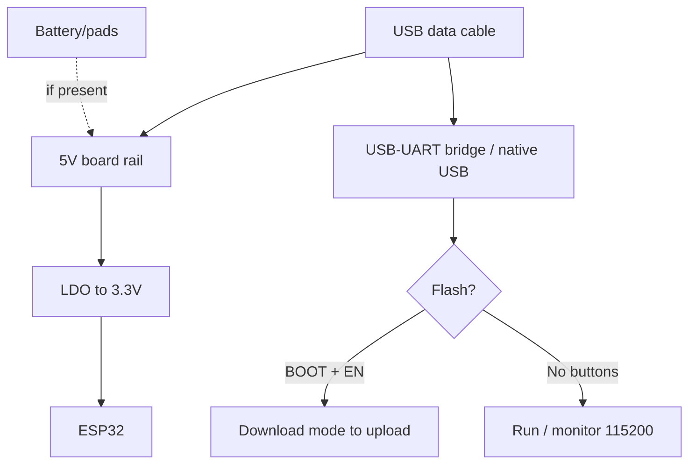

# H2 DevKit boards: DevKitM, Beetle, nano (no WiFi!)

## Purpose

ESP32-H2 is an odd beast: BLE 5 + Zigbee + Thread are present, but WiFi is missing entirely. It has one job - a cheap battery mesh node and a Zigbee/Thread companion for P4/S3 (a radio module next to a host with no radio). An H2 board without a WiFi host is an island with no bridge: data has nowhere to go except mesh.

Base: start - [[Home.en | Home]], chips - [[01-Hardware/04-ESP32-C3-C6-H2.en | C3/C6/H2]], C6 siblings - [[14-Devboards/13-ESP32C6-Boards.en | 13: C6 boards]], Matter - [[15-Protocols/09-Matter-Thread-Zigbee.en | Matter/Thread/Zigbee]], wireless sensors - [[10-Sensors/39-Wireless-Sensors.en | Wireless sensors]].

| Parameter | H2-DevKitM-1 | Beetle H2 | nano H2 (clones) |
| --- | --- | --- | --- |
| Purpose | Reference, P4 companion | Compact Zigbee nodes | Cheapest SED sensors |
| Chip | H2 RISC-V 96 MHz | H2 | H2 |
| Radio | BLE5 + 802.15.4, NO WiFi | Same | Same |
| Size | 48x26 mm (M-format) | ~25x21 mm | ~23x18 mm |

![[assets/img/devboard-h2-boards-scheme.png|600]]
*Fig. H2 lineup: DevKitM for the bench, Beetle/nano for products; a WiFi host (C6/S3/P4+C6) always sits next to them.*

## Specifications

| Specification | H2-DevKitM-1 | Beetle H2 | nano H2 |
| --- | --- | --- | --- |
| Flash | 4 MB / no PSRAM | 4 MB | 4 MB |
| USB | 1x USB-C native | 1x USB-C native | 1x USB-C native |
| LED | RGB (GPIO8!) + power | Blue user | Blue |
| Buttons | BOOT + RESET | Small BOOT + RESET | Microscopic |
| Battery | Pads (no charging) | Pads + charging | Pads with no charging! |
| Antenna | PCB | PCB | PCB |
| Size | 48x26 mm | ~25x21 mm | ~23x18 mm |

> [!danger] H2 is NOT WiFi!
> NO WiFi example will run on H2: no scanner, no direct MQTT, no OTA over WiFi. Firmware goes in over USB, updates over USB or through mesh (smp/suit is a separate topic). For cloud access put a Border Router or a host next to it (diagram below).

## The "H2 + host" architecture (a mandatory picture in your head!)

```text
Варіант A — компаньйон:            Варіант B — Border Router поруч:
 H2-вузол (SED, батарея)            H2/C6-координатор (на мережі!)
   ↕ Thread/Zigbee                    ↕ Thread mesh
 C6 Border Router (на мережі!)        H2-датчики (батареї)
   ↕ WiFi/Ethernet                    |
 Хмара (MQTT/Matter)                Хмара
```

## Pinout features

H2-DevKitM-1: GPIO 0-27 (except flash pins 24-27 partly). Beetle/nano: labeled D0-D8, I2C/UART/SPI. H2 strapping: GPIO8/9 (the same RGB conflict as on C6!) + GPIO25 (download). USB-Serial-JTAG is built in. JTAG debugging over USB - see [[09-Firmware/05-JTAG-Debug.en | JTAG]].

## Power supply features

| Source | H2-DevKitM-1 | Beetle/nano H2 |
| --- | --- | --- |
| USB-C 5V | 500 mA, LDO to 3.3V | Same |
| Deep-sleep SED | ~7-12 uA | nano with no charging-IC is the most frugal! |
| Zigbee RX | ~90 mA (as C6) | Count for routers |
| Battery | Pads with no charging | Beetle: charging-IC; nano: external TP4056! |

## USB-UART features

Native USB only. First flash: BOOT -> USB -> flash -> Reset. H2 devkit fell into a "brick" (no port)? Hold GPIO25 LOW + BOOT + Reset - forced download (see the boot mode in the C3/C6/H2 note).

## Buttons

DevKitM: normal BOOT+RESET. Beetle: small. nano: microscopic. RGB on GPIO8 stays free at boot!

## What it fits

- H2-DevKitM-1: Zigbee device development, Thread SED profiling, P4 companion.
- Beetle H2: Zigbee switches/sensors with binding (switch to lamp with no coordinator!).
- nano H2: disposable SED sensors in large batches.
- NOT a fit: anything that needs WiFi; cameras; USB-host; standalone cloud with no BR.

## Flashing

ESP-IDF: target `esp32h2`. Arduino: `ESP32H2 Dev Module` (support is younger than C6 - check the core!).

```ini
; PlatformIO — H2-DevKitM-1
[env:h2-devkitm]
platform = espressif32
board = esp32-h2-devkitm-1
framework = arduino
monitor_speed = 115200
build_flags = -DARDUINO_USB_CDC_ON_BOOT=1
```

Zigbee firmware: esp-zigbee examples (`light_bulb`/`light_switch` as a start, then your own sensor). Thread: ot_sleepy_device. Matter: H2 is an end device only (it cannot be a controller - too little RAM!).

## Common issues

| Symptom | Cause | Fix |
| --- | --- | --- |
| WiFi example does not compile | H2 has no WiFi physically | Rewrite for BLE/15.4 |
| No port after flashing | Native USB asleep / brick | Reset; force with GPIO25+BOOT |
| SED dead in a month | Poll period 100 ms instead of 1000+ | Longer poll, rarer reporting |
| Matter commissioning fails | No BR / too little RAM | BR on the network; H2 as end device only |
| GPIO8 peripheral stalls boot | Strapping conflict | Free 8/9/25 at boot |

## Power and flashing schematic

```text
USB-C (data!) ──► native USB H2 ──► шити (BOOT; цегла → GPIO25+BOOT+Reset)
BAT-пади ──► [Beetle: charging-IC] / [nano: ЗОВНІШНІЙ TP4056!]
Поруч ЗАВЖДИ: C6-BR або S3-хост з WiFi (інакше дані нікуди!)
```

## Official sources

- [ESP32-H2 DevKitM (Espressif)](https://docs.espressif.com/projects/esp-dev-kits/en/latest/esp32h2/esp32-h2-devkitm-1/user_guide.html) - schematic, pins.
- [ESP Zigbee SDK](https://docs.espressif.com/projects/esp-zigbee-sdk/) - examples for H2.
- [OpenThread sleepy device (Espressif)](https://docs.espressif.com/projects/esp-idf/en/latest/esp32h2/api-guides/openthread.html) - SED profile.

### Mermaid: board power and first flash



### Zigbee binding with no coordinator (the H2 trick!)

```text
Сценарій: вимикач H2 ↔ лампа H2 безпосередньо (координатор потрібен ОДИН раз для спарювання!):
  1. Обидва в permit-join → спарувались через координатор.
  2. Bind: вимикач прив'язує кластер OnOff лампи (Z2M → Bind або install-code).
  3. Координатор можна вимкнути — зв'язка працює!
Живлення: вимикач — CR2450 SED (роки), лампа — мережа (роутер!).
```

## See also

- [[Home.en | Home]]
- [[01-Hardware/04-ESP32-C3-C6-H2.en | C3/C6/H2]]
- [[14-Devboards/13-ESP32C6-Boards.en | 13: C6 boards]]
- [[14-Devboards/08-S3-DevKitC-C3-SuperMini-XIAO.en | 08: S3/C3/XIAO]]
- [[15-Protocols/09-Matter-Thread-Zigbee.en | Matter/Thread/Zigbee]]
- [[10-Sensors/39-Wireless-Sensors.en | Wireless sensors]]
- [[09-Firmware/05-JTAG-Debug.en | JTAG]]
