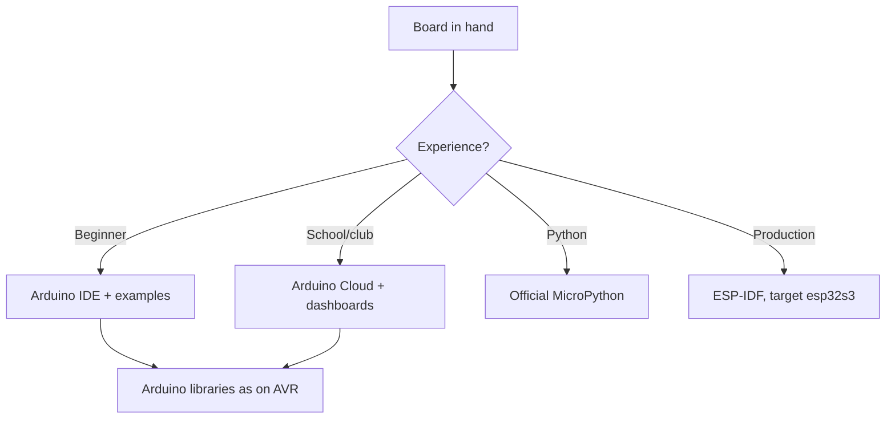

# Arduino Nano ESP32 - the official board in detail

![[assets/img/nano-esp32-scheme.png|600]]

## Purpose

Arduino Nano ESP32 is the official Arduino board on the u-blox NORA-W106 module (ESP32-S3 inside): Nano form factor 45x18 mm, USB-C, 16 MB Flash, official support for the Arduino core, MicroPython and Arduino Cloud. Mini-board overview - [[14-Devboards/10-Mini-Boards.en | Mini boards]], S3 chip - [[01-Hardware/03-ESP32-S3.en | ESP32-S3]]. This note is practice: how NORA differs from a plain S3 module, how to flash with three environments, how to live with the Nano pinout, and where the format ends.

## NORA-W106 inside: what changes

| Topic | Practice |
| --- | --- |
| u-blox module | Certified RF path, stable batches |
| ESP32-S3 inside | All software as for S3: IDF, Arduino, MicroPython |
| Module antenna | u-blox PCB antenna, do not touch or shield! |
| 16 MB Flash | OTA with margin, filesystems fit |
| USB-C on board | Data and power, use a data cable! |

## USB-C and flashing three ways

| Environment | How to flash |
| --- | --- |
| Arduino IDE | Nano ESP32 board from Boards Manager, no buttons needed |
| ESP-IDF | Target esp32s3, USB-C port |
| MicroPython | Official build for Nano ESP32 |

| Symptom | Cause | Fix |
| --- | --- | --- |
| No port | Charge-only cable | Data cable! |
| Upload breaks | Old core | Update the Arduino core |
| Does not start after MicroPython | Filesystem leftovers | Full erase before IDF |

## Mermaid: environment choice

## Nano pinout: pins and limits

| Topic | Practice |
| --- | --- |
| 2.54 pitch | Breadboard and Nano shields fit at once |
| Power supply | VIN 5V, 3V3 output with a limit! |
| Analog | A0-A7 map to the S3 ADC |
| I2C/SPI/UART | Hardware, pins fixed by the layout |
| S3 strapping | Same as on a plain S3! |

## Arduino Cloud: telemetry with no server

| Topic | Practice |
| --- | --- |
| Board binding | Via the Arduino agent, step by step |
| Variable widgets | Temperature to a chart in minutes |
| OTA from cloud | Cable-free flashing after the first one |
| Free-tier limits | Count variables and traffic! |

## Official MicroPython: nuances

| Topic | Practice |
| --- | --- |
| Build | Exactly for Nano ESP32, not generic S3! |
| REPL over USB | Terminal at once, Thonny sees it |
| Files | Internal FS, upload by drag and drop |
| Arduino libraries | Do not work - Python packages only |

## Power supply: limits of a small board

| Source | Limit |
| --- | --- |
| USB-C | The base, 5V with margin |
| VIN | 5V from a PSU, a diode protects |
| 3V3 output | Milliamps for sensors, not motors! |
| LiPo | No built-in charging - external! |

## Common issues

| # | Issue | Why it is bad | How to do it right |
| --- | --- | --- | --- |
| 1 | Generic-S3 firmware | Pins and USB differ | Build exactly for Nano ESP32! |
| 2 | Charge-only cable | No port | Data cable |
| 3 | Motors from 3V3 | Sag and reboot | Separate power supply |
| 4 | Antenna under wires | WiFi goes deaf | Keep the antenna zone clear |
| 5 | Strapping occupied | Does not boot | S3 table before routing |
| 6 | LiPo with no protection | Cell over-discharge | External DW01 board |
| 7 | Cloud with no limits | Bill/block | Count traffic |

## Nano shields: what fits and what does not

| Shield | Status |
| --- | --- |
| Sensor I2C shields | Yes, the bus is standard |
| 5V relay shields | Yes, but separate power! |
| AVR shields with 5V logic | Only via level shifting |
| Old AVR libraries | Check portability! |

## Debug with no JTAG probe: what is real

| Tool | Capabilities |
| --- | --- |
| S3 USB-JTAG | Breakpoints via OpenOCD |
| Serial log | 90% of bugs show here |
| GPIO markers | Timings on an analyzer |
| ESP-Insights | Crash telemetry to the cloud |

## A class of ten boards: organization

| Topic | Practice |
| --- | --- |
| Identical cables | Label data cables, charge cables away! |
| Template sketch | Starter code with log and version |
| Board names | Number on the case with a marker |
| Storage | Case with slots, do not bend antennas |

## Board revisions: what to check when buying

| Item | Where to look |
| --- | --- |
| Revision marking | Board silkscreen |
| NORA module version | Sticker on the shield |
| Core freshness | Support for exactly this revision |

## Official sources

- [Arduino Nano ESP32 docs (Arduino)](https://docs.arduino.cc/hardware/nano-esp32/) - pins, flashing, Cloud.
- [NORA-W106 datasheet (u-blox)](https://www.u-blox.com/en/product/nora-w10-series) - module, antenna, certification.

## See also

- [[EN/Home.en]]
- [[EN/14-Devboards/10-Mini-Boards.en]]
- [[EN/14-Devboards/08-S3-DevKitC-C3-SuperMini-XIAO.en]]
- [[EN/01-Hardware/03-ESP32-S3.en]]
- [[EN/09-Firmware/02-Arduino-PlatformIO.en]]
- [[09-Firmware/03-MicroPython.en | MicroPython]]
- [[EN/99-Additions/08-Diagnostic-Map.en]]
