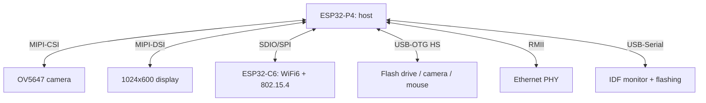

# ESP32-P4 Function EV Board - a radio-free RISC-V host with MIPI and H.264

![[assets/img/esp32-p4-devkit-scheme.png|600]]
*Fig. P4 is a compute host (MIPI, H.264, USB) with radio via a nearby ESP32-C6; flashing over USB-Serial.*

> [!tip] What this note is
> ESP32-P4 is the first Espressif chip with no radio: two 400 MHz RISC-V cores, MIPI-CSI/DSI, hardware H.264, USB-OTG HS. The Function EV Board exposes all of it at once. Radio comes from an external C6. Base: [[01-Hardware/09-ESP32-C2-P4.en | C2/P4 chips]], [[14-Devboards/13-ESP32C6-Boards.en | C6 boards]], [[14-Devboards/08-S3-DevKitC-C3-SuperMini-XIAO.en | DevKitC and minis]].

## 1. Goal

Understand the place of P4 in the ecosystem and bring the board up:

- P4 is the host: camera, display, Ethernet, USB devices, ML inference;
- radio is an ESP32-C6/H2 next to it over SDIO/SPI/UART (the "two-chip" model);
- flashing uses built-in USB-Serial-JTAG, no external programmers;
- where to put it: HMI panels, cameras with analytics, gateways.

| Parameter | ESP32-P4 | ESP32-S3 (for comparison) |
| --- | --- | --- |
| CPU | 2x RISC-V 400 MHz | 2x LX7 240 MHz |
| Radio | none (external C6) | WiFi + BLE 5 |
| Camera | MIPI-CSI 2 lanes | DVP (parallel) |
| Video | H.264 encoder | none |
| USB | OTG HS + Serial-JTAG | Serial-JTAG + OTG FS |
| Memory | 768 KB SRAM + PSRAM | 512 KB + PSRAM |

## 2. Board architecture



The Function EV Board is a large board with every connector at once: no shields needed, everything for a prototype is in place.

## 3. First start

- ESP-IDF 5.3+: `idf.py set-target esp32p4`, `hello_world` example blinks RGB;
- USB-Serial-JTAG: one cable for flashing, log and JTAG debugging;
- display demo is LVGL out of the box (see [[11-Vivid/12-LVGL-SquareLine.en | LVGL and SquareLine]]);
- camera: `esp32-camera` example in MIPI mode, stream to a browser.

## 4. The P4 + C6 pair

- Flash the C6 with AT or RCP (Thread border router), the P4 is the host;
- transport: SDIO for speed, UART for simplicity, SPI the golden middle;
- the P4 issues commands, the C6 moves radio packets; the split as in [[12-Comm-Modules/29-LoRaWAN-Gateway.en | LoRaWAN gateway]];
- power for the pair: 5V 2A, C6 WiFi peaks must not sag the P4.

## 5. Working code (IDF)

```c
#include "esp_camera.h"
#include "esp_log.h"

static const char *TAG = "p4cam";

void app_main(void) {
  camera_config_t cfg = {
    .pin_pwdn = -1, .pin_reset = -1,
    .pin_xclk = 15, .pin_sccb_sda = 4, .pin_sccb_scl = 5,
    .pin_d7 = 16, .pin_d6 = 17, .pin_d5 = 18, .pin_d4 = 12,
    .pin_d3 = 10, .pin_d2 = 8, .pin_d1 = 9, .pin_d0 = 11,
    .pin_vsync = 6, .pin_href = 7, .pin_pclk = 13,
    .xclk_freq_hz = 20000000,
    .pixel_format = PIXFORMAT_JPEG,
    .frame_size = FRAMESIZE_SVGA,
    .jpeg_quality = 12, .fb_count = 2,
  };
  esp_err_t err = esp_camera_init(&cfg);
  if (err != ESP_OK) {
    ESP_LOGE(TAG, "camera failed: %s", esp_err_to_name(err));
    return;
  }
  ESP_LOGI(TAG, "P4 camera ready, heap=%lu", esp_get_free_heap_size());
  while (1) {
    camera_fb_t *fb = esp_camera_fb_get();
    if (fb) {
      ESP_LOGI(TAG, "frame %dx%d %u bytes", fb->width, fb->height, fb->len);
      esp_camera_fb_return(fb);
    }
    vTaskDelay(pdMS_TO_TICKS(1000));
  }
}
```

For MIPI sensors use the `esp_lcd`/`mipi_csi` config from the IDF 5.3 examples; the frame above stays the same: init, loop, buffer return.

## 6. H.264 and USB-OTG

- Hardware encoder: JPEG frame to H.264 stream for recording/streaming;
- USB-OTG HS: flash drive (FATFS), UVC camera, HID mouse - `usb/host` examples;
- Ethernet RMII: a wired gateway with no WiFi at all;
- 4-bit SDMMC: video recording to card at stream speed.

## 6.1 Display and LVGL in 10 minutes

- `lvgl` example from IDF: MIPI-DSI 1024x600 starts with no dance;
- SquareLine Studio exports UI straight into the project (see the LVGL note);
- double buffering in PSRAM - no picture tearing;
- touch panel over I2C, calibrate once;
- add Cyrillic fonts to `lv_conf.h`, else squares.

## 6.2 Ethernet with no WiFi at all

- PHY over RMII: a wired gateway with a PoE injector;
- `ethernet/basic` example: DHCP, link status in logs;
- PoE is not from the board - external splitter only;
- for a P4+C6 gateway: WAN over Ethernet, clients over WiFi.

## 7. Power supply and heat

- 5V 2A minimum: display + camera + C6 WiFi together;
- a heatsink on P4 under H.264 - it heats honestly;
- [[02-Power-Supply/02-LDO-DC-DC.en | LDO and DC-DC]] - node power supply choice;
- P4 sleep: light-sleep between frames, deep-sleep loses PSRAM.

## 7.1 ESP32-P4 DevKitC pinout

| Signal | Pin | Note |
| --- | --- | --- |
| USB-OTG (D-/D+) | GPIO19 / GPIO20 | 5V VBUS powers the device |
| UART log console | USB-Serial | 115200 |
| MIPI-CSI | FPC connector | Ribbon fully in |
| H.264 stream | 8 MB PSRAM | Frame in pair |
| Control GPIO | 20+ pins | 3.3V logic |

## 8. Common issues

| Symptom | Cause | Fix |
| --- | --- | --- |
| Does not flash | wrong USB connector (there are two) | flash via USB-Serial, not OTG |
| Camera black | MIPI ribbon the wrong way | blue stripe to the connector, latch it |
| C6 silent | RCP/AT not flashed | flash C6 separately, check the UART bridge |
| H.264 falls apart | slow PSRAM/overheat | lower resolution, heatsink |
| USB stick does not mount | not FAT32 or current | FAT32, powered hub |
| IDF misses target | IDF older than 5.3 | update IDF, `set-target esp32p4` |

## 9. Neighbor notes

- [[01-Hardware/09-ESP32-C2-P4.en | C2/P4 chips]] - chip in detail.
- [[14-Devboards/13-ESP32C6-Boards.en | C6 boards]] - radio companion.
- [[12-Comm-Modules/13-Camera-Streaming.en | camera streaming]] - server side.
- [[11-Vivid/12-LVGL-SquareLine.en | LVGL and SquareLine]] - interface on the display.
- [[09-Firmware/01-ESP-IDF-Setup.en | ESP-IDF setup]] - toolchain.

## Official sources

- [ESP32-P4 Function EV Board (Espressif)](https://docs.espressif.com/projects/esp-dev-kits/en/latest/esp32p4/esp32-p4-function-ev-board/) - board schematic, connectors.
- [ESP32-C5 DevKitC-1 (Espressif)](https://docs.espressif.com/projects/esp-dev-kits/en/latest/esp32c5/esp32-c5-devkitc-1/) - C-line neighbor for comparison.
- [USB Host examples (Espressif, GitHub)](https://github.com/espressif/esp-idf/tree/master/examples/peripherals/usb/host) - OTG examples for P4.
