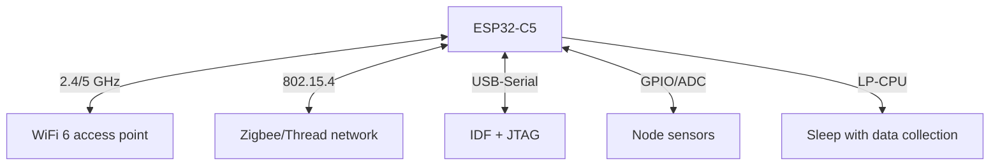

# ESP32-C5 DevKitC - dual-band WiFi 6 and 802.15.4 on the bench

![[assets/img/esp32-c5-devkit-scheme.png|600]]
*Fig. C5 is the first Espressif chip with 5 GHz WiFi 6 plus 802.15.4: DevKitC, USB-Serial, antenna on board.*

> [!tip] What this note is
> A board for the new flagship of the C-line: WiFi 6 on two bands at once + Zigbee/Thread/Matter in one RISC-V chip. For chip comparison see [[01-Hardware/10-ESP32-C5-C61.en | C5/C61 note]], for robot practice [[16-Projects/06-C5-C61-Robotics.en | C5 robot]]. Board base: [[14-Devboards/13-ESP32C6-Boards.en | C6 boards]].

## 1. Goal

Squeeze out of C5 what C6 does not have:

- WiFi 6 on 5 GHz: less interference, faster stream speed;
- 802.15.4: Zigbee end nodes and Thread/Matter with no second chip;
- LP-CPU 40 MHz: sensors in sleep, radio on schedule;
- understand when C5 is right and when C6 is enough.

| Parameter | ESP32-C5 | ESP32-C6 |
| --- | --- | --- |
| WiFi | 6, dual-band 2.4 + 5 GHz | 6, 2.4 GHz only |
| 802.15.4 | Zigbee/Thread | Zigbee/Thread |
| CPU | RISC-V 240 MHz + LP 40 MHz | RISC-V 160 MHz + LP 20 MHz |
| SRAM | 384 KB | 512 KB |
| USB | Serial-JTAG | Serial-JTAG + OTG |

## 2. Board architecture



DevKitC-1: ESP32-C5-WROOM-1 module, BOOT/RESET button, RGB LED, headers for a breadboard. Antenna printed on the module.

## 3. First start

- ESP-IDF 5.5+: `idf.py set-target esp32c5`;
- `wifi/getting_started/station` example - connect to a 5 GHz AP;
- `zigbee` example - on/off light node;
- Arduino-core 3.3+: `ESP32C5 Dev Module` board;
- Matter over WiFi - `connectedhomeip` example (heavy, watch PSRAM).

## 4. WiFi 6 on 5 GHz: what it gives

- OFDMA and MU-MIMO - stable camera stream with no 2.4 lag;
- TWT (target wake time) - a battery node sleeps on the AP schedule;
- check: `idf.py monitor` shows RSSI and MCS index;
- 5 GHz punches through walls worse - keep 2.4 for the dacha.

## 5. Working code (IDF)

```c
#include "esp_wifi.h"
#include "esp_log.h"

static const char *TAG = "c5wifi";

void wifi_init_sta(const char *ssid, const char *pass) {
  ESP_ERROR_CHECK(esp_netif_init());
  ESP_ERROR_CHECK(esp_event_loop_create_default());
  esp_netif_create_default_wifi_sta();
  wifi_init_config_t cfg = WIFI_INIT_CONFIG_DEFAULT();
  ESP_ERROR_CHECK(esp_wifi_init(&cfg));
  wifi_config_t wc = {0};
  strncpy((char*)wc.sta.ssid, ssid, sizeof(wc.sta.ssid));
  strncpy((char*)wc.sta.password, pass, sizeof(wc.sta.password));
  wc.sta.band_mode = WIFI_BAND_MODE_AUTO;
  ESP_ERROR_CHECK(esp_wifi_set_mode(WIFI_MODE_STA));
  ESP_ERROR_CHECK(esp_wifi_set_config(WIFI_IF_STA, &wc));
  ESP_ERROR_CHECK(esp_wifi_start());
  ESP_ERROR_CHECK(esp_wifi_connect());
  ESP_LOGI(TAG, "connecting to %s (auto band)", ssid);
}

void app_main(void) {
  nvs_flash_init();
  wifi_init_sta("ssid", "pass");
  uint8_t mac[6];
  esp_wifi_get_mac(WIFI_IF_STA, mac);
  ESP_LOGI(TAG, "mac %02x:%02x:%02x:%02x:%02x:%02x",
           mac[0], mac[1], mac[2], mac[3], mac[4], mac[5]);
}
```

`WIFI_BAND_MODE_AUTO` - the chip picks 2.4/5 GHz by quality itself. For forced 5 GHz use `WIFI_BAND_MODE_5G`.

## 6. Zigbee/Thread on C5

- Zigbee: on/off light switch example, coordinator on C5;
- Thread: RCP + OpenThread border router on the host;
- Matter: WiFi transport (with no Thread network) is the simplest start;
- one antenna shared for WiFi and 802.15.4 - separate activity in time.

## 6.1 Matter over WiFi: the simplest start

- `light` example from the connectedhomeip repo for C5;
- commissioning over BLE + WiFi at the same time;
- certificates eat SRAM - recalculate partitions;
- for the first time: on/off light, no sensor clusters;
- add the Thread network as step two, once the WiFi variant is stable.

## 6.2 Antenna and 5 GHz range

- Printed module antenna: do not cover with a metal case;
- 5 GHz gives speed but punches through walls worse than 2.4;
- board orientation: antenna toward the AP, not toward the wall;
- for outdoors take the U.FL version with an external antenna;
- RSSI -65 dBm and better means stable MCS with no sag.

## 7. Power supply and sleep

- The 5 GHz transmitter is hungry for current: peaks above C6;
- modem-sleep and light-sleep are mandatory for battery;
- LP-CPU gathers ADC/I2C in sleep, wakes the core on threshold;
- [[07-Timers/03-Sleep-ULP.en | sleep modes]] - details for all chips.

## 7.1 ESP32-C5 DevKitC pinout

| Signal | Pin | Note |
| --- | --- | --- |
| WiFi 6 5 GHz | Built-in antenna | Oval modules, do not cover with metal |
| 802.15.4 (Zigbee) | Built-in radio | No extra pins |
| USB-Serial | USB-C connector | Flashing / monitor |
| Control GPIO | 29 pins | 3.3V logic |
| ADC / DAC | 5 channels / 2 pcs | SDK extension |

## 8. Common issues

| Symptom | Cause | Fix |
| --- | --- | --- |
| Misses the 5 GHz AP | AP with no WiFi 6 or DFS channel | enable ax on channels 36-48 |
| Zigbee does not start | wrong example (for C6/H2) | take the example with `set-target esp32c5` |
| Breaks up on 5 GHz | weak USB-hub power | direct cable, capacitor on 5V |
| Arduino-core does not compile | core older than 3.3 | update the esp32 core |
| LP-CPU does not wake | wakeup source not set | `ulp` example for C5, not C6 |
| Matter does not fit | too little SRAM for certificates | trim partitions, switch off log |

## 9. Neighbor notes

- [[01-Hardware/10-ESP32-C5-C61.en | C5/C61 chips]] - chip in detail.
- [[16-Projects/06-C5-C61-Robotics.en | C5 robot]] - practice with motors.
- [[15-Protocols/09-Matter-Thread-Zigbee.en | Matter and Thread]] - protocol side.
- [[14-Devboards/13-ESP32C6-Boards.en | C6 boards]] - younger sibling.
- [[05-Radio/01-WiFi-STA-AP.en | WiFi STA/AP]] - wireless base.

## Official sources

- [ESP32-C5 DevKitC-1 (Espressif)](https://docs.espressif.com/projects/esp-dev-kits/en/latest/esp32c5/esp32-c5-devkitc-1/) - board schematic, power supply.
- [ESP32-P4 Function EV Board (Espressif)](https://docs.espressif.com/projects/esp-dev-kits/en/latest/esp32p4/esp32-p4-function-ev-board/) - older host for comparison.
- [ESP-AT User Guide (Espressif)](https://docs.espressif.com/projects/esp-at/en/latest/esp32/) - AT firmware for the C-line.
