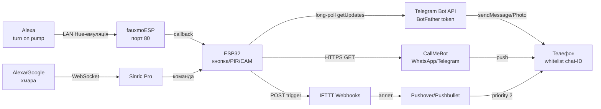

# Notifications and Voice Control ESP32 - Telegram, CallMeBot, Alexa

> [!warning] Bot token in code = password: whoever reads it writes in your name!
> Keep token in NVS/`secrets.h` (not in git!), enable whitelist chat-ID - otherwise anyone in Telegram will click your relay. Do not send camera photos to public groups.!

Network overview: [[05-Radio/01-WiFi-STA-AP.en | 01-WiFi-STA-AP]], broker подій [[15-Protocols/01-MQTT.en | MQTT]], Ready firmwares [[15-Protocols/06-Firmwares | firmwares]], старт [[Home.en | Home]].

## Purpose

ESP32 can not only blink, but also shout: "leak!", "door open!", "watering finished!". Two directions: **notifications** (device → human: Telegram / WhatsApp / push) and **голос** (людина → пристрій: «Alexa, turn on…»).

Коли that брати:

- Кнопка / sensor → message тобі in телефон: **Telegram-бот** (свій, безкоштовно, with фото) або **CallMeBot** (WhatsApp/Telegram without свого бота, 1 GET-запит).
- Критичний аларм with підтвердженням прочитання: **Pushover** (emergency-priority with retry) замість/разом with Telegram.
- Голос in локалці without хмари: **fauxmoESP** («Alexa, turn on…», емуляція ламп).
- Голос + застосунок + віддалено via інтернет: **Sinric Pro** (Alexa / Google Home / SmartThings), in Tasmota - `Emulation`.
- Автоматизації між сервісами («якщо ESP → то Google Sheet»): **IFTTT Webhooks**.

When NOT to use:

- батарейний sensor with deep-sleep - long-poll Telegram тримає WiFi and with'їсть батарею for добу (див. розділ про sleep);
- комерційний продукт on чужому безкоштовному шлюзі (CallMeBot/IFTTT free) - ліміти, черги, жодних SLA;
- приватні дані (відео няні, сигналізація) via публічні боти without whitelist - тільки свій server/webhook.

## Parameters

| Параметр | Telegram-бот (свій) | CallMeBot | IFTTT Webhooks + Pushover | fauxmoESP (Alexa LAN) | Sinric Pro |
| --- | --- | --- | --- | --- | --- |
| Реєстрація | @BotFather → токен | номер in контактах CallMeBot, apikey | key maker.ifttt.com + APP/USER keys | without реєстрації | акаунт + APP_KEY/SECRET |
| Protocol | HTTPS `api.telegram.org` | HTTPS GET 1 запитом | HTTPS POST JSON | UDP discovery + HTTP (LAN) | WebSocket/MQTT TLS до хмари |
| Прийом команд | long-poll `getUpdates` | тільки відправка | via IFTTT-аплети | голос «turn on/off/set %» | голос + застосунок |
| Фото/файли | `sendPhoto` with камери! | текст (медіа - платно) | Pushover attachment 5 МБ | ні | камера (окремі приклади) |
| Вартість | безкоштовно | free personal / TextMeBot платно | IFTTT free-ліміти, Pushover разовий платіж | безкоштовно | 3 девайси free, далі $/рік |
| Затримка | 1-3 с | 5-30 с (черга) | 2-15 с | < 1 с (LAN) | 1-3 с |
| Офлайн-робота | потрібен інтернет | потрібен інтернет | потрібен інтернет | працює without інтернету! | потрібен інтернет |
| Безпека | токен + whitelist chat-ID | apikey in URL (not світити!) | ключі in NVS | тільки LAN, without auth | підписані команди + local control |

![[assets/img/notify-voice-telegram-scheme.png | 600]]
*Fig. Подія with ESP32 розходиться трьома шляхами: Telegram-бот (long-poll + фото), CallMeBot/IFTTT/Pushover (HTTPS-хуки), голос назад via Alexa (fauxmoESP локально або Sinric Pro хмарою).*

### ASCII-схема

```text
ESP32 (кнопка GPIO0 / PIR / ESP32-CAM)
   │
   ├─ 1) Telegram-бот (свій, long-poll) ──HTTPS──► api.telegram.org
   │      getUpdates offset=N ──► нові msg ──► whitelist chat-ID?
   │      sendMessage / sendPhoto ──► твій чат (токен BotFather)
   │
   ├─ 2) CallMeBot (без свого бота) ──HTTPS GET──► api.callmebot.com
   │      /whatsapp.php?phone=..&text=..&apikey=..
   │      /telegram.php /telegram/call (дзвінок голосом!)
   │
   ├─ 3) IFTTT Webhooks ──POST──► maker.ifttt.com/trigger/{event}/with/key/KEY
   │      ──► аплет: Pushover / Pushbullet / Google Sheets / Mail
   │      Pushover: api.pushover.net/1/messages.json (priority 2 = будитиме!)
   │
   └─ 4) Голос назад:
        Alexa ──LAN──► fauxmoESP (порт 80, "Alexa, turn on pump")
        Alexa/Google ──хмара──► Sinric Pro ──WebSocket──► ESP32

 Deep-sleep несумісний з long-poll! (див. розділ Сон): будильник → швидкий POST → спати.
```

### Mermaid



## Telegram-бот: BotFather, long-poll, фото, whitelist

Свій бот - найгнучкіший шлях: безкоштовно, with двостороннім зв'язком (and команди приймає, and фото with камери шле), працює with бібліотекою UniversalTelegramBot.

Крок 1 - BotFather (in застосунку Telegram):

1. Знайти `@BotFather` → `/newbot` → ім'я (`My ESP32`) + username (`myesp32bot`).
2. Зберегти токен `123456:ABC-DEF...` - this ПАРОЛЬ, in code безпосередньо not комітити!
3. `/setprivacy` → Disable (щоб бот бачив команди in групах), `/setcommands` - список (`led_on`, `status`).
4. Написати боту будь-that with особистого акаунта, дізнатись свій chat-ID: `https://api.telegram.org/bot<TOKEN>/getUpdates` → поле `message.chat.id`.

Крок 2 - long-poll on ESP32 (бібліотека [UniversalTelegramBot](https://github.com/witnessmenow/Universal-Arduino-Telegram-Bot)):

```cpp
#include <WiFi.h>
#include <WiFiClientSecure.h>
#include <UniversalTelegramBot.h>

#define BOT_TOKEN "123456:ABC-DEF..."   // ← у secrets.h / NVS, НЕ в git!
#define CHAT_ID "123456789"             // свій ID (whitelist!)
#define ALLOWED_CHAT_ID "123456789"

WiFiClientSecure secured;
UniversalTelegramBot bot(BOT_TOKEN, secured);
uint32_t lastCheck = 0;

void handleMsg(const telegramMessage &m) {
  if (String(m.chat_id) != ALLOWED_CHAT_ID) {
    bot.sendMessage(m.chat_id, "⛔ No access", "");  // чужим — відмова
    return;
  }
  if (m.text == "/led_on")  { digitalWrite(27, HIGH); bot.sendMessage(CHAT_ID, "LED ON", ""); }
  if (m.text == "/led_off") { digitalWrite(27, LOW);  bot.sendMessage(CHAT_ID, "LED OFF", ""); }
  if (m.text == "/status")  { bot.sendMessage(CHAT_ID, "T=24.5 IP=" + WiFi.localIP().toString(), ""); }
}

void setup() {
  Serial.begin(115200);
  pinMode(27, OUTPUT);
  WiFi.begin("SSID", "PASS");
  while (WiFi.status() != WL_CONNECTED) delay(300);
  secured.setCACert(TELEGRAM_CERTIFICATE_ROOT);  // з прикладів бібліотеки!
  bot.longPoll = 10;  // довгі запити — менше трафіку
}

void loop() {
  if (millis() - lastCheck > 2000) {
    lastCheck = millis();
    int n = bot.getUpdates(bot.last_message_received + 1);
    for (int i = 0; i < n; i++) handleMsg(bot.messages[i]);
  }
}
```

sendMessage with фото (ESP32-CAM → Telegram):

```cpp
// Варіант A: фото за URL (камера вже віддає JPEG по HTTP):
bot.sendPhoto(CHAT_ID, "http://192.168.1.60/capture", "Рух біля дверей!");
// Варіант B: прямий POST multipart (див. приклад SendPhoto/PhotoFromSD у бібліотеці):
// bot.sendPhotoByBinary(CHAT_ID, "image/jpeg", size, bufferReader, ...);
// Важливо: бот пише ПЕРШІМ тільки тому, хто вже написав йому (обмеження Bot API)!
```

Чат-ID whitelist - обов'язково:

```cpp
const char* ALLOWED[] = {"123456789", "987654321"};  // сім'я
bool allowed(const String& id) {
  for (auto a : ALLOWED) if (id == a) return true;
  return false;
}
// У handleMsg: if (!allowed(m.chat_id)) return;  // мовчки ігнорувати чужих
```

Ліміти Bot API: ~30 повідомлень/с in чат, 20 МБ on фото via bot API (50 МБ download), текст 4096 символів. Флуд - бан on хвилини.

MicroPython-варіант (without бібліотеки, чистий HTTPS):

```python
import urequests, json
TOKEN = "123456:ABC-DEF..."  # з файлу secrets, не з коду!
CHAT = "123456789"
def tg_send(text):
    url = "https://api.telegram.org/bot%s/sendMessage" % TOKEN
    urequests.post(url, json={"chat_id": CHAT, "text": text}).close()
tg_send("ESP32 прокинувся, T=24.5")
```

## CallMeBot - WhatsApp/Telegram without свого бота

Коли свого бота заводити лінь, but треба «1 GET - and message in WhatsApp»: [CallMeBot API](https://api.callmebot.com/) - безкоштовний шлюз (personal use). Реєстрація: додати номер CallMeBot in контакти, написати йому «I allow callmebot to send me messages», отримати apikey.

WhatsApp with ESP32 (example with [блогу ESP8266/ESP32](https://www.callmebot.com/blog/whatsapp-messages-from-esp8266-esp32/)):

```cpp
#include <WiFi.h>
#include <HTTPClient.h>

String phone = "380501234567";   // БЕЗ + !
String apikey = "123456";        // від CallMeBot
String text = "Door OPEN! T=24.5";

void callmebot_whatsapp(const String& msg) {
  HTTPClient http;
  String url = "https://api.callmebot.com/whatsapp.php?phone=" + phone
             + "&text=" + msg + "&apikey=" + apikey;
  url.replace(" ", "%20");
  http.begin(url);
  int code = http.GET();
  Serial.println(code);  // 200 = прийнято (не = доставлено!)
  http.end();
}
```

Telegram-текст and дзвінок via CallMeBot:

```bash
# Telegram-текст (після активації за інструкцією callmebot-бота):
curl "https://api.callmebot.com/text.php?user=@myuser&text=Alarm!&apikey=KEY"
# Voice дзвінок у Telegram (читає текст уголос!):
curl "https://api.callmebot.com/telegram/call.php?user=@myuser&text=Water+leak!&lang=en-US-Standard-A&apikey=KEY"
```

Обмеження: черги 5-30 с, ліміт повідомлень/добу, текст латиницею надійніший for кирилицю (URL-encode!), жодних фото/файлів on free. for бізнесу - платний TextMeBot. Apikey in URL світиться in логах проксі - окремий акаунт, not основний!

## IFTTT Webhooks + Pushover / Pushbullet

IFTTT - клей між ESP32 and сотнями сервісів: один POST with плати → аплет distributes куди завгодно.

Webhook-тригер:

```cpp
#include <HTTPClient.h>
void ifttt(const char* event, const char* v1) {
  HTTPClient http;
  String url = String("https://maker.ifttt.com/trigger/") + event
             + "/with/key/cdxxxxxxxxxxxxxxxxxxxxxxxxxx";
  http.begin(url);
  http.addHeader("Content-Type", "application/json");
  http.POST(String("{\"value1\":\"") + v1 + "\"}");
  http.end();
}
// Виклик: ifttt("door_open", "kitchen 21:30");
```

Аплет in ifttt.com: `If Webhooks (door_open) → Then Pushover / Gmail / Sheets / Philips Hue`. Ім'я події - латиницею, without пробілів.

Pushover ([API](https://pushover.net/api)) - push with пріоритетами, працює with ESP32 безпосередньо without IFTTT:

```cpp
// POST https://api.pushover.net/1/messages.json
// token=APP_TOKEN&user=USER_KEY&message=Leak!&priority=2&retry=60&expire=1800
// priority: -2 silent, 0 normal, 1 bypass quiet, 2 EMERGENCY (будить поки не підтвердиш!)
```

```bash
curl -s -F "token=APP_TOKEN" -F "user=USER_KEY" \
  -F "priority=2" -F "retry=60" -F "expire=1800" \
  -F "message=Water leak, kitchen!" https://api.pushover.net/1/messages.json
# Вкладення: -F "attachment=@/capture.jpg" (до 5 МБ!)
```

Pushbullet - простіше (1 токен, channelи), але without emergency-повторів. for «пожежа/потоп» - Pushover priority 2, for «полив завершено» - Telegram/IFTTT.

## Alexa via fauxmoESP + Sinric Pro, Google Home

fauxmoESP - локальна емуляція ламп for Alexa, інтернет not потрібен. Працює так: ESP32 прикидається Philips Hue (v3+, раніше - Belkin WeMo), колонка Echo знаходить її in LAN and шле `turn on/off/set %`.

> [!note] Історична деталь: до v3.0 fauxmoESP емулював Belkin WeMo, with v3.0 - Philips Hue (дає димування «set to 50%»). in старих гайдах ще пишуть «WeMo» - суть та сама: локальний discovery without хмари.

```cpp
#include <WiFi.h>
#include <fauxmoESP.h>  // https://github.com/vintlabs/fauxmoESP

fauxmoESP fauxmo;

void setup() {
  Serial.begin(115200);
  WiFi.begin("SSID", "PASS");
  while (WiFi.status() != WL_CONNECTED) delay(300);
  fauxmo.createServer(true);
  fauxmo.setPort(80);  // gen3-колонки вимагають порт 80!
  fauxmo.enable(true);
  fauxmo.addDevice("pump");    // "Alexa, turn on pump"
  fauxmo.addDevice("kitchen light");
  fauxmo.onSetState([](unsigned char id, const char* name, bool state, unsigned char value) {
    Serial.printf("%s → %s (%d)\n", name, state ? "ON" : "OFF", value);
    digitalWrite(27, state ? HIGH : LOW);  // value 0..255 = яскравість!
  });
}

void loop() {
  fauxmo.handle();  // викликати ЧАСТО, без delay()!
}
```

Умови: Echo and ESP32 in ОДНІЙ підмережі (without guest-ізоляції!), port 80 вільний, LwIP «Higher Bandwidth» on ESP8266-ядрі. «Alexa, discover devices» → «turn on pump» / «set kitchen light to fifty percent». with 2.4/5 ГГц-розносом on роутері discovery часто ламається - саджати обох on 2.4 ГГц.

Sinric Pro ([SinricPro ESP SDK](https://github.com/sinricpro/esp8266-esp32-sdk)) - хмарний міст до Alexa/Google/SmartThings/Homebridge, коли треба керування via ІНТЕРНЕТ + застосунок + OTA:

1. Реєстрація → Add Device (Switch/Dimmer/Thermostat) → APP_KEY + APP_SECRET + DEVICE_ID.
2. Прошивка with SDK (`SinricPro` lib): WebSocket TLS до хмари, колбеки `onPowerState`.
3. Free: 3 пристрої; далі ~$3/пристрій/рік. Працює and local control (підписані LAN-команди, коли інтернет ліг).
4. in Tasmota є вбудоване: `Emulation 1` (WeMo) / `2` (Hue) - Alexa знаходить розетку without коду взагалі.

Google Home безпосередньо (without посередників) ESP32 does not вміє - тільки via хмару: Sinric Pro (Google Action), Home Assistant (emulated_hue / Google Assistant integration) або Tasmota Hue-емуляція + HA-міст. Окремої «бібліотеки Google Home for ESP32» not існує - всі гайди ведуть via один із цих мостів.

## Example «button → сповіщення + фото with камери»

Сценарій: button дверей (GPIO0) → ESP32-CAM робить знімок → Telegram-бот шле фото + текст → паралельно Pushover priority 1.

```cpp
#include <WiFi.h>
#include <WiFiClientSecure.h>
#include <UniversalTelegramBot.h>
#include "esp_camera.h"  // ESP32-CAM конфіг опущено

#define BOT_TOKEN "123456:ABC-DEF..."
#define CHAT_ID "123456789"
#define BTN 0

WiFiClientSecure secured;
UniversalTelegramBot bot(BOT_TOKEN, secured);
volatile bool pressed = false;

void IRAM_ATTR onBtn() { pressed = true; }  // тільки прапорець!

void sendAlert() {
  camera_fb_t* fb = esp_camera_fb_get();
  if (!fb) { bot.sendMessage(CHAT_ID, "🚪 Двері! (камера недоступна)", ""); return; }
  // Шлях 1: фото через Telegram (див. SendPhoto-приклади бібліотеки)
  // bot.sendPhotoByBinary(CHAT_ID, "image/jpeg", fb->len, ...);
  esp_camera_fb_return(fb);
  bot.sendMessage(CHAT_ID, "🚪 Двері відчинено 21:30", "");
  // Шлях 2: паралельно Pushover (HTTPClient POST) — якщо Telegram ліг
}

void setup() {
  WiFi.begin("SSID", "PASS");
  while (WiFi.status() != WL_CONNECTED) delay(300);
  secured.setCACert(TELEGRAM_CERTIFICATE_ROOT);
  pinMode(BTN, INPUT_PULLUP);
  attachInterrupt(BTN, onBtn, FALLING);
}

void loop() {
  bot.getUpdates(bot.last_message_received + 1);  // + обробка команд /led_on...
  if (pressed) {
    pressed = false;
    delay(50);  // антибрязкіт
    if (digitalRead(BTN) == LOW) sendAlert();
  }
}
```

Живлення камери: спалах підсвітки + WiFi-TX = пік 600+ мА, окремий стабілізатор 5 in/2 but, інакше brownout in момент фото.

## Сон: long-poll + deep-sleep несумісні

issue: `getUpdates` вимагає ПОСТІЙНОГО WiFi (десятки мА), but deep-sleep вимикає радіо повністю (10 мкА). Разом not живуть: або спиш, або слухаєш команди.

Рішення 1 - polling будильником (sensor спить, прокидається, ШЛЕ, знову спить):

```cpp
// Прокинувся за таймером / EXT0 (PIR) → WiFi → tg_send("T=...") → спати
esp_sleep_enable_timer_wakeup(10 * 60 * 1000000ULL);  // кожні 10 хв
// ... WiFi + sendMessage ...
esp_deep_sleep_start();  // команд НЕ чекаємо — тільки відправка!
```

Рішення 2 - webhook-server замість long-poll (for завжди-ввімкнених вузлів):

- Свій server (VPS/RPi) тримає `setWebhook https://...`, приймає команди Telegram and кладе їх in чергу/MQTT (`device/esp32-01/cmd`).
- ESP32 прокидається, забирає чергу per MQTT (QoS 1, retained команда), виконує, звітує, спить.
- Бонус: server ховає токен бота - on пристрої тільки MQTT-логін.

Правило: батарейка → тільки ВІДПРАВКА per пробудженню (Telegram/CallMeBot/Pushover POST); прийом команд in сні - via retained-MQTT чергу, not long-poll.

## Common issues

| Симптом | Причина | Рішення |
| --- | --- | --- |
| `410 Gone` / бот мовчить | токен відкликано via BotFather | згенерувати новий `/token`, оновити NVS, not комітити in git |
| Бот not відповідає in групі | privacy mode ріже чужі message | @BotFather `/setprivacy` → Disable, додати бота адміном |
| Команди виконує будь-хто | немає whitelist chat-ID | порівнювати `m.chat_id` with ALLOWED, чужим - ігнор/відмова |
| `sendPhoto` падає on ESP32-CAM | мало heap під JPEG + TLS (~40 КБ) | QVGA замість UXGA, PSRAM увімкнено, фото окремо from long-poll |
| CallMeBot відповідає 200, але нічого немає | not завершена активація / ліміт | повторно «I allow…», пауза 24 год, латиниця in тексті |
| Кирилиця in CallMeBot - «???» | not закодовано URL | `url.encode()` / `%20` for пробілів, краще латиниця |
| IFTTT спрацьовує via хвилини | free-черга IFTTT | критичне - безпосередньо Pushover/Telegram, not via аплет |
| «Alexa, turn on…» - «device not found» | різні підмережі / port not 80 | одна LAN 2.4 ГГц, `fauxmo.setPort(80)`, rediscover |
| fauxmoESP not компілюється with WebServer | конфлікт portу 80 | example `fauxmoESP_External_Server` або інший port + gen1-колонка |
| Long-poll їсть батарею for добу | WiFi+TLS постійно in ефірі | deep-sleep + відправка per будильнику, див. розділ Сон |
| Pushover emergency not замовкає | немає `retry/expire`, юзер not підтвердив | `retry≥30, expire≤10800`, підтвердження in застосунку |

## Official sources

- [Telegram Bot API](https://core.telegram.org/bots/api) - `getUpdates`, `sendMessage`, `sendPhoto`, ліміти.
- [UniversalTelegramBot - GitHub](https://github.com/witnessmenow/Universal-Arduino-Telegram-Bot) - long-poll, клавіатури, приклади ESP32/CAM.
- [CallMeBot API](https://api.callmebot.com/) - WhatsApp/Telegram/Signal API, активація, apikey.
- [Pushover API](https://pushover.net/api) - пріоритети, retry/expire, вкладення 5 МБ.
- [fauxmoESP - GitHub](https://github.com/vintlabs/fauxmoESP) - Hue-емуляція, port 80, `onSetState`.

## See also

- [[Home.en | Home]]
- [[15-Protocols/01-MQTT.en | MQTT]] - черга команд for сплячих вузлів, LWT
- [[15-Protocols/06-Firmwares | firmwares]] - Tasmota Emulation, Blynk-сповіщення with коробки
- [[05-Radio/01-WiFi-STA-AP.en | WiFi STA/AP]] - STA-конект перед будь-яким HTTPS
- [[11-Vivid/09-LED-Strip-Power-SK6812-APA102 | LED Strip Power]] - power supply ESP32-CAM in момент фото
- [[99-Additions/02-Troubleshooting-FAQ | FAQ]] - TLS handshake, NTP-час for HTTPS, brownout
