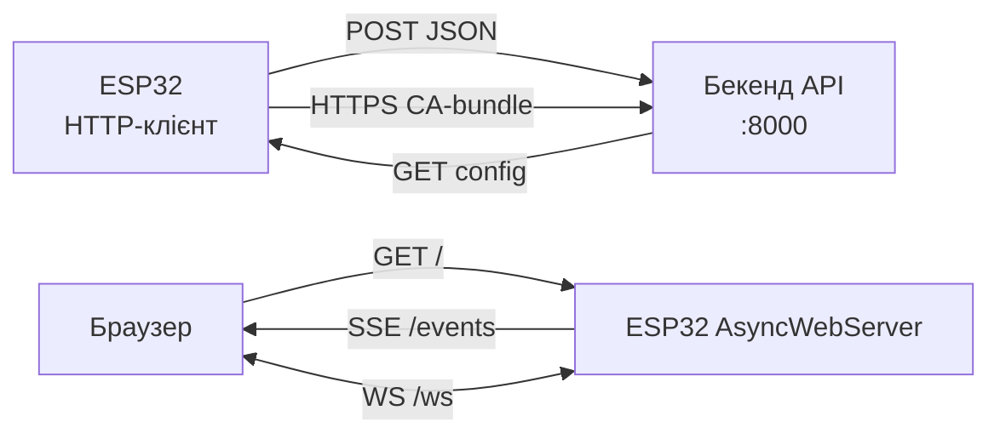

# HTTP REST та WebSocket on ESP32

> [!warning] Довгі HTTPS-запити in `loop()` годують WDT-ресет, but TLS with'їдає ~40 КБ heap!
> Важкі запити - in окрему задачу FreeRTOS with запасом стеку, відповіді читати порціями.

Network overview: [[05-Radio/01-WiFi-STA-AP.en | 01-WiFi-STA-AP]], MQTT-альтернатива [[15-Protocols/01-MQTT.en | MQTT]], час/TLS [[15-Protocols/03-mDNS-NTP-TLS.en | 03-mDNS-NTP-TLS]], старт [[Home.en | Home]].

## Purpose

HTTP - коли потрібен класичний REST до свого бекенда: `GET /api/state`, `POST /api/sensors` with JSON. WebSocket - коли потрібен дуплекс in реальному часі: дашборд, керування реле without опитування.

When to use HTTP:

- відправка телеметрії on свій server раз on хвилину;
- OTA-firmware with URL (`update.start(url)`), див. [[08-Memory/03-OTA.en | OTA]];
- конфіг with бекенда одним GET at старті.

When to use WebSocket / SSE:

- живий дашборд: AsyncWebServer + SSE штовхає дані in браузер;
- команди with браузера without перезавантаження сторінки;
- повний дуплекс - WebSocket-client до свого serverа.

When NOT to use: десятки вузлів with частими messageми - дешевше MQTT, див. [[15-Protocols/01-MQTT.en | MQTT]].

## Parameters

| Параметр | Value | Note |
| --- | --- | --- |
| IDF-client | `esp_http_client` (GET/POST/PUT, keep-alive, chunked) | блокуючий `perform()` |
| IDF-server | `esp_http_server` | for локальних сторінок |
| Arduino-client | `HTTPClient` (обгортка над WiFiClient) | простий, синхронний |
| Arduino-server | ESPAsyncWebServer + SSE | неблокуючий, події in браузер |
| MP-client | `urequests` (GET/POST JSON) | відповідь закривати! |
| MP-server | picoweb / micropython-async вебserver | тільки прості сторінки |
| WebSocket IDF | `esp_websocket_client` | окремий компонент реєстру |
| WebSocket Arduino | WebSocketsClient (Links2004) | текст/бінарні кадри |
| HTTPS | CA-bundle або один CA PEM | час via NTP обов'язково |
| RAM під TLS | ~40 КБ heap on сесію | not тримати 2 TLS-сесії on C3 |
| WDT | довгі запити > 2-3 с in loop = ребут | окрема задача / async |

![[assets/img/http-websocket-rest-scheme.png | 600]]
*Fig. REST (запит→відповідь) and WebSocket/SSE (постійний channel) між ESP32, бекендом and браузером.*

### ASCII-схема

```text
ESP32 (клієнт)                    Свій бекенд (192.168.1.20:8000)
──────────────                    ─────────────────────────────
 POST /api/sensors {"t":24.5} ──► 200 OK {"cmd":"relay_off"}
 GET  /api/config?v=3 ────────► 200 OK {"period":60}
 HTTPS ──► CA-bundle перевірка ──► TLS handshake (час NTP!)
 chunked ──► читати порціями, не чекати весь body в RAM

ESP32 (сервер AsyncWebServer:80)      Браузер дашборда
────────────────────────────────      ────────────────
 GET / ──► index.html (SPIFFS/LittleFS)
 GET /events (SSE) ──► text/event-stream: data: {"t":24.5}
 WS /ws ◄──► дуплекс: {"relay":"ON"} ◄──► {"state":"ON"}
```

### Mermaid



## REST GET/POST JSON до свого бекенда

Контракт прикладного API (вигадати свій, але зафіксувати версію):

```text
POST /api/v1/sensors   body: {"id":"esp32-01","t":24.5,"h":55} → 200 {"ok":true}
GET  /api/v1/config?id=esp32-01 → 200 {"period":60,"relay":"auto"}
```

Правила: `Content-Type: application/json`, таймаут 5-10 с, 3 спроби with backoff, відповідь парсити потоково (ArduinoJson with фільтром), code стану логувати. Період відправки зберігати in NVS, див. [[08-Memory/01-Partitions-NVS.en | 01-Partitions-NVS]].

## HTTPS with CA-бандлом

Варіанти перевірки serverа (from безпечного до тестового):

1. CA-bundle Mozilla in прошивці (IDF: `crt_bundle_attach`, Arduino: вшитий PEM) - продакшен.
2. Один кореневий CA свого serverа - свій VPS with Let's Encrypt.
3. Fingerprint SHA-1/SHA-256 - крихко (ламається at перевипуску), тільки тимчасово.
4. `setInsecure()` - тільки стенд in локалці, ніколи in прод.

without синхронізованого часу (NTP) check сертифіката завжди FAIL - див. [[15-Protocols/03-mDNS-NTP-TLS.en | 03-mDNS-NTP-TLS]].

## WebSocket-дуплекс and AsyncWebServer + SSE

- SSE (`/events`): server штовхає телеметрію in браузер, переconnection автоматичне. Дешево, вистачає for дашборда.
- WebSocket (`/ws`): дуплекс - слайдер/button in браузері керує ESP32 without перезавантаження.
- on IDF - компонент `esp_websocket_client` for clientа; server - `esp_http_server` with WS-хендлером.
- on Arduino - WebSocketsClient for clientа, ESPAsyncWebServer for serverа+S biomarkerSSE.
- not тримати одночасно WS-server on 4+ clients and HTTPS-client on C3 without PSRAM - not вистачить heap.

## Code ESP-IDF (esp_http_client + WebSocket)

```c
#include "esp_http_client.h"
#include "esp_websocket_client.h"

// --- REST POST JSON ---
void post_sensors(const char *json) {
    esp_http_client_config_t cfg = {
        .url = "http://192.168.1.20:8000/api/v1/sensors",
        .timeout_ms = 8000,
        // .crt_bundle_attach = esp_crt_bundle_attach, // для https
    };
    esp_http_client_handle_t c = esp_http_client_init(&cfg);
    esp_http_client_set_method(c, HTTP_METHOD_POST);
    esp_http_client_set_header(c, "Content-Type", "application/json");
    esp_http_client_set_post_field(c, json, strlen(json));
    esp_err_t err = esp_http_client_perform(c);
    if (err == ESP_OK)
        ESP_LOGI("HTTP", "status=%d", esp_http_client_get_status_code(c));
    esp_http_client_cleanup(c); // обов'язково, інакше витік сокетів
}

// --- WebSocket-клієнт (дуплекс) ---
static void ws_event(void *a, esp_event_base_t b, int32_t id, void *d) {
    esp_websocket_event_data_t *e = d;
    if (id == WEBSOCKET_EVENT_DATA)
        ESP_LOGI("WS", "rx: %.*s", e->data_len, (char*)e->data_ptr);
}

void ws_start(void) {
    esp_websocket_client_config_t cfg = { .uri = "ws://192.168.1.20:8000/ws" };
    esp_websocket_client_handle_t ws = esp_websocket_client_init(&cfg);
    esp_websocket_register_events(ws, WEBSOCKET_EVENT_ANY, ws_event, NULL);
    esp_websocket_client_start(ws);
    // esp_websocket_client_send_text(ws, "{\"relay\":\"ON\"}", 14, portMAX_DELAY);
}
```

## Code Arduino (HTTPClient + WebSocketsClient + SSE)

```cpp
#include <WiFi.h>
#include <HTTPClient.h>
#include <WebSocketsClient.h>
#include <ESPAsyncWebServer.h>

AsyncWebServer server(80);
AsyncEventSource events("/events");
WebSocketsClient ws;

void onWs(WStype_t t, uint8_t* p, size_t n) {
  if (t == WStype_TEXT) { // команда з сервера: {"relay":"ON"}
    digitalWrite(27, String((char*)p).indexOf("ON") >= 0);
  }
}

void postSensors(const String& json) {
  HTTPClient http;
  http.begin("http://192.168.1.20:8000/api/v1/sensors");
  http.addHeader("Content-Type", "application/json");
  http.setTimeout(8000);
  int code = http.POST(json);
  Serial.println(code); // 200, -1 = обрив, -11 = таймаут читання
  http.end(); // обов'язково звільнити з'єднання
}

void setup() {
  WiFi.begin("SSID", "PASS");
  while (WiFi.status() != WL_CONNECTED) delay(300);
  // SSE-дашборд:
  server.addHandler(&events);
  server.on("/", HTTP_GET, [](AsyncWebServerRequest* r){
    r->send(200, "text/html", "<meta http-equiv=refresh content=2><h1>ESP32</h1>");
  });
  server.begin();
  // WS-клієнт:
  ws.begin("192.168.1.20", 8000, "/ws");
  ws.onEvent(onWs);
  ws.setReconnectInterval(5000);
}

void loop() {
  ws.loop();
  static uint32_t t = 0;
  if (millis() - t > 5000) { // раз на 5 с
    t = millis();
    events.send("{\"t\":24.5}", "sensors", millis());
    // postSensors(...) — НЕ в кожному циклі: важкий, краще раз на 60 с
  }
}
```

## Code MicroPython (urequests + server)

```python
import network, urequests, json, time

sta = network.WLAN(network.STA_IF)
sta.active(True); sta.connect("SSID", "PASS")
while not sta.isconnected(): time.sleep(0.3)

# --- REST POST ---
try:
    r = urequests.post("http://192.168.1.20:8000/api/v1/sensors",
                       data=json.dumps({"id": "esp32-01", "t": 24.5}),
                       headers={"Content-Type": "application/json"})
    print(r.status_code, r.text[:100])
    r.close()  # ОБОВ'ЯЗКОВО, інакше витік сокетів → ENOMEM
except OSError as e:
    print("http fail:", e)

# --- REST GET конфігу ---
try:
    r = urequests.get("http://192.168.1.20:8000/api/v1/config?id=esp32-01")
    cfg = r.json()
    r.close()
    print("period:", cfg.get("period", 60))
except OSError as e:
    print("cfg fail:", e)

# --- Міні-сервер статусу (замість AsyncWebServer; для SSE/WS на MP
# потрібні picoweb або micropython-async — тільки прості сторінки!) ---
import socket
s = socket.socket(); s.bind(("0.0.0.0", 80)); s.listen(1)
s.settimeout(0.5)
while True:
    try:
        cl, _ = s.accept()
        cl.recv(512)
        body = json.dumps({"t": 24.5})
        cl.send("HTTP/1.0 200 OK\r\nContent-Type: application/json\r\n\r\n" + body)
        cl.close()
    except OSError:
        pass
```

## Common issues

| Симптом | Причина | Рішення |
| --- | --- | --- |
| WDT-ребут під час POST | блокуючий запит in `loop()` without yield | окрема задача FreeRTOS / AsyncWebServer |
| `-1` from HTTPClient | WiFi обрив або DNS not резолвить | verify `WL_CONNECTED`, IP замість hostname |
| `-11` читання | server висне, таймаут малий | `setTimeout(8000)`, ретраї with backoff |
| `ENOMEM` on MP via годину | `urequests` without `r.close()` | закривати кожну відповідь in `finally` |
| HTTPS `verify failed` | немає NTP (час 1970) або not той CA | спочатку SNTP, див. [[15-Protocols/03-mDNS-NTP-TLS.en | 03-mDNS-NTP-TLS]] |
| Обірваний великий body | весь JSON in RAM | chunked-читання порціями / фільтр ArduinoJson |
| SSE not доходять | проксі буферизує потік | `Cache-Control: no-cache`, direct IP |
| WS рветься for NAT | idle > 60 с | ping/pong кожні 25 с, `setReconnectInterval` |
| 4 WS-clientи + HTTPS = крах | heap скінчився (~40 КБ/TLS) | ліміт clients, PSRAM, закривати сесії |

## Official sources

- [ESP HTTP Client - API reference (ESP-IDF)](https://docs.espressif.com/projects/esp-idf/en/stable/esp32/api-reference/protocols/esp_http_client.html) - perform, stream, auth, bundle.
- [esp_websocket_client - ESP Component Registry](https://components.espressif.com/components/espressif/esp_websocket_client) - дуплексний WS-client, події.
- [ESPAsyncWebServer - GitHub](https://github.com/me-no-dev/ESPAsyncWebServer) - AsyncWebServer, SSE `AsyncEventSource`.
- [arduinoWebSockets - GitHub](https://github.com/Links2004/arduinoWebSockets) - WebSocketsClient, кадри, реконект.

## See also

- [[Home.en | Home]]
- [[05-Radio/01-WiFi-STA-AP.en | WiFi STA/AP]] - трансport for HTTP/WS
- [[08-Memory/03-OTA.en | OTA]] - оновлення прошивкою with URL
- [[08-Memory/01-Partitions-NVS.en | NVS]] - URL бекенда and період опитування
- [[99-Additions/02-Troubleshooting-FAQ | FAQ]] - WDT, ENOMEM, heap
- [[15-Protocols/01-MQTT.en | MQTT]] - легка альтернатива for телеметрії
- [[15-Protocols/03-mDNS-NTP-TLS.en | mDNS/NTP/TLS]] - час and сертифікати for HTTPS
- [[15-Protocols/04-Provisioning.en | Provisioning]] - первинне configuration
- [[15-Protocols/05-Cloud-Pipeline.en | Cloud-Pipeline]] - куди складати дані далі
