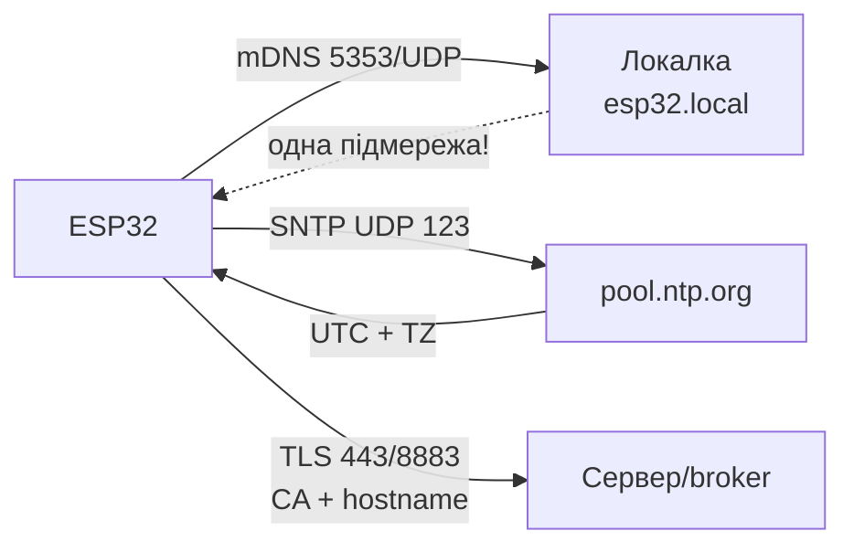

# mDNS, NTP та TLS on ESP32

> [!warning] without NTP час = 1970 рік - and падає БУДЬ-which TLS (HTTPS, MQTTS)!
> Порядок старту: WiFi → SNTP-синхронізація → тільки потім TLS-with'єднання.

Огляд мережі: [[05-Radio/01-WiFi-STA-AP]], MQTT [[15-Protocols/01-MQTT|MQTT]], HTTP [[15-Protocols/02-HTTP-WebSocket]], старт [[Home]].

## Призначення

Три базові сервіси, without яких прикладна комунікація кульгає:

- **mDNS** - звертання до плати for ім'ям `esp32.local` замість IP. Зручно for локального дашборда and firmwares.
- **NTP/SNTP** - точний час: мітки телеметрії, check TLS-сертифікатів, розклад deep-sleep.
- **TLS** - шифрування and автентифікація сервера (HTTPS, MQTTS): CA-сертифікат, check імені, fingerprint how тимчасовий костиль.

## Параметри

| Параметр | Значення | Примітка |
| --- | --- | --- |
| mDNS-ім'я | `esp32.local` (налаштовується) | тільки одна підмережа / broadcast-домен |
| mDNS IDF | компонент `espressif/mdns` | сервіси `_http._tcp`, `_mqtt._tcp` |
| mDNS Arduino | `ESPmDNS.h` | `MDNS.begin("esp32")` |
| mDNS MicroPython | немає вбудованого | тільки клієнт via IP; резолв `.local` - with ПК |
| NTP-сервери | `pool.ntp.org`, `time.google.com` | 2-3 сервери for надійності |
| SNTP-режим IDF | `esp_netif_sntp_init()` | smooth або immediate |
| Arduino-час | `configTzTime()` + `getLocalTime()` | POSIX-час + пояс |
| MP-час | `ntptime.settime()` + RTC | тільки UTC, пояс вручну |
| Пояс Київ | `EET-2EEST,M3.5.0/3,M10.5.0/4` | літній/зимовий автоматично |
| TLS-стек IDF/Arduino-ESP32 | mbedTLS | повний, ~40 КБ heap |
| TLS ESP8266-legacy | BearSSL | легший, але this not ESP32 |
| Зберігання CA | NVS / LittleFS / вшитий PEM | bundle Mozilla for загальних URL |
| check | CA + hostname, fingerprint - тимчасово | `setInsecure()` тільки стенд |

![[assets/img/mdns-ntp-tls-scheme.png|600]]
*Рис. Ланцюжок довіри: mDNS дає ім'я, NTP дає час, CA-bundle дає перевірку TLS.*

### ASCII-схема

```text
ESP32                        Локальна мережа / Інтернет
─────                        ─────────────────────────
 mDNS-responder "esp32.local" ──► multicast 224.0.0.251:5353 ──► ПК/телефон
   сервіси: _http._tcp:80, _mqtt._tcp:1883
   МЕЖІ: тільки одна підмережа! через роутер/VLAN не проходить.

 SNTP-клієнт ──► UDP 123 ──► pool.ntp.org ──► час UTC
   TZ=EET-2EEST ──► локальний час Київ (літній/зимовий авто)
   ДО синхронізації: 1970-01-01 → TLS FAIL гарантовано.

 TLS-клієнт ──► 443/8883 ──► серверний сертифікат
   CA-bundle (NVS/LittleFS/вшитий) перевіряє ланцюжок
   hostname == CN/SAN, термін дії — за NTP-часом
```

### Mermaid



## mDNS: `esp32.local` and межі

that вміє: відповідати on `esp32.local`, анонсувати сервіси (`_http._tcp` with портом 80 - браузер/IDE знаходить плату сам). that not вміє:

- not працює via роутери між підмережами (multicast not форвардиться);
- Android without спеціального резолвера `.local` not бачить (iOS/macOS/Windows with Bonjour - бачать);
- VPN and гостьові WiFi with ізоляцією клієнтів ріжуть multicast.

Практика: mDNS - for домашньої лабораторії and демо, in продакшені - статичний IP / DHCP-reservation + свій DNS або конфіг via provisioning, див. [[15-Protocols/04-Provisioning|Provisioning]].

## SNTP-синхронізація and часові пояси

Порядок: чекати `WL_CONNECTED` → старт SNTP → чекати перший синк (таймаут ~10 с) → тільки потім MQTT-TLS/HTTPS. Період повторного синку - година (дефолт lwIP).

Пояс одним рядком (POSIX TZ):

```text
Київ:  EET-2EEST,M3.5.0/3,M10.5.0/4
```

Після `setenv("TZ", ...); tzset();` функція `localtime()` повертає київський час with автоматичним переходом. on MicroPython пояса немає - тримати UTC and додавати 2/3 год вручну або on сервері.

## TLS on практиці

Де лежить CA:

- **Вшитий PEM** in прошивку - один свій сервер, мінімум коду.
- **CA-bundle Mozilla** (`esp_crt_bundle_attach`) - загальні HTTPS-URL, +~200 КБ флеш.
- **LittleFS-файл** `/ca.pem` - оновлення сертифіката without reflashing (завантажити per HTTP раз).
- **NVS** - маленький CA або fingerprint.

BearSSL vs mbedTLS: on ESP32 стандарт - mbedTLS (повний TLS 1.2/1.3, більше RAM). BearSSL - спадщина ESP8266, on ESP32 його беруть лише for специфічних constranit-задач. **WolfSSL** - третій гравець: менший footprint ніж mbedTLS, сертифікації під авто/мед, API сумісний частково; беруть коли замовник вимагає саме WolfSSL або not влізають in RAM with mbedTLS. Пам'ять: одна TLS-сесія ~40 КБ heap; дві паралельні сесії on ESP32-C3 without PSRAM - on межі.

Fingerprint (SHA-256 відбитка серверного сертифіката): працює without CA and without NTP-часу, але ламається at кожному перевипуску сертифіката (Let's Encrypt - кожні 90 днів). Тільки how тимчасовий місток, not продакшен.

## code ESP-IDF (mDNS + SNTP + TLS-bundle)

```c
#include "mdns.h"
#include "esp_netif_sntp.h"
#include "esp_tls.h"

// --- mDNS ---
void mdns_start(void) {
    mdns_init();
    mdns_hostname_set("esp32");           // → esp32.local
    mdns_instance_name_set("ESP32 lab");
    mdns_service_add(NULL, "_http", "_tcp", 80, NULL, 0);
    mdns_service_add(NULL, "_mqtt", "_tcp", 1883, NULL, 0);
}

// --- SNTP: чекати синк ДО першого TLS ---
void sntp_start(void) {
    esp_sntp_config_t cfg = ESP_NETIF_SNTP_DEFAULT_CONFIG("pool.ntp.org");
    esp_netif_sntp_init(&cfg);
    setenv("TZ", "EET-2EEST,M3.5.0/3,M10.5.0/4", 1); // Київ
    tzset();
    if (esp_netif_sntp_sync_wait(pdMS_TO_TICKS(10000)) != ESP_OK)
        ESP_LOGW("TIME", "NTP timeout — TLS відкласти!");
}

// --- TLS з bundle (для https_client / mqtts) ---
// esp_http_client_config_t cfg = {
//     .url = "https://api.example.com/",
//     .crt_bundle_attach = esp_crt_bundle_attach,
// };
```

## code Arduino (ESPmDNS + configTzTime + CA)

```cpp
#include <WiFi.h>
#include <ESPmDNS.h>

void setup() {
  WiFi.begin("SSID", "PASS");
  while (WiFi.status() != WL_CONNECTED) delay(300);

  // mDNS → http://esp32.local
  MDNS.begin("esp32");
  MDNS.addService("http", "tcp", 80);

  // NTP + Київ: чекати синк до TLS!
  configTzTime("EET-2EEST,M3.5.0/3,M10.5.0/4", "pool.ntp.org", "time.google.com");
  struct tm t; int i = 0;
  while (!getLocalTime(&t) && i++ < 20) delay(500);
}

// HTTPS з CA-сертифікатом (PEM у PROGMEM або LittleFS):
// WiFiClientSecure sec;
// sec.setCACert(ca_pem);          // продакшен
// sec.setFingerprint(fp);         // тимчасово (ламається при перевипуску!)
// sec.setInsecure();              // ТІЛЬКИ стенд
```

## code MicroPython (ntptime + TLS-сокет)

```python
import network, ntptime, time, socket, ssl

sta = network.WLAN(network.STA_IF)
sta.active(True); sta.connect("SSID", "PASS")
while not sta.isconnected(): time.sleep(0.3)

# mDNS-сервера в stock MicroPython НЕМАЄ — плату шукати за IP (див. sta.ifconfig())

# NTP: тільки UTC!
try:
    ntptime.host = "pool.ntp.org"
    ntptime.settime()   # RTC = UTC
    print("utc:", time.gmtime())
except OSError as e:
    print("ntp fail — TLS відкласти:", e)

# Київ вручну: +2 год зима / +3 літо (або тримати UTC і конвертувати на сервері)
KYIV_OFFSET = 2 * 3600
local = time.localtime(time.time() + KYIV_OFFSET)

# TLS до MQTTS/HTTPS з CA:
# with open("ca.pem") as f: ca = f.read()
# ctx = ssl.SSLContext(ssl.PROTOCOL_TLS_CLIENT)
# ctx.verify_mode = ssl.CERT_REQUIRED
# ctx.load_verify_locations(cadata=ca)
# s = ctx.wrap_socket(socket.socket(), server_hostname="broker.example.com")
# s.connect(("broker.example.com", 8883))
```

## typical errors

| Симптом | Причина | Рішення |
| --- | --- | --- |
| TLS FAIL, час 1970 | NTP ще not синкнувся | чекати `sntp_sync_wait` / `getLocalTime` до першого TLS |
| `esp32.local` not відкривається | інша підмережа / Android without резолвера | IP with DHCP, iOS/ПК with Bonjour, статичний IP |
| WolfSSL not збирається під ESP-IDF | not та версія wolfssl / конфіг wolfSSL | Брати wolfSSL-example під свою версію IDF; without вимоги замовника - лишатись on mbedTLS |
| mDNS видно, сервісу немає | not додано `addService` | `_http._tcp:80`, `_mqtt._tcp:1883` |
| `verify failed` після оновлення сервера | Let's Encrypt перевипустив cert | CA-bundle замість fingerprint |
| Fingerprint перестав працювати | перевипуск кожні 90 днів | перейти on CA, fingerprint - тимчасово |
| `setInsecure` in проді | MITM читає паролі MQTT | тільки стенд; прод - CA-bundle |
| Два TLS одночасно → крах | ~40 КБ × 2 on C3 without PSRAM | одна сесія for раз, закривати `cleanup/end` |
| Час пливе in deep-sleep | RC-генератор RTC without калібрування | ресинк NTP після пробудження |
| NTP timeout for фаєрволом | закрито UDP 123 | відкрити 123/UDP або свій NTP in локалці |
| Пояс not той взимку/влітку | жорсткий `+2` замість TZ-правила | повний TZ-рядок with M3/M10 переходами |

## official джерела

- [mDNS Service - ESP-IDF](https://docs.espressif.com/projects/esp-idf/en/stable/esp32/api-reference/protocols/mdns.html) - хостнейм, сервіси `_http._tcp`.
- [System Time / SNTP - ESP-IDF](https://docs.espressif.com/projects/esp-idf/en/stable/esp32/api-reference/system/system_time.html) - `esp_netif_sntp`, пояси, smooth/immed.
- [ESP-TLS - ESP-IDF](https://docs.espressif.com/projects/esp-idf/en/stable/esp32/api-reference/protocols/esp_tls.html) - CA, SNI, сесії, BearSSL/mbedTLS.
- [ESP x509 Certificate Bundle - ESP-IDF](https://docs.espressif.com/projects/esp-idf/en/stable/esp32/api-reference/protocols/esp_crt_bundle.html) - bundle Mozilla, `esp_crt_bundle_attach`.

## Див. також

- [[Home]]
- [[05-Radio/01-WiFi-STA-AP|WiFi STA/AP]] - транспорт for mDNS/NTP/TLS
- [[08-Memory/03-OTA|OTA]] - HTTPS-доставка прошивок потребує часу and CA
- [[08-Memory/01-Partitions-NVS|NVS]] - зберігання CA and TZ-рядка
- [[99-Additions/02-Troubleshooting-FAQ|FAQ]] - TLS FAIL, час 1970
- [[15-Protocols/01-MQTT|MQTT]] - споживач NTP+TLS (mqtts 8883)
- [[15-Protocols/02-HTTP-WebSocket|HTTP/WebSocket]] - споживач CA-bundle
- [[15-Protocols/04-Provisioning|Provisioning]] - mDNS how знахідка порталу
- [[15-Protocols/05-Cloud-Pipeline|Cloud-Pipeline]] - мітки часу in InfluxDB

## Common issues

| Symptom | Cause | Fix |
|---|---|---|
| Connection refused | Wrong broker/port or TLS cert missing | Verify URL, CA cert, firewall rules |
| Timeout / no response | Network unreachable / DNS failure | Check WiFi, mDNS/NTP server reachability |
| TLS handshake failed | Clock not set / wrong CA | Set time via NTP before TLS connect |

## Official sources

- [Espressif ESP-IDF Protocol Docs](https://docs.espressif.com/projects/esp-idf/en/latest/esp32/api-reference/protocols/index.html) - official protocol APIs.
- [Micropython umqtt / network docs](https://docs.micropython.org/en/latest/index.html) - MQTT and socket references.
