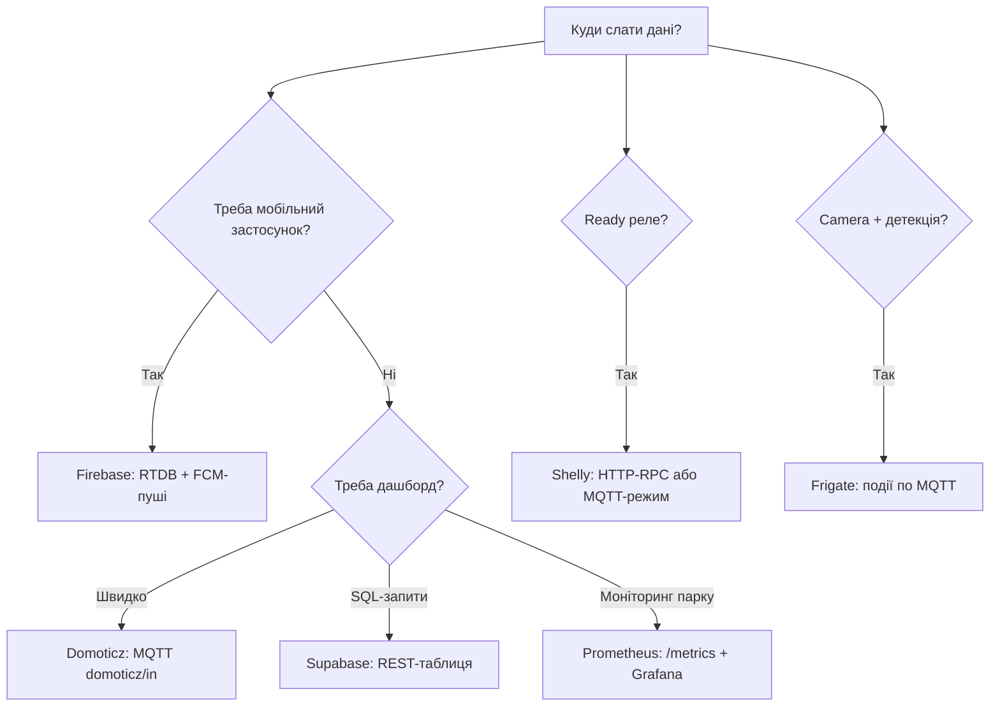

# Хмарні платформи with ESP32: Firebase, Shelly, Frigate, Supabase, Domoticz, Prometheus

## Purpose

Own Mosquitto - not завжди відповідь: інколи треба ready dashboards (Domoticz), mobile pushes with коробки (Firebase), bridge to ready relays (Shelly), video analytics (Frigate), SQL-сховище (Supabase) або збір метрик (Prometheus). Note - карта «that вміє кожен + how підключити ESP32 + ціна питання».

Base: старт - [[Home.en | Home]], MQTT - [[15-Protocols/01-MQTT.en | MQTT]], пайплайн - [[15-Protocols/05-Cloud-Pipeline.en | 05-Cloud-Pipeline]], AWS - [[15-Protocols/12-AWS-IoT.en | 12-AWS-IoT]], Azure - [[15-Protocols/13-Azure-IoT.en | 13-Azure-IoT]], TLS - [[15-Protocols/03-mDNS-NTP-TLS.en | 03-mDNS-NTP-TLS]].

![[assets/img/cloud-platforms-firebase-shelly-scheme.png | 600]]
*Fig. ESP32 in центрі: стрілки до Firebase/Supabase (HTTPS), Shelly (RPC/MQTT), Frigate (MQTT-кадр), Domoticz (MQTT), Prometheus (scrape /metrics).*

## Comparison table

| Platform | Protocol with ESP32 | Auth | Free | When to use |
| --- | --- | --- | --- | --- |
| Firebase RTDB + FCM | HTTPS REST / SSE | OAuth2 / database secret | Spark-план (ліміти!) | Mobile app + пуші |
| Shelly (пристрої) | HTTP-RPC / MQTT | Digest / MQTT-логін | Купуєш реле | Ready actuators without soldering |
| Frigate (NVR) | MQTT-кадр подій | without / MQTT-логін | Open-source | Camera + «хтось in дворі» |
| Supabase | HTTPS REST (PostgREST) | anon/service key (JWT) | 500 МБ БД | Need SQL, not topics |
| Domoticz | MQTT `domoticz/in` | without / пароль | Open-source | Дашборд for 15 хв |
| Prometheus | HTTP GET `/metrics` (scrape!) | without / bearer | Open-source | Моніторинг парку, алерти |

### Mermaid: вибір платформи



## 1. Firebase: RTDB + FCM-пуші

```text
RTDB REST: PUT https://<proj>.firebaseio.com/device/<id>/sensors.json?auth=<DB_SECRET>
  тіло {"t":23.5} → відповідь 200. ПРАВИЛА RTDB: за замовчуванням ЗАКРИТО —
  відкрити читання/запис для шляху пристрою (не root!).
FCM-пуш з ESP32 безпосередньо НЕ шлють (потрібен server key!) — схема:
  ESP32 → RTDB → Cloud Function → FCM на телефон.
ESP32-сторона: HTTPS POST (див. 15-02), CA-сертифікат + NTP-час обов'язково!
```

## 2. Shelly: HTTP-RPC and MQTT-режим

```text
HTTP-RPC (без хмари взагалі!): GET http://shelly-84/status → JSON;
  GET http://shelly-84/rpc/Switch.Set?id=0&on=true → клац!
MQTT-режим: shelly вмикається в Settings → MQTT prefix shelly-kitchen-1 →
  топіки shellies/.../relay/0/command (accept) і .../announce.
ESP32 керує Shelly реле безпосередньо по LAN: затримка мс, інтернет не потрібен.
```

## 3. Frigate: події with камери per MQTT

```text
Frigate (на сервері/міні-ПК) дивиться RTSP з камери → детекція (person/car/dog) →
  MQTT: frigate/events → {"before":{...},"after":{"label":"person","camera":"yard"}}.
ESP32 підписаний на frigate/events → сирена/світло/LINE-сповіщення.
Зворотний бік: ESP32-CAM як джерело для Frigate — RTSP-прошивка камери + стабільний WiFi!
```

## 4. Supabase: SQL замість топіків

```cpp
// Arduino: POST рядка в таблицю telemetry через PostgREST
// POST https://<proj>.supabase.co/rest/v1/telemetry
// Headers: apikey: <ANON_KEY>, Authorization: Bearer <ANON_KEY>, Content-Type: application/json
// Body: {"device_id":"esp32-01","t":23.5}
// Відповідь 201. RLS-політики: дозволити INSERT тільки в свою таблицю!
```

## 5. Domoticz: MQTT-вхід for 15 хв

```text
Domoticz → Налаштування → MQTT (mosquitto той самий!) → топік domoticz/in.
ESP32 шле: {"idx":12,"nvalue":0,"svalue":"23.5"} → пристрій-сенсор з'являється сам!
idx дізнатись: вкладка Пристрої (невикористані) → додати.
```

## 6. Prometheus: scrape `/metrics` with ESP32

```text
ESP32 віддає текст на :80/metrics:
  # HELP esp32_temp_c Температура
  # TYPE esp32_temp_c gauge
  esp32_temp_c{device="esp32-01"} 23.5
  esp32_heap_free 180000
Prometheus scrape_interval 60s → Grafana → алерти (t>30 5 хв).
Плюс: нуль коду на пристрої крім формату; мінус: pull-модель (пристрій має бути доступний!).
```

## Code (ESP-IDF/Arduino - універсальні фрагменти)

```cpp
// Arduino: Domoticz-публікація через PubSubClient (розділ 5)
mqtt.publish("domoticz/in", "{\"idx\":12,\"nvalue\":0,\"svalue\":\"23.5\"}");
// Arduino: Prometheus-метрики через WebServer (розділ 6)
server.on("/metrics", []() {
  char b[160];
  snprintf(b, sizeof(b),
    "# TYPE esp32_temp_c gauge\nesp32_temp_c{device=\"esp32-01\"} %.1f\n", readTemp());
  server.send(200, "text/plain", b);
});
```

## Common issues

| # | error | Чому погано | how правильно |
| --- | --- | --- | --- |
| 1 | RTDB rules відкриті on root | Читає/пише хто завгодно | Правила on шлях пристрою |
| 2 | FCM with ESP32 безпосередньо | Потрібен server key (секрет on пристрої!) | via Cloud Function |
| 3 | Shelly in хмарі, but треба LAN | Затримки + залежність from інтернету | HTTP-RPC per локалці |
| 4 | Supabase without RLS | Будь-хто пише in таблицю | RLS: INSERT тільки своє |
| 5 | Prometheus scrape 5s | DDoS власного вузла | 30-60s достатньо |
| 6 | Domoticz without idx | Повідомлення in нікуди | idx with вкладки Пристрої |
| 7 | HTTPS without NTP | TLS падає | SNTP до запитів (див. 15-03) |
| 8 | Один key on парк | Компрометація = всі | key/токен on пристрій |

## Official sources

- [Firebase RTDB REST](https://firebase.google.com/docs/database/rest/start) - auth, правила.
- [Shelly API Docs](https://shelly-api-docs.shelly.cloud/gen2/) - RPC, MQTT.
- [Frigate MQTT](https://docs.frigate.video/integrations/mqtt) - топіки подій.
- [Supabase PostgREST](https://supabase.com/docs/guides/api) - таблиці, RLS.
- [Prometheus exposition format](https://prometheus.io/docs/instrumenting/exposition_formats/) - формат метрик.

## See also

- [[Home.en | Home]]
- [[15-Protocols/01-MQTT.en | MQTT]]
- [[15-Protocols/02-HTTP-WebSocket.en | HTTP/WebSocket]]
- [[15-Protocols/03-mDNS-NTP-TLS.en | TLS/NTP]]
- [[15-Protocols/05-Cloud-Pipeline.en | Cloud-Pipeline]]
- [[15-Protocols/12-AWS-IoT.en | 12-AWS-IoT]]
- [[15-Protocols/13-Azure-IoT.en | 13-Azure-IoT]]
- [[12-Comm-Modules/13-Camera-Streaming | Камера-стримінг]]
