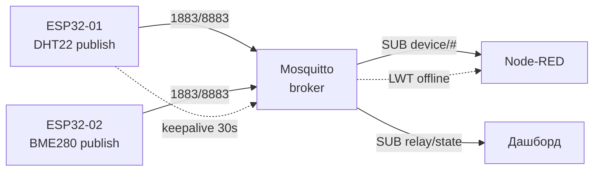

# MQTT on ESP32 - esp-mqtt, PubSubClient, umqtt

> [!warning] MQTT without TLS on відкритому WiFi - passwords and telemetry летять plain text!
> In local network достатньо `mqtt://:1883` with password, in production - тільки `mqtts://:8883` with CA-сертифікатом. See section 7.

Network overview: [[05-Radio/01-WiFi-STA-AP.en | 01-WiFi-STA-AP]], power supply радіо [[02-Power-Supply/01-Power-Rails.en | 01-Lancjugi-zhivlennya]], sleep [[07-Timers/03-Sleep-ULP.en | 03-Sleep-ULP]], OTA [[08-Memory/03-OTA.en | OTA]], старт [[Home.en | Home]].

## Purpose

MQTT - lightweight publish/subscribe protocol for IoT: node does not hold direct connections with dozens of clients, but speaks with one broker. Broker distributes message subscriberам for топіками.

When to use MQTT:

- sensor telemetry every second/minute (temperature, humidity, current);
- commands to node (`relay/set ON`) with підтвердженням стану (`relay/state`);
- tens/hundreds of nodes on один broker Mosquitto on Raspberry Pi / VPS;
- unstable connection: QoS 1 + LWT дають знати, that вузол відвалився.

When NOT to use:

- передача файлів/OTA-прошивок - for цього HTTP(S), див. [[15-Protocols/02-HTTP-WebSocket.en | 02-HTTP-WebSocket]];
- локальний discovery without serverа - for цього mDNS, див. [[15-Protocols/03-mDNS-NTP-TLS.en | 03-mDNS-NTP-TLS]];
- разове entry WiFi-облікових - for цього provisioning, див. [[15-Protocols/04-Provisioning.en | Provisioning]];
- повний хмарний пайплайн with графіками - див. [[15-Protocols/05-Cloud-Pipeline.en | 05-Cloud-Pipeline]].

## Parameters

| Параметр | Value for ESP32 | Note |
| --- | --- | --- |
| Бібліотеки | esp-mqtt (IDF), PubSubClient (Arduino), umqtt.simple/robust (MP) | API різне, логіка одна |
| Broker | Mosquitto 2.x | portи 1883 (plain) / 8883 (TLS) |
| Версія protocolу | MQTT 3.1.1 (скрізь), MQTT 5 частково in esp-mqtt | PubSubClient тільки 3.1.1 |
| QoS | 0 / 1 / 2 (див. таблицю нижче) | PubSubClient публікує тільки QoS 0 |
| Keepalive | 15-60 с | пінгує broker, ловить обрив |
| LWT | топік `device/<id>/status` = `offline` | retained, спрацьовує at обриві |
| Retain | for `state`/`config`, not for потоку телеметрії | інакше retain-шторм після реконекту |
| Буфер Arduino | 256 байт for замовчуванням | `setBufferSize()` for JSON |
| Пам'ять TLS | ~40 КБ heap під mbedTLS-сесію | врахувати on S2/C3 without PSRAM |
| Power supply | WiFi TX пік 500 мА | див. [[02-Power-Supply/01-Power-Rails.en | 01-Lancjugi-zhivlennya]] |

![[assets/img/mqtt-broker-lwt-scheme.png | 600]]
*Fig. MQTT-топологія: вузли публікують телеметрію, broker роздає subscriberам, LWT повідомляє про відвал.*

### ASCII-схема

```text
ESP32-вузол #1 (DHT22)          Mosquitto-broker (RPi 192.168.1.10)
─────────────────────          ──────────────────────────────────
 PUBLISH device/esp32-01/sensors ──► 1883/8883 ──► розсилка підписникам
 SUBSCRIBE device/esp32-01/relay/set ◄── команда від Node-RED/додатка
 LWT device/esp32-01/status="offline" (retained, QoS 1)
         │                                │
         │ PINGREQ keepalive 30с          │ SUB device/# (Node-RED)
         │                                │ SUB device/+/relay/state (дашборд)
ESP32-вузол #2 (BME280) ──► PUBLISH ──► той самий broker
Grafana/Node-RED ◄── SUB ── broker ──► InfluxDB (див. 05-Cloud-Pipeline)

Реконект: WiFi down → чекати WL_CONNECTED → mqtt.reconnect() з backoff 1/2/4/8с
```

### Mermaid



### Сусіди MQTT: LwM2M / AMQP / CoAP одним абзацом

| Протокол | Коли замість MQTT |
| --- | --- |
| LwM2M (OMA, поверх CoAP/UDP) | Керування парком пристроїв оператором (телеметрія + firmwares + конфіг with одного serverа, Leshan/Anjay) |
| AMQP 0-9-1 / 1.0 (RabbitMQ, Azure Service Bus) | Черги with pathизацією and підтвердженнями on serverному боці; ESP32 - лише client via шлюз (важкий for прямого) |
| CoAP | UDP-аналог HTTP for сплячих вузлів (див. Matter/Thread) |

## Mosquitto broker on Ubuntu

installation and перший launch:

```bash
sudo apt update && sudo apt install -y mosquitto mosquitto-clients
sudo systemctl enable --now mosquitto
mosquitto -v                      # перевірка версії
mosquitto_sub -h localhost -t 'device/#' -v   # слухач усіх топіків
```

with Mosquitto 2.0 анонімний доступ із мережі заборонено for замовчуванням. Мінімальна configuration `/etc/mosquitto/conf.d/esp32.conf`:

```conf
listener 1883
allow_anonymous false
password_file /etc/mosquitto/passwd
```

Паролі й ACL:

```bash
sudo mosquitto_passwd -c /etc/mosquitto/passwd esp      # створити користувача esp
sudo mosquitto_passwd /etc/mosquitto/passwd esp32-01    # додати вузол
sudo systemctl restart mosquitto
```

example ACL-файлу (`acl_file /etc/mosquitto/acl`):

```conf
user esp32-01
topic readwrite device/esp32-01/#
topic read device/+/config
user nodered
topic readwrite device/#
```

check with консолі:

```bash
mosquitto_pub -h localhost -u esp -P '***' -t 'device/esp32-01/sensors' -m '{"t":24.5}'
```

## QoS 0/1/2, retain, LWT, keepalive

| Рівень | Назва | Гарантія | Ціна | Застосування |
| --- | --- | --- | --- | --- |
| QoS 0 | At most once | може загубитись | 1 пакет | сира телеметрія кожні 5 с |
| QoS 1 | At least once | дійде, можливі дублі | 2+ пакети, idempotent-обробка | команди реле, статуси |
| QoS 2 | Exactly once | рівно 1 раз | 4 пакети, повільно | білінг, критичні лічильники |

Правила практики:

- Телеметрія потоку - QoS 0, without retain. Втрата одного пакета погоди not робить.
- `state`/`status`/`config` - QoS 1 + retain: новий subscriber одразу бачить останній стан.
- LWT завжди разом with retained `online` at старті: вузол публікує `online` (retain), but LWT налаштовано on `offline` (retain). Хто живий - видно одразу.
- Keepalive 30 с for power supply from мережі, 60 с for батареї. Менше 15 с - зайвий трафік and пробудження радіо.
- PubSubClient: публікація тільки QoS 0, підписка QoS 0/1 - закладатись on this in архітектурі.

## Topic convention `device/<id>/...`

```text
device/esp32-01/sensors        → телеметрія JSON (QoS 0, без retain)
device/esp32-01/relay/state    → стан реле (QoS 1, retain)
device/esp32-01/relay/set      → команда реле (QoS 1, без retain)
device/esp32-01/status         → online/offline LWT (QoS 1, retain)
device/esp32-01/config         → конфіг з хмари (QoS 1, retain)
device/esp32-01/fw             → тригер OTA (QoS 1, без retain)
```

Заборони: пробіли and кирилиця in топіках, `#`/`+` тільки in підписках, глибина not більше 4-5 рівнів. ID вузла - MAC або flashй серійник with NVS, див. [[08-Memory/01-Partitions-NVS.en | 01-Partitions-NVS]].

## TLS: mqtts on port 8883

on brokerі додати слухач:

```conf
listener 8883
cafile /etc/mosquitto/ca/ca.crt
certfile /etc/mosquitto/ca/server.crt
keyfile /etc/mosquitto/ca/server.key
require_certificate false
```

on ESP32 покласти CA-сертифікат in прошивку (IDF: компонент cert bundle або PEM in флеші; Arduino: `WiFiClientSecure::setCACert()`; MP: `ssl_params={'cert':...}`). Час має бути синхронізовано via NTP, інакше handshake падає - див. [[15-Protocols/03-mDNS-NTP-TLS.en | 03-mDNS-NTP-TLS]]. Пам'ять: TLS-сесія with'їдає ~40 КБ heap, on ESP32-C3 without PSRAM not тримати одночасно HTTPS and MQTT-TLS.

![[assets/img/mqtt-client-3stack-scheme.png | 600]]
*Fig. Три clientські стеки поруч: esp-mqtt (реконект+LWT+TLS), PubSubClient (QoS 0, буфер), umqtt.robust (WDT-обережно).*

## ESP-IDF code (esp-mqtt, with reconnect)

```c
#include "mqtt_client.h"
static const char *TAG = "MQTT";
static esp_mqtt_client_handle_t s_client;
static bool s_connected = false;

static void mqtt_event(void *arg, esp_event_base_t base, int32_t id, void *data) {
    esp_mqtt_event_handle_t e = data;
    switch ((esp_mqtt_event_id_t)id) {
    case MQTT_EVENT_CONNECTED:
        s_connected = true;
        esp_mqtt_client_subscribe(s_client, "device/esp32-01/relay/set", 1);
        esp_mqtt_client_publish(s_client, "device/esp32-01/status",
                                "online", 0, 1, 1); // retained online
        break;
    case MQTT_EVENT_DISCONNECTED:
        s_connected = false; // esp-mqtt перепідключиться сам (auto_reconnect)
        break;
    case MQTT_EVENT_DATA:
        // e->topic / e->topic_len, e->data / e->data_len
        break;
    default: break;
    }
}

void mqtt_start(void) {
    esp_mqtt_client_config_t cfg = {
        .broker.address.uri = "mqtt://192.168.1.10:1883",
        .credentials.client_id = "esp32-01",
        .credentials.username = "esp32-01",
        .credentials.authentication.password = "SECRET",
        .session.keepalive = 30,
        .session.disable_auto_reconnect = false,
        .session.last_will.topic = "device/esp32-01/status",
        .session.last_will.msg = "offline",
        .session.last_will.qos = 1,
        .session.last_will.retain = 1,
    };
    s_client = esp_mqtt_client_init(&cfg);
    esp_mqtt_client_register_event(s_client, ESP_EVENT_ANY_ID, mqtt_event, NULL);
    esp_mqtt_client_start(s_client);
}

// Публікація телеметрії (викликати раз на 5 с):
// esp_mqtt_client_publish(s_client, "device/esp32-01/sensors", json, 0, 0, 0);
```

## Arduino code (PubSubClient, with reconnect)

```cpp
#include <WiFi.h>
#include <PubSubClient.h>

WiFiClient net;
PubSubClient mqtt(net);
const char* ID = "esp32-01";

void onMsg(char* topic, byte* p, unsigned int n) {
  String s; for (unsigned i = 0; i < n; i++) s += (char)p[i];
  if (String(topic) == "device/esp32-01/relay/set") {
    digitalWrite(27, s == "ON" ? HIGH : LOW);
    mqtt.publish("device/esp32-01/relay/state", s.c_str(), true); // retained
  }
}

bool mqttReconnect() {
  static uint8_t attempt = 0;
  if (mqtt.connected() || WiFi.status() != WL_CONNECTED) return mqtt.connected();
  if (mqtt.connect(ID, "esp32-01", "SECRET",
                   "device/esp32-01/status", 1, 1, "offline")) { // LWT
    mqtt.publish("device/esp32-01/status", "online", true);
    mqtt.subscribe("device/esp32-01/relay/set", 1);
    attempt = 0;
    return true;
  }
  delay(min(8000, (1 << min(attempt++, 3)) * 1000)); // backoff 1/2/4/8 с
  return false;
}

void setup() {
  WiFi.begin("SSID", "PASS");
  while (WiFi.status() != WL_CONNECTED) delay(300);
  mqtt.setServer("192.168.1.10", 1883);
  mqtt.setCallback(onMsg);
  mqtt.setBufferSize(1024);   // дефолт 256 замалий для JSON!
  mqtt.setKeepAlive(30);
}

void loop() {
  mqttReconnect();
  mqtt.loop(); // викликати ЧАСТО, інакше keepalive зірветься
}
```

## MicroPython code (umqtt.robust, with reconnect)

```python
import network, time, json
from umqtt.robust import MQTTClient

ID = "esp32-01"
sta = network.WLAN(network.STA_IF)
sta.active(True); sta.connect("SSID", "PASS")
while not sta.isconnected(): time.sleep(0.3)

def on_msg(topic, msg):
    if topic == b"device/esp32-01/relay/set":
        from machine import Pin
        Pin(27, Pin.OUT).value(1 if msg == b"ON" else 0)
        c.publish(b"device/esp32-01/relay/state", msg, retain=True, qos=1)

c = MQTTClient(ID, "192.168.1.10", user="esp32-01", password="SECRET",
               keepalive=30)
c.set_callback(on_msg)
c.set_last_will(b"device/esp32-01/status", b"offline", retain=True, qos=1)
c.connect()  # robust сам перепідключиться при обриві publish/wait
c.publish(b"device/esp32-01/status", b"online", retain=True, qos=1)
c.subscribe(b"device/esp32-01/relay/set", qos=1)

while True:
    c.publish(b"device/esp32-01/sensors", json.dumps({"t": 24.5}), qos=0)
    c.check_msg()   # disassemble вхідні
    time.sleep(5)
```

> [!tip] umqtt.simple вміє тільки QoS 0/1 (QoS 2 немає свідомо - економія RAM). for TLS: `MQTTClient(..., ssl=True, ssl_params={})`.

## Common issues

| Симптом | Причина | Рішення |
| --- | --- | --- |
| `rc=-2` (conn lost) | WiFi ліг раніше for MQTT | реконект тільки після `WL_CONNECTED`, backoff |
| `rc=-4` (connection refused) | невірний логін/пароль або `allow_anonymous false` without юзера | `mosquitto_passwd`, verify ACL |
| `rc=5` (not authorized) | юзеру заборонено топік ACL-файлом | `topic readwrite device/<id>/#` for вузла |
| Обриви кожні ~15 с | `mqtt.loop()` / `check_msg()` викликається рідко | keepalive 30 с + виклик loop кожну ітерацію |
| JSON обрізається | буфер PubSubClient 256 байт | `setBufferSize(1024)` до `connect()` |
| Після deep-sleep - мовчання | сесія померла, LWT спрацював how offline | повний `connect()` + повторний `subscribe()` після сну |
| retain-шторм після реконекту | retain on потоці телеметрії | retain тільки on `state/status/config` |
| TLS `handshake failed` | час 1970 (немає NTP) або not той CA | спочатку SNTP, див. [[15-Protocols/03-mDNS-NTP-TLS.en | 03-mDNS-NTP-TLS]] |
| broker слухає тільки localhost | дефолт Mosquitto 2.x | явний `listener 1883` in conf.d |
| AMQP-client безпосередньо on ESP32 | важка бібліотека + RAM | AMQP - via шлюз/broker-міст, not on кристал |

## Official sources

- [ESP-MQTT - API reference (ESP-IDF)](https://docs.espressif.com/projects/esp-idf/en/stable/esp32/api-reference/protocols/mqtt.html) - esp-mqtt, події, LWT, TLS.
- [Eclipse Mosquitto - документація](https://mosquitto.org/documentation/) - broker, утиліти `mosquitto_pub/sub`.
- [mosquitto.conf - man page](https://mosquitto.org/man/mosquitto-conf-5.html) - listener, ACL, паролі, TLS-слухачі.
- [PubSubClient (knolleary) - GitHub](https://github.com/knolleary/pubsubclient) - ліміт 256 байт, QoS 0 on публікацію.
- [umqtt.simple - micropython-lib](https://github.com/micropython/micropython-lib/tree/master/micropython/umqtt.simple) - QoS 0/1, `set_last_will`, robust-реконект.

## See also

- [[Home.en | Home]]
- [[05-Radio/01-WiFi-STA-AP.en | WiFi STA/AP]] - without WiFi MQTT not стартує
- [[08-Memory/03-OTA.en | OTA]] - тригер оновлення via топік `fw`
- [[08-Memory/01-Partitions-NVS.en | NVS]] - зберігання ID вузла and MQTT-password
- [[99-Additions/02-Troubleshooting-FAQ | FAQ]] - діагностика обривів
- [[15-Protocols/02-HTTP-WebSocket.en | HTTP/WebSocket]] - REST and дашборди
- [[15-Protocols/03-mDNS-NTP-TLS.en | mDNS/NTP/TLS]] - час for TLS, локальні імена
- [[15-Protocols/04-Provisioning.en | Provisioning]] - entry WiFi without reflashing
- [[15-Protocols/05-Cloud-Pipeline.en | Cloud-Pipeline]] - MQTT → Node-RED → InfluxDB → Grafana
