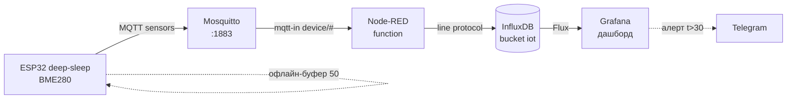

# Cloud-пайплайн: ESP32 → MQTT → Node-RED → InfluxDB → Grafana

> [!warning] without NTP-часу on вузлі InfluxDB запише точки with міткою 1970 - графіки «порожні»!
> NTP-синк до першої публікації обов'язковий, див. [[15-Protocols/03-mDNS-NTP-TLS]].

База: MQTT [[15-Protocols/01-MQTT|MQTT]], час [[15-Protocols/03-mDNS-NTP-TLS]], сон [[07-Timers/03-Sleep-ULP]], WiFi [[05-Radio/01-WiFi-STA-AP]], старт [[Home]].

## Призначення

Наскрізний example прикладного IoT: вузол ESP32 with DHT22/BME280 шле телеметрію per MQTT, Mosquitto приймає, Node-RED нормалізує, InfluxDB зберігає часові ряди, Grafana малює дашборд. Кожну ланку можна замінити, контракт між ними - JSON and MQTT-топіки with розділу [[15-Protocols/01-MQTT|MQTT]].

Коли брати такий стек:

- свій сервер (RPi 4 / VPS), дані нікуди not віддаємо;
- десятки вузлів, потрібні графіки, алерти, історія for рік;
- правила («якщо t > 30 - увімкнути вентилятор») пише нетехнар in Node-RED.

Альтернативи (оглядово, нижче): ThingsBoard замість Node-RED+InfluxDB+Grafana разом; AWS IoT Core замість свого Mosquitto - коли парку тисяч пристроїв замало одного брокера.

## Параметри

| Параметр | Значення | Примітка |
| --- | --- | --- |
| Вузол | ESP32 + DHT22/BME280, період 60 с | deep-sleep між вимірами |
| Транспорт | MQTT QoS 0, топік `device/<id>/sensors` | without retain on потоці! |
| broker | Mosquitto 2.x on RPi/VPS | 1883 локально, див. [[15-Protocols/01-MQTT | MQTT]] |
| Потік | Node-RED: mqtt-in → function → influxdb-out | JSON потоку нижче |
| Сховище | InfluxDB 2.x bucket `iot`, measurement `climate` | retention 365 днів |
| Дашборд | Grafana: Flux/SQL-запит, панель Time series | алерт in Telegram |
| Batch | 1 точка = 1 запис; офлайн-буфер - пачками до 50 | більше - різати |
| Час | NTP on вузлі + серверний timestamp how fallback | without часу - сміття in БД |
| Альтернатива 1 | ThingsBoard (MQTT + свій UI) | швидкий старт, менше гнучкості |
| Альтернатива 2 | AWS IoT Core (MQTT + rules → Timestream) | гроші for повідомлення |

![[assets/img/cloud-pipeline-nodered-scheme.png|600]]
*Рис. Пайплайн: сонний вузол прокидається, шле MQTT, Node-RED пише in InfluxDB, Grafana малює.*

### ASCII-схема

```text
ESP32-вузол (deep-sleep 60с)        Сервер RPi (192.168.1.10)
────────────────────────────        ────────────────────────
 wake → BME280 read → connect WiFi
   │ NTP sync (раз на добу/wake)     Mosquitto :1883
   └─► PUBLISH device/esp32-01/sensors {"t":24.5,"h":55,"vbat":4.0} ──►│
                                                                      ▼
                                                              Node-RED :1880
                                                               mqtt-in (device/#)
                                                                 │
                                                              function: нормалізація
                                                               + timestamp fallback
                                                                 │
                                                              influxdb-out ──► InfluxDB :8086
                                                                                bucket iot
                                                                                  │
                                                                               Grafana :3000
                                                                                 дашборд + алерти
Офлайн: нема WiFi → кільцевий буфер у RTC/NVS (до 50 точок) → злив пачкою.
```

### Mermaid



## Ланка 1: вузол (коротко, деталі - 01-MQTT)

Вузол робить мінімум: прокинувся → виміряв → підключився → опублікував → заснув. Повний MQTT-code with реконектом - in [[15-Protocols/01-MQTT|MQTT]], тут лише каркас трьох стеків (нижче). Формат корисного навантаження фіксований:

```json
{"id": "esp32-01", "t": 24.5, "h": 55.1, "vbat": 4.02, "rssi": -67}
```

Поле `ts` вузол not ставить (годинник може брехати) - timestamp проставляє Node-RED/InfluxDB at записі, but NTP on вузлі потрібен for TLS and порядку точок.

## Ланка 2: Mosquitto

broker with розділу [[15-Protocols/01-MQTT|MQTT]]: користувач on вузол, ACL `device/<id>/#`, користувач `nodered` with `device/#` on читання. Жодної логіки in брокері - він тільки шина.

## Ланка 3: Node-RED flow (JSON потоку)

Встановити: `sudo apt install -y nodejs npm`, далі Node-RED офіційним скриптом, палітра `node-red-contrib-influxdb`. Імпортувати потік (Menu → Import):

```json
[
  {
    "id": "mqtt-in-climate",
    "type": "mqtt in",
    "topic": "device/+/sensors",
    "qos": "0",
    "broker": "mosquitto-local",
    "nl": false
  },
  {
    "id": "fn-normalize",
    "type": "function",
    "func": "const m = JSON.parse(msg.payload);\nmsg.measurement = 'climate';\nmsg.payload = [{\n  t: Number(m.t), h: Number(m.h),\n  vbat: Number(m.vbat), rssi: Number(m.rssi)\n}, {id: m.id}];\nreturn msg;"
  },
  {
    "id": "influx-out",
    "type": "influxdb out",
    "influxdb": "influx-local",
    "measurement": "climate",
    "precision": "s"
  },
  {
    "id": "fn-alert",
    "type": "function",
    "func": "const m = JSON.parse(msg.payload);\nif (m.t > 30) { msg.payload = 'ALERT ' + m.id + ' t=' + m.t; return msg; }\nreturn null;"
  }
]
```

Зв'язки: `mqtt-in-climate` → `fn-normalize` → `influx-out`; `mqtt-in-climate` → `fn-alert` → (telegram-sender). Функція нормалізації відкидає сміття (`NaN` from DHT22 - not писати in БД, лічильник бракованих per BME280 - окрема метрика).

## Ланка 4: InfluxDB (bucket, retention, запит)

```bash
influx setup -b iot -o home -u admin -p '***' -r 365d --force
influx bucket list
```

Line protocol, that пише Node-RED:

```text
climate,id=esp32-01 t=24.5,h=55.1,vbat=4.02,rssi=-67 1727486400
```

check даних (Flux):

```flux
from(bucket: "iot")
  |> range(start: -24h)
  |> filter(fn: (r) => r._measurement == "climate" and r.id == "esp32-01")
```

Batch-правило: пачка with офлайн-буфера - до 50 точок for запис; більше ріже пам'ять Node-RED and таймаути InfluxDB.

## Ланка 5: Grafana-дашборд

source: InfluxDB (Flux, URL `http://localhost:8086`, токен with правами read on `iot`). Панелі: Time series `t`/`h` for 24 год, Stat `vbat` (червоний < 3.3 in), Bar gauge `rssi`. Алерт: `t > 30` протягом 5 хв → контакт Telegram. Дашборд експортувати JSON in git - відновлення for хвилину.

## Deep-sleep вузол + буферизація at офлайні

Цикл: `wake → sensors → WiFi → NTP (рідко) → MQTT → sleep(60 с)`. Якщо WiFi/MQTT недоступні - точку складати in кільцевий буфер (RTC-пам'ять до ребуту, NVS - переживе ребут, до 50 записів). at наступному успіху - злити буфер пачкою QoS 1 and почистити. Ніколи not крутити реконект довше 20 с from батареї - краще заснути and спробувати наступного циклу.

## code вузла: ESP-IDF (каркас, деталі - 01-MQTT)

```c
// wake → read BME280 → publish → sleep. MQTT-клієнт як у 01-MQTT.
void app_main(void) {
    wifi_connect(); sntp_start(); mqtt_start();
    float t, h; bme280_read(&t, &h);
    char j[128];
    snprintf(j, sizeof j, "{\"id\":\"esp32-01\",\"t\":%.1f,\"h\":%.1f}", t, h);
    mqtt_await_connected(5000);
    esp_mqtt_client_publish(s_client, "device/esp32-01/sensors", j, 0, 0, 0);
    vTaskDelay(pdMS_TO_TICKS(500)); // дати TCP стекти
    esp_sleep_enable_timer_wakeup(60 * 1000000ULL);
    esp_deep_sleep_start();
}
```

## code вузла: Arduino (каркас)

```cpp
#include <WiFi.h>
#include <PubSubClient.h>
WiFiClient net; PubSubClient mqtt(net);
void setup() {
  WiFi.begin("SSID", "PASS");
  for (int i = 0; i < 60 && WiFi.status() != WL_CONNECTED; i++) delay(500);
  mqtt.setServer("192.168.1.10", 1883);
  if (mqtt.connect("esp32-01", "esp32-01", "SECRET")) {
    float t = 24.5, h = 55.0; // dht.readTemperature/Humidity()
    if (!isnan(t)) mqtt.publish("device/esp32-01/sensors",
      ("{\"id\":\"esp32-01\",\"t\":" + String(t) + "}").c_str());
    delay(500);
  }
  esp_sleep_enable_timer_wakeup(60 * 1000000ULL);
  esp_deep_sleep_start(); // реконект — у 01-MQTT, тут сон важливіший
}
void loop() {}
```

## code вузла: MicroPython (каркас)

```python
import network, time, json, machine
from umqtt.simple import MQTTClient
import dht
from machine import Pin

sta = network.WLAN(network.STA_IF); sta.active(True)
sta.connect("SSID", "PASS")
for _ in range(40):
    if sta.isconnected(): break
    time.sleep(0.5)
if sta.isconnected():
    s = dht.DHT22(Pin(4)); s.measure()
    c = MQTTClient("esp32-01", "192.168.1.10", user="esp32-01", password="SECRET")
    c.connect()
    c.publish(b"device/esp32-01/sensors",
              json.dumps({"id": "esp32-01", "t": s.temperature(), "h": s.humidity()}))
    time.sleep(0.5)
# else: записати точку в буфер (файл) і спати
machine.deepsleep(60_000)
```

## Альтернативи: ThingsBoard, AWS IoT Core (оглядово)

- **ThingsBoard:** вузол шле MQTT on `v1/devices/me/telemetry` with токеном пристрою - and одразу має дашборди, rule engine, алерти without Node-RED/InfluxDB/Grafana. Швидкий старт, ціна - менша гнучкість запитів and прив'язка до однієї платформи.
- **AWS IoT Core:** broker + rules (SQL) → Timestream/DynamoDB/S3, тінь пристрою (shadow), fleet provisioning for тисяч вузлів. Ціна - гроші for мільйон повідомлень and складніший IAM/TLS with клієнтськими сертифікатами. Виправдано from сотень пристроїв або коли замовник уже in AWS.

## typical errors

| Симптом | Причина | Рішення |
| --- | --- | --- |
| Графіки порожні, точки with 1970 | немає NTP on вузлі | SNTP до першої публікації; fallback - серверний timestamp |
| Дублі точок після реконекту | retained `sensors` + перепідписка | retain ТІЛЬКИ state/status, ніколи потік (див. 01-MQTT) |
| `NaN` in БД, ламані графіки | DHT22 not встиг / CRC fail | відкидати `isnan` in Node-RED function |
| Пачка 500 точок вішає запис | batch without ліміту | різати per 50, таймаут InfluxDB-клієнта |
| retain-шторм: 1000 старих точок | вузол щоразу публікує retain | QoS 0 without retain on `sensors` |
| Час стрибає після deep-sleep | RTC-дрейф, NTP раз on добу мало | синк кожного N-го wake або at дрейфі > 2 с |
| Grafana `401` до InfluxDB | протух токен / not той bucket | токен read on `iot`, verify Organization |

## official джерела

- [Node-RED - документація](https://nodered.org/docs/) - потоки, mqtt-in, function-вузли.
- [InfluxDB OSS v2 - документація](https://docs.influxdata.com/influxdb/v2/) - buckets, line protocol, Flux.
- [Grafana - документація](https://grafana.com/docs/grafana/latest/) - джерела, панелі, алерти.
- [ThingsBoard - документація](https://thingsboard.io/docs/) - MQTT telemetry API, rule engine.
- [AWS IoT - What is AWS IoT](https://docs.aws.amazon.com/iot/latest/developerguide/what-is-aws-iot.html) - Core, rules, протоколи.

## Див. також

- [[Home]]
- [[05-Radio/01-WiFi-STA-AP|WiFi STA/AP]] - транспорт вузла
- [[08-Memory/03-OTA|OTA]] - оновлення вузлів пайплайна
- [[08-Memory/01-Partitions-NVS|NVS]] - офлайн-буфер, ID вузла
- [[99-Additions/02-Troubleshooting-FAQ|FAQ]] - діагностика ланок
- [[15-Protocols/01-MQTT|MQTT]] - повний code вузла with реконектом
- [[15-Protocols/02-HTTP-WebSocket|HTTP/WebSocket]] - REST-альтернатива вузлу
- [[15-Protocols/03-mDNS-NTP-TLS|mDNS/NTP/TLS]] - час for InfluxDB
- [[15-Protocols/04-Provisioning|Provisioning]] - entry WiFi on вузлах

## Common issues

| Symptom | Cause | Fix |
|---|---|---|
| Connection refused | Wrong broker/port or TLS cert missing | Verify URL, CA cert, firewall rules |
| Timeout / no response | Network unreachable / DNS failure | Check WiFi, mDNS/NTP server reachability |
| TLS handshake failed | Clock not set / wrong CA | Set time via NTP before TLS connect |

## Official sources

- [Espressif ESP-IDF Protocol Docs](https://docs.espressif.com/projects/esp-idf/en/latest/esp32/api-reference/protocols/index.html) - official protocol APIs.
- [Micropython umqtt / network docs](https://docs.micropython.org/en/latest/index.html) - MQTT and socket references.
