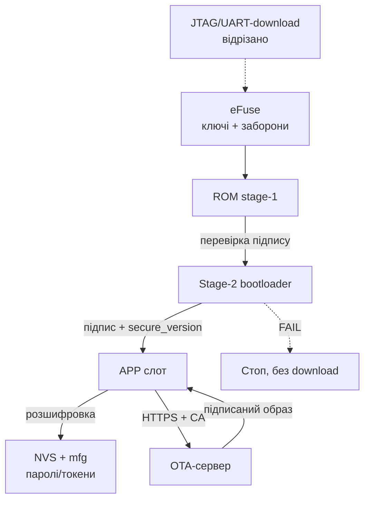

# Security Hardening ESP32 before production

> [!warning] Prototype ≠ product!
> Board with open UART log, firmware without signature and WiFi password in plaintext-NVS - this desk demo, but not product for client. Pass this checklist BEFORE first batches: half items irreversible (eFuse).

Base: flash and signature [[08-Memory/04-Secure-Boot-Encrypt | 04-Secure-Boot-Encrypt]], доставка оновлень [[08-Memory/03-OTA.en | OTA]], дебаг [[09-Firmware/05-JTAG-Debug | 05-JTAG-Debug]], час and TLS [[15-Protocols/03-mDNS-NTP-TLS.en | 03-mDNS-NTP-TLS]], старт [[Home.en | Home]].

## Purpose

Hardening - this shifting device with "easy to develop" mode in "hard to break" mode. Document gives one checklist: what to enable, what to disable, where it impactsться and чим доведеться заплатити (гроші, час, ризик цегли). Охоплює Secure Boot, шифрування Flash, protection OTA, JTAG-лок та унікальні паролі on виріб.

## 1. Threat model: who we defend against

Physical access - main difference embedded from server. Device is placed in entryway, on roof, in field: attacker може його disassemble.

| Threat | What attacker can do | What saves |
| --- | --- | --- |
| Flash reading programmer / `esptool read_flash` | copy firmwares, extract passwords and keys | Flash Encryption + NVS encryption |
| Firmware substitution (своя with бекдором) | reflashing via UART або підміна OTA-файла | Secure Boot V2 + signed OTA |
| Rollback to old vulnerable version | flash signed but old binary | Anti-rollback, secure version in eFuse |
| Сніфінг ефіру (WiFi, BLE, MQTT) | читає паролі, підміняє команди | WPA2/WPA3 + PMF, MQTTS/TLS, BLE bonding with шифруванням |
| Перехоплення provisioning | підключається до відкритого Setup-AP | Пароль on portал, таймаут, PoP (див. [[15-Protocols/04-Provisioning.en | Provisioning]]) |
| Клонування пристроїв batches | копіює одну прошивку on 100 плат | Унікальні паролі/ключі on пристрій (mfg-партиція) |
| Витяг секретів with логів | UART-консоль сипле токенами | Level логів without секретів, консоль вимкнена in релізі |
| Віддалена експлуатація старої версії | ботнет with незапатчених вузлів | OTA тільки per HTTPS with підписом + rollback |

> [!caution] Physical access = повний доступ without криптографії!
> without Flash Encryption + Secure Boot будь-хто with викруткою and USB-кабелем - твій «адмін». Package and пломби - затримка, but not protection.

## 2. Головний чек-лист: what to disable / ввімкнути

| № | Захід | Де вмикається | Ціна/ризик |
| --- | --- | --- | --- |
| 1 | Threat model записано (table вище) | цей документ + ADR під розписку | 1 година; ризик - будувати not той protection |
| 2 | Flash Encryption, Release-режим | `menuconfig` → Security features → Enable flash encryption; підсумок [[08-Memory/04-Secure-Boot-Encrypt | 04-Secure-Boot-Encrypt]] | Незворотно; `read_flash` віддає шифротекст; бекап до ввімкнення |
| 3 | Secure Boot V2, signature ECDSA/RSA | `menuconfig` → Secure Boot V2 + key on офлайн-машині; деталі [[08-Memory/04-Secure-Boot-Encrypt | 04-Secure-Boot-Encrypt]] | Незворотно; втрата `signing.pem` = заморожений флот |
| 4 | Anti-rollback, secure version +1 on реліз | `CONFIG_BOOTLOADER_APP_ANTI_ROLLBACK`, `CONFIG_BOOTLOADER_APP_SECURE_VERSION` | Лічильник on 32 кроки; not ставити on factory/test-слоти |
| 5 | JTAG заблоковано (`DIS_USB_JTAG` / JTAG-disable) | eFuse / `menuconfig` (Secure Boot палить автоматично at першому старті) | Дебаг більше неможливий; дебажити ДО запаювання бітів |
| 6 | UART-download вимкнено (`DIS_DOWNLOAD_MODE`) | eFuse `DISABLE_DL_ENCRYPT/DECRYPT`, опція UART ROM download mode | Цегла at мертвій OTA - рятує тільки заміна модуля |
| 7 | NVS-шифрування, паролі not in plaintext | `nvs_keys`-партиція + `CONFIG_NVS_ENCRYPTION`, WiFi/MQTT-пасс тільки туди | +4 КБ партиція, ключі залежать from Flash Encryption |
| 8 | WiFi: WPA2/WPA3 + PMF required | `pmf_cfg.required`, `WIFI_AUTH_WPA2_PSK` and вище | Старі роутери without PMF not підключаться - протестувати |
| 9 | BLE: privacy (RPA) + bonding + шифрування характеристик | `esp_ble_gap_config_local_privacy`, `ESP_LE_AUTH_REQ_SC_MITM_BOND` | Складніше pairing UX; without цього трекінг for MAC |
| 10 | OTA тільки per HTTPS + signature образу | `esp_https_ota` with CA-bundle, Secure Boot перевіряє signature | Потрібен PKI and server; HTTP-OTA заборонено in проді |
| 11 | Унікальні паролі/PoP on пристрій (mfg-партиція) | заводський стенд пише `mfg` (серійник, PoP, токен) | Інфраструктура перsleepалізації; один пароль on партію - заборонено |
| 12 | Ротація TLS-сертифікатів and API-токенів | server віддає новий токен per старій сесії; CA-bundle оновлюється with OTA | Прострочений CA = відвал флоту; тримати запасний корінь |
| 13 | UART-консоль вимкнена або without команд запису | `CONFIG_ESP_CONSOLE_NONE` / level логу `Error`, прибрати `console_repl` | Втрата польової діагностики - компенсувати coredump and хмарою |
| 14 | Debug-логи without секретів | рев'ю `ESP_LOGI` on `password/token/key/ssid-pass`, маскування `***` | 30 хв grep-рев'ю; один токен in логах = компрометація |
| 15 | Пароль on `/update` and provisioning-portал | `AsyncElegantOTA.begin(&server, "admin", per-device-pass)`, таймаут 180 с | Див. [[15-Protocols/04-Provisioning.en | Provisioning]]; відкритий portал = чужа firmware |
| 16 | Фінальний прогон: `espefuse summary` + OTA-тест with підписом | стенд QA, 3+ жертовні модулі перед Release | Час QA; зате партія not стане цеглою |

![[assets/img/security-hardening-scheme.png | 600]]
*Fig. Ланцюг довіри: eFuse → Secure Boot → Flash Encryption → підписана OTA; NVS and mfg - під парасолькою шифрування.*

### ASCII-схема ланцюга довіри (boot → app → OTA)

```text
eFuse (корінь довіри, ONE-TIME)
  ├─ дайджест публічного ключа Secure Boot (перевірка підпису)
  ├─ key Flash Encryption (розшифровка на льоту)
  ├─ FLASH_CRYPT_CNT (що зашифровано)
  └─ DIS_DOWNLOAD_MODE / DIS_USB_JTAG (що відрізано назавжди)
        │
        ▼
ROM stage-1 (незмінний)
  ── перевіряє підпис stage-2 bootloader ── FAIL → стоп, без fallback
        │
        ▼
Stage-2 bootloader
  ── перевіряє підпис app-слота (Secure Boot V2)
  ── перевіряє secure_version ≥ eFuse (anti-rollback)
  ── розшифровує flash (AES-XTS)
        │
        ▼
APP (робоча прошивка)
  ── NVS читається розшифрованим (WiFi/MQTT-пасс НЕ в plaintext)
  ── TLS: NTP-час + CA-bundle (див. [[15-Protocols/03-mDNS-NTP-TLS]])
  ── OTA: тільки HTTPS → підпис → запис у неактивний слот
        │
        ▼
OTA-сервер ──TLS──► пристрій ──► self-test ──► mark_valid / rollback
  старий підписаний образ з secure_version < eFuse ──► ВІДХИЛЕНО
```

### Mermaid



## 3. Flash Encryption + Secure Boot: короткий підсумок

Повна механіка - [[08-Memory/04-Secure-Boot-Encrypt | 04-Secure-Boot-Encrypt]]. Тут тільки прод-підсумок:

- key шифрування генерує сам пристрій at першому старті (або вшивається on заводі, але унікальний on плату).
- Development-режим - for жертовних модулів: reflashing ще можливе.
- Release-режим - for batches: тільки зашифровані образи and підписана OTA.
- Secure Boot V2 перевіряє signature bootloader and app on кожному старті and on кожній OTA.
- Порядок for продакшну: бекап ключів in 2 сховища → 3+ тести in Development → тільки потім Release on batches.

## 4. Anti-rollback: secure version

Навіть підписаний образ може бути старим and вразливим. Anti-rollback not дає відкотитись нижче записаної in eFuse версії безпеки.

```c
// menuconfig:
//   CONFIG_BOOTLOADER_APP_ANTI_ROLLBACK=y
//   CONFIG_BOOTLOADER_APP_SECURE_VERSION=3   // +1 на кожен security-реліз
//   CONFIG_BOOTLOADER_APP_ROLLBACK_ENABLE=y  // разом з anti-rollback
#include "esp_ota_ops.h"

// Після self-test нової версії — підтвердити, інакше відкат:
esp_ota_mark_app_valid_cancel_rollback();
// Провал self-test — примусовий відкат:
// esp_ota_mark_app_invalid_rollback_and_reboot();
```

Правила: версія in образі мусить бути ≥ версії in eFuse, інакше bootloader відхилить слот. Бітів вистачає on ~32 підняття - not витрачати on кожен багфікс, тільки on security-релізи. Factory/test-слоти in цій схемі not підтримуються.

## 5. JTAG lock + UART-download-disable: ЗАСТЕРЕЖЕННЯ ПРО ЦЕГЛУ

> [!caution] this точка неповернення!
> `DIS_USB_JTAG` and `DIS_DOWNLOAD_MODE` (but також `DISABLE_DL_ENCRYPT/DECRYPT`) перегорають НАЗАВЖДИ. Пристрій with мертвою прошивкою and відрізаним UART-завантаженням лікується тільки паяльником (заміна модуля).

that коли відрізається:

| Біт / дія | that закриває | Коли палити |
| --- | --- | --- |
| JTAG-disable (автоматично with Secure Boot / Flash Encryption) | апаратний дебаг, дамп RAM via адаптер | після останньої дебаг-сесії |
| `DIS_DOWNLOAD_MODE` / `DISABLE_DL_*` | `esptool write_flash`, читання flash via UART | тільки коли OTA with підписом протестована on 3+ boardх |
| `RD_DIS` on ключах | навіть власник not прочитає eFuse | разом with релізом, після запису бекапів |

Мінімальний безпечний порядок: дебаг and QA → бекап ключів → Development-шифрування → підписана OTA → Release → and тільки потім JTAG/UART-lock.

## 6. NVS-шифрування ключів: паролі not in plaintext

WiFi-пароль, MQTT-логін/пароль, API-tokens for замовчуванням лежать in NVS plain text. with увімкненим Flash Encryption увімкни and NVS-шифрування:

```text
# partitions.csv — партиція ключів NVS (мінімум 4 КБ, прапор encrypted):
nvs,      data, nvs,      0x9000, 0x6000,
nvs_keys, data, nvs_keys, 0xF000, 0x1000, encrypted
```

```c
// menuconfig: CONFIG_NVS_ENCRYPTION=y
// Дефолтна NVS шифрується автоматично через nvs_flash_init(),
// ключі генеруються в nvs_keys при першому старті.
```

Заборони: not класти секрети in `phy_init`, in незашифровані `data`-партиції, in LittleFS-файли without шифрування, in code (`const char *PASS = ...` читається with бінарника!). Унікальні секрети - in `mfg`-партицію із заводу (наступний розділ).

## 7. WiFi PMF + WPA3 and BLE privacy/bonding

Ефір слухають усі. Мінімум for WiFi - WPA2-PSK with увімкненим PMF (protection from deauth-атак and зриву сесії):

```c
wifi_config_t cfg = { /* ... .sta.threshold.authmode = WIFI_AUTH_WPA2_PSK ... */ };
// PMF: optional — для сумісності, required — для продакшену з новими AP:
cfg.sta.pmf_cfg.capable = true;
cfg.sta.pmf_cfg.required = true; // відхиляє AP без PMF — протестувати з цільовими роутерами!
```

WPA3-SAE - якщо цільові роутери його вміють; інакше WPA2/WPA3-transition. Деталі режимів - офіційний гайд Wi-Fi Security (див. джерела).

BLE-мінімум for носимих/кімнатних пристроїв:

- Privacy: resolvable private address (RPA) - інакше трекінг for статичним MAC per офісу.
- Pairing with bonding + MITM-protection (passkey/JustWorks for моделлю загроз), шифрування характеристик with секретами.
- Після provisioning BLE вимикати (`esp_bt_mem_release`), щоб not висіти відкритим GATT (див. [[15-Protocols/04-Provisioning.en | Provisioning]]).

## 8. Ротація TLS-сертифікатів and API-токенів

Сертифікати вмирають (Let's Encrypt - 90 днів), tokens течуть. Закладати ротацію in архітектуру, but not in авральний виїзд:

- CA-bundle оновлювати разом with OTA; тримати 2 корені (старий + новий) on перехідний період.
- Токен пристрою: видача on заводі in `mfg`, оновлення per автентифікованій сесії (`POST /rotate` зі старим токеном → новий токен in NVS).
- Час for перевірки терміну - тільки після NTP-синку, інакше валідний сертифікат буде відхилено (див. [[15-Protocols/03-mDNS-NTP-TLS.en | 03-mDNS-NTP-TLS]]).
- Fingerprint сертифіката - тимчасовий костиль for стенду, in проді ламається at кожному перевипуску.

## 9. OTA тільки per HTTPS with підписом

Прод-правила (механіка слотів - [[08-Memory/03-OTA.en | OTA]]):

1. Трансport - тільки HTTPS with перевіркою CA and hostname. Чистий HTTP - стенд.
2. Образ підписаний тим самим ключем, that in eFuse; непідписаний відхиляє bootloader.
3. `secure_version` монотонно зростає on security-релізах.
4. Після старту - self-test (WiFi, сенсори, дотягнувся до OTA-serverа) and тільки потім `mark_valid`, інакше rollback.
5. `/update`-ендпоінт під паролем, унікальним on пристрій.

```c
#include "esp_https_ota.h"
esp_http_client_config_t config = {
    .url = "https://ota.example.com/firmware.bin",
    .crt_bundle_attach = esp_crt_bundle_attach, // CA-bundle, НЕ setInsecure!
    .timeout_ms = 10000,
};
if (esp_https_ota(&config) == ESP_OK) esp_restart();
```

## 10. Унікальні паролі on пристрій (mfg-партиція)

Один пароль `admin/admin` on всю партію = один злив and мертвий флот. Заводський стенд пише in кожну плату свою `mfg`-партицію: серійник, PoP for provisioning, пароль `/update`, токен хмари.

```text
# partitions.csv:
mfg, data, undefined, 0x3A0000, 0x10000, encrypted
```

Друк наліпки with серійником + PoP клеїться on package. PoP видається for запитом власника, not лежить in публічному CSV. Скидання до заводських стирає WiFi-облікові, але not затирає `mfg`.

## 11. Debug-логи without секретів

Логи - перше, that викладають on форум разом with токенами.

```c
// ПОГАНО:
ESP_LOGI("NET", "mqtt pass=%s token=%s", pass, token);
// ДОБРЕ:
ESP_LOGI("NET", "mqtt connected as %s", client_id);
ESP_LOGI("OTA", "token ...%s", token + strlen(token) - 4); // тільки хвіст
```

Чек перед релізом: `grep -rn "pass\|token\|key\|secret" main/ --include=*.c` and вичистити кожен `LOG` with секретом. Рівень релізних логів - `Error`, консоль without команд запису.

## 12. Команди espefuse / idf: тільки читання

> [!caution] not виконуй команди запису (`burn_key`, `burn_efuse`, `efuse-burn`) without письмового чек-листа and бекапу!
> Нижче - безпечні команди читання. Команда запису in цьому документі навмисно not наводиться повністю.

```bash
# Безпечно: подивитись стан бітів (що вже запаяно):
espefuse.py --port /dev/ttyUSB0 summary
idf.py efuse-summary

# Безпечно: перевірити підпис образу ОФЛАЙН-ключем (key не на пристрої!):
espsecure.py verify_signature --version 2 --keyfile signing.pem app-signed.bin

# Безпечно: перевірити, що flash уже шифрується (на живому пристрої):
esptool.py --port /dev/ttyUSB0 read_flash 0x10000 256 dump.bin
# Після Release там має бути шифротекст, а не читабельний код.
```

Запис - тільки on жертовному модулі, тільки for процедурою with [[08-Memory/04-Secure-Boot-Encrypt | 04-Secure-Boot-Encrypt]] розділ 4, with двома бекапами ключів.

## Common issues

| Симптом | Причина | Рішення |
| --- | --- | --- |
| JTAG not чіпляється після захисту | Secure Boot / Flash Encryption відрізали JTAG | this штатна поведінка; далі - логи, coredump, `esp-coredump.py`, софтверний трейс |
| Заблокований JTAG, but дебаг ще потрібен | біти запаяно on робочому зразку | Дебажити on незахищеному близнюці; захищений - тільки for регресійних прогонів |
| UART-download вимкнено, firmware мертва | `DIS_DOWNLOAD_MODE` + битий app, OTA not піднімається | Порятунку per дроту немає - заміна модуля; висновок: різати download тільки після 3+ вдалих OTA |
| `flash read err, 1000` per колу | plaintext залито поверх зашифрованого flash | verify `FLASH_CRYPT_CNT`, лити шифрований образ або OTA; деталі [[08-Memory/04-Secure-Boot-Encrypt | 04-Secure-Boot-Encrypt]] |
| Пристрій not стартує після підпису | key not той / secure_version нижче eFuse | `verify_signature` офлайн, звірити `CONFIG_BOOTLOADER_APP_SECURE_VERSION` |
| OTA падає with TLS-ошибкою | час 1970 (немає NTP) або прострочений CA | Спочатку SNTP-синк, потім TLS; ротувати CA-bundle (див. [[15-Protocols/03-mDNS-NTP-TLS.en | 03-mDNS-NTP-TLS]]) |
| MQTT-пароль витягли with дампа | NVS лежала in plaintext | Увімкнути NVS-шифрування, переписати секрети, старі відкликати |
| Один пароль on партію злили | немає mfg-перsleepалізації | Відкликати спільний секрет, ввести mfg + ротацію токенів |
| Токен світиться in логах on форумі | `LOGI` with секретом | Маскувати, знизити level, відкликати засвічений токен |
| PMF-required ні до чого not чіпляється | старі AP without PMF | Fallback: capable without required + WPA2, або оновити парк AP |
| Після ввімкнення захисту `esptool` мовчить | відрізано download / not той port | verify port and біти via `summary`; якщо біти цілі - this цегла |

## Official sources

- [Security Overview - ESP-IDF](https://docs.espressif.com/projects/esp-idf/en/stable/esp32/security/security.html) - цілі, threat-model, огляд Secure Boot / Flash Encryption / Secure OTA / Secure Storage.
- [Flash Encryption - ESP-IDF](https://docs.espressif.com/projects/esp-idf/en/stable/esp32/security/flash-encryption.html) - Development vs Release, eFuse, наслідки.
- [Secure Boot v2 - ESP-IDF](https://docs.espressif.com/projects/esp-idf/en/stable/esp32/security/secure-boot-v2.html) - signature RSA/ECDSA, ключі, best practices.
- [NVS Encryption - ESP-IDF](https://docs.espressif.com/projects/esp-idf/en/stable/esp32/api-reference/storage/nvs_encryption.html) - `nvs_keys`-партиція, шифрування облікових.
- [OTA / Anti-rollback - ESP-IDF](https://docs.espressif.com/projects/esp-idf/en/stable/esp32/api-reference/system/ota.html) - rollback, secure version, стани слотів.
- [Wi-Fi Security - ESP-IDF](https://docs.espressif.com/projects/esp-idf/en/stable/esp32/api-guides/wifi-security.html) - PMF, WPA3, Enterprise.
- [ESP-TLS - ESP-IDF](https://docs.espressif.com/projects/esp-idf/en/stable/esp32/api-reference/protocols/esp_tls.html) - CA, SNI, check serverа.
- [ESP x509 Certificate Bundle - ESP-IDF](https://docs.espressif.com/projects/esp-idf/en/stable/esp32/api-reference/protocols/esp_crt_bundle.html) - bundle Mozilla for OTA and MQTTS.

## See also

- [[Home.en | Home]]
- [[08-Memory/04-Secure-Boot-Encrypt | Secure Boot та Flash Encryption]] - повна механіка ключів and eFuse
- [[08-Memory/03-OTA.en | OTA]] - слоти, rollback, HTTPS-доставка
- [[09-Firmware/05-JTAG-Debug | JTAG-дебаг]] - дебажити до запаювання бітів
- [[15-Protocols/03-mDNS-NTP-TLS.en | mDNS/NTP/TLS]] - час for TLS and CA-bundle
- [[08-Memory/01-Partitions-NVS.en | NVS]] - партиції `nvs`, `nvs_keys`, `mfg`
- [[15-Protocols/01-MQTT.en | MQTT]] - паролі brokerа зберігати шифровано
- [[15-Protocols/04-Provisioning.en | Provisioning]] - PoP, пароль portалу, таймаут
- [[99-Additions/02-Troubleshooting-FAQ | FAQ]] - розбір зальотів
