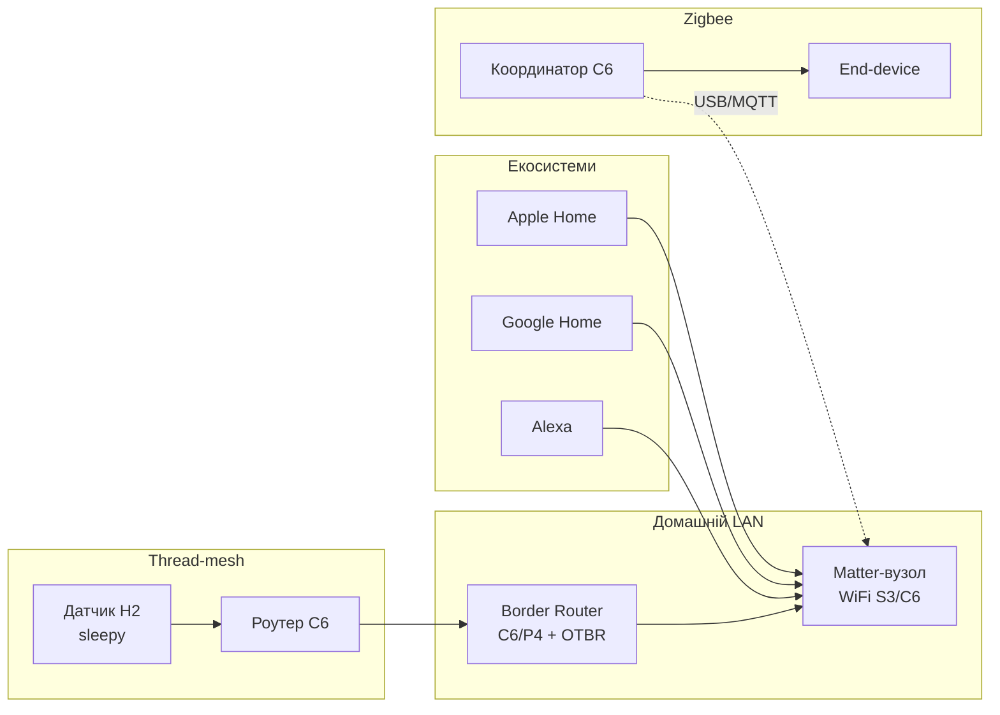

# Matter, Thread and Zigbee on ESP32 - esp-matter, OpenThread, esp-zigbee-SDK

> [!warning] Matter/Thread/Zigbee потребують радіо 802.15.4 - this C6/H2, but not C3!
> ESP32-C3 not має 802.15.4 and not підтримує ані Thread, ані Zigbee. for Matter-over-WiFi підійде будь-which ESP32 with WiFi, але for Matter-over-Thread або Zigbee беріть C6/H2. Див. [[01-Hardware/04-ESP32-C3-C6-H2|C3/C6/H2]].

Огляд радіо: [[05-Radio/02-BLE-Bluetooth|BLE]], живлення [[02-Power-Supply/01-Lancjugi-zhivlennya|живлення]], старт [[Home]].

## Призначення

Три різні відповіді on питання «how розумному дому спілкуватись without хмари»:

- **Matter** - прикладний IP-протокол верхнього рівня (застосунок). Працює поверх WiFi, Thread або Ethernet. Єдина «мова» for Apple Home, Google Home, Alexa, SmartThings: один пристрій видно in кількох екосистемах одразу (multi-admin). Комісіонування - via BLE + QR-code/числовий code.
- **Thread** - мережевий транспорт (IPv6 поверх 802.15.4, mesh). this «дороги», якими їздять Matter-пакети, коли WiFi недоступний або невигідний (батарейні датчики). Thread сам per собі застосунку not дає - поверх нього йде Matter (або plain UDP/CoAP).
- **Zigbee** - зрілий not-IP стек (802.15.4 + власний мережевий/прикладний рівень). Своя екосистема: координатор + роутери + кінцеві пристрої, інтеграція with Home Assistant via ZHA або Zigbee2MQTT. with Matter несумісний безпосередньо - міст via Border Router/хаб.

Коли брати that:

- лампа/розетка in Apple/Google Home without власної хмари - Matter-over-WiFi on будь-якому ESP32;
- батарейний датчик with роками роботи and mesh - Matter-over-Thread on C6/H2;
- велика наявна Zigbee-мережа (десятки пристроїв Aqara/IKEA) - Zigbee-координатор/кінцевий on C6/H2;
- один сенсор до телефону поруч - звичайний BLE, див. [[05-Radio/02-BLE-Bluetooth]].

## that обрати - Matter vs Zigbee vs BLE vs WiFi

| Критерій | Matter-over-WiFi | Matter-over-Thread | Zigbee 3.0 | BLE (GATT) | Plain WiFi (MQTT/HTTP) |
| --- | --- | --- | --- | --- | --- |
| Чіпи ESP | будь-which with WiFi | C6/H2 (+Border Router) | C6/H2 | всі | будь-which with WiFi |
| Транспорт | IP/WiFi | 802.15.4 mesh + IP | 802.15.4 mesh, not IP | BLE-with'єднання | IP/WiFi |
| Екосистеми | Apple/Google/Alexa одночасно | ті ж | ZHA/Zigbee2MQTT, хаби | телефон/додаток | своя хмара, Node-RED |
| Комісіонування | BLE + QR/code | BLE + QR/code | pairing (permit join) | connect | provisioning, див. [[15-Protocols/04-Provisioning | Provisioning]] |
| Живлення батарей | погане (WiFi) | відмінне (SED сплять роками) | відмінне | добре | погане without deep-sleep |
| Дальність/топологія | зірка до роутера | mesh, саморемонт | mesh, саморемонт | точка-точка ~10-50 м | зірка до роутера |
| Сертифікація | потрібна for логотипа | потрібна for логотипа | потрібна for логотипа | not потрібна | not потрібна |
| Складність коду | висока (esp-matter) | найвища (matter+thread) | середня (esp-zigbee-SDK) | низька | низька |
| Коли | розетка in HomeKit | датчик on батареї in HomeKit | наявний Zigbee-дім | пульт/маяк поруч | свій дашборд/MQTT |

Правило: **немає екосистем Apple/Google - not платіть ціну Matter**. for свого дому достатньо Zigbee або MQTT, див. [[15-Protocols/01-MQTT|MQTT]].

## Вимоги до чіпів and пам'яті

| Чіп | WiFi | 802.15.4 | Matter-over-WiFi | Matter-over-Thread / Zigbee | Роль in Thread/Zigbee |
| --- | --- | --- | --- | --- | --- |
| ESP32 Classic | так | ні | так | ні | - |
| ESP32-S3 | так | ні | так | ні | - |
| ESP32-C3 | так | ні | так | ні | - |
| ESP32-C6 | WiFi 6 | так | так | так | вузол, RCP-радіо, Border Router |
| ESP32-H2 | ні | так | ні (немає WiFi) | так | вузол, RCP-радіо |
| ESP32-C2 | так | ні | обмежено (мало RAM) | ні | - |
| ESP32-P4 | ні (треба зовнішнє радіо) | ні | how хост per Ethernet | how хост + C6/H2-радіо per UART/SPI | хост Border Router |

Пам'ять: esp-matter тягне ~1 МБ flash (сертифікати DAC, кластери, BLE-комісіонування) - закладайте flash from 4 МБ and партиції під factory + OTA, див. [[08-Memory/01-Partitions-NVS|Partitions]]. Thread-вузол on H2 живе in ~320 КБ flash. Деталі заліза: [[01-Hardware/04-ESP32-C3-C6-H2|C3/C6/H2]], [[01-Hardware/09-ESP32-C2-P4|C2/P4]].

![[assets/img/matter-thread-zigbee-scheme.png|600]]
*Рис. Matter поверх WiFi and Thread: комісіонування BLE+QR, fabric кількох екосистем, Border Router між Thread-mesh and домашнім LAN.*

### ASCII-схема

```text
ЕКOSИСТЕМИ (multi-admin, одна fabric або кілька):
  Apple Home ─┐
  Google Home ─┼──► WiFi/Ethernet ──► Matter-вузол (ESP32-S3, on-off light)
  Alexa ──────┘                              │
                                             │ Thread-радіо (802.15.4)
                                             ▼
  Thread-mesh: H2-датчик (SED, спить) ──► C6-роутер ──► Border Router (C6+RCP / RPi+OTBR)
                                                    ──► LAN ──► ті самі екосистеми

Zigbee-гілка (окрема мережа, не IP):
  Zigbee-координатор (C6, esp-zigbee-SDK) ──► роутер (лампа) ──► end-device (кнопка, спить)
        │ USB/UART
        ▼
  Home Assistant (ZHA / Zigbee2MQTT) ──► MQTT ──► Node-RED (див. 05-Cloud-Pipeline)

Комісіонування Matter: BLE-advertise + QR (passcode/discriminator) ──► fabric-credentials ──► operational
```

### Mermaid



## esp-matter SDK: комісіонування, кластери, fabric, OTA

**Комісіонування (BLE + QR).** Новий пристрій рекламується per BLE. Комісіонер (телефон with Home) зчитує QR: там passcode, discriminator and дані for PASE-сесії. Далі per BLE йдуть operational-credentials (NOC - node operational certificate), пристрій входить in **fabric** and переходить on робочий транспорт (WiFi/Thread). Практика: QR друкуйте on корпусі + тримайте копію; without заводського QR перекомісіонування - via ручне entry коду with консолі.

**Модель даних: endpoints → clusters → attributes/commands.**

| Рівень | example (розумна лампа) | Примітка |
| --- | --- | --- |
| Endpoint 0 | Root Node (Descriptor, Basic Information, OTA) | службовий, є завжди |
| Endpoint 1 | On/Off Light (0x0100): OnOff-сервер, LevelControl-сервер | твій пристрій |
| Cluster-сервер | OnOff (0x0006): атрибут `OnOff`, команди `On/Off/Toggle` | стан + керування |
| Cluster-клієнт | OnOff-клієнт on вимикачі - шле команди лампі | binding |
| Атрибут | `OnOff = true`, reporting at зміні | підписки екосистем |

**Fabric and multi-admin.** Fabric - домен безпеки (один дім = одна fabric; пристрій може бути in кількох - multi-admin: Apple + Google одночасно). Кожна fabric має свій NOC and своїх адмінів. Видалення fabric = «прибрати with дому» without скидання інших.

**Matter OTA.** Прошивка тягнеться via BDX-протокол from OTA-провайдера (хаб/телефон), образ перевіряється for VID/PID/версією. Закладайте два OTA-слоти, див. [[08-Memory/03-OTA|OTA]].

Приклади esp-matter: `examples/light` (on-off + level), `examples/light_switch` (клієнт), `examples/thermostat`. Збірка - тільки ESP-IDF (esp-matter how компонент, CMake).

## Thread, OpenThread and Border Router

**Ролі вузлів Thread:**

| Роль | Живлення | that робить | example |
| --- | --- | --- | --- |
| Leader | мережа | керує mesh, один on мережу | C6-роутер |
| Router | мережа | ретранслює, до 32 on мережу | C6-лампа |
| Child (FTD/MTD) | мережа/батарея | говорить via батька | H2-вимикач |
| SED (Sleepy End Device) | батарея, роки | спить, опитує батька | H2-датчик дверей |

**OpenThread on ESP:** стек OpenThread in ESP-IDF (`CONFIG_OPENTHREAD_*`), транспорт 802.15.4 on C6/H2. Два дизайни: SoC (все on одному C6) або **RCP** (C6/H2 - тільки радіо per Spinel/UART, but стек and застосунок - on хості: P4 або Linux).

**Border Router (OTBR):** міст Thread-mesh ↔ WiFi/Ethernet. Варіанти: готовий OTBR on Raspberry Pi + C6/H2-RCP, або ESP32-Border-Router (C6-радіо + WiFi-аплінк). without Border Router Thread-пристрої ізольовані from LAN and екосистем - this error №1 новачків.

> [!tip] C6 how радіо + P4 how хост
> Зв'язка with ТЗ: P4 (потужний хост without радіо) + C6/H2 how RCP per UART/SPI. Використовуйте офіційний образ `esp-border-router` and транспорт Spinel - not винаходьте свій протокол між хостом and радіо.

## esp-zigbee-SDK: ролі, pairing, touchlink

**Ролі:**

| Роль | Живлення | example | Примітка |
| --- | --- | --- | --- |
| Coordinator | мережа, 1 on мережу | C6-стік on Home Assistant | формує мережу, зберігає таблиці |
| Router | мережа | лампа/розетка | ретранслює, діти до нього чіпляються |
| End Device | батарея | кнопка/датчик | спить, опитує батька |

**Pairing with ZHA/Zigbee2MQTT:** in координатора/ХАБа вмикається `permit join` (60-120 с), пристрій переводиться in pairing (кнопка/ресет), далі interview (кластери) and поява in HA. Канали 11-26 (2.4 ГГц); канали 25-26 перетинаються with WiFi 11-м - at глухому ефірі змініть канал координатора. Приклади SDK: `examples/esp_zigbee_HA_sample` (HA on-off light/switch), `HA_on_off_light`, `HA_on_off_switch`.

**Touchlink (оглядово).** Пряме спарювання «лампа↔пульт» зблизька (кілька метрів, знижена потужність), without координатора: пульт «краде» лампу in свою міні-мережу. Корисно for демо, in продакшені - обережно: touchlink може відв'язати чужу лампу via стіну, therefore тримайте його вимкненим for замовчуванням.

> [!warning] Zigbee and Matter - різні мережі
> Zigbee-пристрій not with'явиться in Apple Home безпосередньо. Міст - via Home Assistant (ZHA/Z2M → HomeKit-bridge) або Matter-bridge-пристрій. Закладайте this in архітектуру одразу.

## code - комісіонування and кластер on-off

**ESP-IDF, esp-matter: on-off light (скорочено, example `examples/light`):**

```c
// idf.py menuconfig: ESP_MATTER_ENABLE_DATA_MODEL_SERVER, WiFi/Thread транспорт,
// BLE-комісіонування увімкнено. QR-код друкується в лог при старті.
// Ключові кроки light-прикладу:
#include <esp_matter.h>
#include <esp_matter_console.h>

static void *s_onoff_handle; // дескриптор кластера OnOff (endpoint 1)

static esp_err_t onoff_cb(esp_matter::attribute::callback_type_t type, uint16_t ep,
                          uint32_t cluster, uint32_t attr, esp_matter_attr_val_t *val,
                          void *priv)
{
    if (type == esp_matter::attribute::callback_type_t::PRE_UPDATE) {
        bool on = val->val.b;                 // новий стан OnOff
        gpio_set_level(GPIO_NUM_2, on);       // фізична лампа/світлодіод
    }
    return ESP_OK;
}

void app_main(void)
{
    nvs_flash_init();                         // fabric-дані і QR живуть у NVS!
    esp_matter::node_t *node = esp_matter::node::create_raw();
    esp_matter::endpoint_t *ep =
        esp_matter::endpoint::on_off_light::create(node, NULL, NULL, NULL);
    s_onoff_handle = esp_matter::cluster::get_first(ep); // OnOff-кластер
    esp_matter::attribute::set_callback(onoff_cb);       // колбек PRE_UPDATE
    esp_matter::start();                        // старт + BLE-advertise для комісіонування
    // QR/passcode шукайте в логу: "QR Code URL: ...", "Manual pairing code: ..."
}
```

**ESP-IDF, esp-zigbee-SDK: HA on-off light (скорочено, `HA_on_off_light`):**

```c
// menuconfig: Zigbee channel/mode (Coordinator/Router/End Device), install code.
// Кнопка BOOT — toggle локально + report; pairing — довге утримання.
#include "esp_zigbee_core.h"

static void bdb_start_top_level_commissioning_cb(uint8_t mode_mask)
{
    ESP_ERROR_CHECK(esp_zb_bdb_start_top_level_commissioning(mode_mask));
}

void esp_zb_app_signal_handler(esp_zb_app_signal_t *sig)
{
    if (sig->p_app_signal == ESP_ZB_BDB_SIGNAL_STEERING) {
        // пристрій у мережі (coordinator відкрив permit join)
    }
}

static esp_err_t zb_onoff_handler(const esp_zb_zcl_set_attr_value_message_t *m)
{
    if (m->info.cluster == ESP_ZB_ZCL_CLUSTER_ID_ON_OFF &&
        m->attribute.id == ESP_ZB_ZCL_ATTR_ON_OFF_ON_OFF_ID) {
        gpio_set_level(GPIO_NUM_2, m->attribute.data.value.__u8);
    }
    return ESP_OK;
}

void app_main(void)
{
    esp_zb_cfg_t cfg = { .esp_zb_role = ESP_ZB_DEVICE_TYPE_ED, // або ROUTER/COORDINATOR
                         .install_code_policy = false };
    esp_zb_init(&cfg);
    esp_zb_on_off_light_cfg_t light = ESP_ZB_DEFAULT_ON_OFF_LIGHT_CONFIG();
    esp_zb_ep_list_t *ep = esp_zb_on_off_light_ep_create(10, &light);
    esp_zb_device_register(ep);
    esp_zb_core_action_handler_register(zb_onoff_handler);
    ESP_ERROR_CHECK(esp_zb_start(false)); // false = не factory-reset при старті
    esp_zb_main_loop_iteration();         // головний цикл стеку
}
```

**Arduino:** офіційної Arduino-обгортки esp-matter/esp-zigbee-SDK немає - ці стеки збираються тільки під ESP-IDF (CMake, партиції, NVS-фабричні дані). Практика: Matter/Zigbee-вузол пишіть on ESP-IDF, but Arduino-логіку тримайте on другому контролері або спілкуйтесь via UART/MQTT-міст. not намагайтесь «залити Matter скетчем» - this глухий кут.

**MicroPython:** підтримки Matter/Thread/Zigbee in MicroPython немає (немає 802.15.4-драйвера and місця під сертифікати). Практика: MicroPython-вузол говорить with шлюзом per MQTT/UART (див. [[15-Protocols/01-MQTT|MQTT]]), but Matter/Zigbee-частину тримає окремий C6/H2 on ESP-IDF.

## typical errors

| Симптом | Причина | Рішення |
| --- | --- | --- |
| Thread/Zigbee not збирається on C3 | немає радіо 802.15.4 on C3 | перейти on C6/H2, див. [[01-Hardware/04-ESP32-C3-C6-H2 | C3/C6/H2]] |
| Телефон not бачить QR / комісіонування висить | BLE зайнято іншим стеком; фабричні дані стерті | чистий example `light`, verify лог QR; not стирати NVS після комісіонування |
| Пристрій in fabric, але «not відповідає» | немає маршруту: Thread without Border Router; WiFi in іншому VLAN | підняти OTBR; тримати IoT and телефон in одному L2 |
| Після `erase_flash` пристрій «привид» in Home | fabric-дані лишились in хабі | видалити вузол with усіх fabric (усіх екосистем) до reflashing |
| Zigbee-інтерв'ю падає in ZHA/Z2M | сівший акумулятор end-device; канал with перешкодами | свіжа батарея; змінити канал координатора; роутер ближче |
| Touchlink «вкрав» чужу лампу | touchlink увімкнено скрізь | вимикати touchlink for замовчуванням, вмикати on хвилину |
| OTA Matter not стартує | not збігаються VID/PID/версія; малий OTA-слот | вирівняти версії in дескрипторі; партиції під два слоти |
| NVS переповнено після десятків комісіонувань | старі fabric not чистяться | factory-reset via довгу кнопку + `nvs_flash_erase()` |

## official джерела

- [ESP-Matter - Programming Guide](https://docs.espressif.com/projects/esp-matter/en/latest/) - комісіонування, data model, Matter OTA, приклади light/switch.
- [ESP Zigbee SDK - Programming Guide](https://docs.espressif.com/projects/esp-zigbee-sdk/en/latest/) - ролі, HA-приклади, API reference.
- [OpenThread](https://openthread.io/guides/border-router) - Border Router, Commissioner, RCP-дизайн.
- [Matter - Connectivity Standards Alliance](https://csa-iot.org/all-solutions/matter/) - специфікація, сертифікація, multi-admin.

## Див. також

- [[Home]]
- [[05-Radio/02-BLE-Bluetooth|BLE/Bluetooth]] - BLE-комісіонування Matter, GATT-база
- [[05-Radio/05-BLE-Mesh-A2DP-HID|BLE Mesh / A2DP / HID]] - інший BLE-стек Espressif, A2DP тільки on Classic
- [[01-Hardware/04-ESP32-C3-C6-H2|ESP32-C3/C6/H2]] - which радіо де є
- [[01-Hardware/09-ESP32-C2-P4|ESP32-C2/P4]] - P4 how хост Border Router
- [[11-Vivid/13-Audio-Codecs|Аудіо-кодеки]] - I2S-звук for голосових Matter-пристроїв
- [[15-Protocols/01-MQTT|MQTT]] - міст Zigbee2MQTT → хмара
- [[15-Protocols/04-Provisioning|Provisioning]] - entry WiFi without reflashing
- [[08-Memory/03-OTA|OTA]] - слоти під Matter OTA
- [[08-Memory/01-Partitions-NVS|NVS]] - fabric-дані живуть in NVS


## Common issues

| Symptom | Cause | Fix |
|---|---|---|
| Connection/timeout | Network / broker settings | Verify URL, firewall, credentials |

## Official sources

- [Espressif Protocol Docs](https://docs.espressif.com/projects/esp-idf/en/latest/esp32/api-reference/protocols/index.html)
