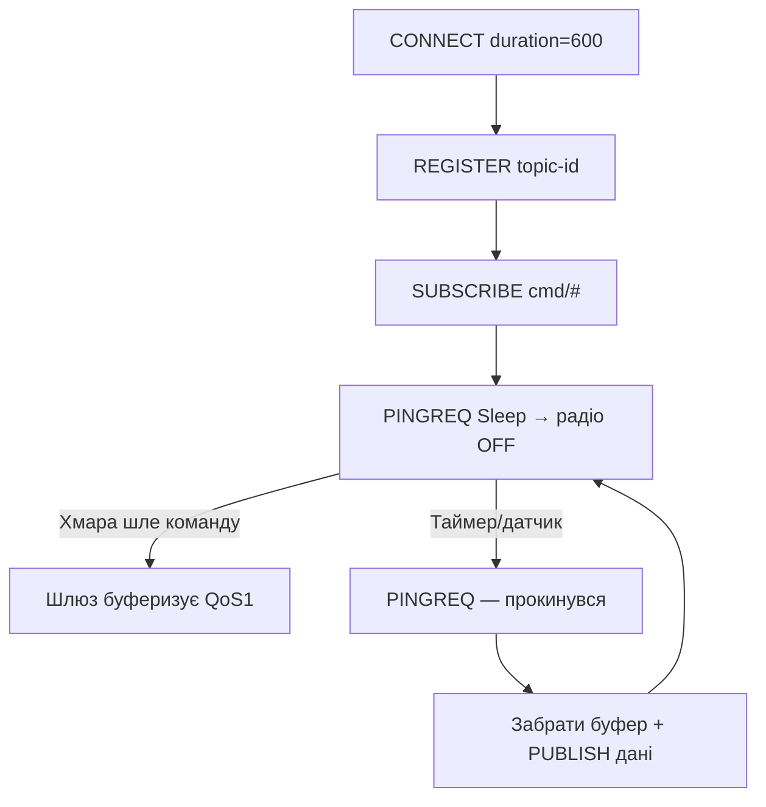

# MQTT-SN: MQTT for сенсорних мереж

## Призначення

Класичний MQTT - this TCP + довгі імена топіків: важко for LoRa/Zigbee (маленькі MTU, сплячі вузли, немає TCP). MQTT-SN (Sensor Networks) - той же pub/sub, але поверх UDP, with короткими topic-id and процедурою сну. ESP32 виступає шлюзом: with одного боку LoRa/Zigbee-вузли, with іншого - звичайний broker.

База: старт - [[Home]], MQTT - [[15-Protocols/01-MQTT|MQTT]], LoRa - [[12-Comm-Modules/02-NRF24-LoRa|LoRa]], Zigbee - [[15-Protocols/09-Matter-Thread-Zigbee]], офлайн-буфер - [[12-Comm-Modules/18-Cellular-LoRa-2|Cat-1]].

> MQTT-SN ≠ MQTT: різні дроти! Безпосередньо до Mosquitto not підключитись - потрібен SN-шлюз (прозорий або агрегуючий). Шлюз - this and є робота ESP32 тут.

![[assets/img/mqtt-sn-gateway-scheme.png|600]]
*Рис. LoRa/Zigbee-вузли говорять MQTT-SN/UDP зі шлюзом ESP32, шлюз - класичним MQTT/TCP with брокером.*

## Характеристики

| Параметр | MQTT-SN | Класичний MQTT |
| --- | --- | --- |
| Транспорт | UDP (TCP - опційно) | TCP |
| Топіки | 2-байтні topic-id / predefined / short-name (2 символи!) | Довгі рядки |
| CONNECT | Короткий, with `.../sleep` процедурою | Довгий + will |
| QoS | −1 (fire-and-forget!), 0, 1, 2 | 0, 1, 2 |
| Сплячі | PINGREQ with `...` + буфер шлюзу | Тільки LWT |
| MTU-дружність | Пакети ~10-30 байт | CONNECT ~100+ байт |
| Шлюз | Обов'язковий (transparent/aggregating) | not потрібен |

## 1. Топіки: id замість рядків

```text
Реєстрація: PUBLISH з довгим ім'ям → шлюз повертає REGISTER + topic-id (2 байти).
Далі: PUBLISH тільки з topic-id — економія кожного байта ефіру!
Predefined topic-id: зашиті в прошивку обох сторін (0x0001 = temp) — реєстрація не потрібна.
Short topic name: рівно 2 ASCII-символи ("t1") — для найбідніших.
```

## 2. Сплячий вузол: процедура SLEEP

```text
Вузол: CONNECT (clean, duration=600) → REGISTER/SUB → ... → PINGREQ з полем Sleep!
Шлюз: бачить Sleep → БУФЕРИЗУЄ вхідні QoS1/2 для вузла.
Вузол спить (радіо вимкнене!) → прокидається → PINGREQ (будить) → забирає буфер → знову Sleep.
DISCONNECT з duration: «спатиму N с, тримай буфер» — офіційний механізм, не хак!
```

### Mermaid: сон with буфером шлюзу



## 3. Шлюз on ESP32: прозорий vs агрегуючий

| Тип | how працює | Плюс | Мінус |
| --- | --- | --- | --- |
| Transparent | 1 SN-with'єднання = 1 MQTT-with'єднання with брокером | Простота, LWT наскрізний | 100 вузлів = 100 TCP-сесій (RAM!) |
| Aggregating | ОДНЕ MQTT-with'єднання on всіх, префікси топіків | Масштаб: сотні вузлів | Складніший code, LWT емулювати |

```text
Архітектура шлюзу (ESP32-S3 з PSRAM!):
  LoRa (SX1262/SPI) або Zigbee (C6 UART) ──► SN-парсер ──► буфер ──► esp-mqtt ──► broker
  Мапінг: SN topic-id 0x0001 вузла A → MQTT device/node-A/sensors/temp
  Реалізації: Eclipse Paho MQTT-SN Gateway (Java/C), RSMB (старий, але робочий),
  або свій міні-шлюз під 10–20 вузлів (простіше, ніж здається!).
```

## 4. QoS −1: publish without with'єднання (for маяків!)

```text
QoS −1 = вузол шле PUBLISH з predefined topic-id БЕЗ CONNECT взагалі.
Шлюз налаштований приймати — ідеально для односторонніх датчиків (температура раз на 10 хв).
Ціна: без підтверджень і без шифрування на цьому рівні — для критичного додати лічильник + HMAC у payload!
```

## typical errors

| # | error | Чому погано | how правильно |
| --- | --- | --- | --- |
| 1 | MQTT-SN безпосередньо in Mosquitto | Різні протоколи! | Тільки via SN-шлюз |
| 2 | Довгі топіки in ефірі | Їсть MTU LoRa | topic-id / predefined |
| 3 | TCP замість UDP on LoRa | Handshake not пролізе | UDP for замовчуванням |
| 4 | without duration in CONNECT | Шлюз викидає буфер | Duration = період сну + запас |
| 5 | 100 TCP-сесій on ESP32 | Немає RAM | Агрегуючий шлюз |
| 6 | QoS −1 for команд | Команди губляться мовчки | −1 тільки for телеметрії |
| 7 | without лічильника in payload | Replay-атаки | seq + HMAC |
| 8 | Один topic-id on всіх | Колізії | Реєстрація on вузол |

## official джерела

- [MQTT-SN specification (OASIS)](https://www.oasis-open.org/committees/mqtt-sn/) - пакети, процедури, шлюзи.
- [Eclipse Paho MQTT-SN Gateway](https://github.com/eclipse-paho/paho.mqtt-sn.embedded-c) - embedded-C клієнт + шлюз.
- [RSMB (Really Small Message Broker)](https://github.com/eclipse-mosquitto/mosquitto.rsmb) - broker with SN-підтримкою.

### Мінімальний SN-клієнт (псевдокод вузла)

```text
LOOP (прокинувся раз на 10 хв):
  CONNECT(clean, duration=700) → чекати CONNACK
  REGISTER "sensors/temp" → запам'ятати topic-id (або predefined 0x0001!)
  PUBLISH topic-id, QoS1, "23.5" → чекати PUBACK (3 ретраї)
  PINGREQ зі Sleep → радіо OFF, спати 600 с
Перший цикл: duration з запасом +20% (дрейф годинника вузла!).
```

### SN + LoRa: розрахунок ефіру

```text
Пакет PUBLISH QoS1: ~15–25 байт (замість 60+ у класичного MQTT!).
SF7/125 кГц: ефір ~50–100 мс → 1% duty-cycle = ~14 пакетів/годину МАКСИМУМ.
Висновок: період 10 хв — комфортно; раз на хвилину — тільки SF7 + короткий payload.
Sleep duration: період + 20% запас (дрейф RC-генератора вузла!).
Шлюз на ESP32-S3: SN-UDP-сокет + esp-mqtt + LittleFS-буфер (див. 18-Cellular-LoRa-2).
```

### RSMB-шлюз on сервері (коли ESP32-шлюз замалий)

```text
Eclipse RSMB (Really Small Message Broker): приймає MQTT-SN/UDP :1883
і класичний MQTT/TCP одночасно — шлюз не потрібен взагалі!
  - Вузли LoRa → свій UDP-міст (LoRa-приймач + forwarder) → RSMB :1883/UDP
  - Дашборди → класичний MQTT :1883/TCP до того самого RSMB
  - Retained/LWT працюють наскрізно (transparent-режим)
Мінус: RSMB застарілий (останні коміти давні) — для продакшену брати
Paho Gateway або ChirpStack + MQTT-інтеграцію.
```

## Див. також

- [[Home|Головна]]
- [[15-Protocols/01-MQTT|MQTT]]
- [[15-Protocols/11-Cloud-2|MQTT-клієнт]]
- [[15-Protocols/09-Matter-Thread-Zigbee|Matter/Thread/Zigbee]]
- [[12-Comm-Modules/02-NRF24-LoRa|LoRa]]
- [[12-Comm-Modules/18-Cellular-LoRa-2|Cat-1 (буфер)]]
- [[10-Sensors/39-Wireless-Sensors|Бездротові сенсори]]


## Common issues

| Symptom | Cause | Fix |
|---|---|---|
| Connection / auth failure | Credentials / cert / region | Verify keys, cert, region config |

## Official sources

- [AWS IoT Docs](https://docs.aws.amazon.com/iot/latest/developerguide/iot-connect-devices.html)
- [Azure IoT Docs](https://learn.microsoft.com/en-us/azure/iot/develop/reference-iot-device-mqtt/)
