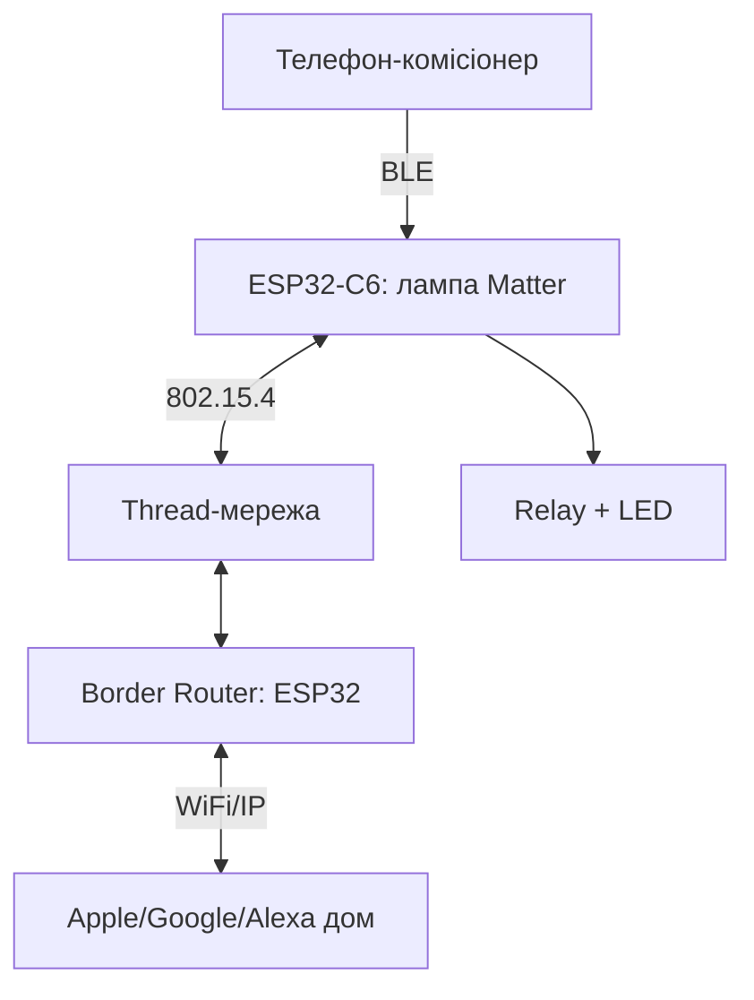

# ESP32 Matter-over-Thread - глибокий розбір Fabric, кластерів and commissioning

![[assets/img/esp32-matter-thread-deep-scheme.png|600]]
*Рис. Matter-вузол: 802.15.4-радіо C6/H2, Thread-мережа, border router in IP, комісія via BLE.*

> [!tip] that this for нота
> Глибина поверх оглядової Matter-ноти: тут Fabric, кластери and code, but not маркетинг. Потрібні C6 або H2 (є 802.15.4). База: [[01-Hardware/04-ESP32-C3-C6-H2|чипи C3/C6/H2]], [[15-Protocols/09-Matter-Thread-Zigbee|Matter оглядово]].

## 1. Мета

Зібрати сертифіковно-сумісний Matter-вузол:

- Fabric: that this and чому один пристрій in кількох домах;
- кластери OnOff/LevelControl/Color: кінцевий вимикач and лампа;
- commissioning per BLE: QR, passcode, discriminator;
- border router: Thread↔WiFi on другому ESP32;
- пам'ять: скільки їсть Matter on C6.

| Елемент | Роль | Де живе |
| --- | --- | --- |
| Node | пристрій (лампа) | ESP32-C6/H2 |
| Fabric | домен довіри + ключі | комісіонер and вузол |
| Cluster | функція (OnOff) | endpoint вузла |
| Commissioner | вводить in Fabric | телефон/хаб |
| Border Router | Thread↔IP міст | ESP32 + WiFi |

## 2. Архітектура



Commissioning йде per BLE (тимчасово), робота - per Thread. WiFi on вузлі not потрібен взагалі.

## 3. Розпіновка вузла (DevKitC-H2/C6)

| Пін плати | Призначення | Примітка |
| --- | --- | --- |
| GPIO8 | Реле/LED (OnOff-кластер) | via транзистор, not безпосередньо! |
| GPIO9 | Кнопка commissioning | on землю, pull-up |
| GPIO20/21 | UART-лог | 115200 for моніторингу |
| 3V3/GND | живлення | 500 мА запас |
| EN/BOOT | прошивка | кнопки плати |

Реле - тільки модулем with опторозв'язкою. Мережева частина - for електриком, not for цією нотою.

## 4. Commissioning покроково

- прошиваємо example `light` with esp-matter;
- QR on екрані монітора: `MT:XXXX-XXX-XXXX`;
- телефон (Apple Home/Google Home) → додати пристрій → сканувати QR;
- BLE-сесія обмінюється ключами Fabric (CASE/PASE);
- після комісії BLE можна вимкнути - далі Thread;
- другий дім - той же вузол, новий Fabric (multi-admin!).

## 5. Робочий code (C, ESP-IDF)

```c
#include "esp_matter.h"

static esp_err_t on_off_cb(esp_matter_cluster_t *cluster, uint32_t cmd) {
  bool on = (cmd == 1);
  gpio_set_level(GPIO_NUM_8, on);
  esp_matter_attr_val_t val = {.b = on};
  esp_matter_cluster_update(cluster, 0, &val);
  return ESP_OK;
}

void app_main(void) {
  esp_matter_node_t *node = esp_matter_node_create(NULL, 0, 0, 0);
  esp_matter_endpoint_t *ep = esp_matter_endpoint_create(node, 0);
  esp_matter_cluster_t *cl = esp_matter_cluster_create_on_off(ep, on_off_cb);
  (void)cl;
  esp_matter_start();
}
```

Кластер OnOff: команда 0/1, атрибут стану, підписка контролера. Колбеки - короткі, важке - in чергу.

## 6. Робочий code (MicroPython)

```python
# MicroPython: Matter-клієнт-емуляція через BLE-GATT (навчальний міст)
# Повний Matter-стек на MicroPython нема — керуємо вузлом HTTP-мостом
import network
import urequests
import time
from machine import Pin

relay = Pin(8, Pin.OUT)
btn = Pin(9, Pin.IN, Pin.PULL_UP)
wlan = network.WLAN(network.STA_IF)
wlan.active(True)
wlan.connect('ssid', 'pass')
while not wlan.isconnected():
    time.sleep(0.5)

BRIDGE = 'http://border-router.local:8080'

def set_lamp(on):
    urequests.post(BRIDGE + '/lamp', json={'on': on})
    relay.value(on)

while True:
    if not btn.value():
        set_lamp(not relay.value())
        time.sleep(0.5)
    time.sleep(0.05)
```

Чесно: Matter-commissioning on MicroPython not реалізувати розумно - міст via border router дає той же результат (керування лампою) малою кров'ю.

## 7. Border Router

- другий ESP32 (S3/C6) with RCP-прошивкою OpenThread + WiFi;
- `otbr-agent` або ESP Thread Border Router example;
- Thread-мережа отримує IPv6-префікс with LAN;
- mDNS/DNS-SD - виявлення вузлів контролерами;
- живлення 24/7, провідний uplink бажано.

## 8. Пам'ять and межі C6

| Ресурс | Витрата Matter | Залишок |
| --- | --- | --- |
| Flash | ~1.5 МБ (стек+кластери) | під OTA-запас |
| RAM | ~150 КБ runtime | обережно with буферами |
| NVS | ключі Fabric + лічильники | not прати without decommission! |

Фабричний ресет - кнопкою for процедурою (утримання 10 с), інакше ключі залишаться and комісія зависне.

## 9. typical errors

| Симптом | Причина | Лікування |
| --- | --- | --- |
| Комісія падає on 90 % | BLE розрив / далеко | телефон поруч, without металу між |
| Вузол not in Thread | немає лідера/border router | підняти BR першим |
| Працює, після ребута - ні | стерто NVS with ключами | not прати flash цілком, тільки app |
| Дві лампи плутаються | однакові discriminator | унікальний дискримінатор on вузол |
| Apple бачить, Google ні | лише один Fabric | multi-admin: додати другий дім |
| Пам'яті not вистачає | важкі кластери + лог | рівень логу Error, оптимізувати партиції |

## 10. Швидка шпаргалка Matter

- вузол: C6/H2, example light;
- комісія: QR + BLE поруч;
- робота: Thread, BR 24/7;
- NVS with ключами - святе;
- multi-admin - фішка, not баг.

## 11. Суміжні ноти

- [[15-Protocols/09-Matter-Thread-Zigbee|Matter оглядово]] - стартова картина.
- [[01-Hardware/04-ESP32-C3-C6-H2|чипи C3/C6/H2]] - радіо 802.15.4.
- [[15-Protocols/01-MQTT|протокол MQTT]] - альтернативний транспорт.
- [[14-Devboards/13-ESP32C6-Boards|плати C6]] - залізо вузла.
- [[Home|головна карта]] - повна навігація.

## official джерела

- [esp-matter (Espressif, GitHub)](https://github.com/espressif/esp-matter) - SDK, приклади, комісія.
- [ESP-Matter Docs (Espressif)](https://docs.espressif.com/projects/esp-matter/en/latest/) - Fabric, кластери, пам'ять.
- [esp-thread-br (Espressif, GitHub)](https://github.com/espressif/esp-thread-br) - border router, RCP, IPv6.


## Common issues

| Symptom | Cause | Fix |
|---|---|---|
| Connection / auth failure | Credentials / cert / region | Verify keys, cert, region config |

## Official sources

- [AWS IoT Docs](https://docs.aws.amazon.com/iot/latest/developerguide/iot-connect-devices.html)
- [Azure IoT Docs](https://learn.microsoft.com/en-us/azure/iot/develop/reference-iot-device-mqtt/)
