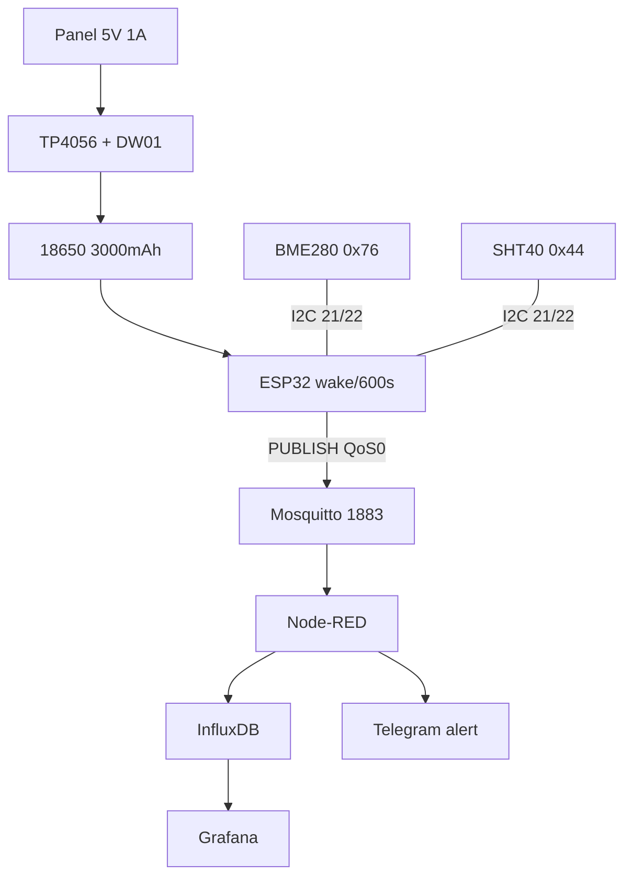

# Project 1 - Weather Station: BME280 + SHT40 → deep-sleep 10 min → MQTT → solar

![[assets/img/cookbook-weather-scheme.png|600]]
*Fig. Weather station: ESP32 + BME280/SHT40, solar TP4056 + 18650 power supply, MQTT uplink.*

> [!tip] What we are building
> Autonomous outdoor weather station: wakes every 10 min, reads temperature/humidity/pressure, publishes JSON over MQTT, then sleeps. Power supply is a solar panel + TP4056 + 18650. Base: [[05-Radio/01-WiFi-STA-AP.en | WiFi]], [[15-Protocols/01-MQTT.en | MQTT]], [[07-Timers/03-Sleep-ULP.en | Sleep]], [[10-Sensors/03-BME280-BMP280-SHT31.en | BME280]], [[10-Sensors/07-AHT10-AHT20-SHT40 | AHT/SHT40]].

## 1. Goal

Measure outdoor/greenhouse microclimate without a wall outlet and without maintenance for months.

Usage scenarios:

- balcony/country house: temperature + humidity + pressure → charts on phone;
- greenhouse: alert "humidity > 90%" → ventilate;
- learning: first battery device with deep-sleep and solar.

Result requirements:

- runtime without sun - minimum 7 days;
- temperature error ±0.5 °C, humidity ±3 %RH;
- one MQTT topic, one JSON - no format zoo;
- IP65 enclosure: rain and dust are not dangerous, condensation is drained.

| Parameter | Target value | How to check |
| --- | --- | --- |
| Cycle | wake → measure → publish → sleep, 600 s | log `uptime` in JSON |
| Sleep consumption | < 50 µA at battery terminals | multimeter in series + |
| Active consumption | < 120 mA average, 15 s | USB tester |
| Uplink | MQTT QoS 0, no retain | `mosquitto_sub -t 'device/#'` |
| Power | 5V 1A panel + 18650 3000 mAh | 7 days without sun |
| Enclosure | IP65, cable glands | hose spray test |

> [!warning] Two sensors - why?
> BME280 gives pressure (weather forecast by trend), SHT40 gives more accurate humidity with heater against condensation. If budget is one - choose SHT40. See [[10-Sensors/03-BME280-BMP280-SHT31.en | BME280]] and [[10-Sensors/07-AHT10-AHT20-SHT40 | SHT40]].

## 2. BOM - components

| Component | Reference note | Price, approx. |
| --- | --- | --- |
| ESP32 DevKit (WROOM-32) | [[00-Start/04-Devkit-plati.en | DevKit]] | $6 |
| BME280 module (I2C, 3.3V) | [[10-Sensors/03-BME280-BMP280-SHT31.en | BME280]] | $3 |
| SHT40 module (I2C 0x44) | [[10-Sensors/07-AHT10-AHT20-SHT40 | SHT40]] | $5 |
| TP4056 with DW01 protection | [[13-Power-Modules/03-TP4056-IP5306-BMS-UPS | Charge/BMS]] | $1 |
| 18650 3000 mAh (protected) | [[02-Power-Supply/04-Akumulyatori-TP4056 | Batteries]] | $5 |
| Solar panel 5V 1A (5W) | [[13-Power-Modules/01-Buck-Boost-Solar | Buck/Solar]] | $8 |
| MT3608 boost 18650→5V (optional) | [[13-Power-Modules/01-Buck-Boost-Solar | Buck/Solar]] | $1 |
| IP65 enclosure 150×110×70 + cable glands | [[99-Additions/03-Cheklisti-montazhu | Assembly checklists]] | $7 |
| Radiation shield-louver (tray) | [[10-Sensors/03-BME280-BMP280-SHT31.en | BME280]] | $2 |
| Battery divider 100k/100k + 100 nF | [[06-Analog/01-ADC.en | ADC]] | $0.5 |
| USB-UART cable DATA | [[13-Power-Modules/05-USB-UART-AutoReset | USB-UART]] | $2 |

Total: ~$40 without delivery.

What NOT to take:

- BME280 on 5V logic without level shifter - only 3.3V modules;
- TP4056 without DW01 protection - battery dies from over-discharge;
- 6V panel without Schottky diode - reverse current at night.

## 3. Architecture

### ASCII diagram

```text
                    OUTDOOR (IP65)
            +-----------------------------+
            |  Solar 5V --+--> TP4056 --+--> 18650 3000mAh
            |             |   (PROG 1A)  |
            |             +-- Schottky --+--> MT3608 --> 5V ESP32 VIN
            |                                          |
            |  BME280 (0x76) --I2C--> ESP32 <--I2C-- SHT40 (0x44)
            |   SDA GPIO21, SCL GPIO22, pull-up 4.7k
            |   VBAT --100k/100k--> GPIO34 (ADC control)
            +-----------------------------+
                              |
                    WiFi 2.4G  |  wake 600s
                              v
                  Mosquitto :1883 --mqtt-in--> Node-RED
                                                        +--> InfluxDB --> Grafana
                                                        +--> Telegram-alert
```

### Mermaid



Loop logic:

1. timer-wakeup every 600 s (see [[07-Timers/03-Sleep-ULP.en | Sleep]]);
2. read BME280 + SHT40 + VBAT in < 3 s;
3. one PUBLISH then immediately `esp_deep_sleep_start()`;
4. LWT `status=offline` - normal for a sleeping node, do not panic.

## 4. Power and calculation

Energy balance (see [[02-Power-Supply/03-Spozhivannya | Consumption]]):

- sleep: 50 µA × 600 s ≈ 0.008 mAh per cycle;
- active: 100 mA × 15 s ≈ 0.42 mAh per cycle;
- total: ~0.43 mAh × 144 cycles/day ≈ 62 mAh/day;
- 3000 mAh / 62 ≈ 48 days without sun in theory, 7-14 days with efficiency and self-discharge.

Power wiring rules:

- TP4056 PROG at 1A for daytime charging, see [[13-Power-Modules/03-TP4056-IP5306-BMS-UPS | Charge]];
- Schottky diode SS14 between panel and TP4056;
- battery divider 100k+100k on GPIO34, cap 100 nF (see [[06-Analog/01-ADC.en | ADC]]);
- thick short battery wires, 470 µF cap on 5V against WiFi TX dips.

## 5. Firmware step by step

Step 0 - environment: Arduino + PubSubClient (see [[09-Firmware/02-Arduino-PlatformIO | Arduino]]).

Step 1 - I2C scanner: make sure 0x76 and 0x44 are visible (see [[04-Interfaces/03-I2C | I2C]]).

Step 2 - read sensors separately (Adafruit_BME280 + Adafruit_SHT4x).

Step 3 - WiFi + MQTT with backoff (see [[05-Radio/01-WiFi-STA-AP.en | WiFi]], [[15-Protocols/01-MQTT.en | MQTT]]).

Step 4 - VBAT via ADC1 (not ADC2 + WiFi!).

Step 5 - deep-sleep 600 s + RTC memory cycle counter.

```cpp
#include <WiFi.h>
#include <PubSubClient.h>
#include <Wire.h>
#include <Adafruit_BME280.h>
#include <Adafruit_SHT4x.h>

#define SLEEP_SEC 600
#define ID "weather-01"
RTC_DATA_ATTR int bootCnt = 0;

WiFiClient net; PubSubClient mqtt(net);
Adafruit_BME280 bme; Adafruit_SHT4x sht;

float readVbat() { // 100k/100k -> GPIO34
  int raw = analogRead(34);          // [[EN/06-Analog/01-ADC.en|ADC]]
  return raw * 3.3 / 4095 * 2.0;
}

bool mqttConnect() { // backoff 1/2/4/8 [[EN/15-Protocols/01-MQTT.en|MQTT]]
  mqtt.setServer("192.168.1.10", 1883);
  for (int a = 0; a < 4; a++) {
    if (mqtt.connect(ID, "esp", "SECRET",
        "device/" ID "/status", 1, 1, "offline"))
      return true;
    delay((1 << a) * 1000);
  }
  return false;
}

void setup() {
  bootCnt++;
  Wire.begin(21, 22);                // [[04-Interfaces/03-I2C|I2C]]
  bme.begin(0x76); sht.begin();
  sht.setHeater(SHT4X_NO_HEATER);
  WiFi.begin("SSID", "PASS");        // [[EN/05-Radio/01-WiFi-STA-AP.en]]
  for (int i = 0; i < 40 && WiFi.status() != WL_CONNECTED; i++) delay(300);
  sensors_event_t h, t;
  sht.getEvent(&h, &t);
  float pres = bme.readPressure() / 100.0;
  float vbat = readVbat();
  if (WiFi.status() == WL_CONNECTED && mqttConnect()) {
    char js[220];
    snprintf(js, sizeof(js),
      "{\"t\":%.1f,\"rh\":%.1f,\"p\":%.1f,\"vbat\":%.2f,\"n\":%d}",
      t.temperature, h.relative_humidity, pres, vbat, bootCnt);
    mqtt.publish("device/" ID "/sensors", js); // QoS0, no retain
    mqtt.publish("device/" ID "/status", "online", true);
    delay(300);
  }
  esp_sleep_enable_timer_wakeup((uint64_t)SLEEP_SEC * 1000000ULL);
  esp_deep_sleep_start();            // [[EN/07-Timers/03-Sleep-ULP.en]]
}
void loop() {}
```

Step 6 - ESP-IDF variant: same steps through esp-mqtt + `esp_sleep` (see [[09-Firmware/01-ESP-IDF-setup | IDF]]).

Step 7 - MicroPython variant: `umqtt.robust` + `machine.deepsleep(600000)` (see [[09-Firmware/03-MicroPython | MicroPython]]).

JSON example for Node-RED (see [[15-Protocols/05-Cloud-Pipeline.en | Cloud]]):

```json
{"t": 21.4, "rh": 58.2, "p": 1002.3, "vbat": 4.02, "n": 123}
```

## 6. Enclosure and IP65 assembly

- ESP32 board at top of enclosure, battery at bottom (heat flows up, not over sensor);
- sensors in separate louvered shield at bottom, NOT in a sealed compartment (condensation!);
- PG7 cable glands on panel and antenna, silica gel packet inside;
- SHT40 heater: turn on 1 s before reading when RH > 95% (see [[10-Sensors/07-AHT10-AHT20-SHT40 | SHT40]]);
- pre-deployment checklist: [[99-Additions/03-Cheklisti-montazhu | Assembly checklists]].

## 7. Troubleshooting

| Symptom | Where to look |
| --- | --- |
| Brownout at publish | 470 µF cap, short USB, see FAQ #1 [[99-Additions/02-Troubleshooting-FAQ | FAQ]] |
| BME280 not visible | SDO→GND=0x76, scanner, FAQ #37 [[99-Additions/02-Troubleshooting-FAQ | FAQ]] |
| MQTT breaks | keepalive 30 s, buffer 1024, FAQ #15 [[99-Additions/02-Troubleshooting-FAQ | FAQ]] |
| Sleep eats milliamps | desolder LED, GPIO hold, FAQ #56 [[99-Additions/02-Troubleshooting-FAQ | FAQ]] |
| Retain storm | retain only on status, FAQ #23 [[99-Additions/02-Troubleshooting-FAQ | FAQ]] |
| Time/graphs 1970 | SNTP before publish, FAQ #65 [[99-Additions/02-Troubleshooting-FAQ | FAQ]] |

## Official sources

- [Adafruit BME280 - library](https://github.com/adafruit/Adafruit_BME280_Library) - I2C addresses, oversampling.
- [Adafruit SHT4x - library](https://github.com/adafruit/Adafruit_SHT4X) - heater, accuracy.
- [ESP sleep - ESP-IDF](https://docs.espressif.com/projects/esp-idf/en/stable/esp32/api-reference/system/sleep_modes.html) - timer-wakeup, RTC memory.

## See also

- [[EN/Home.en]]
- [[10-Sensors/03-BME280-BMP280-SHT31.en | BME280]]
- [[10-Sensors/07-AHT10-AHT20-SHT40 | SHT40]]
- [[15-Protocols/01-MQTT.en | MQTT]]
- [[15-Protocols/05-Cloud-Pipeline.en | Cloud-Pipeline]]
- [[07-Timers/03-Sleep-ULP.en | Sleep]]
- [[02-Power-Supply/04-Akumulyatori-TP4056 | Batteries]]
- [[99-Additions/02-Troubleshooting-FAQ.en | FAQ]]
- [[16-Projects/02-GPS-Tracker.en | GPS Tracker]]
- [[16-Projects/04-Energy-Monitor.en | Energy Monitor]]
