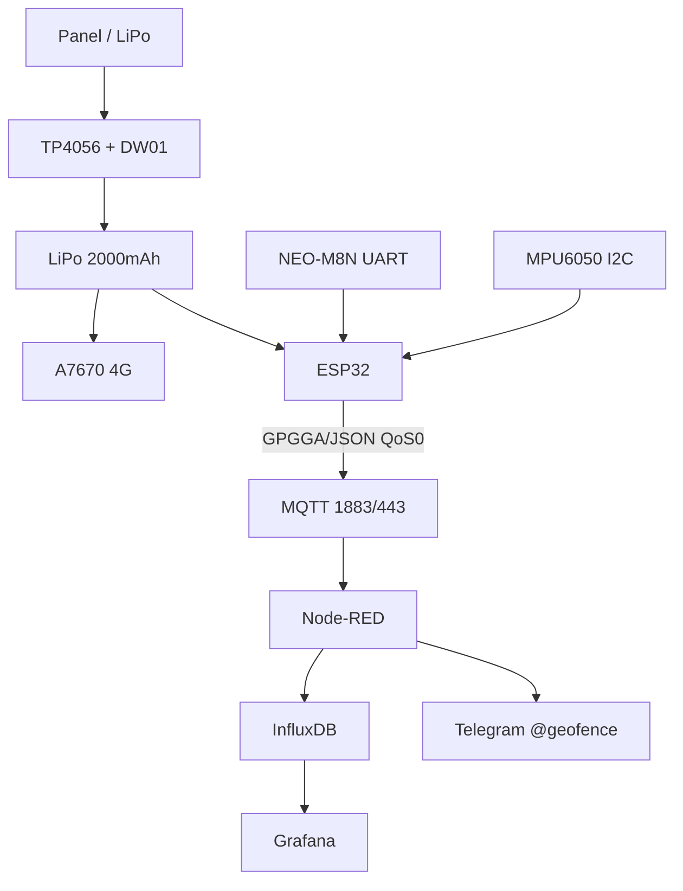

# Project 2 - GPS Tracker: NEO-M8N + A7670 + MQTT + deep-sleep + LiPo

![[assets/img/cookbook-tracker-scheme.png|600]]
*Fig. Tracker: ESP32 + NEO-M8N (UART) + A7670 (4G), LiPo power supply, MQTT uplink.*

> [!tip] What we are building
> Tracker for car/I2C adapter/bicycle: wakes every 2-5 min or on motion, takes a GPS fix, sends coordinates over MQTT, sleeps. Link is 4G A7670 (successor to SIM800L). Base: [[12-Comm-Modules/03-SIM800L-GPS.en | SIM800L/GPS]], [[12-Comm-Modules/07-SIM7600-W5500-MCP2515.en | 4G]], [[15-Protocols/01-MQTT.en | MQTT]], [[07-Timers/03-Sleep-ULP.en | Sleep]].

## 1. Goal

Know where the object is without a subscription to commercial trackers and with full data control.

Scenarios:

- car at parking: point every 5 min + alert on leaving geofence;
- bicycle/I2C adapter: point every 2 min in motion, once per 30 min at rest;
- cargo: LiPo + solar trickle charge in truck bed.

Requirements:

- fix < 60 s outdoors (hot/warm start);
- accuracy 2.5 m (NEO-M8N); 72 channels; -167 dBm;
- 4G A7670 (LTE Cat-1, 5-30 mA sleep); MQTT/TLS or HTTP; SIM M2M;
- geofence radius 300 m around home; alert on exit;
- LiPo 2000 mAh + TP4056; 3 days tracking; deep-sleep 0.15 mA;
- store-and-forward buffer (10 tracks); OTA via 4G (careful!);
- enclosure IP65; antenna on roof; vibration sensor MPU6050.

| Parameter | Target | Check |
| --- | --- | --- |
| GPS | NEO-M8N, 72 channels, -167 dBm | GGA sats ≥ 6 |
| Modem | A7670 4G, MQTT(S) or HTTP | AT+CMQTTCONNECT OK |
| Cycle | 120-300 s + wake by MPU6050 | wake reason log |
| Battery | LiPo 2000 mAh + TP4056 | 3 days tracking |
| Topic | `device/<id>/track` JSON | sub in Node-RED |
| Geofence | 300 m radius around home | event test |

## 2. BOM - components

| Component | Reference note | Price, approx. |
| --- | --- | --- |
| ESP32 DevKit (WROOM-32) | [[00-Start/04-Devkit-plati.en | DevKit]] | $6 |
| NEO-M8N module with antenna | [[12-Comm-Modules/03-SIM800L-GPS.en | SIM800L/GPS]] | $10 |
| A7670E/SA 4G module + LTE antenna | [[12-Comm-Modules/07-SIM7600-W5500-MCP2515.en | 4G]] | $25 |
| LiPo 2000 mAh + TP4056 (protected) | [[02-Power-Supply/04-Akumulyatori-TP4056 | Batteries]] | $8 |
| Buck LM2596 → 3.8V for A7670 | [[13-Power-Modules/01-Buck-Boost-Solar | Buck/Solar]] | $2 |
| MPU6050 (wake by motion) | [[10-Sensors/04-MPU6050.en | MPU6050]] | $2 |
| SIM card IoT/M2M | [[12-Comm-Modules/07-SIM7600-W5500-MCP2515.en | 4G]] | $3 |
| Enclosure IP54 + antenna gland | [[99-Additions/03-Cheklisti-montazhu | Assembly checklists]] | $5 |
| VBAT divider 100k/100k | [[06-Analog/01-ADC.en | ADC]] | $0.5 |

Total: ~$58 without delivery.

What NOT to take:

- NEO-6M (without multi-band) - long cold start > 30 s;
- A7670 without 1000 µF cap near module - 2-3 A peak kills 4G;
- LiPo without DW01 - fire risk; TP4056 only.

## 3. Architecture

### ASCII diagram

```text
        CAR / BIKE (IP65 / IP54)
  +-----------------------------------+
  | Solar 5V --+--> TP4056 --+--> 18650 / LiPo
  |            |  (PROG 1A)  |
  |            +-- Schottky --+--> A7670 (4G)
  |                          |
  | NEO-M8N UART + GPS ant. -> ESP32 <--I2C--> MPU6050
  | (GPGGA 1 Hz)              |
  |                          v
  |                  MQTT TLS 1883 / 443
  |                          v
  |          Node-RED + InfluxDB -> Grafana
  |                          +--> Telegram alert
  +-----------------------------------+
```

### Mermaid



Loop logic:

1. timer-wakeup every 120-300 s OR MPU6050 motion interrupt (see [[07-Timers/03-Sleep-ULP.en | Sleep]]);
2. GPS warm start < 60 s; read GPGGA; if no fix in 90 s, skip publish;
3. 4G connect (AT+CMQTTCONNECT); publish JSON with lat/lon/fix/time/vbat;
4. deep-sleep `esp_deep_sleep_start()`; LWT `status=offline` normal.

## 4. Power and antennas

Energy budget (5 min warm cycle):

| Phase | Current | Time | Charge |
| --- | --- | --- | --- |
| Wake + GPS fix search | ~70 mA (GPS) + ~30 mA (ESP32) | 30 s (warm) / 90 s (cold) | 0.8 / 2.5 mAh |
| Modem register + MQTT publish | ~250 mA avg (peaks 2-3A from capacitor!) | 15-30 s | 1.0-2.0 mAh |
| Deep-sleep (all off via keys) | ~0.15 mA (ESP32) + ~0.05 mA (leakage) | rest of cycle | ~0.2 mAh/h |
| **Total warm 5 min cycle** | - | - | **~2 mAh** |

Battery budget with numbers (we calculate the cycle!):

- 2 mAh / 5 min = 24 mAh/h in motion; 2000 mAh / 24 ≈ 83 h ≈ 3.5 days continuous tracking;
- at rest (30 min cycle, GPS off) = ~0.3 mAh / 30 min = 0.6 mAh/h → ~140 days standby;
- solar 5V 1A panel + TP4056 → 7 dB charge/day in sun; LiPo stays full.

Antenna rules:

- GPS active antenna (28 dB) with 3 m coax to ESP32; ground plane 70×70 mm;
- 4G LTE antenna = rubber duck 3 dBi; SMA to A7670; keep 5 cm from ESP32 RF;
- GPS shield = aluminum tray; 4G = none (LTE handles it); do NOT put both in one box.

## 5. Firmware step by step

Step 1 - UART GPS: connect NEO-M8N TX→GPIO16 (RX2), RX→GPIO17 (TX2); 9600 baud; GPGGA parser.

Step 2 - I2C MPU6050: motion interrupt to GPIO25; wake from deep-sleep.

Step 3 - 4G modem AT commands: `AT+CMQTTCONNECT` + `AT+CMQPUB`; keepalive 60 s; TLS if needed.

Step 4 - JSON payload (see [[15-Protocols/01-MQTT.en | MQTT]]):

```json
{"id":"trk-01","t":1712345678,"lat":50.4501,"lon":30.5234,"fix":6,"vbat":3.82,"n":42}
```

Step 5a - Local geofence ON TRACKER (no network!): compare lat/lon to home circle; if outside 300 m, set `alert=1` and publish immediately; else sleep.

Step 5b - Track buffer on 4G loss (store-and-forward): save up to 10 JSON to RTC/PSRAM or SPI flash; on reconnect, send batch.

Step 5c - OTA via modem (careful!): download binary to /tmp; verify CRC; `esp_ota_begin()`; only if battery > 3.7 V.

```cpp
#include <WiFi.h> // reuse for ESP32 WiFi if using AP; else UART only
#include <PubSubClient.h>
#include <Wire.h>
#include <TinyGPS++.h>

#define SLEEP_SEC 300
#define ID "trk-01"
RTC_DATA_ATTR int bootCnt = 0;
TinyGPSPlus gps; HardwareSerial gpsSerial(2); // UART2

void setup() {
  bootCnt++;
  gpsSerial.begin(9600, SERIAL_8N1, 16, 17); // RX, TX
  // read GPS... parse GPGGA
  // 4G publish via A7670 AT over UART1 or SoftwareSerial
  esp_sleep_enable_timer_wakeup((uint64_t)SLEEP_SEC * 1000000ULL);
  esp_deep_sleep_start();
}
void loop() {}
```

## 6. Enclosure and assembly

### 12V car battery mode (guard mode)

- buck LM2596 → 3.8 V for A7670; ESP32 via 3.3 V LDO from 12 V (low drain);
- ignition sense: GPIO23 high = car on; then cycle 30 s; off = sleep 5 min + motion.

### IP65 outdoor enclosure

| Element | Solution |
| --- | --- |
| Box | IP65 100×70×45 with gasket, see [[17-Lab/03-Enclosure-Cert-Factory]] |
| Antennas outside | SMA feedthroughs in wall + rubber grommets; GPS washer on car roof with magnet |
| Ventilation | Gore membrane M12 (condensation kills faster than rain) |
| Mounting | DIN/magnets/straps - NOT hot glue (melts in summer) |
| SIM access | Tray with rubber seal outside or screw lid (SIM theft!) |

## 7. Troubleshooting

| Symptom | Where to look |
| --- | --- |
| `+CREG: 0,0` / no network | 3.8 V power + 1000 µF, LTE antenna, FAQ #32 [[99-Additions/02-Troubleshooting-FAQ.en | FAQ]] |
| GPS no fix 15 min | sky view, active antenna, FAQ #33 [[99-Additions/02-Troubleshooting-FAQ.en | FAQ]] |
| Modem reboot at publish | 3 A peak, thick wires, FAQ #44 [[99-Additions/02-Troubleshooting-FAQ.en | FAQ]] |
| Battery dead in a day | 30 min cycles at rest, turn off GPS key, FAQ #59 [[99-Additions/02-Troubleshooting-FAQ.en | FAQ]] |
| MQTT `rc=5` over 4G | operator APN + login, FAQ #22 [[99-Additions/02-Troubleshooting-FAQ.en | FAQ]] |
| Time 1970 in tracks | NTP or GPS-time before TLS, FAQ #65 [[99-Additions/02-Troubleshooting-FAQ.en | FAQ]] |

## Official sources

- [u-blox NEO-M8N - datasheet](https://www.u-blox.com/en/product/neo-m8n-series) - multi-band, -167 dBm.
- [A7670E - Quectel](https://www.quectel.com/product/cat-4g-module-a7670/) - LTE Cat-1, MQTT, TLS.
- [ESP32 UART - ESP-IDF](https://docs.espressif.com/projects/esp-idf/en/stable/esp32/api-reference/peripherals/uart.html) - UART2, baud.

## See also

- [[EN/Home.en]]
- [[12-Comm-Modules/03-SIM800L-GPS.en | SIM800L/GPS]]
- [[12-Comm-Modules/07-SIM7600-W5500-MCP2515.en | 4G]]
- [[15-Protocols/01-MQTT.en | MQTT]]
- [[07-Timers/03-Sleep-ULP.en | Sleep]]
- [[10-Sensors/04-MPU6050.en | MPU6050]]
- [[16-Projects/01-Weather-Station.en | Weather Station]]
- [[16-Projects/04-Energy-Monitor.en | Energy Monitor]]
