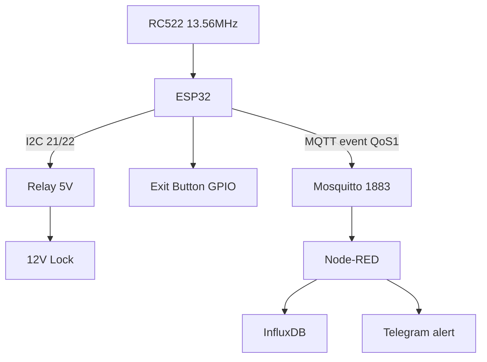

# Project 3 - Access Control: RC522 + Relay + Electric Lock → MQTT + NVS

![[assets/img/cookbook-access-scheme.png|600]]
*Fig. Access control: ESP32 + RC522 RFID + relay + 12V electric lock, MQTT uplink, NVS lists.*

> [!tip] What we are building
> Door access with MIFARE cards: read UID, check allow/deny lists in NVS, open relay for 5 s, publish event, accept remote add/del/sync commands. Base: [[12-Comm-Modules/01-RC522-RFID.en | RC522]], [[11-Vivid/03-NeoPixel-Servo-Rele-MOSFET.en | Relay]], [[15-Protocols/01-MQTT.en | MQTT]], [[04-Interfaces/03-I2C | I2C]].

## 1. Goal

Secure entry with RFID, local list, remote updates and audit log.

Usage scenarios:

- apartment: card = open; lost = remove from list remotely;
- garage: dark + motion = allow only owner card + time window;
- office: 200 allow / 50 deny; TTL 30 days; sync on reconnect.

Requirements:

- reader: RC522 13.56 MHz, MIFARE Classic/Ultralight, UID < 300 ms;
- actuator: 5V relay module (opto, LOW trigger) + 12 V electric lock + 1N4007 diode;
- lists: NVS allow[200], deny[50], TTL; survives reboot;
- uplink: `access/event` QoS 1 + LWT `status=offline`;
- control: `access/cmd add/del/sync` QoS 1 + confirmation `access/ack`;
- update: OTA over MQTT `access/fw`; rollback on bad CRC.

| Parameter | Target | Check |
| --- | --- | --- |
| Reader | RC522 13.56 MHz, MIFARE Classic/Ultralight | UID in 300 ms |
| Actuator | Relay 5V + 12V electric lock | click + log |
| Lists | NVS: allow[200], deny[50], TTL | reboot keeps |
| Uplink | `access/event` QoS 1 + LWT | sub in Node-RED |
| Control | `access/cmd add/del/sync` QoS 1 | test from console |
| Update | OTA over `access/fw` | rollback on bad |

## 2. BOM - components

| Component | Reference note | Price, approx. |
| --- | --- | --- |
| ESP32 DevKit (WROOM-32) | [[00-Start/04-Devkit-plati.en | DevKit]] | $6 |
| RC522 module 13.56 MHz | [[12-Comm-Modules/01-RC522-RFID.en | RC522]] | $2 |
| Relay module 5V (opto, LOW trigger) | [[11-Vivid/03-NeoPixel-Servo-Rele-MOSFET.en | Relay]] | $2 |
| Electric lock 12V + 12V PSU 2A | [[11-Vivid/07-BTS7960-L9110S-SSR-Solenoid.en | Power]] | $20 |
| Diode 1N4007 parallel to lock | [[11-Vivid/07-BTS7960-L9110S-SSR-Solenoid.en | Power]] | $0.2 |
| Buzzer + red/green LED | [[11-Vivid/04-L298N-TB6612-A4988-Buzzer.en | Sound]] | $1 |
| Exit button (NO) | [[03-GPIO/04-Pererivannya-PWM | GPIO]] | $1 |
| 5V 2A PSU for ESP32+relay | [[02-Power-Supply/02-LDO-DC-DC | LDO]] | $5 |
| Enclosure + UTP cable to reader | [[99-Additions/03-Cheklisti-montazhu | Assembly checklists]] | $4 |

Total: ~$41.

What NOT to take:

- RC522 5V (only 3.3V); SDA/MOSI on GPIO5, SCK on GPIO18, MOSI on GPIO23;
- relay without opto - ESP32 reset on 12V spike;
- lock without 1N4007 - relay contact burns.

## 3. Architecture

### ASCII diagram

```text
      DOOR (IP54 / indoor)
  +-----------------------------+
  |  ESP32 + RC522 (I2C 21/22)  |
  |        |                    |
  |        v                    |
  |  Relay 5V -> Lock 12V       |
  |  Button -> GPIO26           |
  |  Buzzer/LED -> GPIO25/27    |
  |        |                    |
  |  WiFi 2.4G / MQTT 1883     |
  |        v                    |
  |  Node-RED + InfluxDB        |
  +-----------------------------+
```

### Mermaid



Logic:

1. RC522 reads UID; check allow/deny lists in NVS; if allow and TTL valid → relay 5 s;
2. publish `access/event` JSON with UID, time, result, vbat;
3. remote command `access/cmd add` → add UID to allow[200]; `del` → deny; `sync` → push current list;
4. OTA only after list sync; rollback guard checks CRC before apply.

## 4. Power and assembly

- 5V 2A for ESP32 + relay; 12V 2A for lock; separate grounds to GND star;
- RC522 must be < 20 cm from ESP32; wires twisted; 100 nF at 3.3V pin;
- button is NO (normally open) with 10k pull-down; LED 220 Ω.

## 5. Firmware step by step

Step 1 - RC522 init: `MFRC522` library; SPI or I2C; address 0x28; read UID.

Step 2 - NVS lists: `Preferences` (ESP32) or `NVS`; allow[200] = 200 UIDs 4 bytes; deny[50]; TTL = Unix time.

Step 3 - MQTT publish: `PubSubClient`; QoS 1; `access/event`; `access/ack`; LWT `status=offline`.

Step 4 - Remote command handler: parse JSON; if `add` → write allow; `del` → write deny; `sync` → send allow[200] as array.

Step 5 - OTA guard: download to `/tmp/fw.bin`; CRC32; if bad → delete; else `esp_ota_begin()`; rollback if boot count > 2 bad.

```cpp
#include <WiFi.h>
#include <PubSubClient.h>
#include <MFRC522.h>
#include <Preferences.h>

#define LED_OK 27
#define LOCK 26
Preferences prefs;
MFRC522 mfrc522(SS_PIN, RST_PIN); // SPI or I2C

void openLock() {
  digitalWrite(LOCK, HIGH); delay(5000); digitalWrite(LOCK, LOW);
}
void setup() {
  prefs.begin("access");
  // RC522 init, WiFi, MQTT
}
void loop() {
  // read RC522; check list; open; publish
}
```

## 6. Enclosure and assembly

- reader at 110 cm height, 10 cm from door frame; shield from rain; IP54;
- lock inside frame, 12V PSU hidden; diaphragm tube for wire to lock;
- LED red/green visible from outside; buzzer 85 dB for 2 s on open.

## 7. Troubleshooting

| Symptom | Where to look |
| --- | --- |
| RC522 Version 0x00 | only 3.3V, wires < 20 cm, FAQ #43 [[99-Additions/02-Troubleshooting-FAQ.en | FAQ]] |
| Relay clicks, lock silent | separate 12V + 1N4007, FAQ #52 [[99-Additions/02-Troubleshooting-FAQ.en | FAQ]] |
| Card works only with network | NVS cache + NTP time, FAQ #63 [[99-Additions/02-Troubleshooting-FAQ.en | FAQ]] |
| OTA bricks access | rollback-guard, FAQ #62 [[99-Additions/02-Troubleshooting-FAQ.en | FAQ]] |
| TTL time floats (1970) | SNTP before check until, FAQ #65 [[99-Additions/02-Troubleshooting-FAQ.en | FAQ]] |
| Card clones | switch to DESFire/PN532, FAQ appendix [[12-Comm-Modules/05-PN532-RDM6300-Fingerprint-GM65.en | NFC]] |

## Official sources

- [MFRC522 - NXP](https://www.nxp.com/products/interfaces/ic-card-solutions/reader-ics/mfrc522.html) - SPI, 13.56 MHz, MIFARE.
- [MFRC522 library - GitHub](https://github.com/miguelbalboa/rfid) - Arduino/ESP32.
- [ESP32 NVS - ESP-IDF](https://docs.espressif.com/projects/esp-idf/en/stable/esp32/api-reference/storage/nvs_flash.html) - persistence, TTL.

## See also

- [[EN/Home.en]]
- [[12-Comm-Modules/01-RC522-RFID.en | RC522]]
- [[11-Vivid/03-NeoPixel-Servo-Rele-MOSFET.en | Relay]]
- [[15-Protocols/01-MQTT.en | MQTT]]
- [[04-Interfaces/03-I2C | I2C]]
- [[16-Projects/01-Weather-Station.en | Weather Station]]
- [[16-Projects/04-Energy-Monitor.en | Energy Monitor]]
