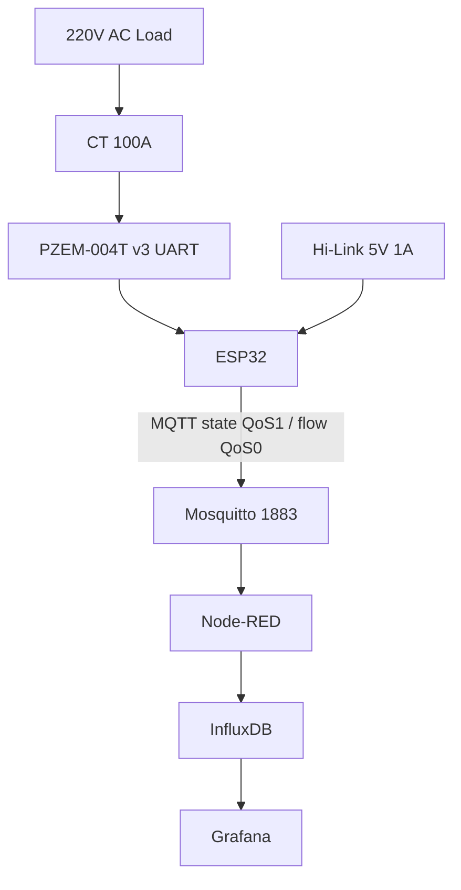

# Project 4 - Energy Monitor: PZEM-004T v3 + CT 100A → MQTT + Modbus + buffer

![[assets/img/cookbook-energy-scheme.png|600]]
*Fig. Energy monitor: ESP32 + PZEM-004T v3 (Modbus UART) + CT 100A, isolated 5V PSU, DIN enclosure, MQTT uplink.*

> [!tip] What we are building
> Monitor household or garage AC load: voltage, current, power, energy, frequency, power factor, temperature; publish every 10 s; buffer 50 points on WiFi loss; DIN box sealed. Base: [[10-Sensors/15-ACS712-ZMPT101B-PZEM-AS5600-FSR.en | Current], [[15-Protocols/01-MQTT.en | MQTT]].

## 1. Goal

Measure AC parameters safely, with isolation, buffer and remote reading.

Usage scenarios:

- apartment: daily consumption, peak load alert, power factor improvement;
- garage: compressor + heater load; alert if > 30 A;
- solar inverter: feed-in vs consumption; net metering.

Requirements:

- sensor: PZEM-004T v3, Modbus 9600 8N1, V/I/P/E/F/PF; CT 100A split-core;
- interval: 10 s publish; Grafana no gaps;
- uplink: MQTT QoS 1 state + QoS 0 flow; sub `device/#`;
- buffer: 50 points in RAM/LittleFS; test with WiFi off;
- enclosure: DIN 4TE, sealed; breaker + varistor + isolation review by electrician.

| Parameter | Target | Check |
| --- | --- | --- |
| Sensor | PZEM-004T v3, CT 100A | V/I/P/E/F/PF via Modbus |
| Interval | 10 s publish | Grafana no gaps |
| Uplink | MQTT QoS 1 state + QoS 0 flow | sub device/# |
| Buffer | 50 points RAM/LittleFS | test with WiFi off |
| Enclosure | DIN 4TE, sealed | lid sealed |
| Safety | fuse + varistor + isolation | electrician review |

## 2. BOM - components

| Component | Reference note | Price, approx. |
| --- | --- | --- |
| ESP32 DevKit (WROOM-32) | [[00-Start/04-Devkit-plati.en | DevKit]] | $6 |
| PZEM-004T v3 + CT 100A | [[10-Sensors/15-ACS712-ZMPT101B-PZEM-AS5600-FSR.en | Current]] | $12 |
| 5V 1A isolated PSU (Hi-Link) | [[02-Power-Supply/02-LDO-DC-DC | LDO]] | $5 |
| Fuse 1A + DIN holder | [[13-Power-Modules/04-LDO-Buck-XL4015-Protect.en | Protection]] | $2 |
| Varistor 275V AC | [[13-Power-Modules/04-LDO-Buck-XL4015-Protect.en | Protection]] | $0.5 |
| DIN box 4TE + blanks | [[99-Additions/03-Cheklisti-montazhu | Assembly checklists]] | $6 |
| PZEM-TX divider 1k/2k (5V→3.3V) | [[13-Power-Modules/02-Level-Shifters.en | Level-shifters]] | $0.3 |
| DS18B20 on panel (temperature) | [[10-Sensors/02-DS18B20 | DS18B20]] | $2 |

Total: ~$34.

What NOT to take:

- PZEM on 5V logic - only UART, not I2C; TX/RX cross; baud 9600;
- non-isolated PSU - 220V to 5V direct = fire risk; Hi-Link isolated mandatory.

## 3. Architecture

### ASCII diagram

```text
     220V AC CIRCUIT (DIN 4TE)
  +-----------------------------+
  |  Breaker 16A -> CT 100A ->  |
  |  PZEM-004T (UART 9600)      |
  |  5V isolated PSU -> ESP32   |
  |  DS18B20 on DIN rail       |
  |  WiFi -> MQTT 1883         |
  |  LittleFS buffer 50 pts    |
  +-----------------------------+
```

### Mermaid



Logic:

1. PZEM Modbus read every 10 s; if no response, retry 3 times; skip point;
2. JSON publish with V/A/W/Wh/Hz/PF/temp/value;
3. if WiFi off, save to LittleFS (50 points); flush on reconnect;
4. DS18B20 alert > 60 °C on DIN rail = cooling or load check.

## 4. Power, isolation, 220V assembly

- isolated 5V PSU (Hi-Link HLK-PM01) - 220V direct to 5V with transformer isolation; no common ground with AC;
- fuse 1A on AC line before PZEM; varistor 275V AC across line-neutral after fuse;
- CT split-core around live wire only; do NOT put CT on neutral - current is zero;
- divider 1k/2k on PZEM TX (5V → 3.3V ESP32 RX); PZEM RX (3.3V direct to 5V tolerant);
- DIN box 4TE; all screws with washers; cable glands for AC and USB.

## 5. Firmware step by step

Step 1 - PZEM init: `Serial2.begin(9600, SERIAL_8N1, 16, 17)`; send `0x01 0x03 ...`; parse response.

Step 2 - Buffer: `Preferences` / `LittleFS`; 50 JSON lines; timestamp; flush if count > 45.

Step 3 - MQTT: `PubSubClient`; QoS 1 for state (`device/01/state`); QoS 0 for flow (`device/01/flow`); LWT.

Step 4 - Temperature: `DallasTemperature` on GPIO4; alert if > 60 °C.

```cpp
#include <WiFi.h>
#include <PubSubClient.h>
#include <ModbusMaster.h>
#include <DallasTemperature.h>

ModbusMaster node; // UART2
void setup() {
  Serial2.begin(9600, SERIAL_8N1, 16, 17);
  node.begin(1, Serial2);
  // read 0x00 voltage, 0x01 current, etc.
}
void loop() {
  // publish JSON; buffer on fail
}
```

## 6. Enclosure and assembly

- DIN rail mount; 4TE width; sealed lid with screw; breaker label;
- AC wires 1.5 mm²; ground to DIN rail; isolation check by electrician before closing.

## 7. Troubleshooting

| Symptom | Where to look |
| --- | --- |
| PZEM silent / NaN | baud 9600 8N1, cross TX/RX, FAQ #46 [[99-Additions/02-Troubleshooting-FAQ.en | FAQ]] |
| Current 0 with kettle on | CT on both wires or wrong side, FAQ section CT [[10-Sensors/15-ACS712-ZMPT101B-PZEM-AS5600-FSR.en | Current]] |
| ESP32 reboot at publish | separate 5V 1A PSU + 470 µF, FAQ #1 [[99-Additions/02-Troubleshooting-FAQ.en | FAQ]] |
| Gaps in Grafana | offline buffer + NTP stamps, FAQ #65 [[99-Additions/02-Troubleshooting-FAQ.en | FAQ]] |
| PF jumps 0.5→1.0 | impulse PSU without PFC - normal; average 6 points |
| Panel heating | DS18B20 alert, terminal tightening yearly, see [[10-Sensors/02-DS18B20 | DS18B20]] |

## Official sources

- [PZEM-004T v3 - Peacefair](https://www.perez-ya.com/docs/PZEM-004T-v3-manual.pdf) - Modbus, 9600, V/I/P/E.
- [ModbusMaster - GitHub](https://github.com/4-20ma/ModbusMaster) - ESP32 UART.
- [Hi-Link HLK-PM01 - datasheet](https://www.hlktech.com/product/detail/5) - isolated 220V to 5V.

## See also

- [[EN/Home.en]]
- [[10-Sensors/15-ACS712-ZMPT101B-PZEM-AS5600-FSR.en | Current]]
- [[15-Protocols/01-MQTT.en | MQTT]]
- [[13-Power-Modules/02-Level-Shifters.en | Level-shifters]]
- [[10-Sensors/02-DS18B20 | DS18B20]]
- [[16-Projects/01-Weather-Station.en | Weather Station]]
- [[16-Projects/03-Access-Control.en | Access Control]]
