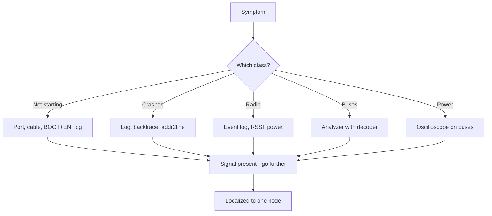

# Diagnostic Map - Symptom, Tool, Signal

![[assets/img/diagnostic-map-scheme.png|600]]
*Fig. From symptom to signal: which instrument and what to look at.*

> [!tip] Purpose of note
> Provide a table-route: symptom - instrument to measure - signal to find. Supplement to [[EN/99-Additions/02-Troubleshooting-FAQ.en|FAQ]], not a duplicate.

## 1. How to Use the Map

Find symptom in table, take instrument, check signal. No signal - cause found. Yes - go further in chain. Cause analysis per symptom in [[EN/99-Additions/02-Troubleshooting-FAQ.en|FAQ]], here only measurement route.

## 2. Boot and Flash

| Symptom | Instrument | Signal |
| --- | --- | --- |
| No port | Device manager + different cable | COM port appears when connected |
| No logs | Serial monitor 115200 | First boot line at EN |
| Reboot loop | Monitor log | Reset cause: brownout, panic, wdt |
| Flash fails | esptool at lower speed | `write_flash` reaches 100% |
| Secure-boot brick | eFuse history | What burned before flash! |

## 3. Panics and Hangs

| Symptom | Instrument | Signal |
| --- | --- | --- |
| Guru Meditation | Full log to file | Backtrace + EXCVADDR |
| LoadProhibited | addr2line on ELF | File and line of culprit |
| Task watchdog | Kernel task log | Which task does not feed WDT |
| Silent hang | JTAG/OpenOCD halt | PC and stack of halted core |

```text
Panic pipeline:
  log fully to file -> addr2line on backtrace -> file:line;
  EXCVADDR zero -> NULL pointer;
  EXCVADDR garbage -> overflow or foreign memory.
```

## 4. WiFi and Radio

| Symptom | Instrument | Signal |
| --- | --- | --- |
| Not connecting | WiFi event log | Disconnect reason code |
| Weak signal | RSSI scan | Level at node site |
| Breaks at TX | Oscilloscope on 3.3V | Sag at packet moment |
| BLE not visible | Phone scanner | Advertising packets in air |
| MQTT silent | Client log + broker | CONNECT reaches or not |

## 5. Buses and Sensors

| Symptom | Instrument | Signal |
| --- | --- | --- |
| I2C NACK | Logic analyzer | Address on line vs datasheet |
| I2C hangs | Oscilloscope on SCL | Line at zero - slave holds |
| SPI shift | Analyzer with decoder | CPOL/CPHA on both sides |
| ADC noisy | Oscilloscope on power | Ripple synchronized with WiFi |
| Sensor lies | Reference nearby | Deviation from known good |

## 6. Power and Sleep

| Symptom | Instrument | Signal |
| --- | --- | --- |
| Brownout at WiFi | Oscilloscope on VIN | Dip below threshold |
| Sleep current high | Ammeter in gap | USB-UART and LDO eat more than chip! |
| Does not wake | Wakeup source log | Which source fired |
| CAM reboot on photo | Oscilloscope on 5V | Sag at PSRAM + camera |

## Mermaid: Diagnostic Route



## 7. Tool Index: What I Can Do With What I Have

| Have | Can check | Cannot |
| --- | --- | --- |
| Only USB cable | Port, log, flash | All analog |
| Plus multimeter | Power, shorts, current | Timings and protocols |
| Plus analyzer | I2C/SPI/UART decoders | Analog noise |
| Plus oscilloscope | Ripple, crystals, edges | Radio spectrum |
| Plus JTAG | Halt, registers, silent hangs | Setup time cost |

```text
Purchase priority:
  data cable -> multimeter -> analyzer -> oscilloscope -> JTAG probe.
```

## 8. Diagnostic Log: What to Record

| Field | Why |
| --- | --- |
| Symptom verbatim | Repeat in a month |
| Board and revision | Clones behave differently! |
| Log complete | First lines most important |
| Already checked | Do not go in circles |
| Minimal sketch | Bare example with bug |

## 9. Diagnostic Stories: Five More (V6-V10)

### V6. S3 Not Seen Over USB

| Field | Record |
| --- | --- |
| Symptom | No port after flash |
| Measurement | Wrong connector: UART instead of native USB |
| Cause | Two ports on DevKitC, need USB-OTG |
| Fix | Correct cable in correct connector |

### V7. Strapping Kills Boot After Assembly

| Field | Record |
| --- | --- |
| Symptom | Worked on breadboard, not on board |
| Measurement | GPIO12 pulled by peripheral |
| Cause | Flash voltage selected wrong |
| Fix | Free strapping pins in layout |

### V8. Deep-Sleep Eats Milliamps

| Field | Record |
| --- | --- |
| Symptom | Battery drains in weeks |
| Measurement | Without USB-UART - microamps, with it - not |
| Cause | Bridge and LDO do not sleep |
| Fix | Measure bare module, sleep for real |

### V9. PSRAM Not Found

| Field | Record |
| --- | --- |
| Symptom | `PSRAM not found` in log |
| Measurement | Config without SPIRAM |
| Cause | Not enabled in menuconfig |
| Fix | Enable, rebuild, check size |

### V10. Time 1970 After Each Reboot

| Field | Record |
| --- | --- |
| Symptom | TLS fails, time logic wrong |
| Measurement | SNTP does not finish before first connection |
| Cause | No wait for synchronization |
| Fix | Wait until time > 2024 before network |

## See Also

- [[EN/Home.en]]
- [[EN/99-Additions/02-Troubleshooting-FAQ.en]]
- [[EN/99-Additions/03-Cheklisti-montazhu.en]]
- [[EN/17-Lab/01-Instruments.en]]
- [[EN/17-Lab/05-Breadboard-Mezhi.en]]
- [[09-Firmware/05-JTAG-Debug]]

> UA original twin: [[99-Additions/08-Diagnostic-Map.md | UA]]
