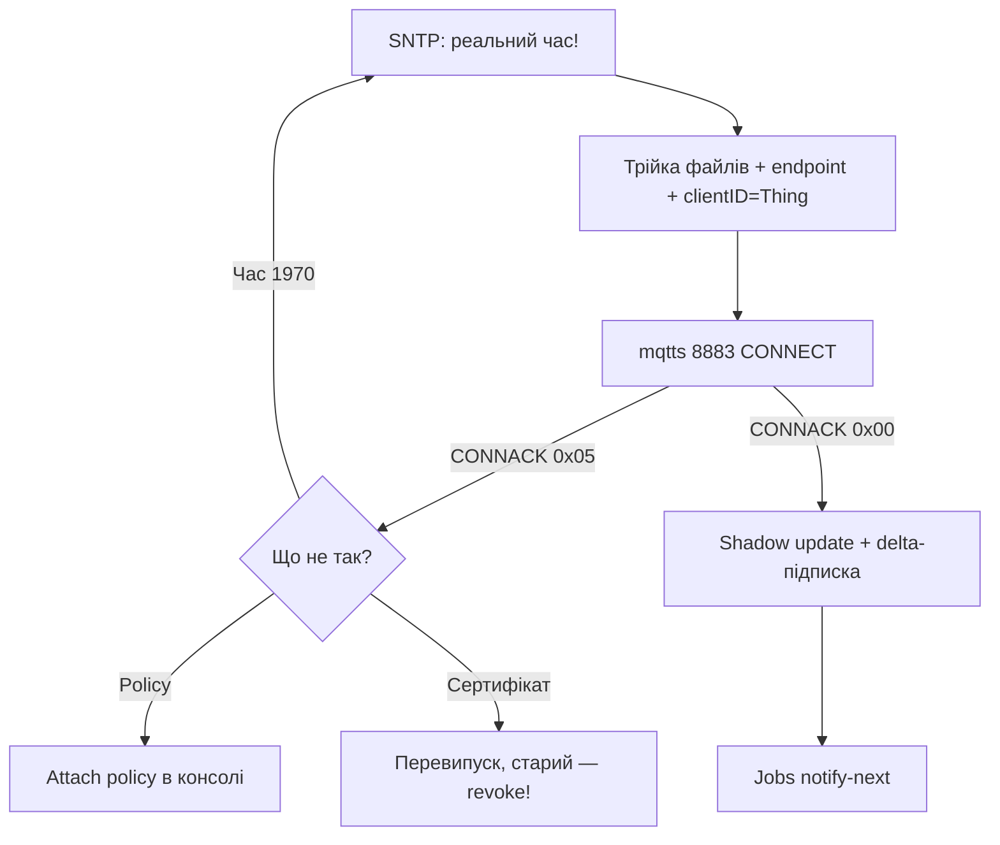

# AWS IoT Core з ESP32: сертифікати, Shadow, Jobs

## Призначення

AWS IoT Core - керований MQTT-брокер з авторизацією ТІЛЬКИ за X.509-сертифікатами (логін/пароль не приймається!). Плюс Thing Shadow (цифровий двійник) і Jobs (команди/OTA парку). ESP32 підключається через esp-mqtt з клієнтським сертифікатом.

База: старт - [[Home]], MQTT-база - [[15-Protokoli/01-MQTT|MQTT]], TLS/NTP - [[15-Protokoli/03-mDNS-NTP-TLS]], пайплайн - [[15-Protokoli/05-Cloud-Pipeline]], OTA - [[08-Pamyat/03-OTA|OTA]], час - [[10-Sensori/27-Time-Mem-IO-DAC]].

> [!danger] Три речі, без яких AWS не підключить
>
> 1. Реальний час (NTP/GPS) - сертифікат перевіряється за датою. 2. Трійка файлів: device-certificate + private-key + AmazonRootCA1 - усі три на пристрої. 3. Policy в хмарі дозволяє `iot:Connect/Publish/Subscribe` саме цьому Thing. Помилка в будь-якому - мовчазний `CONNACK 0x05`.

![[assets/img/cloud-aws-iot-scheme.png|600]]
*Рис. ESP32 з трійкою файлів → TLS 8883 → IoT Core endpoint → Rules → Shadow/DynamoDB + Jobs на парк.*

## Характеристики підключення

| Параметр | Значення |
| --- | --- |
| Endpoint | `<account>-ats.iot.<region>.amazonaws.com:8883` (ATS - новий корінь!) |
| Авторизація | X.509 клієнтський сертифікат + приватний ключ (P256/RSA2048) |
| CA | AmazonRootCA1.pem (ECC) - качати з AWS docs, НЕ зі стелі |
| Протокол | MQTT 3.1.1 (5 - ні), keepalive 60-300 с |
| RAM | TLS-сесія ~40-60 КБ - на C3 без PSRAM рахувати! |
| Ліміти | 100 повідомлень/с на з'єднання (тротлінг!), payload 128 КБ |

## 1. Створення Thing і трійки файлів (консоль AWS)

```text
IoT Core → Manage → Things → Create:
  1. Thing name = серійник пристрою (напр. esp32-tracker-0142).
  2. Auto-generate certificate → ЗАВАНТАЖИТИ ОДРАЗУ 3 файли:
     xxxx-certificate.pem.crt + xxxx-private.pem.key + AmazonRootCA1.pem
     (приватний ключ показують ОДИН раз — провтикав = перевипуск!)
  3. Attach policy (приклад нижче) → Attach thing.
Policy (мінімум, не "*"):
  { "iot:Connect": "arn:...:client/esp32-tracker-0142",
    "iot:Publish": "arn:...:topic/device/esp32-tracker-0142/*",
    "iot:Subscribe": "arn:...:topicfilter/device/esp32-tracker-0142/cmd" }
```

## 2. Прошивка: esp-mqtt з сертифікатами (ESP-IDF)

```c
// ESP-IDF: сертифікати вшиті (certs.h) або з LittleFS; час — SNTP ДО connect!
extern const char ca_pem_start[] asm("_binary_AmazonRootCA1_pem_start");
extern const char cert_pem_start[] asm("_binary_device_pem_start");
extern const char key_pem_start[] asm("_binary_private_pem_start");
esp_mqtt_client_config_t cfg = {
  .broker.address.uri = "mqtts://xxxx-ats.iot.eu-central-1.amazonaws.com:8883",
  .credentials.authentication.certificate = cert_pem_start,
  .credentials.authentication.key = key_pem_start,
  .credentials.authentication.certificate_len = 0,  // NUL-terminated
  .credentials.client_id = "esp32-tracker-0142",    // = Thing name!
};
// Arduino (PubSubClient + WiFiClientSecure): setCACert(ca) + setCertificate(cert) + setPrivateKey(key).
// MicroPython: umqtt + ssl_params={'cert':..., 'key':..., 'cadata':...} — важко на малих чипах!
```

## 3. Thing Shadow: цифровий двійник

```text
Топіки Shadow (резервовані, з $):
  $aws/things/esp32-tracker-0142/shadow/update         ← PUBLISH desired+reported
  $aws/things/esp32-tracker-0142/shadow/update/accepted ← відповідь
  $aws/things/esp32-tracker-0142/shadow/update/delta   ← хмара хоче змін!
Документ: {"state":{"reported":{"t":23.5,"vbat":3.95},"desired":{"period":300}}}
Логіка: пристрій слухає delta → застосовує period=300 → звітує reported.
Навіщо: команда дійде навіть якщо пристрій спав (desired чекає!), конфлікти видно.
```

## 4. Jobs: команди і OTA на парк

```text
Job = документ для списку Things: {"operation":"ota","url":"https://.../fw.bin","ver":"1.5.0"}.
Пристрій підписаний на $aws/things/<id>/jobs/notify-next → отримав → виконує →
звітує {status: IN_PROGRESS → SUCCEEDED/FAILED}.
OTA через Jobs = єдина пристойна масова OTA на AWS (див. 08-Pamyat/03).
```

## 5. Fleet Provisioning: серійне виробництво (JITP/JITR)

```text
Проблема: 1000 пристроїв — не будеш руками клікати 1000 сертифікатів!
Рішення: один CLAIM-сертифікат у прошивці заводу → перше підключення →
  хмара видає УНІКАЛЬНИЙ operational-сертифікат (JITP) → пристрій зберігає в NVS →
  далі працює на своєму. Claim після цього відкликати!
Зв'язок з базою: mfg-NVS партиція (див. 17-Lab/03) + серійник = CN сертифіката.
```

### Mermaid: перше підключення



## Типові помилки

| # | Помилка | Чому погано | Як правильно |
| --- | --- | --- | --- |
| 1 | Час 1970 при connect | Сертифікат «недійсний» | SNTP ДО MQTT (блокуюче очікування!) |
| 2 | clientID ≠ Thing name | Policy не пускає | clientID = Thing name буквально |
| 3 | Policy `*` на все | Дірка в безпеці парку | Мінімальні ресурсні ARN |
| 4 | Приватний ключ загублено | Перевипуск + revoke старого | Зберігати при створенні (три файли!) |
| 5 | ATS vs старий endpoint | Старий корінь VeriSign - deprecated | Тільки `-ats` endpoint + AmazonRootCA1 |
| 6 | MQTT 5 фічі | Core говорить 3.1.1 | Без user properties |
| 7 | Тротлінг 100 msg/s | Обрізає пачки | Агрегувати, QoS 0 для телеметрії |
| 8 | Один сертифікат на парк | Компрометація одного = всі | Fleet Provisioning, розділ 5 |
| 9 | umqtt + X.509 на C3 | Мало RAM під 3 PEM | ESP-IDF або чип з PSRAM |
| 10 | Desired ніхто не читає | Команди губляться | Завжди підписка на delta |

## Офіційні джерела

- [AWS IoT Core - Device SDK + приклади ESP32](https://docs.aws.amazon.com/iot/latest/developerguide/iot-embedded-c-sdk.html) - embedded C SDK.
- [AWS Fleet Provisioning (JITP)](https://docs.aws.amazon.com/iot/latest/developerguide/provision-wo-cert.html) - claim → operational.
- [Thing Shadow + Jobs docs](https://docs.aws.amazon.com/iot/latest/developerguide/iot-device-shadows.html) - топіки, документи.

### Arduino: PubSubClient + WiFiClientSecure (скорочено)

```cpp
#include <WiFiClientSecure.h>
#include <PubSubClient.h>
WiFiClientSecure net;
PubSubClient mqtt(net);
void setup() {
  net.setCACert(AWS_ROOT_CA);       // AmazonRootCA1
  net.setCertificate(DEVICE_CERT);  // свій сертифікат
  net.setPrivateKey(DEVICE_KEY);    // свій ключ
  mqtt.setServer(AWS_ENDPOINT, 8883);
  mqtt.connect("esp32-tracker-0142");  // clientID = Thing name!
  mqtt.publish("device/esp32-tracker-0142/sensors", "{}");
}
// RAM-ліміт C3 без PSRAM: 3 PEM (~4 КБ) + TLS-сесія 40+ КБ — рахувати heap!
```

## Див. також

- [[Home|Головна]]
- [[15-Protokoli/01-MQTT|MQTT]]
- [[15-Protokoli/03-mDNS-NTP-TLS|TLS/NTP]]
- [[15-Protokoli/05-Cloud-Pipeline|Cloud-Pipeline]]
- [[15-Protokoli/13-Azure-IoT]]
- [[08-Pamyat/03-OTA|OTA]]
- [[08-Pamyat/04-Secure-Boot-Encrypt|Secure Boot]]
- [[17-Lab/03-Enclosure-Cert-Factory|mfg-NVS]]

> English twin: [[15-Protokoli/12-AWS-IoT.en.md | EN]]
