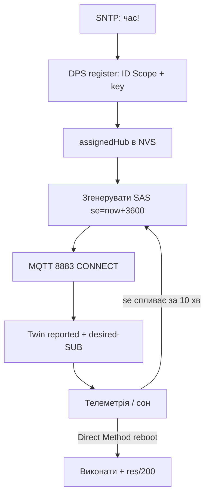

# Azure IoT Hub з ESP32: SAS, DPS, Twins, Direct Methods

## Призначення

Azure IoT Hub - MQTT-брокер Microsoft з авторизацією за SAS-токенами (HMAC від device key, час життя - години!) або X.509. Плюс DPS (автопідключення пристроїв), Device Twins (двійники) і Direct Methods (виклик функцій з хмари). ESP32 - через Azure SDK for Embedded C.

База: старт - [[Home]], MQTT - [[15-Protokoli/01-MQTT|MQTT]], TLS - [[15-Protokoli/03-mDNS-NTP-TLS]], AWS-близнюк - [[15-Protokoli/12-AWS-IoT]], OTA - [[08-Pamyat/03-OTA|OTA]].

> [!warning] SAS-токен протухає!
> На відміну від AWS-сертифіката (безстроковий), SAS-токен живе години-добу (поле `se=` - expiry epoch). Прошивка МУСИТЬ перегенеровувати токен і перепідключатись ДО expiry, інакше парк мовчки відвалюється опівночі. Час (NTP!) - критичний двічі: для TLS і для `se`.

![[assets/img/cloud-azure-iot-scheme.png|600]]
*Рис. ESP32 з device key → SAS-токен → IoT Hub 8883 → Twins/Direct Methods + DPS для парку.*

## Характеристики підключення

| Параметр | Значення |
| --- | --- |
| Endpoint | `<hub>.azure-devices.net:8883` |
| Авторизація | SAS-токен (`SharedAccessSignature sr=...&sig=...&se=...`) або X.509 |
| Username | `<hub>.azure-devices.net/<device-id>/?api-version=2020-09-30` (так, username - цілий URL!) |
| ClientID | `<device-id>` |
| Протокол | MQTT 3.1.1, keepalive 120-300 с |
| Безкоштовний ліміт | 8000 повідомлень/добу (F1) - вистачає на ~5 вузлів по 1/хв |

## 1. SAS-токен: формула і генерація на ESP32

```text
Токен = "SharedAccessSignature sr={URL-encoded resourceURI}&sig={URL-encoded HMAC-SHA256}&se={expiry}"
  resourceURI = <hub>.azure-devices.net/devices/<device-id> (lowercase!)
  HMAC-SHA256 ключем = base64-декодований device primary key
  se = epoch + 3600 (година життя — мінімум для сну!)
Генерація — на пристрої (mbedTLS HMAC є в IDF) або сервером-посередником.
Пароль MQTT = весь токен цілком (довгий рядок 200+ символів — буфер PubSubClient збільшити!).
```

```c
// ESP-IDF: HMAC-SHA256 з mbedTLS (скорочено, повний код — в Azure SDK samples)
mbedtls_md_hmac(mbedtls_md_info_from_type(MBEDTLS_MD_SHA256),
  key, key_len, (uint8_t*)toSign, toSign_len, hmac);
// далі base64 + URL-encode + збірка токена; se = time(NULL) + 3600.
```

## 2. Топіки Hub (закодовані в MQTT!)

```text
Телеметрія:  devices/<id>/messages/events/              ← PUBLISH сюди
  + властивості: devices/<id>/messages/events/tempAlert=true
C2D (хмара→пристрій): devices/<id>/messages/devicebound/# ← SUB
Direct Method виклик (з хмари): $iothub/methods/POST/reboot/?$rid=1
  ← відповідь пристрою: $iothub/methods/res/200/?$rid=1 {"result":"ok"}
Twin desired: $iothub/twin/PATCH/properties/desired/#   ← SUB (команди!)
Twin reported: $iothub/twin/PATCH/properties/reported/  ← PUBLISH стан
```

## 3. Device Twins vs Direct Methods - коли що

| Механізм | Семантика | Приклад | Обмеження |
| --- | --- | --- | --- |
| Twin desired | Стан, що ЧЕКАЄ (для сплячих!) | `{"period":300}` | Доставка при наступному connect |
| Twin reported | Стан пристрою в хмару | `{"t":23.5,"vbat":3.95}` | Останнє відоме |
| Direct Method | Синхронний виклик, 30 с таймаут | `reboot`, `relayOn` | Пристрій МУСИТЬ бути онлайн! |
| C2D | Повідомлення в чергу (48 год) | Конфіг-файл | Черга, не виклик |

> Сплячий датчик: тільки Twins. Живий актуатор: Direct Methods. Плутанина = «команда reboot не дійшла, бо пристрій спав».

## 4. DPS: автопідключення парку

```text
Device Provisioning Service: один глобальний endpoint (global.azure-devices-provisioning.net),
пристрій приїжджає з ID Scope + реєстраційним ID → DPS віддає СВІЙ hub + hostname.
Типи: Symmetric Key (групові/індивідуальні), X.509 (сертифікати), TPM (рідко на ESP32).
Прошивка: DPS-реєстрація ОДИН раз → зберегти assigned hub в NVS → далі безпосередньо в Hub.
```

### Mermaid: життєвий цикл пристрою



## Типові помилки

| # | Помилка | Чому погано | Як правильно |
| --- | --- | --- | --- |
| 1 | SAS протух - парк мовчить | `se` в минулому | Регенерація за 10 хв до expiry |
| 2 | Час 1970 | І TLS, і `se` ламаються | SNTP блокуюче до connect |
| 3 | Username короткий | Hub вимагає повний URL | Формат з таблиці вище |
| 4 | PubSubClient дефолтний буфер | Токен 200+ символів не влазить | `setBufferSize(512)` |
| 5 | Direct Method на сплячого | Таймаут 30 с | Сплячим - тільки Twins |
| 6 | Один key на парк | Компрометація = всі | DPS group + окремі derived keys |
| 7 | F1-ліміт перевищено | Hub ріже повідомлення | Рахувати: вузли × частота < 8000/добу |
| 8 | `sr` не lowercase | Підпис не зійдеться | resourceURI в нижньому регістрі! |
| 9 | Вільний `se=+86400×30` | Місячний токен = дірка | Максимум доба, краще година |
| 10 | DPS кожен раз | Зайві секунди і трафік | assignedHub кешувати в NVS |

## Офіційні джерела

- [Azure IoT SDK for Embedded C (GitHub)](https://github.com/Azure/azure-sdk-for-c) - приклади ESP32 (provisioning + telemetry + twin).
- [IoT Hub MQTT protocol](https://learn.microsoft.com/azure/iot-hub/iot-hub-mqtt-support) - топіки, SAS, ліміти.
- [DPS concepts](https://learn.microsoft.com/azure/iot-dps/concepts-service) - enrollment, ID Scope.

### Twin desired-обробник (концепція, ESP-IDF)

```c
// Підписка: $iothub/twin/PATCH/properties/desired/#
// Вхід: {"period":300} → зберегти в NVS → застосувати до таймера deep-sleep.
// Відповідь: PUBLISH reported {"period":300,"status":"applied"}.
// Direct Method reboot: $iothub/methods/POST/reboot → виконати esp_restart()
// ТІЛЬКИ якщо пристрій онлайн (таймаут хмари 30 с!); сплячим — ігнорувати,
// хмара повторить через twin при наступному пробудженні.
```

### Ціни і ліміти: що влізає у free tier

| Параметр | F1 (free) | S1 (платно) |
| --- | --- | --- |
| Повідомлень/добу | 8000 | мільйони |
| Пристроїв | 500 | необмежено |
| C2D + Direct Methods | Так | Так |
| SLA | Немає | 99.9% |

```text
Бюджет повідомлень (приклад): 5 вузлів × 1/хв × 1440 = 7200/добу — влазить у F1!
Правило: телеметрія раз на 1–5 хв + reported twin раз на годину = запас 20%+.
```

## Див. також

- [[Home|Головна]]
- [[15-Protokoli/01-MQTT|MQTT]]
- [[15-Protokoli/03-mDNS-NTP-TLS|TLS/NTP]]
- [[15-Protokoli/12-AWS-IoT]]
- [[15-Protokoli/05-Cloud-Pipeline|Cloud-Pipeline]]
- [[08-Pamyat/03-OTA|OTA]]
- [[08-Pamyat/01-Partitions-NVS|NVS]]

> English twin: [[15-Protokoli/13-Azure-IoT.en.md | EN]]
