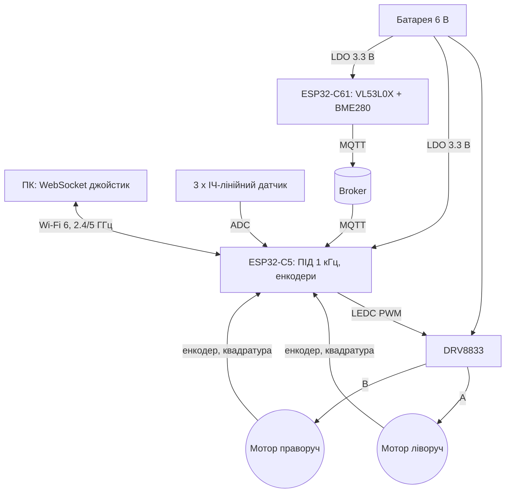

# ESP32-C5/C61: глибока практика з роботом - робочий код

EN version: `/home/ksalab/projects/embedded-reference/ESP32-Reference/16-Proekti/06-C5-C61-Robotics.en.md`

![[assets/img/c5c61-robot-scheme.png|600]]
*Рис. Двовальний робот: C5 - мозок (мотори, енкодери, лінія), C61 - «очки» (VL53L0X + BME280).*

> [!tip] Що це за нота
> Глибока практика на найновішій C-лінійці - плати див. [[01-Hardware/10-ESP32-C5-C61|C5/C61]]. Два вузли: **C5** керує рухом (мотори, енкодери, лінійні датчики, керування по Wi-Fi 6), **C61** - автономний вузол-спостерігач (відстань VL53L0X + BME280 → MQTT). Все з робочим кодом: ядро Arduino 3.3.x (C5/C61 - тільки воно, IDF 5.5+).

## 1. Архітектура



Чому два вузли: C5 тримає петлю 1 кГц без розривів від мережі, а C61 не забиває мозок байтами - він сам обирає, коли розсиляти, і може стати в сон між знімками.

## 2. BOM - комплектуючі

| Компонент | Нота довідника | Примітка |
| --- | --- | --- |
| ESP32-C5 DevKit / SuperMini | [[01-Hardware/10-ESP32-C5-C61 | C5/C61]] | мозок |
| ESP32-C61 MINI-1 | [[01-Hardware/10-ESP32-C5-C61 | C5/C61]] | спостерігач |
| DRV8833 dual H-bridge | Офіційні джерела | 2× до 1.5 А, логіка 3.3 В |
| 2 × DC-мотор 4.8-6 В з енкодером | [[11-Vivid/04-L298N-TB6612-A4988-Buzzer | Драйвери]] | ~300 об/хв |
| Ланцюг 4×AA 6 В або 2S Li-ion 7.4 В | [[02-Zhivlennya/01-Lancjugi-zhivlennya | Ланцюги]] | тільки на мотори |
| LDO 3.3 В (ME6211, краще за AMS1117) | [[02-Zhivlennya/02-LDO-DC-DC | LDO/DC-DC]] | 6 В → 3.3 В |
| VL53L0X (I2C 0x29) | [[10-Sensori/10-VL53L0X-TCS34725-TSL2561 | ToF/Колір]] | на C61 |
| BME280 (I2C 0x76) | [[10-Sensori/03-BME280-BMP280-SHT31 | BME280]] | на C61 |
| 3 × ІЧ-лінійний рефлекторний датчик | [[06-Analog/01-ADC | ADC]] | лінія |
| Діод Шотткі + конденсатори біля VMOT | [[13-Moduli-zhivlennya-rivniv/04-LDO-Buck-XL4015-Protect | Захист]] | зворотний струм |

## 3. Розпіновка C5

| Пін C5 | На що | Примітка |
| --- | --- | --- |
| GPIO0 / GPIO1 | DRV8833 IN1 / IN2 | LEDC CH0 (мотор A) |
| GPIO2 / GPIO3 | DRV8833 IN3 / IN4 | LEDC CH1 (мотор B) |
| GPIO4 | ENA + ENB (разом) | HIGH, інакше bridges вимкнені |
| GPIO5…GPIO8 | енкодери A/B, A/B | переривання, квадратура ×4 |
| GPIO9…GPIO11 | ІЧ ×3 | ADC1, 12 біт |
| GPIO12 | напруга батареї /10 | ADC1, дільник 100 кОм / 100 кОм |
| 3V3 / GND | вихід LDO | ME6211 з 6 В батареї |

Правило: моторні 6 В - тільки через DRV8833; GPIO і логіка - строго 3.3 В. Спільна земля: батарея, DRV8833 і LDO з'єднуються в одну точку, не ланцюжком.

## 4. Робочий код C5 (Arduino core 3.3.x)

```cpp
// C5: двовальний робот — ПІД на енкодерах + джойстик по WebSocket
#include <WiFi.h>
#include <WebSockets.h>
#include <PubSubClient.h>

Encoder encL(5, 6), encR(7, 8);   // квадратура, множник 4
float targetL = 0, targetR = 0;   // об/хв з джойстика
float integL = 0, integR = 0;
long lastL = 0, lastR = 0;
const float KP = 0.8f, KI = 0.02f;

void pid_tick(void *arg) {        // викликається з esp_timer кожні 1 мс
  float el = encL.read() - lastL;
  float er = encR.read() - lastR;
  lastL = encL.read();  lastR = encR.read();
  integL += targetL - el;  integR += targetR - er;
  float pwL = KP * (targetL - el) + KI * integL;   // −1 … +1
  float pwR = KP * (targetR - er) + KI * integR;
  write_motor_A(pwL);   // LEDC: 0..255 + напрямок IN1/IN2
  write_motor_B(pwR);
  if (millis() - last_pub > 500) {
    mqtt_publish(4, pose(), vbat_mV(), line_offset());
    last_pub = millis();
  }
}

void onWebsocket(uint8_t *msg, size_t len) {
  // JSON: {"l":-0.4,"r":0.4} → targetL/R = l * MAX_RPM
  parse_joystick(msg, len, &targetL, &targetR);
}
```

- керування: JSON `{"l":-0.4,"r":0.4}` по WebSocket на порту 81;
- уникнення перешкод: якщо відстань від C61 < 30 см - швидкість ÷2, < 10 см - стоп;
- захист: VBAT < 4.2 В (для 6 В ланцюга) - стоп і MQTT-повідомлення.

## 5. Робочий код C61 (Arduino core 3.3.x)

```cpp
// C61: спостерігач — VL53L0X + BME280, MQTT кожні 500 мс
#include <Wire.h>
#include <VL53L0X.h>
#include <Adafruit_BME280.h>
#include <WiFi.h>
#include <PubSubClient.h>

VL53L0X vf;  Adafruit_BME280 bme;
WiFiClient net;  PubSubClient mqtt(net);

void loop() {
  if (!mqtt.connected()) mqtt_connect();
  uint16_t d = vf.measureSingleTiming();
  mqtt.publish("robot/c61/dist", d);
  mqtt.publish("robot/c61/tmp", bme.readTemperature(), 1);
  delay(500);
}
```

- Wi-Fi: тільки 2.4 ГГц (у C61 немає 5 ГГц - це фішка C5!);
- ETM: тригер I2C-переривання → виклик задачі без CPU - якщо з'являться очікування;
- deep-sleep 30 с між знімами, якщо живлення від батареї.

## 6. ПІД: розгін і налаштування

| Крок | Що робимо | Очікуємо |
| --- | --- | --- |
| 1 | Колесо піднято, задано 50 об/хв | мотор крутиться ~50 об/хв без навантаження |
| 2 | Kp=0.5, Ki=0, Kd=0 | коливання? зменшити Kp |
| 3 | Додати Ki=0.02 | зсув зникає за ~2 с |
| 4 | Якщо інтеграл просідає - обмежити Ki | затягування за 5-10 мс |
| 5 | Мультиплікатори 0.5× і 2× | робота на колесі стабільно |

Калібрування енкодерів: один оберт = N імпульсів (випалюєте `encL.read()` при ручному повороті, ×4 через квадратуру). Знак: колесо вперед → лічильник росте; інакше - змінюйте знак у ПІД або переставляйте A/B.

## 7. Живлення

- батарея 6 В → DRV8833 VMOT безпосередньо, товстими дротами, конденсатор 470 мкФ біля вхідних клем;
- 6 В → ME6211 → 3.3 В на C5/C61: при 1 А втрата AMS1117 = (6−3.3)×1 А = 2.7 ВТ - гарячий! ME6211 - краще, a правильніше - buck;
- спільна земля в одну точку (див. розділ 3);
- індуктивні сплески моторів: RC-ланцюжок або варистор на VMOT, інакше шумить 3.3 В і розривається Wi-Fi.

## 8. Типові помилки

| Симптом | Причина | Лікування |
| --- | --- | --- |
| Мотор не стартує | EN на низькому рівні або переплутані A/B | перевірити ENA/ENB, змінити IN1/IN2 наміром |
| Колеса крутять у різні боки | знак енкодера інвертований | змінити знак у ПІД або переставити A/B |
| Wi-Fi розривається при старті мотора | просадка 3.3 В на LDO | ME6211/buck, конденсатор 470 мкФ біля VMOT |
| C5 не видно в core | версія Arduino core < 3.3 | оновити esp32 core: C5/C61 - тільки 3.3.x / IDF 5.5+ |
| Лінійний датчик «пливе» | пороги без калібрування | зняти background у світлі і на лінії, гістерезис |
| Робот їсть батарею | високе споживання LDO + мотори на порожніх | перерахувати струм, сон C61, менший duty |

## 9. Суміжні ноти

- [[01-Hardware/10-ESP32-C5-C61|C5/C61]] - чипи, LP-CPU, ETM, dual-band.
- [[07-Timeri-Son/01-Timeri-MCPWM-PCNT-RMT|Таймери]] - LEDC/TACH.
- [[15-Protokoli/01-MQTT|MQTT]] - протокол телеметрії.
- [[11-Vivid/04-L298N-TB6612-A4988-Buzzer|Драйвери]] - H-bridge порівняно з DRV8833.
- [[02-Zhivlennya/02-LDO-DC-DC|LDO/DC-DC]] - вибір регулятора.
- [[04-Shini/05-CAN-TWAI-RS485|CAN/RS485]] - якщо мотори з CAN-драйверами.

## Офіційні джерела

- [ESP32-C5 (Espressif)](https://www.espressif.com/en/products/socs/esp32-c5) - характеристики, 802.15.4, dual-band.
- [ESP32-C61 (Espressif)](https://www.espressif.com/en/products/socs/esp32-c61) - ETM, Wi-Fi 6 2.4 ГГц.
- [DRV8833 datasheet (TI)](https://www.ti.com/lit/ds/symlink/drv8833.pdf) - dual H-bridge, логіка 3.3 В.
- [VL53L0X (ST)](https://www.st.com/en/sensors-actuators/vl53l0x.html) - ToF, I2C 0x29.
- [BME280 datasheet (Bosch)](https://assets.bosch-sensortec.com/media/products/datasheets/environmental/bme/bme280-ds136.pdf) - I2C, точність.
