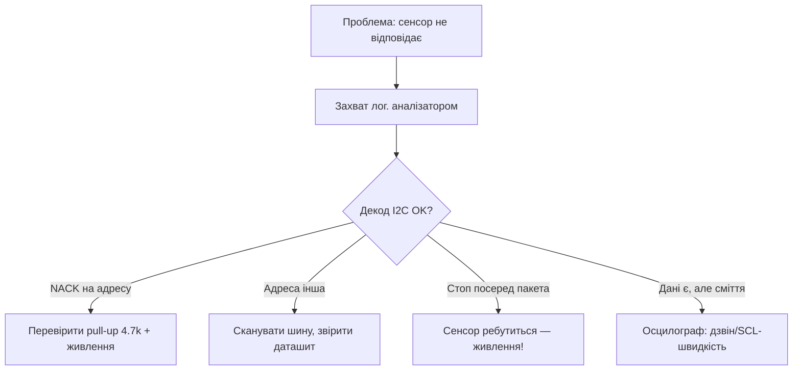
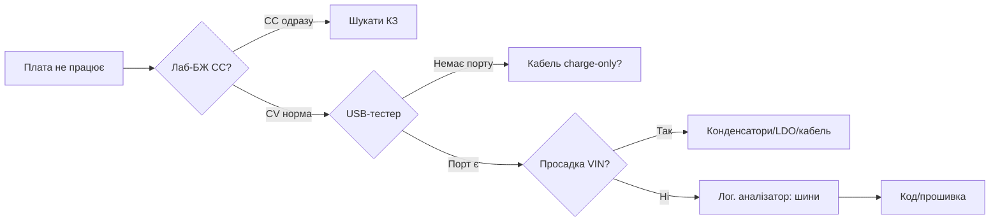

# Lab 1 - Вимірювальні прилади: мультиметр, осцилограф, аналізатор, БЖ, навантаження, USB-тестер

![[assets/img/lab-instruments-scheme.png|600]]
*Рис. Лабораторний стенд ESP32: лаб-БЖ → USB-тестер → DevKit, мультиметр у розриві живлення, осцилограф на VIN, логічний аналізатор на шинах.*

> [!warning] Безпека понад усе
> Лаб-БЖ завжди стартує з обмеженням струму (CC). Перше ввімкнення нової плати - через CC 100-200 мА. КЗ на ESP32-платі пахне гарячим AMS1117 - встигніть вимкнути.
>
> [!tip] Призначення розділу
> Ця нота - карта лабораторних приладів для розробки й налагодження ESP32: що чим міряти, як не спалити плату щупом і як зловити просадку живлення під час WiFi-передачі.

## 1. Призначення

Без приладів розробка ESP32 - це гадання по логах. Прилади закривають питання:

- скільки реально споживає плата у deep-sleep (мікроампери чи міліампери?);
- чому плата ребутиться при старті WiFi (просадка VIN нижче brownout?);
- що реально їде по I2C/SPI/UART (адреса, ACK, бодрейт?);
- чи тягне LDO/buck пікові 500 мА WiFi-TX;
- чи кабель USB взагалі має data-жили, чи тільки заряджає.

Мінімальний набір лабораторії:

| Прилад | Закриває питання | Орієнтовна ціна |
| --- | --- | --- |
| Мультиметр (мА/мкА) | Струм deep-sleep, цілісність кіл | $15-60 |
| Осцилограф 2 канали, 50-100 МГц | Просадка VIN, шуми, сигнали | $250-400 |
| Логічний аналізатор 8-16 кан. + PulseView | Декод I2C/SPI/UART | $10-50 |
| Лаб-БЖ CC/CV 30V/5A | Безпечне перше ввімкнення | $60-120 |
| Електронне навантаження | Тест LDO/buck під струмом | $30-80 |
| USB-тестер V/A/W | Діагностика кабелів і портів | $8-25 |

## 2. Мультиметр - струм deep-sleep через розрив

Головне вимірювання для батарейних проєктів (див. [[02-Zhivlennya/03-Spozhivannya|Споживання]]).

### 2.1. Burden voltage - прихована пастка

Мультиметр міряє струм через внутрішній шунт. Падіння напруги на шунті (burden voltage) знижує реальну напругу живлення плати:

| Діапазон | Типовий шунт | Burden при 100 мА | Наслідок |
| --- | --- | --- | --- |
| 10A | ~0.01 Ом | ~1 мВ | Нехтовно, але роздільна здатність погана |
| 200 мА | ~1 Ом | ~100 мВ | Відчутно, можливі ребути при WiFi-TX |
| 20 мА / мкА | ~10-100 Ом | 1 В і більше | Плата взагалі не стартує! |

Правила:

- deep-sleep (мкА-одиниці мА) - діапазон мА/мкА окремими гніздами;
- активний режим + WiFi (до 500 мА пік) - тільки гніздо 10A;
- ніколи не міряйте струм WiFi-TX на діапазоні мкА - згорить запобіжник приладу.

### 2.2. ASCII-схема: вимірювання через розрив джампера живлення

```text
   Лаб-БЖ 5.0V (CC=200 мА) ──(+)──┬──► VIN плати
                                 │
                              [A] МУЛЬТИМЕТР (розрив!)
                              гніздо: мкА ─ для sleep
                              гніздо: 10A ─ для WiFi-TX
                                 │
   Лаб-БЖ GND ───────────────────┴──► GND плати (товстий дріт!)

   Джампер живлення DevKit ЗНЯТИ, замість нього — щупи амперметра.
   Після вимірювання sleep → перемкнути на 10A → wake + WiFi-TX.
```

### 2.3. Процедура покроково: струм deep-sleep

1. Прошийте мінімальний скетч deep-sleep на 10 с (приклад нижче).
2. Зніміть джампер живлення / розірвіть лінію VIN.
3. Мультиметр у гнізда `COM` + `мкА/мА`, діапазон мА.
4. Увімкніть живлення: побачите пік старту (~50-150 мА), потім спад.
5. Через 2-3 с показання мають впасти до десятків-сотень мкА.
6. Запишіть: `sleep = ___ мкА`, `active = ___ мА`, `WiFi-TX пік = ___ мА` (гніздо 10A!).
7. Порівняйте з таблицею в [[02-Zhivlennya/03-Spozhivannya|Споживання]].

```cpp
// Мінімальний тест deep-sleep для вимірювання струму
#include <esp_sleep.h>
void setup() {
  Serial.begin(115200);
  Serial.println("Going to deep-sleep 10 s...");
  Serial.flush();                        // дочекатись виводу перед сном!
  esp_sleep_enable_timer_wakeup(10 * 1000000ULL);
  esp_deep_sleep_start();
}
void loop() {}
```

```cpp
// Тест піку WiFi-TX (міряти на гнізді 10A!)
#include <WiFi.h>
void setup() {
  Serial.begin(115200);
  WiFi.begin("SSID", "PASS");
  while (WiFi.status() != WL_CONNECTED) delay(300);
  Serial.println("WiFi up, flooding...");
}
void loop() {
  // активний трафік → максимальні піки TX
  for (int i = 0; i < 50; i++) { WiFi.RSSI(); delay(20); }
}
```

### 2.4. Орієнтири струму ESP32

| Режим | Очікувано | Якщо більше - шукати |
| --- | --- | --- |
| Deep-sleep, голий модуль | 5-20 мкА | Світлодіод живлення, USB-UART, дільники на платі |
| Deep-sleep, DevKit з USB-UART | 0.5-5 мА | CP2102/CH340 живий - норма для DevKit |
| Modem-sleep | 15-30 мА | - |
| Active + WiFi-TX пік | 160-500 мА | Просадка слабкого LDO/кабелю |

## 3. Осцилограф - просадка VIN при WiFi-TX

Класичний симптом: плата працює від USB ПК, але ребутиться від батареї/кабелю. Причина - просадка VIN нижче порога brownout (~2.8-3.0V на 3.3V-рейці) у момент піку TX.

### 3.1. Налаштування

| Параметр | Значення | Чому |
| --- | --- | --- |
| Щуп | ×10, компенсація перевірена | ×1 вносить ємність і шуми, ріже смугу |
| Канал 1 | VIN (5V) або 3.3V-рейка | Бачимо просадку |
| Канал 2 | GPIO-маркер (підняти перед WiFi-блоком) | Тригер по фронту |
| Розгортка | 2-10 мс/под | Пік TX триває сотні мкс - одиниці мс |
| Зв'язок | DC, смуга 20 МГц вкл. | Прибрати ВЧ-сміття |

### 3.2. Земля-крокодил - пастка

Довгий провід «крокодила» (10-15 см) - це антена і індуктивність. На швидких фронтах він домальовує дзвін і викиди, яких немає в схемі.

```text
   ПОГАНО (довга земля):              ДОБРЕ (коротка земля):

   Щуп ──► VIN                        Щуп ──► VIN
     └─крокодил─ ~15 см ─► GND          └─пружинка-GND 5 мм ─► GND-пад поруч
         = дзвін + викиди                  = чесна картина
```

Правила:

- земля щупа - найкоротшим шляхом до GND поруч із точкою вимірювання;
- пружинка-заземлення або «тюльпан» замість крокодила для ВЧ;
- ніколи не чіпляйте землю щупа до іншої потенціальної точки (струмові петлі!).

### 3.3. ASCII-схема підключення осцилографа

```text
   Лаб-БЖ / USB ──► VIN плати ──┬──► CH1 (×10) ── осцилограф
                               │
   GPIO25 (маркер) ─────────────┼──► CH2 (×1) ── тригер RISING
                               │
   GND плати ──► пружинка GND обох щупів (ОДНА точка!)

   Скетч: digitalWrite(25, HIGH) перед WiFi.publish, LOW після.
```

### 3.4. Процедура покроково: зловити просадку

1. Підключіть CH1 до 3.3V-рейки (точка після LDO), CH2 до GPIO-маркера.
2. Тригер: CH2, фронт вгору, рівень ~1.6V.
3. Запустіть скетч з WiFi-трафіком і маркером.
4. Виміряйте курсорами мінімум 3.3V під час піку TX.
5. Критерій: просадка не глибше 3.0V і не довше 1-2 мс. Глибше → міняйте LDO/конденсатори/кабель.
6. Лікування: 470-1000 мкФ low-ESR на VIN + 100 нФ кераміка біля модуля (див. [[02-Zhivlennya/01-Lancjugi-zhivlennya|Ланцюги живлення]]).

## 4. Логічний аналізатор + PulseView

Декодує I2C/SPI/UART дешевше за осцилограф і з розшифровкою пакетів.

### 4.1. Частота семплування - правило ×10

| Шина | Швидкість | Мінімальний семплрейт | Рекомендовано |
| --- | --- | --- | --- |
| UART 115200 | ~115 кбод | 1 МГц | 2-4 МГц |
| I2C 100 кГц | 100 кГц | 1 МГц | 2 МГц |
| I2C Fast 400 кГц | 400 кГц | 4 МГц | 8 МГц |
| SPI 8 МГц | 8 МГц | 40 МГц | 50-100+ МГц (межа дешевих клонів!) |

> [!warning] Межа дешевих клонів
> Клони Saleae на CY7C68013A дають реально ~12-24 МГц. SPI на 20-40 МГц ними не зловити - знижуйте SPI-clock у прошивці для налагодження або беріть аналізатор на 100+ МГц.

### 4.2. ASCII-схема підключення аналізатора

```text
   ESP32 DevKit                    Логічний аналізатор (USB → ПК)
   ────────────                    ─────────────────────────────
   GPIO21 (SDA) ──────────────────► CH0
   GPIO22 (SCL) ──────────────────► CH1
   GPIO23 (MOSI) ─────────────────► CH2
   GPIO19 (MISO) ─────────────────► CH3
   GPIO18 (SCK) ──────────────────► CH4
   GPIO5  (CS) ───────────────────► CH5
   TX0 (GPIO1) ───────────────────► CH6   (лог UART, див. [[04-Shini/01-UART|UART]])
   GND ───────────────────────────► GND (ОБОВ'ЯЗКОВО спільна!)

   PulseView: +I2C на CH0/CH1, +SPI на CH2–CH5, +UART на CH6.
```

### 4.3. Процедура покроково: декод I2C у PulseView

1. Підключіть CH0→SDA, CH1→SCL, GND→GND. Плата живиться окремо!
2. Відкрийте PulseView → виберіть пристрій → Sample rate за таблицею ×10.
3. Samples: 1-5M, тригер: спад на SDA (умова старту) - або вільний захват кнопкою.
4. Натисніть Acquire, змусьте ESP32 опитати сенсор.
5. Додайте декодер: зелений `+` → `I2C` → SDA=CH0, SCL=CH1.
6. Перевірте: адреса (напр. 0x76 для BME280), ACK після кожного байта.
7. NACK → неправильна адреса/відсутні pull-up/сенсор не живиться (див. [[04-Shini/03-I2C|I2C]]).



## 5. Лабораторний БЖ CC/CV - перше ввімкнення

Режими: CV (стабільна напруга) для роботи, CC (обмеження струму) для захисту.

| Крок | Дія | Значення |
| --- | --- | --- |
| 1 | Виставити напругу БЕЗ навантаження | 5.0V (або 3.3V для голої плати) |
| 2 | Закоротити вихід → виставити струм | 100-200 мА для першого ввімкнення |
| 3 | Зняти закоротку, підключити плату | Дивитись, який режим світиться |
| 4 | CC світиться одразу | КЗ! Вимкнути, шукати перемичку/соплю |
| 5 | CV + струм 30-80 мА | Норма для DevKit в idle |
| 6 | Після перевірки підняти ліміт | 1-2A для роботи з WiFi |

```text
   ПЕРШЕ ВВІМКНЕННЯ НОВОЇ ПЛАТИ:

   [БЖ: 5.0V, CC=150 мА] ──(+)──► VIN
                              ──(−)──► GND
        │
        ├── світить CV, I=40–80 мА ──► OK, можна працювати
        │
        └── світить CC, V впала ──► КЗ! Вимкнути НЕГАЙНО
```

## 6. Електронне навантаження - тест LDO/buck

Перевіряє, чи тримає перетворювач напругу під струмом до пайки в проєкт.

| Тест | Навантаження | Критерій |
| --- | --- | --- |
| LDO 3.3V (AMS1117) | CC 100/300/500 мА | Vout ≥ 3.15V на 500 мА, нагрів терпимий |
| Buck 5→3.3V | CC 0.5/1/2A | Vout у ±2%, пульсації < 50 мВ (осцилограф!) |
| Тепловий | 500 мА, 10 хв | LDO без радіатора > 100 °C → потрібен buck/радіатор |

Процедура:

1. Навантаження в режимі CC, мінімальний струм.
2. Підключити до виходу LDO/buck (плата живиться від свого входу!).
3. Ступінчасто піднімати струм, записувати Vout.
4. Осцилографом перевірити пульсації на максимумі.
5. Якщо Vout падає або кільця - див. [[02-Zhivlennya/02-LDO-DC-DC|LDO/DC-DC]].

## 7. USB-тестер - V/A/W і детект charge-only кабелів

USB-тестер у розриві кабелю показує напругу, струм, потужність, інколи ємність (мА·год).

| Показання | Діагноз |
| --- | --- |
| 5.0V, 0.00A, порт є - плати не видно | Charge-only кабель (немає D+/D−) - замінити! |
| 4.4-4.7V під навантаженням | Тонкий/довгий кабель - просадка, міняти |
| Струм стрибає 0→500 мА циклічно | Плата ребутиться (brownout), див. розділ 3 |
| 5V є, струм 30-80 мА, порт видно | Норма idle DevKit |

Процедура детекту charge-only кабелю:

1. Увіткніть тестер у порт ПК/зарядки, кабель - у тестер, плату - в кабель.
2. Якщо струм споживання є, а COM-порт не з'явився - кабель під підозрою.
3. Перевірте тим самим тестером + завідомо data-кабелем.
4. Додатково: продзвоніть D+/D− мультиметром (обрив = charge-only).

## 8. Маршрут діагностики (Mermaid)



### RF-діагностика ефіру: RTL-SDR ($30 замість аналізатора спектра!)

| Задача | Як |
| --- | --- |
| Чи передає мій LoRa-вузол? | RTL-SDR + GQRX/SDR++: пік на 868.1 МГц в момент TX |
| Який SF/смуга? | Ширина і тривалість chirp-сплеску на водоспаді |
| Хто заважає? | Огляд 863-870 МГц 5 хв: чужі сплески = зайняті канали |
| Потужність (грубо) | Порівняння з еталоном на фіксованій відстані (не дБм, а «голосніше/тихіше»!) |
| 2.4 ГГц (WiFi/BLE/NRF)? | RTL-SDR НЕ бачить (максимум ~1.7 ГГц!) - тільки суб-ГГц |
| HackRF One / Airspy (наступний рівень) | TX+RX до 6 ГГц (HackRF, напівдуплекс) / чутливіший RX (Airspy); для 2.4 ГГц-аналізу WiFi/BLE і перевірки гармонік LoRa-передавача |

```text
Процедура перевірки LoRa-передавача:
  1. Антена RTL-SDR поруч (1–3 м, НЕ впритул — перевантаження!).
  2. GQRX: центр 868 МГц, смуга 2 МГц, водоспад увімкнено.
  3. Змусити вузол слати раз на 2 с → регулярні chirp-риски = живе!
  4. Нема рисок: живлення/антена/частота вузла (перевірити регістри!).
  5. Риски є, шлюз не чує: SF/BWCoderate розійшлися або шлюз глухий.
```

## Типові помилки

| # | Помилка | Чому погано | Як правильно |
| --- | --- | --- | --- |
| 1 | Міряти струм WiFi на діапазоні мА | Згорить запобіжник, burden посадить живлення | Піки - тільки гніздо 10A |
| 2 | Послідовно ввімкнений амперметр забули в колі | Наступного разу плата не стартує | Після вимірювання повернути джампер |
| 3 | Щуп осцилографа ×1 на швидких сигналах | Ємність щупа спотворює фронт | Завжди ×10 з компенсацією |
| 4 | Довгий крокодил землі | Дзвін і викиди-фантоми | Пружинка GND 5 мм |
| 5 | Земля щупа до іншої точки схеми | Петлі, КЗ через заземлений осцилограф! | Одна точка GND, диференційно - за потреби |
| 6 | Семплрейт аналізатора = частоті шини | Аліасинг, хибний декод | Правило ×10, див. таблицю 4.1 |
| 7 | Перше ввімкнення без CC | Дим і діагностика згорілого | CC 100-200 мА, див. розділ 5 |
| 8 | USB-кабель «від зарядки» для прошивки | Немає D+/D−, порту немає | Перевірка тестером + продзвон D+/D− |
| 9 | Тригер осцилографа навмання | Не видно рідкісний пік TX | Тригер по GPIO-маркеру з прошивки |
| 10 | Віра показанням без калібру | Дешевий мультиметр бреше на мкА | Звірка з відомим навантаженням (резистор) |

## Офіційні джерела

- [ESP-IDF - Sleep Modes (струми режимів сну)](https://docs.espressif.com/projects/esp-idf/en/latest/esp32/api-reference/system/sleep_modes.html) - deep-sleep/light-sleep, джерела пробудження.
- [Espressif - Hardware Design Guidelines](https://docs.espressif.com/projects/esp-hardware-design-guidelines/en/latest/esp32/index.html) - розв'язка живлення, конденсатори, розведення.
- [sigrok - PulseView](https://sigrok.org/wiki/PulseView) - логічний аналізатор, декодери протоколів.
- [Espressif - esptool docs](https://docs.espressif.com/projects/esptool/en/latest/esp32/index.html) - зв'язок по UART, діагностика завантаження.

## Див. також

- [[Home|Головна]]
- [[02-Zhivlennya/03-Spozhivannya|Споживання]]
- [[09-Proshivka/04-Esptool-Flash|Esptool-Flash]]
- [[99-Dodatki/03-Cheklisti-montazhu|Чек-листи монтажу]]
- [[17-Lab/02-Soldering-Connectors|Пайка та роз'єми]]
- [[17-Lab/03-Enclosure-Cert-Factory|Корпус, сертифікація, виробництво]]
- [[02-Zhivlennya/01-Lancjugi-zhivlennya|Ланцюги живлення]]
- [[02-Zhivlennya/02-LDO-DC-DC|LDO/DC-DC]]
- [[04-Shini/01-UART|UART]]
- [[04-Shini/03-I2C|I2C]]
- [[04-Shini/02-SPI|SPI]]

> English twin: [[17-Lab/01-Instruments.en.md | EN]]
